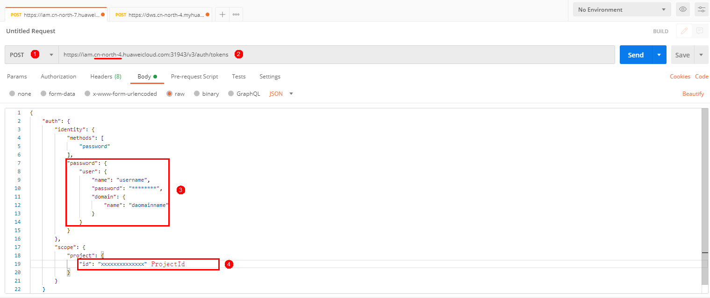
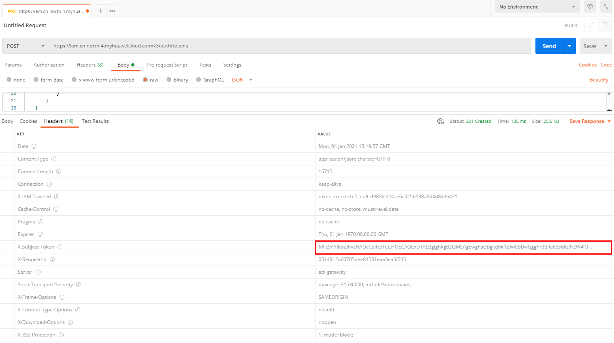
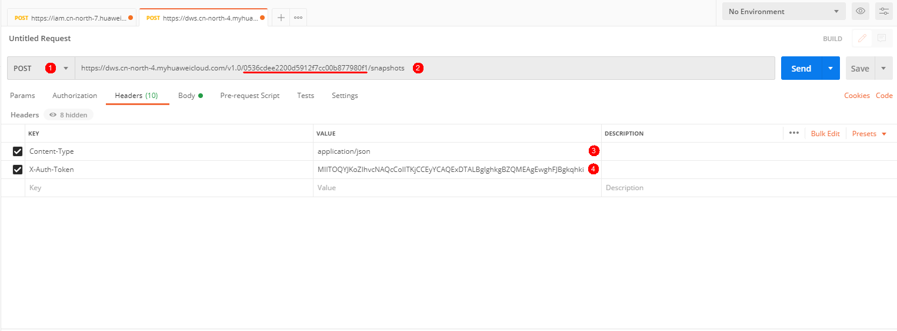
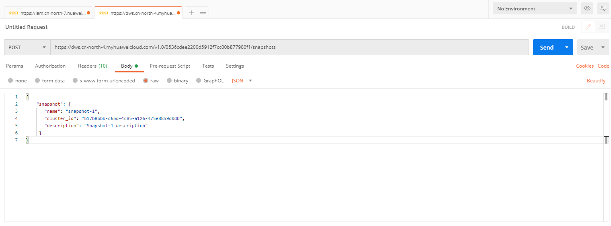

# 使用Postman调用创建快照接口<a name="ZH-CN_TOPIC_0000001437540353"></a>

## 场景描述<a name="section1491118522374"></a>

本章节指导用户使用Postman调用创建快照接口。API的调用方法请参考[如何调用API](如何调用API.md)。

## 涉及接口<a name="section1564824483810"></a>

调用该接口时，需要进行认证鉴权，涉及的接口如下：

-   [认证鉴权](认证鉴权.md)：经过身份认证，获得操作API的权限。
-   [创建快照](创建快照.md)：通过该接口创建集群的快照。

## 操作步骤<a name="section206661804418"></a>

1.  配置环境。

    > **说明：** 
    >下载Postman调用创建快照服务，Postman建议使用7.24.0版本。

2.  调用服务。
    1.  获取Token，进行认证。

        在Postman界面上新建Post请求，选中Body的配置项，填写用户名、用户密码、帐号名及项目ID。在[我的凭证](https://console.huaweicloud.com/iam/#/myCredential)下，您可以查看帐号的用户名、用户密码和帐号名等信息。项目ID获取方法请参见[获取项目ID](获取项目ID.md)。

        

        > **说明：** 
        >获取token的华为云服务所在区域需要和调用的服务所在区域需一致，否则会导致调用失败。

    2.  单击右上角“Send”，发送“POST https://iam.cn-north-4.myhuaweicloud.com/v3/auth/tokens”。获取返回结果中的Token值（Token有效期为24小时）。

        

    3.  调用创建快照服务。
        -   在Postman界面上新建Post请求，选中“Headers”配置项，添加对应的KEY、VALUE，复制Token值到“X-Auth-Token”。请求中划红横线部分为项目ID，获取方法请参见[获取项目ID](获取项目ID.md)。请求URL中的所在区域需要与调用的服务所在区域保持一致，您可以从[地区和终端节点](https://developer.huaweicloud.com/endpoint?DWS)获取。

            

        -   单击“Body”， 添加请求参数值到请求中。不同服务的参数各不相同，详情请参考[API说明](API说明.md)。

            

        -   单击右上角“Send”按钮发送请求“POST https://dws.cn-north-4.myhuaweicloud.com/v1.0/\{project\_id\}/snapshots”，查看创建结果。

            ```
            {
              "snapshot": {
                  "id": "809bcf6e-4022-496d-9320-bbc700695692"
                }
            }
            ```


