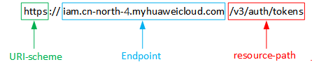

# 构造请求<a name="ZH-CN_TOPIC_0000001437660313"></a>

本节介绍REST API请求的组成，并以调用IAM服务的[获取用户Token](https://support.huaweicloud.com/api-iam/iam_30_0001.html)说明如何调用API，该API获取用户的Token，Token可以用于调用其他API时鉴权。

您还可以通过这个视频教程了解如何构造请求调用API：[https://bbs.huaweicloud.com/videos/102987](https://bbs.huaweicloud.com/videos/102987)  。

## 请求URI<a name="s4575482b25134dc1a9ca4df2c5d72c6b"></a>

请求URI由如下部分组成：

**\{URI-scheme\}://\{Endpoint\}/\{resource-path\}?\{query-string\}**

尽管请求URI包含在请求消息头中，但大多数语言或框架都要求您从请求消息中单独传递它，所以在此单独强调。

**表 1**  URI中的参数说明

<a name="t9af702b84a01463ba146da3540ec906f"></a>
<table><thead align="left"><tr id="rdd5de970ddaf422083d586ecf42c0a9f"><th class="cellrowborder" valign="top" width="24.23%" id="mcps1.2.3.1.1"><p id="a19434eb2026742318d4d54bed50f9db8"><a name="a19434eb2026742318d4d54bed50f9db8"></a><a name="a19434eb2026742318d4d54bed50f9db8"></a><strong id="a5c59c216102a4b9f9d5b95bf894395c4"><a name="a5c59c216102a4b9f9d5b95bf894395c4"></a><a name="a5c59c216102a4b9f9d5b95bf894395c4"></a>参数</strong></p>
</th>
<th class="cellrowborder" valign="top" width="75.77000000000001%" id="mcps1.2.3.1.2"><p id="aa99811d9a1354ffc90c399d3effe35f0"><a name="aa99811d9a1354ffc90c399d3effe35f0"></a><a name="aa99811d9a1354ffc90c399d3effe35f0"></a><strong id="a7e4e900f1eed4fcdb892b4054baf7292"><a name="a7e4e900f1eed4fcdb892b4054baf7292"></a><a name="a7e4e900f1eed4fcdb892b4054baf7292"></a>描述</strong></p>
</th>
</tr>
</thead>
<tbody><tr id="r94b0864962c4486196d8896727b693f6"><td class="cellrowborder" valign="top" width="24.23%" headers="mcps1.2.3.1.1 "><p id="a2c7b5dd5b6924ceba3e67e0f162d9710"><a name="a2c7b5dd5b6924ceba3e67e0f162d9710"></a><a name="a2c7b5dd5b6924ceba3e67e0f162d9710"></a>URI-scheme</p>
</td>
<td class="cellrowborder" valign="top" width="75.77000000000001%" headers="mcps1.2.3.1.2 "><p id="a65fd32c6193a4d35a9e2ebd91dbc4476"><a name="a65fd32c6193a4d35a9e2ebd91dbc4476"></a><a name="a65fd32c6193a4d35a9e2ebd91dbc4476"></a>表示用于传输请求的协议，当前所有API均采用<strong id="a2bbde07b55f94fa388af408e615b2ad2"><a name="a2bbde07b55f94fa388af408e615b2ad2"></a><a name="a2bbde07b55f94fa388af408e615b2ad2"></a>HTTPS</strong>协议。</p>
</td>
</tr>
<tr id="r8b17dfd690b64ff09a322e290bc49929"><td class="cellrowborder" valign="top" width="24.23%" headers="mcps1.2.3.1.1 "><p id="a192d0d49499b42dea9fcb9823bdcd208"><a name="a192d0d49499b42dea9fcb9823bdcd208"></a><a name="a192d0d49499b42dea9fcb9823bdcd208"></a>Endpoint</p>
</td>
<td class="cellrowborder" valign="top" width="75.77000000000001%" headers="mcps1.2.3.1.2 "><p id="p14221174382419"><a name="p14221174382419"></a><a name="p14221174382419"></a>指定承载REST服务端点的服务器域名或IP，不同服务不同区域的Endpoint不同，您可以从<a href="https://developer.huaweicloud.com/endpoint?DWS" target="_blank" rel="noopener noreferrer">地区和终端节点</a>获取。</p>
<p id="a602572ac7e684503937819b3e7205e1a"><a name="a602572ac7e684503937819b3e7205e1a"></a><a name="a602572ac7e684503937819b3e7205e1a"></a>例如IAM服务在<span class="parmname" id="p8c0d515dd551472e8bc62ea8057f9ed3"><a name="p8c0d515dd551472e8bc62ea8057f9ed3"></a><a name="p8c0d515dd551472e8bc62ea8057f9ed3"></a>“华北-北京四”</span>区域的Endpoint为<span class="parmname" id="p72ddca10f4724963a5147aec811fdf81"><a name="p72ddca10f4724963a5147aec811fdf81"></a><a name="p72ddca10f4724963a5147aec811fdf81"></a>“iam.cn-north-4.myhuaweicloud.com”</span>。</p>
</td>
</tr>
<tr id="r2caabf3ab8f14411a6f80aa41240506a"><td class="cellrowborder" valign="top" width="24.23%" headers="mcps1.2.3.1.1 "><p id="a8b74dc44c0004466a75be092ed7e75fe"><a name="a8b74dc44c0004466a75be092ed7e75fe"></a><a name="a8b74dc44c0004466a75be092ed7e75fe"></a>resource-path</p>
</td>
<td class="cellrowborder" valign="top" width="75.77000000000001%" headers="mcps1.2.3.1.2 "><p id="a36c7839ff46e415ab57937cb8f804f52"><a name="a36c7839ff46e415ab57937cb8f804f52"></a><a name="a36c7839ff46e415ab57937cb8f804f52"></a>资源路径，也即API访问路径。从具体API的URI模块获取，例如<span class="parmname" id="pd1c57fa3c439469fb4e9856659d8b5fc"><a name="pd1c57fa3c439469fb4e9856659d8b5fc"></a><a name="pd1c57fa3c439469fb4e9856659d8b5fc"></a>“获取用户Token”</span>API的resource-path为<span class="parmvalue" id="p7d45a00067594d9480aa3abd03302993"><a name="p7d45a00067594d9480aa3abd03302993"></a><a name="p7d45a00067594d9480aa3abd03302993"></a>“/v3/auth/tokens”</span>。</p>
</td>
</tr>
<tr id="r336a33aad869453ea3919c876cf81c96"><td class="cellrowborder" valign="top" width="24.23%" headers="mcps1.2.3.1.1 "><p id="a0b78a40936c34cef85fc5803efa2cfa3"><a name="a0b78a40936c34cef85fc5803efa2cfa3"></a><a name="a0b78a40936c34cef85fc5803efa2cfa3"></a>query-string</p>
</td>
<td class="cellrowborder" valign="top" width="75.77000000000001%" headers="mcps1.2.3.1.2 "><p id="a76f53170251e4801a68c3596f892a7e9"><a name="a76f53170251e4801a68c3596f892a7e9"></a><a name="a76f53170251e4801a68c3596f892a7e9"></a>查询参数，是可选部分，并不是每个API都有查询参数。查询参数前面需要带一个<span class="parmname" id="p9e3eae99d58844a59ccb461f85a0a676"><a name="p9e3eae99d58844a59ccb461f85a0a676"></a><a name="p9e3eae99d58844a59ccb461f85a0a676"></a>“？”</span>，形式为<span class="parmname" id="p28521d747f2c4763a2e4ca0e6bfd2ffe"><a name="p28521d747f2c4763a2e4ca0e6bfd2ffe"></a><a name="p28521d747f2c4763a2e4ca0e6bfd2ffe"></a>“参数名=参数取值”</span>，例如<span class="parmname" id="p4dc766c570c84b38bfef3a6c49fe08a3"><a name="p4dc766c570c84b38bfef3a6c49fe08a3"></a><a name="p4dc766c570c84b38bfef3a6c49fe08a3"></a>“?limit=10”</span>，表示查询不超过10条数据。</p>
</td>
</tr>
</tbody>
</table>

例如您需要获取IAM在“华北-北京四“区域的Token，则需使用“华北-北京四“区域的Endpoint（iam.cn-north-4.myhuaweicloud.com），并在[获取用户Token](https://support.huaweicloud.com/api-iam/iam_30_0001.html)的URI部分找到resource-path（/v3/auth/tokens），拼接起来如下所示。

```
https://iam.cn-north-4.myhuaweicloud.com/v3/auth/tokens
```

**图 1**  URI示意图<a name="faf7a0e77aeb941c0960689a58a31db13"></a>  


> **说明：** 
>为查看方便，在每个具体API的URI部分，只给出resource-path部分，并将请求方法写在一起。这是因为URI-scheme都是HTTPS，而Endpoint在同一个区域也相同，所以简洁起见将这两部分省略。

## 请求方法<a name="s3a0a7d00d5e8439199eae85866dd654c"></a>

HTTP请求方法（也称为操作或动词），它告诉服务你正在请求什么类型的操作。

**表 2**  HTTP方法

<a name="t3b46425c8c014a76abc28553bfc6a93e"></a>
<table><thead align="left"><tr id="ra4b6b401721947ac83c014847719ae98"><th class="cellrowborder" valign="top" width="30%" id="mcps1.2.3.1.1"><p id="a13c783bbcf244f95b36f4004255f4050"><a name="a13c783bbcf244f95b36f4004255f4050"></a><a name="a13c783bbcf244f95b36f4004255f4050"></a><strong id="ae3520a090bb040318eb77cbafde0daa5"><a name="ae3520a090bb040318eb77cbafde0daa5"></a><a name="ae3520a090bb040318eb77cbafde0daa5"></a>方法</strong></p>
</th>
<th class="cellrowborder" valign="top" width="70%" id="mcps1.2.3.1.2"><p id="aa77de578fb984433a73cafde21ac8e94"><a name="aa77de578fb984433a73cafde21ac8e94"></a><a name="aa77de578fb984433a73cafde21ac8e94"></a><strong id="a62f3947047eb4fef937e5aecf7ed71a7"><a name="a62f3947047eb4fef937e5aecf7ed71a7"></a><a name="a62f3947047eb4fef937e5aecf7ed71a7"></a>说明</strong></p>
</th>
</tr>
</thead>
<tbody><tr id="r5d72afeaf52f444dae3326ad054a169e"><td class="cellrowborder" valign="top" width="30%" headers="mcps1.2.3.1.1 "><p id="a5a33889fc201457eaa22f9fa4948abfd"><a name="a5a33889fc201457eaa22f9fa4948abfd"></a><a name="a5a33889fc201457eaa22f9fa4948abfd"></a>GET</p>
</td>
<td class="cellrowborder" valign="top" width="70%" headers="mcps1.2.3.1.2 "><p id="afb9798e36e974910a58e4a5049c6a6b1"><a name="afb9798e36e974910a58e4a5049c6a6b1"></a><a name="afb9798e36e974910a58e4a5049c6a6b1"></a>请求服务器返回指定资源。</p>
</td>
</tr>
<tr id="rd426fa26449542379f50afbd4eb0e987"><td class="cellrowborder" valign="top" width="30%" headers="mcps1.2.3.1.1 "><p id="a549de39865d540f1803235d64a0a3f80"><a name="a549de39865d540f1803235d64a0a3f80"></a><a name="a549de39865d540f1803235d64a0a3f80"></a>PUT</p>
</td>
<td class="cellrowborder" valign="top" width="70%" headers="mcps1.2.3.1.2 "><p id="a1b6cfa2b7fce449b89828e57f7cd0c5d"><a name="a1b6cfa2b7fce449b89828e57f7cd0c5d"></a><a name="a1b6cfa2b7fce449b89828e57f7cd0c5d"></a>请求服务器更新指定资源。</p>
</td>
</tr>
<tr id="rc804d98a2a1a4cbcb8b8b5f4492c29b2"><td class="cellrowborder" valign="top" width="30%" headers="mcps1.2.3.1.1 "><p id="a9c4623a2b2e249799869a1eb3fef8e92"><a name="a9c4623a2b2e249799869a1eb3fef8e92"></a><a name="a9c4623a2b2e249799869a1eb3fef8e92"></a>POST</p>
</td>
<td class="cellrowborder" valign="top" width="70%" headers="mcps1.2.3.1.2 "><p id="a631318c44c4b45fe9ec741be77b7dd7d"><a name="a631318c44c4b45fe9ec741be77b7dd7d"></a><a name="a631318c44c4b45fe9ec741be77b7dd7d"></a>请求服务器新增资源或执行特殊操作。</p>
</td>
</tr>
<tr id="rfba912c6cf3d49c1960df2c69a43d0d4"><td class="cellrowborder" valign="top" width="30%" headers="mcps1.2.3.1.1 "><p id="aff1a4f3ecc4f4159aa58a57040879ccc"><a name="aff1a4f3ecc4f4159aa58a57040879ccc"></a><a name="aff1a4f3ecc4f4159aa58a57040879ccc"></a>DELETE</p>
</td>
<td class="cellrowborder" valign="top" width="70%" headers="mcps1.2.3.1.2 "><p id="aab3690b4ec2f49a88a0d2a20bd9fdb84"><a name="aab3690b4ec2f49a88a0d2a20bd9fdb84"></a><a name="aab3690b4ec2f49a88a0d2a20bd9fdb84"></a>请求服务器删除指定资源，如删除对象等。</p>
</td>
</tr>
<tr id="r3cbeb0876c174c16ae79e7e837caddc8"><td class="cellrowborder" valign="top" width="30%" headers="mcps1.2.3.1.1 "><p id="a9a2e82c5bab74f5dbe00a9aa83e0cfc3"><a name="a9a2e82c5bab74f5dbe00a9aa83e0cfc3"></a><a name="a9a2e82c5bab74f5dbe00a9aa83e0cfc3"></a>HEAD</p>
</td>
<td class="cellrowborder" valign="top" width="70%" headers="mcps1.2.3.1.2 "><p id="a9ab1370359984ddb847fb4dc423edd5f"><a name="a9ab1370359984ddb847fb4dc423edd5f"></a><a name="a9ab1370359984ddb847fb4dc423edd5f"></a>请求服务器资源头部。</p>
</td>
</tr>
<tr id="rb160956154f9459297563674213e9223"><td class="cellrowborder" valign="top" width="30%" headers="mcps1.2.3.1.1 "><p id="ac45fb7aecd48481bafd0d396b2b69edb"><a name="ac45fb7aecd48481bafd0d396b2b69edb"></a><a name="ac45fb7aecd48481bafd0d396b2b69edb"></a>PATCH</p>
</td>
<td class="cellrowborder" valign="top" width="70%" headers="mcps1.2.3.1.2 "><p id="ad57dfa15e7014613ba806e1bcb8c3d78"><a name="ad57dfa15e7014613ba806e1bcb8c3d78"></a><a name="ad57dfa15e7014613ba806e1bcb8c3d78"></a>请求服务器更新资源的部分内容。</p>
<p id="a769d314e6f5246aaa0d1f1aa4f4d6b14"><a name="a769d314e6f5246aaa0d1f1aa4f4d6b14"></a><a name="a769d314e6f5246aaa0d1f1aa4f4d6b14"></a>当资源不存在的时候，PATCH可能会去创建一个新的资源。</p>
</td>
</tr>
</tbody>
</table>

在[获取用户Token](https://support.huaweicloud.com/api-iam/iam_30_0001.html)的URI部分，您可以看到其请求方法为“POST“，则其请求为：

```
POST https://iam.cn-north-4.myhuaweicloud.com/v3/auth/tokens
```

## 请求消息头<a name="s75225d72d09f45f89d861c32d7811ec0"></a>

附加请求头字段，如指定的URI和HTTP方法所要求的字段。例如定义消息体类型的请求头“Content-type“，请求鉴权信息等。

详细的公共请求消息头字段请参见[表3](#t771a2351c332419f86fd66136fc5ebae)。

**表 3**  公共请求消息头

<a name="t771a2351c332419f86fd66136fc5ebae"></a>
<table><thead align="left"><tr id="reeb6a8cd47c340f78a07a0987473c794"><th class="cellrowborder" valign="top" width="19.919999999999998%" id="mcps1.2.5.1.1"><p id="a06d9a5c5ce6e4f5db0eacec794ed7a94"><a name="a06d9a5c5ce6e4f5db0eacec794ed7a94"></a><a name="a06d9a5c5ce6e4f5db0eacec794ed7a94"></a><strong id="a7a9237071550460eb82440ba39664de3"><a name="a7a9237071550460eb82440ba39664de3"></a><a name="a7a9237071550460eb82440ba39664de3"></a>名称</strong></p>
</th>
<th class="cellrowborder" valign="top" width="26.32%" id="mcps1.2.5.1.2"><p id="ab63103d7318b46cc978c5fafec0caa2b"><a name="ab63103d7318b46cc978c5fafec0caa2b"></a><a name="ab63103d7318b46cc978c5fafec0caa2b"></a><strong id="aedc9437eeaab4710bdb260b0a8c02623"><a name="aedc9437eeaab4710bdb260b0a8c02623"></a><a name="aedc9437eeaab4710bdb260b0a8c02623"></a>描述</strong></p>
</th>
<th class="cellrowborder" valign="top" width="20.11%" id="mcps1.2.5.1.3"><p id="a7482594ba97d402482e54bd3eb257aba"><a name="a7482594ba97d402482e54bd3eb257aba"></a><a name="a7482594ba97d402482e54bd3eb257aba"></a><strong id="a3e3b8781bf6d447fbe8a71e4b0761b19"><a name="a3e3b8781bf6d447fbe8a71e4b0761b19"></a><a name="a3e3b8781bf6d447fbe8a71e4b0761b19"></a>是否必选</strong></p>
</th>
<th class="cellrowborder" valign="top" width="33.650000000000006%" id="mcps1.2.5.1.4"><p id="ac5f53f4836c94f198bc1f7fe9cff9e3f"><a name="ac5f53f4836c94f198bc1f7fe9cff9e3f"></a><a name="ac5f53f4836c94f198bc1f7fe9cff9e3f"></a><strong id="adeef3dc14ab746f89a3a518dff40e439"><a name="adeef3dc14ab746f89a3a518dff40e439"></a><a name="adeef3dc14ab746f89a3a518dff40e439"></a>示例</strong></p>
</th>
</tr>
</thead>
<tbody><tr id="row821411541852"><td class="cellrowborder" valign="top" width="19.919999999999998%" headers="mcps1.2.5.1.1 "><p id="p15264191183511"><a name="p15264191183511"></a><a name="p15264191183511"></a>x-sdk-date</p>
</td>
<td class="cellrowborder" valign="top" width="26.32%" headers="mcps1.2.5.1.2 "><p id="p1926814111357"><a name="p1926814111357"></a><a name="p1926814111357"></a>请求的发生时间，格式为(YYYYMMDD'T'HHMMSS'Z')。</p>
<p id="p13270111103511"><a name="p13270111103511"></a><a name="p13270111103511"></a>取值为当前系统的GMT时间。</p>
</td>
<td class="cellrowborder" valign="top" width="20.11%" headers="mcps1.2.5.1.3 "><p id="p202731111356"><a name="p202731111356"></a><a name="p202731111356"></a>否</p>
</td>
<td class="cellrowborder" valign="top" width="33.650000000000006%" headers="mcps1.2.5.1.4 "><p id="p1427891113519"><a name="p1427891113519"></a><a name="p1427891113519"></a>20150907T101459Z</p>
</td>
</tr>
<tr id="r60283d3ae6324d20aeeca7244f54fc1a"><td class="cellrowborder" valign="top" width="19.919999999999998%" headers="mcps1.2.5.1.1 "><p id="ae76bbd2a0d5f4da79a59c1c0ce442d9a"><a name="ae76bbd2a0d5f4da79a59c1c0ce442d9a"></a><a name="ae76bbd2a0d5f4da79a59c1c0ce442d9a"></a>Host</p>
</td>
<td class="cellrowborder" valign="top" width="26.32%" headers="mcps1.2.5.1.2 "><p id="acfbd3a68ec11477c8ef77e5ffe56af63"><a name="acfbd3a68ec11477c8ef77e5ffe56af63"></a><a name="acfbd3a68ec11477c8ef77e5ffe56af63"></a>请求的服务器信息，从服务API的URL中获取。值为hostname[:port]。端口缺省时使用默认的端口，https的默认端口为443。</p>
</td>
<td class="cellrowborder" valign="top" width="20.11%" headers="mcps1.2.5.1.3 "><p id="abbc3ebe9801c498b89eab681a68e31b2"><a name="abbc3ebe9801c498b89eab681a68e31b2"></a><a name="abbc3ebe9801c498b89eab681a68e31b2"></a>否</p>
</td>
<td class="cellrowborder" valign="top" width="33.650000000000006%" headers="mcps1.2.5.1.4 "><p id="af02c5bd8acb541ca8faf67b77d8fc72f"><a name="af02c5bd8acb541ca8faf67b77d8fc72f"></a><a name="af02c5bd8acb541ca8faf67b77d8fc72f"></a>code.test.com</p>
<p id="ab698f3e144454eecb214dbaa2c464fca"><a name="ab698f3e144454eecb214dbaa2c464fca"></a><a name="ab698f3e144454eecb214dbaa2c464fca"></a>or</p>
<p id="a99cd85092e1b416a9833278da6f45829"><a name="a99cd85092e1b416a9833278da6f45829"></a><a name="a99cd85092e1b416a9833278da6f45829"></a>code.test.com:443</p>
</td>
</tr>
<tr id="rff1af139e623489680969182058cbd05"><td class="cellrowborder" valign="top" width="19.919999999999998%" headers="mcps1.2.5.1.1 "><p id="a0446ea7b4a274a78973f56b75331c7a2"><a name="a0446ea7b4a274a78973f56b75331c7a2"></a><a name="a0446ea7b4a274a78973f56b75331c7a2"></a>Content-Type</p>
</td>
<td class="cellrowborder" valign="top" width="26.32%" headers="mcps1.2.5.1.2 "><p id="a52955e1269db44c88597727f5bf0cc66"><a name="a52955e1269db44c88597727f5bf0cc66"></a><a name="a52955e1269db44c88597727f5bf0cc66"></a>发送的实体的MIME类型。推荐用户默认使用application/json，如果API是对象、镜像上传等接口，媒体类型可按照流类型的不同进行确定。</p>
</td>
<td class="cellrowborder" valign="top" width="20.11%" headers="mcps1.2.5.1.3 "><p id="ac6dd0ac422524cba890678a68a974502"><a name="ac6dd0ac422524cba890678a68a974502"></a><a name="ac6dd0ac422524cba890678a68a974502"></a>是</p>
</td>
<td class="cellrowborder" valign="top" width="33.650000000000006%" headers="mcps1.2.5.1.4 "><p id="a8762b993085a4846a14b0a23beef9d56"><a name="a8762b993085a4846a14b0a23beef9d56"></a><a name="a8762b993085a4846a14b0a23beef9d56"></a>application/json</p>
</td>
</tr>
<tr id="r6d866bd825814835a0df92089f7de129"><td class="cellrowborder" valign="top" width="19.919999999999998%" headers="mcps1.2.5.1.1 "><p id="a413501a215ee4fed86fd86122c0c6e76"><a name="a413501a215ee4fed86fd86122c0c6e76"></a><a name="a413501a215ee4fed86fd86122c0c6e76"></a>Content-Length</p>
</td>
<td class="cellrowborder" valign="top" width="26.32%" headers="mcps1.2.5.1.2 "><p id="a342281e3ab564717be7f29c8ed2cd27a"><a name="a342281e3ab564717be7f29c8ed2cd27a"></a><a name="a342281e3ab564717be7f29c8ed2cd27a"></a>请求body长度，单位为Byte。</p>
</td>
<td class="cellrowborder" valign="top" width="20.11%" headers="mcps1.2.5.1.3 "><p id="a8f04ddb604594b4fbae6d12d3a832103"><a name="a8f04ddb604594b4fbae6d12d3a832103"></a><a name="a8f04ddb604594b4fbae6d12d3a832103"></a>否</p>
</td>
<td class="cellrowborder" valign="top" width="33.650000000000006%" headers="mcps1.2.5.1.4 "><p id="ac4e7b16cdf4049c8ac5b06e3f59238d5"><a name="ac4e7b16cdf4049c8ac5b06e3f59238d5"></a><a name="ac4e7b16cdf4049c8ac5b06e3f59238d5"></a>3495</p>
</td>
</tr>
<tr id="rd3bc126a39e74f27bdc2e0e727f80d2f"><td class="cellrowborder" valign="top" width="19.919999999999998%" headers="mcps1.2.5.1.1 "><p id="a7a03215d37fb4f0baae370bb2cb0ea6e"><a name="a7a03215d37fb4f0baae370bb2cb0ea6e"></a><a name="a7a03215d37fb4f0baae370bb2cb0ea6e"></a>X-Project-id</p>
</td>
<td class="cellrowborder" valign="top" width="26.32%" headers="mcps1.2.5.1.2 "><p id="a528f08291c6b4e3686d48a2856da7b73"><a name="a528f08291c6b4e3686d48a2856da7b73"></a><a name="a528f08291c6b4e3686d48a2856da7b73"></a>project id，项目ID。请参考<a href="获取项目ID.md">获取项目ID</a>章节获取项目ID。</p>
</td>
<td class="cellrowborder" valign="top" width="20.11%" headers="mcps1.2.5.1.3 "><p id="a6d829e06fbbd4ce1ae6c51a1c1d41867"><a name="a6d829e06fbbd4ce1ae6c51a1c1d41867"></a><a name="a6d829e06fbbd4ce1ae6c51a1c1d41867"></a>否</p>
</td>
<td class="cellrowborder" valign="top" width="33.650000000000006%" headers="mcps1.2.5.1.4 "><p id="af4093f13647e48dd825ee1dcedf8e712"><a name="af4093f13647e48dd825ee1dcedf8e712"></a><a name="af4093f13647e48dd825ee1dcedf8e712"></a>e9993fc787d94b6c886cbaa340f9c0f4</p>
</td>
</tr>
<tr id="rf847a34e730941ef8f697125929b09db"><td class="cellrowborder" valign="top" width="19.919999999999998%" headers="mcps1.2.5.1.1 "><p id="a3d04975a13644cc3835330fcba01536f"><a name="a3d04975a13644cc3835330fcba01536f"></a><a name="a3d04975a13644cc3835330fcba01536f"></a>X-Auth-Token</p>
</td>
<td class="cellrowborder" valign="top" width="26.32%" headers="mcps1.2.5.1.2 "><p id="a0da9174621ea49cf917f7bf74a6c0644"><a name="a0da9174621ea49cf917f7bf74a6c0644"></a><a name="a0da9174621ea49cf917f7bf74a6c0644"></a>用户Token。</p>
<p id="a959a7cab645f49c5b2c34d33def8da8b"><a name="a959a7cab645f49c5b2c34d33def8da8b"></a><a name="a959a7cab645f49c5b2c34d33def8da8b"></a>用户Token也就是调用<a href="https://support.huaweicloud.com/api-iam/iam_30_0001.html" target="_blank" rel="noopener noreferrer">获取用户Token</a>接口的响应值，该接口是唯一不需要认证的接口。</p>
<p id="af7baeb8f219d40da93ef8d0b656af2d6"><a name="af7baeb8f219d40da93ef8d0b656af2d6"></a><a name="af7baeb8f219d40da93ef8d0b656af2d6"></a>请求响应成功后在响应消息头中包含的“X-Subject-Token”的值即为Token值。</p>
</td>
<td class="cellrowborder" valign="top" width="20.11%" headers="mcps1.2.5.1.3 "><p id="a3112971a0bae42669e1bef17cb2be9f6"><a name="a3112971a0bae42669e1bef17cb2be9f6"></a><a name="a3112971a0bae42669e1bef17cb2be9f6"></a>否</p>
<p id="ae1555c70e41a4acba5dc0d84598b633b"><a name="ae1555c70e41a4acba5dc0d84598b633b"></a><a name="ae1555c70e41a4acba5dc0d84598b633b"></a>使用Token认证时该字段必选。</p>
</td>
<td class="cellrowborder" valign="top" width="33.650000000000006%" headers="mcps1.2.5.1.4 "><p id="aee2de5289e004da3b4f29349c6958b7f"><a name="aee2de5289e004da3b4f29349c6958b7f"></a><a name="aee2de5289e004da3b4f29349c6958b7f"></a>注：以下仅为Token示例片段</p>
<p id="a690dd9d15fab4d3caf3e920d67f27b92"><a name="a690dd9d15fab4d3caf3e920d67f27b92"></a><a name="a690dd9d15fab4d3caf3e920d67f27b92"></a>MIIPAgYJKoZIhvcNAQcCo...ggg1BBIINPXsidG9rZ</p>
</td>
</tr>
<tr id="row87451312414"><td class="cellrowborder" valign="top" width="19.919999999999998%" headers="mcps1.2.5.1.1 "><p id="p5388211133515"><a name="p5388211133515"></a><a name="p5388211133515"></a>X-Language</p>
</td>
<td class="cellrowborder" valign="top" width="26.32%" headers="mcps1.2.5.1.2 "><p id="p16391101119350"><a name="p16391101119350"></a><a name="p16391101119350"></a>请求语言。</p>
</td>
<td class="cellrowborder" valign="top" width="20.11%" headers="mcps1.2.5.1.3 "><p id="p539461143514"><a name="p539461143514"></a><a name="p539461143514"></a>否</p>
</td>
<td class="cellrowborder" valign="top" width="33.650000000000006%" headers="mcps1.2.5.1.4 "><p id="p239871112358"><a name="p239871112358"></a><a name="p239871112358"></a>zh_cn</p>
</td>
</tr>
</tbody>
</table>

对于[获取用户Token](https://support.huaweicloud.com/api-iam/iam_30_0001.html)接口，由于不需要认证，所以只添加“Content-type“即可，添加消息头后的请求如下所示。

```
POST https://iam.cn-north-4.myhuaweicloud.com/v3/auth/tokens
Content-type: application/json
```

## 请求消息体<a name="s21ef4bef3df240f894aa42ca2d98b09d"></a>

请求消息体通常以结构化格式（如JSON或XML）发出，与请求消息头中Content-type对应，传递除请求消息头之外的内容。若请求消息体中的参数支持中文，则中文字符必须为UTF-8编码。

每个接口的请求消息体内容不同，也并不是每个接口都需要有请求消息体（或者说消息体为空），GET、DELETE操作类型的接口就不需要消息体，消息体具体内容需要根据具体接口而定。

对于[获取用户Token](https://support.huaweicloud.com/api-iam/iam_30_0001.html)接口，您可以从接口的请求部分看到所需的请求参数及参数说明。将消息体加入后的请求如下所示，加粗的斜体字段需要根据实际值填写，其中_**user\_name**_为用户名，_**domainname**_为用户所属的帐号名称，**_\*\*\*\*\*\*\*\*_**为用户登录密码，**_xxxxxxxxxxxxxxxxxx_**为project的名称，例如cn-north-4，可以从[地区和终端节点](https://developer.huaweicloud.com/endpoint?all)中获取。请联系数据库管理员获取。

> **说明：** 
>scope参数定义了Token的作用域，上面示例中获取的Token仅能访问project下的资源。您还可以设置Token的作用域为某个帐号下所有资源或帐号的某个project下的资源，详细定义请参见[获取用户Token](https://support.huaweicloud.com/api-iam/iam_30_0001.html)。

```
POST https://iam.cn-north-4.myhuaweicloud.com/v3/auth/tokensContent-type: application/json

{
    "auth": {
        "identity": {
            "methods": [
                "password"
            ],
            "password": {
                "user": {
                    "name": "user_name",
                    "password": "********",
                    "domain": {
                        "name": "domainname"
                    }
                }
            }
        },
        "scope": {
            "project": {
                "id": "xxxxxxxxxxxxxxxxxx"
            }
        }
    }
}
```

到这里为止这个请求需要的内容就具备齐全了，您可以使用[curl](https://curl.haxx.se/)、[Postman](https://www.getpostman.com/)或直接编写代码等方式发送请求调用API。对于获取用户Token接口，返回的响应消息头中“x-subject-token”就是需要获取的用户Token。有了Token之后，您就可以使用Token认证调用其他API。

