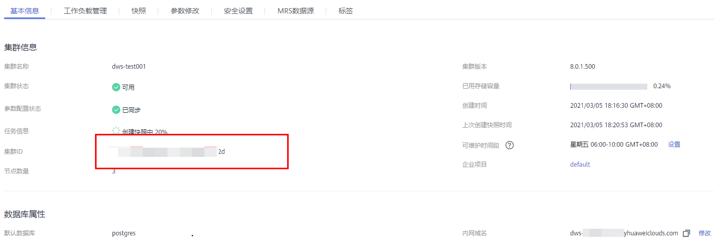

# 获取集群ID

在调用接口的时候，部分URL中需要填入集群ID（cluster\_id），所以需要获取到集群ID。集群ID获取步骤如下：

1.  登录GaussDB\(DWS\)管理控制台。
2.  在左侧导航栏，单击“集群管理”。
3.  在集群列表中找到所需要的集群，然后单击集群名称，进入集群“基本信息“页面。
4.  在“基本信息”页面查看集群ID。

    **图 1**  查看集群ID  
    

