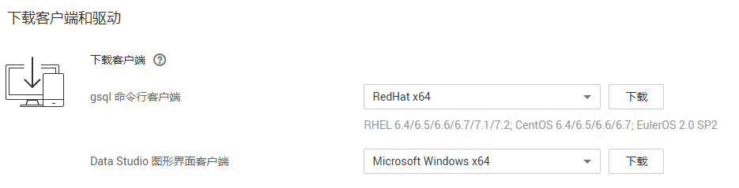
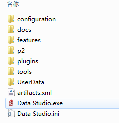
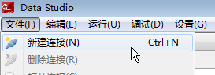
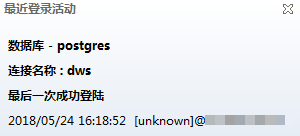

# 使用Data Studio图形界面客户端连接集群

Data Studio是一款运行在Windows操作系统上的SQL客户端工具，有着丰富的GUI界面，能够管理数据库和数据库对象，编辑、运行、调试SQL脚本，查看执行计划等。在DWS管理控制台下载Data Studio软件包，解压后免安装即可使用。

DataStudio可供下载的版本分为“Windows x86“和“Windows x64“两种版本，分别支持32位和64位Windows操作系统。

## 连接集群前的准备

-   DWS集群已绑定弹性IP。
-   已获取DWS集群的数据库管理员用户名和密码。
-   已获取DWS集群的公网访问地址，含IP地址和端口。具体请参见[获取集群连接地址](获取集群连接地址.md)。
-   已配置DWS集群所属的安全组，添加入规则允许用户的IP地址使用TCP访问端口。

    具体步骤，请参见[《虚拟私有云用户指南》](https://support.huaweicloud.com/vpc/index.html)中“添加安全组规则“章节。

## 使用Data Studio连接到集群数据库

1.  通过访问以下地址登录DWS管理控制台：[https://console.huaweicloud.com/dws](https://console.huaweicloud.com/dws)。
2.  单击“连接管理“。
3.  在“下载客户端和驱动“页面，选择对应版本的“Data Studio图形界面客户端“。请根据操作系统类型，选择“Windows x86“或“Windows x64“，单击“下载“，如[图1](#zh-cn_topic_0107187019_fig68962081218)所示。

    **图 1**  下载客户端  
    

    如果同时拥有不同版本的集群，系统会弹出对话框，提示您选择“集群版本“然后下载与集群版本相对应的客户端。在“集群管理“页面的集群列表中，单击指定集群的名称，再选择“基本信息“页签，可查看集群版本。

4.  解压下载的客户端软件包（32位或64位）到需要安装的路径。
5.  打开安装目录，双击Data Studio.exe，启动Data Studio客户端，如[图2](#zh-cn_topic_0107187019_fig6324139192412)所示。

    > **说明：**   
    >请安装与操作系统位数对应的Java 1.8.0\_141或更高版本，否则无法正常启动Data Studio客户端。  

    **图 2**  启动客户端  
    

6.  在主菜单中选择“文件“  \>  “新建连接“，如[图3](#zh-cn_topic_0107187019_fig14311312192811)所示。

    **图 3**  新建连接  
    

7.  在弹出的“新建/选择数据库连接“页面中，如[图4](#zh-cn_topic_0107187019_fig27101723910)所示，输入连接参数。

    **图 4**  配置连接参数  
    

    **表 1**  配置连接参数

    
    <table><thead align="left"><tr id="zh-cn_topic_0107187019_row88417113910"><th class="cellrowborder" valign="top" width="23.232323232323232%" id="mcps1.2.4.1.1">
字段名称

    </th>
    <th class="cellrowborder" valign="top" width="43.43434343434344%" id="mcps1.2.4.1.2">
说明

    </th>
    <th class="cellrowborder" valign="top" width="33.33333333333333%" id="mcps1.2.4.1.3">
举例

    </th>
    </tr>
    </thead>
    <tbody><tr id="zh-cn_topic_0107187019_row138017153913"><td class="cellrowborder" valign="top" width="23.232323232323232%" headers="mcps1.2.4.1.1 ">
名称

    </td>
    <td class="cellrowborder" valign="top" width="43.43434343434344%" headers="mcps1.2.4.1.2 ">
连接名称

    </td>
    <td class="cellrowborder" valign="top" width="33.33333333333333%" headers="mcps1.2.4.1.3 ">
DWS_DB

    </td>
    </tr>
    <tr id="zh-cn_topic_0107187019_row178141710395"><td class="cellrowborder" valign="top" width="23.232323232323232%" headers="mcps1.2.4.1.1 ">
主机名

    </td>
    <td class="cellrowborder" valign="top" width="43.43434343434344%" headers="mcps1.2.4.1.2 ">
所要连接的集群IP地址（IPv4）或域名。

    </td>
    <td class="cellrowborder" valign="top" width="33.33333333333333%" headers="mcps1.2.4.1.3 ">
-

    </td>
    </tr>
    <tr id="zh-cn_topic_0107187019_row88151717394"><td class="cellrowborder" valign="top" width="23.232323232323232%" headers="mcps1.2.4.1.1 ">
端口号

    </td>
    <td class="cellrowborder" valign="top" width="43.43434343434344%" headers="mcps1.2.4.1.2 ">
端口地址

    </td>
    <td class="cellrowborder" valign="top" width="33.33333333333333%" headers="mcps1.2.4.1.3 ">
8000

    </td>
    </tr>
    <tr id="zh-cn_topic_0107187019_row9881783912"><td class="cellrowborder" valign="top" width="23.232323232323232%" headers="mcps1.2.4.1.1 ">
数据库

    </td>
    <td class="cellrowborder" valign="top" width="43.43434343434344%" headers="mcps1.2.4.1.2 ">
数据库名称

    </td>
    <td class="cellrowborder" valign="top" width="33.33333333333333%" headers="mcps1.2.4.1.3 ">
postgres

    </td>
    </tr>
    <tr id="zh-cn_topic_0107187019_row79151714394"><td class="cellrowborder" valign="top" width="23.232323232323232%" headers="mcps1.2.4.1.1 ">
用户名

    </td>
    <td class="cellrowborder" valign="top" width="43.43434343434344%" headers="mcps1.2.4.1.2 ">
所要连接数据库的用户名

    </td>
    <td class="cellrowborder" valign="top" width="33.33333333333333%" headers="mcps1.2.4.1.3 ">
-

    </td>
    </tr>
    <tr id="zh-cn_topic_0107187019_row18961717397"><td class="cellrowborder" valign="top" width="23.232323232323232%" headers="mcps1.2.4.1.1 ">
密码

    </td>
    <td class="cellrowborder" valign="top" width="43.43434343434344%" headers="mcps1.2.4.1.2 ">
所要连接数据库的登录密码。

    </td>
    <td class="cellrowborder" valign="top" width="33.33333333333333%" headers="mcps1.2.4.1.3 ">
-

    </td>
    </tr>
    <tr id="zh-cn_topic_0107187019_row86069127252"><td class="cellrowborder" valign="top" width="23.232323232323232%" headers="mcps1.2.4.1.1 ">
保存密码

    </td>
    <td class="cellrowborder" valign="top" width="43.43434343434344%" headers="mcps1.2.4.1.2 ">
在下拉列表中选择：

    <ul id="zh-cn_topic_0107187019_ul37500309263"><li><strong id="zh-cn_topic_0107187019_b1675011302264">“仅当前会话”</strong>：仅在当前会话中保存密码。</li><li><strong id="zh-cn_topic_0107187019_b1091204022619">“不保存”</strong>：不保存密码。</li></ul>
    </td>
    <td class="cellrowborder" valign="top" width="33.33333333333333%" headers="mcps1.2.4.1.3 ">
-

    </td>
    </tr>
    </tbody>
    </table>

8.  选择是否启用SSL。SSL模式安全性高于普通模式，建议在客户端使用SSL模式。
    -   如果启用SSL，在“通用“页签，勾选“启用SSL“，执行[9](#zh-cn_topic_0107187019_li1286823061917)～[11](#zh-cn_topic_0107187019_li1855114111377)。
    -   如果不启用SSL，在“通用“页签，去掉“启用SSL“勾选，执行[10](#zh-cn_topic_0107187019_li181020421385)。

9.  执行以下步骤启用SSL连接。
    1.  在“通用“页签，勾选“启用SSL“。
    2.  单击“SSL“页签。
    3.  在SSL配置页面，填写以下参数。

        下载SSL证书，参见[下载SSL证书](https://support.huaweicloud.com/mgtg-dws/dws_01_0083.html)，解压证书文件到指定路径。

        -   “客户端SSL证书“：单击，选择解压目录下的“sslcert\\client.crt“文件。
        -   “客户端SSL密钥“：单击，选择解压目录下的“sslcert\\client.key“文件。
        -   “根证书“：根据所选的“SSL模式“，单击，选择解压目录下的“sslcert\\cacert.pem“文件。
        -   “SSL模式“：在下拉列表中选择SSL模式：“require“，“verify-ca“\(DWS不支持“verify-full“模式\)。如果将“SSL模式“设为“verify-ca“，则必须选择根证书。

        **图 5**  配置SSL参数  
        

10. 单击“确定“建立数据库连接。
11. （可选）如果启用了SSL，在弹出的“连接安全告警“提示对话框中单击“继续“。

    登录成功后，将弹出“最近登录活动“提示框，表示Data Studio已经连接到数据库。用户即可在Data Studio界面的“SQL终端“窗口中执行SQL语句。

    **图 6**  登录成功  
    

12. （可选）欲详细了解Data Studio其他功能的使用方法，按“F1“查看Data Studio用户手册。

