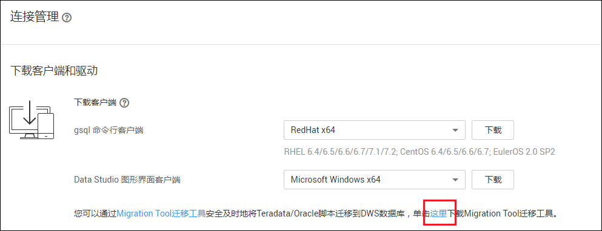

# 使用Migration Tool将Teradata/Oracle脚本迁移到DWS

Migration Tool工具用于将Teradata或Oracle数据库中的SQL脚本迁移为适用于DWS的SQL脚本，便于在DWS中通过执行这些SQL脚本即可恢复数据库，从而实现线下数据库轻松上云。

Migration Tool工具是运行在Linux操作系统的命令行工具，下载软件包后免安装使用。

## 下载Migration Tool工具

1.  通过访问以下地址登录DWS管理控制台：[https://console.huaweicloud.com/dws](https://console.huaweicloud.com/dws)。
2.  在左侧导航栏中，单击“连接管理“。
3.  在“下载客户端和驱动“区域，单击“这里“即可下载Migration Tool工具。

    如果同时拥有不同版本的集群，系统会弹出对话框，提示您选择“集群版本“然后下载与集群版本相对应的客户端。在“集群管理“页面的集群列表中，单击指定集群的名称，再选择“基本信息“页签，可查看集群版本。

    **图 1**  下载工具  
    

4.  下载到本机后，使用WinSCP工具，将Migration Tool工具上传到一个待安装工具的Linux主机上。

    执行上传操作的用户需要对Linux主机的目标存放目录有完全控制权限。

## 使用Migration Tool将Teradata/Oracle脚本迁移到DWS

详细指导请参见[Migration Tool SQL语法迁移工具](https://support.huaweicloud.com/tg-dws/mt_tool_index.html)。

