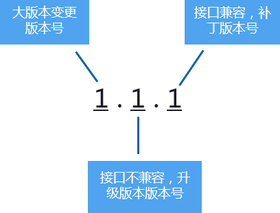
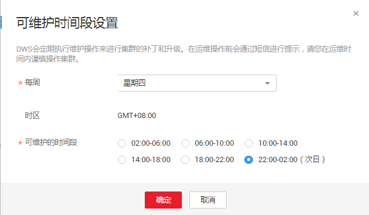

# 升级集群

在DWS集群创建成功后，系统会自动为集群设置一个随机的“可维护时间段”，用户也可以根据实际情况自定义设置一个“可维护时间段”。如何查看和设置可维护时间段，请参见[设置可维护时间段](#section1583412504297)。

可维护时间段有效时长为4小时，即每次最长维护操作为4小时，在此期间，可以进行升级集群、修复操作系统补丁、系统加固等操作。如果在计划的维护时段内没有要执行的维护任务，则集群将继续正常运行，直到下一个计划的维护时段。DWS对集群进行运维操作前，会通过短信进行提示，在运维时间内请谨慎操作集群。

如果有一个节点因硬件故障需要替换，会激发repairCluster事件，用户可以通过[订阅事件通知](订阅事件通知.md)获取最新进展，确保业务正常进行；节点替换操作由后台运维人员在可维护时间段内操作。

如果升级破坏了当前的查询请求和业务运行，请联系技术人员进行紧急处理。

只要集群状态为“可用”，则集群继续按小时计费或者按预付费节点计费。由于集群继续按小时计费或者按预付费节点计费，如果节点故障/系统升级仅导致集群短暂中断（例如15分钟），则您将看不到任何差异。如果此类事件导致系统中断（非常罕见），则不会向您收取停机时间的费用。

## 升级集群

用户不需要关心DWS集群的修补或升级，因为DWS将自动处理版本升级。当DWS服务升级后，DWS将在集群的“可维护时间段”内，自动将集群升级到最新版本，无需人为操作。升级过程中会自动重启集群，在此期间集群将短时间无法提供服务，因此，请合理设置“可维护时间段”，建议用户选择连接用户数少、活跃任务数少的时间。

> **说明：**   
>集群升级后，不支持回退。  

集群版本说明如下图所示：

**图 1**  版本说明  

-   **服务补丁升级**：表示集群版本X.X.X最后一位数字的升级更新，例如，集群版本从1.1.0升级到1.1.1。
    -   持续时间：整个升级过程将花费不到10分钟。
    -   业务影响：在此期间，业务会中断1至3分钟。

-   **服务升级**：表示集群版本X.X.X前面两位数字的升级更新，例如，集群版本从1.1.0升级到1.2.0。
    -   持续时间：整个升级过程将花费不到30分钟。
    -   业务影响：在此期间，数据库无法访问。

## 设置可维护时间段

1.  通过访问以下地址登录DWS管理控制台：[https://console.huaweicloud.com/dws](https://console.huaweicloud.com/dws)。
2.  单击“集群管理“。
3.  在集群列表中，单击指定集群的名称，将显示集群的“基本信息“页面。

    在“基本信息“页面的“集群信息“区域，可以查看“可维护时间段“。

4.  在“可维护时间段“右侧，单击“设置“。
5.  在弹出对话框中，设置可维护时间段。

    **图 2**  可维护时间段设置  
    

6.  单击“确定“。

