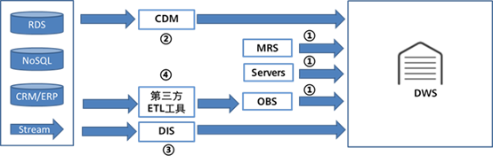

# 数据导入导出概述

DWS支持多样化的数据入库方式，如[图1](#fig6397143273115)所示。建议用户配合云数据迁移（Cloud Data Migration，简称CDM）、数据接入服务（Data Ingestion Service，简称DIS）和数据湖工厂（Data Lake Factory，简称DLF）一起使用，CDM用于批量数据迁移，DIS用于流数据接入，DLF可以对整个ETL过程进行编排调度，同时提供可视化的开发环境。

**图 1**  入库方式  

数据库导入方式/工具：

**表 1**  数据导入详细说明

<table><thead align="left"><tr id="row1627416369375"><th class="cellrowborder" valign="top" width="5.9405940594059405%" id="mcps1.2.5.1.1">
序号

</th>
<th class="cellrowborder" valign="top" width="23.762376237623762%" id="mcps1.2.5.1.2">
导入方式

</th>
<th class="cellrowborder" valign="top" width="37.62376237623762%" id="mcps1.2.5.1.3">
数据源

</th>
<th class="cellrowborder" valign="top" width="32.67326732673268%" id="mcps1.2.5.1.4">
优势

</th>
</tr>
</thead>
<tbody><tr id="row152747367379"><td class="cellrowborder" valign="top" width="5.9405940594059405%" headers="mcps1.2.5.1.1 ">
1

</td>
<td class="cellrowborder" valign="top" width="23.762376237623762%" headers="mcps1.2.5.1.2 ">
并行拉取

</td>
<td class="cellrowborder" valign="top" width="37.62376237623762%" headers="mcps1.2.5.1.3 ">
OBS、MRS（HDFS）、远端服务器（使用GDS）

</td>
<td class="cellrowborder" valign="top" width="32.67326732673268%" headers="mcps1.2.5.1.4 ">
性能好，横向扩展。

</td>
</tr>
<tr id="row1127453617378"><td class="cellrowborder" valign="top" width="5.9405940594059405%" headers="mcps1.2.5.1.1 ">
2

</td>
<td class="cellrowborder" valign="top" width="23.762376237623762%" headers="mcps1.2.5.1.2 ">
CDM（使用Copy和GDS）

</td>
<td class="cellrowborder" valign="top" width="37.62376237623762%" headers="mcps1.2.5.1.3 ">
数据库、NoSQL、文件系统、大数据平台

</td>
<td class="cellrowborder" valign="top" width="32.67326732673268%" headers="mcps1.2.5.1.4 ">
数据源丰富，操作简单。

</td>
</tr>
<tr id="row1372113404214"><td class="cellrowborder" valign="top" width="5.9405940594059405%" headers="mcps1.2.5.1.1 ">
3

</td>
<td class="cellrowborder" valign="top" width="23.762376237623762%" headers="mcps1.2.5.1.2 ">
DIS（使用OBS转储）

</td>
<td class="cellrowborder" valign="top" width="37.62376237623762%" headers="mcps1.2.5.1.3 ">
流数据

</td>
<td class="cellrowborder" valign="top" width="32.67326732673268%" headers="mcps1.2.5.1.4 ">
准实时入库。

</td>
</tr>
<tr id="row115562143311"><td class="cellrowborder" valign="top" width="5.9405940594059405%" headers="mcps1.2.5.1.1 ">
4

</td>
<td class="cellrowborder" valign="top" width="23.762376237623762%" headers="mcps1.2.5.1.2 ">
第三方ETL工具

</td>
<td class="cellrowborder" valign="top" width="37.62376237623762%" headers="mcps1.2.5.1.3 ">
数据库、NoSQL、文件系统、大数据平台

</td>
<td class="cellrowborder" valign="top" width="32.67326732673268%" headers="mcps1.2.5.1.4 ">
通过OBS中转，数据源丰富，数据转换能力强。

</td>
</tr>
<tr id="row3587172710331"><td class="cellrowborder" valign="top" width="5.9405940594059405%" headers="mcps1.2.5.1.1 ">
5

</td>
<td class="cellrowborder" valign="top" width="23.762376237623762%" headers="mcps1.2.5.1.2 ">
DLF

</td>
<td class="cellrowborder" valign="top" width="37.62376237623762%" headers="mcps1.2.5.1.3 ">
-

</td>
<td class="cellrowborder" valign="top" width="32.67326732673268%" headers="mcps1.2.5.1.4 ">
工作流可视化编排调度。

</td>
</tr>
</tbody>
</table>

数据库导出工具：

OBS、GDS。

