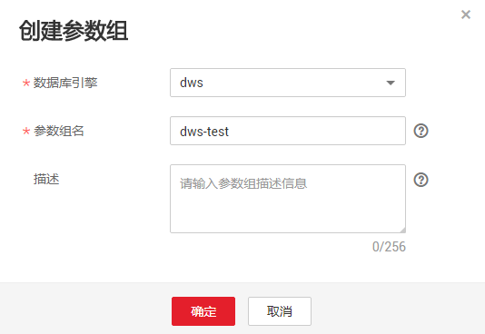
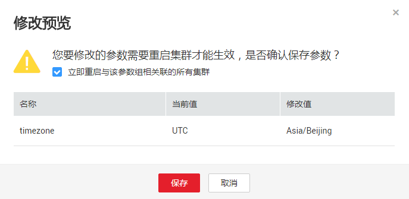
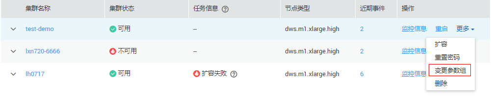
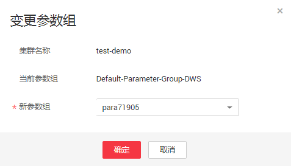

# 管理参数组

用户可以在DWS管理控制台上[创建参数组](#section14261524455)、[修改参数组](#section1957519408206)、[删除参数组](#section988984052114)以及[变更参数组](#section2615131874812)。

## 参数组概述

参数组是一组数据库参数的集合，用户可以通过设置数据库参数组，使数据库更好地适配实际情况，并运行业务。在创建集群、恢复集群时，必须指定一个参数组与集群相关联，指定的参数组中的参数将被应用于该DWS集群中的所有数据库。当集群创建成功后，用户可以通过变更参数组，为集群指定另一个参数组与之相关联，但是，您可能需要重启集群，才能使新指定的参数组生效。

DWS预置了一个默认参数组“Default-Parameter-Group-DWS“，默认参数组不支持删除，参数组中的参数也不支持修改。如果用户想要修改参数值，可以创建一个自定义参数组，自定义参数组中的参数值允许被修改。

对于在1.2.3版本之前创建的集群，等集群版本自动升级至1.2.3或以上版本后，参数组中各个参数的值将被设置为默认参数组的值，用户可以通过变更参数组给集群指定一个参数组。

## 参数组参数说明

**表 1**  参数组参数说明

<table><thead align="left"><tr id="row92716201567"><th class="cellrowborder" valign="top" width="23.762376237623762%" id="mcps1.2.4.1.1">
<strong id="b192968471772">参数名称</strong>

</th>
<th class="cellrowborder" valign="top" width="47.524752475247524%" id="mcps1.2.4.1.2">
<strong id="b6296747077">参数描述</strong>

</th>
<th class="cellrowborder" valign="top" width="28.71287128712871%" id="mcps1.2.4.1.3">
<strong id="b429614479717">默认值</strong>

</th>
</tr>
</thead>
<tbody><tr id="row7273201611"><td class="cellrowborder" valign="top" width="23.762376237623762%" headers="mcps1.2.4.1.1 ">
session_timeout

</td>
<td class="cellrowborder" valign="top" width="47.524752475247524%" headers="mcps1.2.4.1.2 ">
Session闲置超时时间，单位为秒，0表示关闭超时限制。

</td>
<td class="cellrowborder" valign="top" width="28.71287128712871%" headers="mcps1.2.4.1.3 ">
600

</td>
</tr>
<tr id="row9271201464"><td class="cellrowborder" valign="top" width="23.762376237623762%" headers="mcps1.2.4.1.1 ">
query_dop

</td>
<td class="cellrowborder" valign="top" width="47.524752475247524%" headers="mcps1.2.4.1.2 ">
用户自定义的查询并行度。

</td>
<td class="cellrowborder" valign="top" width="28.71287128712871%" headers="mcps1.2.4.1.3 ">
2

</td>
</tr>
<tr id="row10271220063"><td class="cellrowborder" valign="top" width="23.762376237623762%" headers="mcps1.2.4.1.1 ">
datestyle

</td>
<td class="cellrowborder" valign="top" width="47.524752475247524%" headers="mcps1.2.4.1.2 ">
设置日期和时间值的显示格式。

</td>
<td class="cellrowborder" valign="top" width="28.71287128712871%" headers="mcps1.2.4.1.3 ">
ISO,MDY

</td>
</tr>
<tr id="row6271820468"><td class="cellrowborder" valign="top" width="23.762376237623762%" headers="mcps1.2.4.1.1 ">
failed_login_attempts

</td>
<td class="cellrowborder" valign="top" width="47.524752475247524%" headers="mcps1.2.4.1.2 ">
输入密码错误的次数达到该参数所设置的值时，帐户将会被自动锁定。配置为0时表示不限制密码输入错误的次数。

</td>
<td class="cellrowborder" valign="top" width="28.71287128712871%" headers="mcps1.2.4.1.3 ">
10

</td>
</tr>
<tr id="row5271202614"><td class="cellrowborder" valign="top" width="23.762376237623762%" headers="mcps1.2.4.1.1 ">
timezone

</td>
<td class="cellrowborder" valign="top" width="47.524752475247524%" headers="mcps1.2.4.1.2 ">
设置显示和解释时间类型数值时使用的时区。

</td>
<td class="cellrowborder" valign="top" width="28.71287128712871%" headers="mcps1.2.4.1.3 ">
UTC

</td>
</tr>
<tr id="row42710205610"><td class="cellrowborder" valign="top" width="23.762376237623762%" headers="mcps1.2.4.1.1 ">
log_timezone

</td>
<td class="cellrowborder" valign="top" width="47.524752475247524%" headers="mcps1.2.4.1.2 ">
设置服务器写日志文件时使用的时区。

</td>
<td class="cellrowborder" valign="top" width="28.71287128712871%" headers="mcps1.2.4.1.3 ">
UTC

</td>
</tr>
</tbody>
</table>

## 创建参数组

如果默认参数组中的参数值无法满足业务，用户可以创建自定义参数组，然后可以修改其中的参数值，从而更好地适配业务。

创建参数组操作步骤如下：

1.  通过访问以下地址登录DWS管理控制台：[https://console.huaweicloud.com/dws](https://console.huaweicloud.com/dws)。
2.  在左侧导航栏中，单击“参数组管理“。
3.  单击“创建参数组“，然后设置以下参数。

    -   “数据库引擎“：选择一个数据库引擎。
    -   “参数组名“：填写新参数组的名称。

        参数组名称长度为4～64个字符，必须以字母开头，不区分大小写，可以包含字母、数字、中划线或者下划线，不能包含其他的特殊字符。

    -   “描述“：填写新参数组的描述信息。此参数为可选参数。

        参数组描述的字符长度为0～256，且特殊字符!<\>'=&"不支持。

    **图 1**  创建参数组  
    

4.  单击“确定“，开始创建参数组。

## 修改参数组

对于用户自定义创建的参数组，可以修改其中的参数值，但是默认参数组中的参数值不支持修改。

1.  通过访问以下地址登录DWS管理控制台：[https://console.huaweicloud.com/dws](https://console.huaweicloud.com/dws)。
2.  在左侧导航栏中，单击“参数组管理“。
3.  在“名称“列单击待修改的参数组名称，进入参数列表页面。
4.  在待修改的参数所对应的“值“中，输入新的值。修改完，单击“保存“

    对于参数列表中“是否重启”这一列显示为“是”的参数，修改此类参数并保存后，需要重启集群才能使新的参数值生效。

5.  （可选）如果所修改的参数需要重启集群才能生效，请在弹出的“修改预览“对话框中勾选“立即重启与该参数组相关联的所有集群”。

    如果不勾选，系统将只保存参数值。稍后，用户需要手动重启集群才能使新的参数值生效。

    **图 2**  修改预览  
    

6.  在“修改预览“对话框中，确认无误后，单击“保存“。

## 删除参数组

对于多余或者长期不使用的参数组，用户可以将其删除，但是不支持删除默认参数组。成功删除的参数组无法恢复，请用户谨慎操作。

当要删除某个参数组时，必须先确保它没有被任何集群所使用，否则无法删除，必须先通过[变更参数组](#section2615131874812)，为集群指定其他参数组（建议指定为默认参数组），然后再删除待删除的参数组。

1.  通过访问以下地址登录DWS管理控制台：[https://console.huaweicloud.com/dws](https://console.huaweicloud.com/dws)。
2.  在左侧导航栏中，单击“参数组管理“。
3.  在待删除的参数组右侧，单击“删除“。
4.  在弹出的对话框，单击“确定“。

## 变更参数组

集群创建成功后，用户可以为集群变更参数组，变更后，您可能需要重启集群，才能使新的参数组生效。

集群需满足以下条件，才能执行变更参数组的操作。

变更参数组的操作步骤如下：

1.  通过访问以下地址登录DWS管理控制台：[https://console.huaweicloud.com/dws](https://console.huaweicloud.com/dws)。
2.  在左侧导航栏中，单击“集群管理“。
3.  在某个集群右侧，单击“更多 \> 变更参数组“。

    **图 3**  变更参数组  
    

4.  在“变更参数组“对话框，“新参数组“右侧，单击下拉菜单，选择新参数组。

    **图 4**  选择新参数组  
    

5.  单击“确定“。

