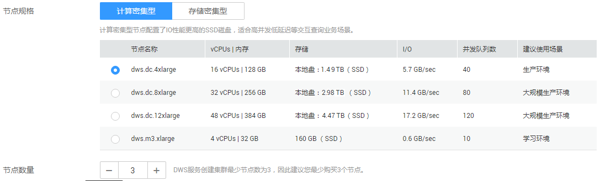
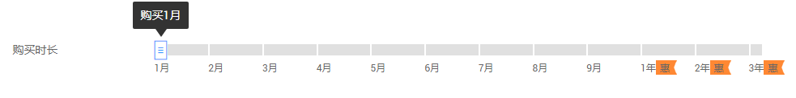

# 购买预付费节点

DWS同时提供预付费节点的计费方式，根据服务购买时长，一次性支付费用。最短时长为1个月，最长时长为3年。这种购买方式相对比较优惠，对于长期使用者，推荐该方式。

预付费节点购买成功后系统不会自动创建集群。您需要前往[DWS管理控制台](https://console.huaweicloud.com/dws)自行创建集群，具体操作步骤请参见[创建集群](创建集群.md)章节。

请参见以下操作步骤以预付费的方式购买DWS服务。

## 购买预付费节点

1.  登录[DWS管理控制台](https://console.huaweicloud.com/dws)。
2.  单击“预付费享折扣”。
3.  在“购买数据仓库服务预付费节点”页面，选择“区域”。

    **表 1**  区域参数说明

    
    <table><thead align="left"><tr id="zh-cn_topic_0106894116_row191411656123611"><th class="cellrowborder" valign="top" width="21.62%" id="mcps1.2.4.1.1">
<strong id="zh-cn_topic_0106894116_b314125603616">参数名</strong>

    </th>
    <th class="cellrowborder" valign="top" width="53.76%" id="mcps1.2.4.1.2">
<strong id="zh-cn_topic_0106894116_b17141135693614">参数解释</strong>

    </th>
    <th class="cellrowborder" valign="top" width="24.62%" id="mcps1.2.4.1.3">
<strong id="zh-cn_topic_0106894116_b14141125653610">样例值</strong>

    </th>
    </tr>
    </thead>
    <tbody><tr id="zh-cn_topic_0106894116_row13142135610364"><td class="cellrowborder" valign="top" width="21.62%" headers="mcps1.2.4.1.1 ">
区域

    </td>
    <td class="cellrowborder" valign="top" width="53.76%" headers="mcps1.2.4.1.2 ">
选择集群节点实际工作区域。

    
不同的区域之间预付费节点不互通，每个区域需分别购买，请根据您的实际需求慎重选择。

    
目前支持“华南-广州”、“华北-北京一”和“华东-上海二”。

    </td>
    <td class="cellrowborder" valign="top" width="24.62%" headers="mcps1.2.4.1.3 ">
华北-北京一

    </td>
    </tr>
    </tbody>
    </table>

4.  选择“节点规格“，并设置“节点数量“。

    **图 1**  选择节点规格  
    

    **表 2**  规格参数说明

    
    <table><thead align="left"><tr id="zh-cn_topic_0106894116_row6531322154416"><th class="cellrowborder" valign="top" width="21.62%" id="mcps1.2.4.1.1">
<strong id="zh-cn_topic_0106894116_b7538102234418">参数名</strong>

    </th>
    <th class="cellrowborder" valign="top" width="53.76%" id="mcps1.2.4.1.2">
<strong id="zh-cn_topic_0106894116_b75435223442">参数解释</strong>

    </th>
    <th class="cellrowborder" valign="top" width="24.62%" id="mcps1.2.4.1.3">
<strong id="zh-cn_topic_0106894116_b6547722184419">样例值</strong>

    </th>
    </tr>
    </thead>
    <tbody><tr id="zh-cn_topic_0106894116_row165685224446"><td class="cellrowborder" valign="top" width="21.62%" headers="mcps1.2.4.1.1 ">
节点规格

    </td>
    <td class="cellrowborder" valign="top" width="53.76%" headers="mcps1.2.4.1.2 ">
选择集群中每个节点的CPU与内存资源。DWS支持的节点规格具体可参见<a href="#dws_01_0138__zh-cn_topic_0106894116_table19316337719">表3</a>。

    </td>
    <td class="cellrowborder" valign="top" width="24.62%" headers="mcps1.2.4.1.3 ">
dws.dc.4xlarge

    </td>
    </tr>
    <tr id="zh-cn_topic_0106894116_row352611520469"><td class="cellrowborder" valign="top" width="21.62%" headers="mcps1.2.4.1.1 ">
节点数量

    </td>
    <td class="cellrowborder" valign="top" width="53.76%" headers="mcps1.2.4.1.2 ">
选择集群中的节点个数。

    
如果您是首次购买，建议您购买至少3个节点，因为DWS集群最小规模为3个节点。

    
如果您非首次购买，则根据您的实际需要选择节点数即可。

    </td>
    <td class="cellrowborder" valign="top" width="24.62%" headers="mcps1.2.4.1.3 ">
3

    </td>
    </tr>
    </tbody>
    </table>

    **表 3**  规格说明

    
    <table><thead align="left"><tr id="zh-cn_topic_0106894116_dws_01_0019_row4719111131414"><th class="cellrowborder" valign="top" width="29.23%" id="mcps1.2.6.1.1">
<strong id="zh-cn_topic_0106894116_dws_01_0019_b11729311121418">规格类型</strong>

    </th>
    <th class="cellrowborder" valign="top" width="13.65%" id="mcps1.2.6.1.2">
<strong id="zh-cn_topic_0106894116_dws_01_0019_b2073791117140">vCPU核数</strong>

    </th>
    <th class="cellrowborder" valign="top" width="12.31%" id="mcps1.2.6.1.3">
<strong id="zh-cn_topic_0106894116_dws_01_0019_b174621181411">内存大小</strong>

    </th>
    <th class="cellrowborder" valign="top" width="16.37%" id="mcps1.2.6.1.4">
<strong id="zh-cn_topic_0106894116_dws_01_0019_b27541811171418">节点磁盘大小</strong>

    </th>
    <th class="cellrowborder" valign="top" width="28.439999999999998%" id="mcps1.2.6.1.5">
<strong id="zh-cn_topic_0106894116_dws_01_0019_b2076320113147">磁盘类型</strong>

    </th>
    </tr>
    </thead>
    <tbody><tr id="zh-cn_topic_0106894116_dws_01_0019_row7897131111414"><td class="cellrowborder" valign="top" width="29.23%" headers="mcps1.2.6.1.1 ">
dws.d2.xlarge

    </td>
    <td class="cellrowborder" valign="top" width="13.65%" headers="mcps1.2.6.1.2 ">
4

    </td>
    <td class="cellrowborder" valign="top" width="12.31%" headers="mcps1.2.6.1.3 ">
32 GB

    </td>
    <td class="cellrowborder" valign="top" width="16.37%" headers="mcps1.2.6.1.4 ">
1.68 TB

    </td>
    <td class="cellrowborder" valign="top" width="28.439999999999998%" headers="mcps1.2.6.1.5 ">
存储密集型，本地盘（HDD）

    </td>
    </tr>
    <tr id="zh-cn_topic_0106894116_dws_01_0019_row6924131111146"><td class="cellrowborder" valign="top" width="29.23%" headers="mcps1.2.6.1.1 ">
dws.d2.12xlarge

    </td>
    <td class="cellrowborder" valign="top" width="13.65%" headers="mcps1.2.6.1.2 ">
48

    </td>
    <td class="cellrowborder" valign="top" width="12.31%" headers="mcps1.2.6.1.3 ">
384 GB

    </td>
    <td class="cellrowborder" valign="top" width="16.37%" headers="mcps1.2.6.1.4 ">
13.41 TB

    </td>
    <td class="cellrowborder" valign="top" width="28.439999999999998%" headers="mcps1.2.6.1.5 ">
存储密集型，本地盘（HDD）

    </td>
    </tr>
    <tr id="zh-cn_topic_0106894116_dws_01_0019_row149761311181418"><td class="cellrowborder" valign="top" width="29.23%" headers="mcps1.2.6.1.1 ">
dws.m3.xlarge

    </td>
    <td class="cellrowborder" valign="top" width="13.65%" headers="mcps1.2.6.1.2 ">
4

    </td>
    <td class="cellrowborder" valign="top" width="12.31%" headers="mcps1.2.6.1.3 ">
32 GB

    </td>
    <td class="cellrowborder" valign="top" width="16.37%" headers="mcps1.2.6.1.4 ">
160 GB

    </td>
    <td class="cellrowborder" valign="top" width="28.439999999999998%" headers="mcps1.2.6.1.5 ">
计算密集型SSD

    </td>
    </tr>
    <tr id="zh-cn_topic_0106894116_dws_01_0019_row152315233489"><td class="cellrowborder" valign="top" width="29.23%" headers="mcps1.2.6.1.1 ">
dws.dc.4xlarge

    </td>
    <td class="cellrowborder" valign="top" width="13.65%" headers="mcps1.2.6.1.2 ">
16

    </td>
    <td class="cellrowborder" valign="top" width="12.31%" headers="mcps1.2.6.1.3 ">
128 GB

    </td>
    <td class="cellrowborder" valign="top" width="16.37%" headers="mcps1.2.6.1.4 ">
1.49 TB

    </td>
    <td class="cellrowborder" valign="top" width="28.439999999999998%" headers="mcps1.2.6.1.5 ">
计算密集型，本地盘（SSD）

    </td>
    </tr>
    <tr id="zh-cn_topic_0106894116_dws_01_0019_row4711133319484"><td class="cellrowborder" valign="top" width="29.23%" headers="mcps1.2.6.1.1 ">
dws.dc.8xlarge

    </td>
    <td class="cellrowborder" valign="top" width="13.65%" headers="mcps1.2.6.1.2 ">
32

    </td>
    <td class="cellrowborder" valign="top" width="12.31%" headers="mcps1.2.6.1.3 ">
256 GB

    </td>
    <td class="cellrowborder" valign="top" width="16.37%" headers="mcps1.2.6.1.4 ">
2.98 TB

    </td>
    <td class="cellrowborder" valign="top" width="28.439999999999998%" headers="mcps1.2.6.1.5 ">
计算密集型，本地盘（SSD）

    </td>
    </tr>
    <tr id="zh-cn_topic_0106894116_dws_01_0019_row13695174014488"><td class="cellrowborder" valign="top" width="29.23%" headers="mcps1.2.6.1.1 ">
dws.dc.12xlarge

    </td>
    <td class="cellrowborder" valign="top" width="13.65%" headers="mcps1.2.6.1.2 ">
48

    </td>
    <td class="cellrowborder" valign="top" width="12.31%" headers="mcps1.2.6.1.3 ">
384 GB

    </td>
    <td class="cellrowborder" valign="top" width="16.37%" headers="mcps1.2.6.1.4 ">
4.47 TB

    </td>
    <td class="cellrowborder" valign="top" width="28.439999999999998%" headers="mcps1.2.6.1.5 ">
计算密集型，本地盘（SSD）

    </td>
    </tr>
    </tbody>
    </table>

    > **说明：**   
    >-   预付费节点和具体的区域、节点规格绑定，当您购买的预付费节点和您运行的集群节点的区域和规格完全一致时，才能在实际计费时享受优惠。  

5.  拖动“购买时长“的滑块，确定购买时长。

    在页面底部，将显示“参考价格“，您可以单击“了解计费详情“，在弹出的“产品价格详情“页面中，查看具体的计费详情。

    **图 2**  设置购买时长  
    

6.  单击“立即购买“，进入订单详情确认页面。
7.  订单详情确认无误后，单击“去支付”。
8.  选择如下任一方式付款：

    -   选择“余额支付“，然后单击“确认付款“。
    -   选择“在线支付“，然后选择支付方式，再单击“确认付款“。
    -   选择“申请线上合同请款后支付“，然后填写合同内容，再单击“创建正式合同“。

    预付费节点购买成功后系统不会自动创建集群。如果您尚未创建集群，需前往[DWS管理控制台](https://console.huaweicloud.com/dws)自行创建，具体操作步骤请参见[创建集群](创建集群.md)章节。

