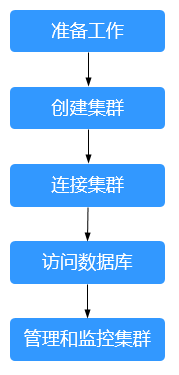

# DWS使用简介

数据仓库服务是一种基于公有云基础架构和平台的在线数据处理数据库，提供即开即用、可扩展且完全托管的分析型数据库服务。DWS是基于华为融合数据仓库GaussDB产品的云原生服务，兼容标准ANSI SQL 99和SQL 2003，同时兼容PostgreSQL/Oracle数据库生态，为各行业PB级海量大数据分析提供有竞争力的解决方案。

DWS提供了简单易用的Web管理控制台，帮助您快速创建数据仓库集群，轻松执行数据仓库管理任务。

## DWS使用流程介绍

**图 1**  DWS使用流程  

**表 1**  DWS使用流程介绍

<table><thead align="left"><tr id="row980471411194"><th class="cellrowborder" valign="top" width="16.41%" id="mcps1.2.5.1.1">
主流程

</th>
<th class="cellrowborder" valign="top" width="12.879999999999999%" id="mcps1.2.5.1.2">
子任务

</th>
<th class="cellrowborder" valign="top" width="39.269999999999996%" id="mcps1.2.5.1.3">
说明

</th>
<th class="cellrowborder" valign="top" width="31.44%" id="mcps1.2.5.1.4">
操作指导

</th>
</tr>
</thead>
<tbody><tr id="row569524210342"><td class="cellrowborder" valign="top" width="16.41%" headers="mcps1.2.5.1.1 ">
准备工作

</td>
<td class="cellrowborder" valign="top" width="12.879999999999999%" headers="mcps1.2.5.1.2 ">
-

</td>
<td class="cellrowborder" valign="top" width="39.269999999999996%" headers="mcps1.2.5.1.3 ">
在使用华为云DWS服务之前，请先注册一个公有云账号，并在您的防火墙中确定一个开放端口作为DWS集群的数据库端口。

</td>
<td class="cellrowborder" valign="top" width="31.44%" headers="mcps1.2.5.1.4 ">
<a href="准备工作.md">准备工作</a>

</td>
</tr>
<tr id="row1780491461916"><td class="cellrowborder" valign="top" width="16.41%" headers="mcps1.2.5.1.1 ">
创建集群

</td>
<td class="cellrowborder" valign="top" width="12.879999999999999%" headers="mcps1.2.5.1.2 ">
-

</td>
<td class="cellrowborder" valign="top" width="39.269999999999996%" headers="mcps1.2.5.1.3 ">
在使用DWS执行数据分析任务前，您首先要创建一个集群。一个DWS集群由多个在相同子网中的节点组成，共同提供服务。创建集群时，系统会创建一个默认数据库。

</td>
<td class="cellrowborder" valign="top" width="31.44%" headers="mcps1.2.5.1.4 "><ul id="ul665919136919"><li><a href="创建集群.md">创建集群</a></li><li><a href="购买包年包月套餐.md">购买包年包月套餐</a>（推荐购买）</li></ul>
</td>
</tr>
<tr id="row7867168102818"><td class="cellrowborder" valign="top" width="16.41%" headers="mcps1.2.5.1.1 ">
连接集群

</td>
<td class="cellrowborder" valign="top" width="12.879999999999999%" headers="mcps1.2.5.1.2 ">
-

</td>
<td class="cellrowborder" valign="top" width="39.269999999999996%" headers="mcps1.2.5.1.3 ">
DWS集群创建完成后，您就可以使用SQL客户端工具或者JDBC/ODBC等第三方驱动程序连接集群中的数据库。进入DWS控制台的“连接管理”页面，您可以下载SQL客户端工具和JDBC/ODBC驱动程序。

</td>
<td class="cellrowborder" valign="top" width="31.44%" headers="mcps1.2.5.1.4 ">
<a href="连接集群的方式.md">连接集群</a>

</td>
</tr>
<tr id="row193781041152120"><td class="cellrowborder" valign="top" width="16.41%" headers="mcps1.2.5.1.1 ">
访问数据库

</td>
<td class="cellrowborder" valign="top" width="12.879999999999999%" headers="mcps1.2.5.1.2 ">
-

</td>
<td class="cellrowborder" valign="top" width="39.269999999999996%" headers="mcps1.2.5.1.3 ">
连接集群后，您就可以创建和管理数据库，管理用户及权限，导入或导出数据，以及查询和分析数据。

</td>
<td class="cellrowborder" valign="top" width="31.44%" headers="mcps1.2.5.1.4 ">
<a href="https://support.huaweicloud.com/devg-dws/before_you_start_0001.html" target="_blank" rel="noopener noreferrer">《数据仓库服务数据库开发指南》</a>

</td>
</tr>
<tr id="row860511553219"><td class="cellrowborder" rowspan="3" valign="top" width="16.41%" headers="mcps1.2.5.1.1 ">
管理和监控集群

</td>
<td class="cellrowborder" valign="top" width="12.879999999999999%" headers="mcps1.2.5.1.2 ">
管理集群

</td>
<td class="cellrowborder" valign="top" width="39.269999999999996%" headers="mcps1.2.5.1.3 ">
您可以查看集群状态，修改集群配置，添加集群标签，对集群进行调整大小、重启、删除等管理操作。

</td>
<td class="cellrowborder" valign="top" width="31.44%" headers="mcps1.2.5.1.4 ">
<a href="登录DWS管理控制台.md">管理集群</a>

</td>
</tr>
<tr id="row18970322194014"><td class="cellrowborder" valign="top" headers="mcps1.2.5.1.1 ">
管理快照

</td>
<td class="cellrowborder" valign="top" headers="mcps1.2.5.1.2 ">
通过创建集群快照，可以对集群进行备份，使用快照可以恢复集群。

</td>
<td class="cellrowborder" valign="top" headers="mcps1.2.5.1.3 ">
<a href="快照概述.md">管理快照</a>

</td>
</tr>
<tr id="row10253419154015"><td class="cellrowborder" valign="top" headers="mcps1.2.5.1.1 ">
运维与监控

</td>
<td class="cellrowborder" valign="top" headers="mcps1.2.5.1.2 ">
您可以通过监控集群、审计日志、事件通知、资源与负载管理，了解集群的运行状况和性能。

</td>
<td class="cellrowborder" valign="top" headers="mcps1.2.5.1.3 "><ul id="ul8102554205215"><li><a href="监控集群.md">监控集群</a></li><li><a href="事件通知概述.md">事件通知</a></li><li><a href="审计日志.md">审计日志</a></li><li><a href="https://support.huaweicloud.com/devg-dws/dws_04_0921.html" target="_blank" rel="noopener noreferrer">资源负载管理</a></li></ul>
</td>
</tr>
</tbody>
</table>

