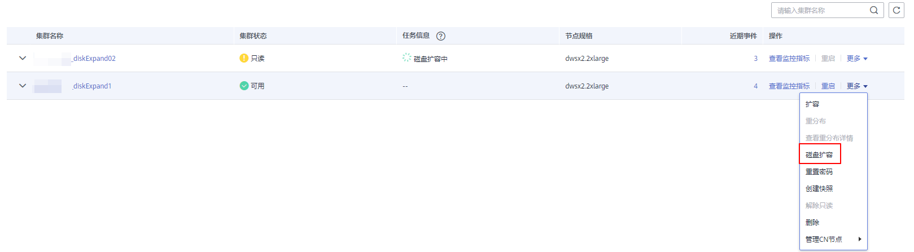
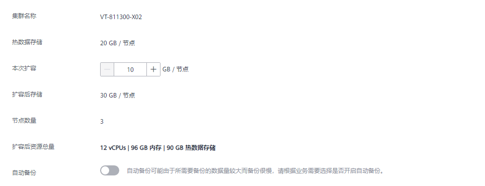
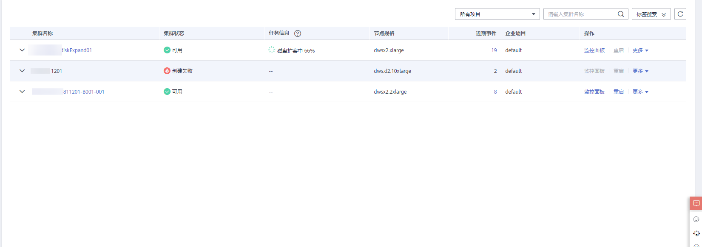

# EVS集群磁盘扩容

## 磁盘扩容概述

随着客户业务的发展，磁盘空间往往最先出现资源瓶颈，在其他资源尚且充足的情况下，执行传统扩容操作不仅耗时久，还伴随着资源浪费问题，扩容过程也不具备在线能力。通过磁盘扩容可快速缓解存储资源瓶颈现象，操作过程中无需暂停业务，并且不会造成CPU、内存等资源浪费。用户可在没有其他业务情况下选择磁盘扩容操作，扩容成功后可以继续磁盘扩容，若扩容失败用户可尝试重新进行磁盘扩容操作。

> **说明：** 
>-   磁盘扩容功能仅8.1.1.203及以上版本支持，并且创建集群规格需要为云数仓SSD云盘、实时数仓或IoT数仓类型。
>-   集群状态为“可用”、“待重启”、“只读”、“非均衡”、“节点故障”或者 “不可用”的情况下才能下发磁盘扩容。

## 注意事项

-   热数据存储只支持磁盘扩容，不支持缩容。
-   磁盘扩容最多可扩容5000个磁盘，扩容后节点存储容量按磁盘数量均分。
-   热数据存储扩容后超出折扣套餐包部分将按需收费。
-   热数据存储扩容时，请选择在业务低峰期进行存储扩容。
-   若集群是只读状态，单击“磁盘扩容”后，页面会弹出提示信息，磁盘扩容完成后，请耐心等待集群状态恢复为可用。
-   包年/包月计费模式集群进行磁盘扩容操作时，默认扩容磁盘也按照包年包月计费。

## 操作步骤

1.  登录GaussDB\(DWS\) 管理控制台。
2.  单击“集群管理“。默认显示用户所有的集群列表。
3.  集群列表中，在指定集群所在行的“操作“列，选择“更多\>磁盘扩容“。系统将显示“磁盘扩容”页面。

    

4.  在“磁盘扩容”页面，选择磁盘扩容容量，用户可根据需求选择是否打开自动备份开关，单击“下一步：确认”按钮。

    

5.  确认无误后，单击"提交"按钮提交磁盘扩容任务。
6.  单击返回集群列表，显示磁盘扩容进度信息。

    

