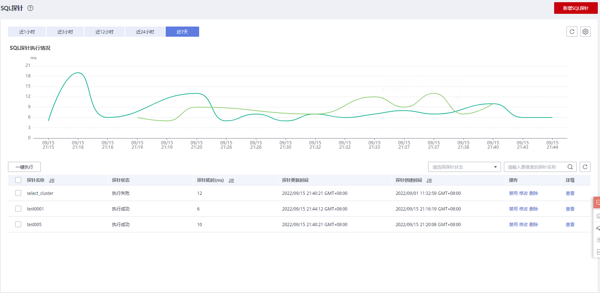
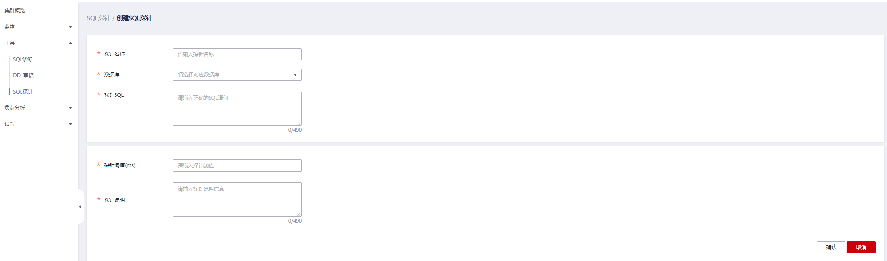
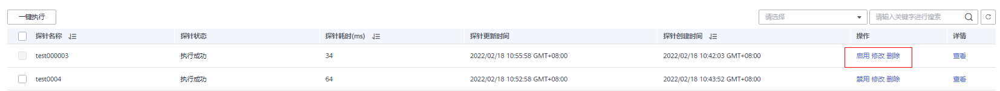
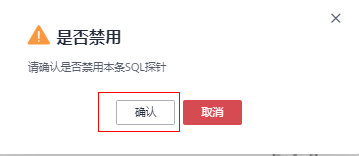
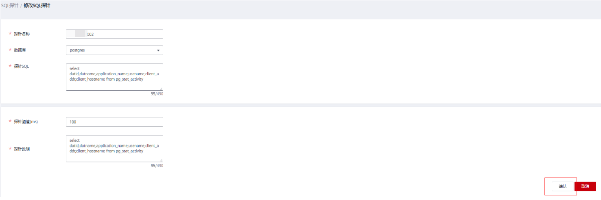
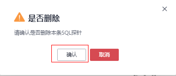
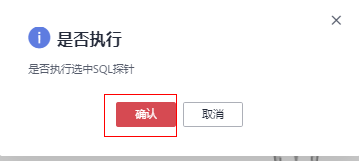

# SQL探针

DMS设计SQL探针工具，提供SQL探针上传，校验，一键执行和定时执行探针任务等功能，并可以针对超时的探针SQL提供告警上报功能。支持功能如下所示：

-   [添加SQL探针](#section15317181252017)
-   [启用（禁用）SQL探针](#section151719344274)
-   [修改SQL探针](#section19477477271)
-   [删除SQL探针](#section16956310352)
-   [一键执行SQL探针](#section13165101519425)

> **说明：** 
>-   SQL探针仅8.1.1.300及以上版本支持，历史版本需要联系技术支持人员升级dms-agent为8.1.3版本后支持。
>-   该特性仅适用SELECT语句作为SQL探针。
>-   SQL探针限制数量为20，即最大能新增20个SQL探针。

## 添加SQL探针

1.  登录GaussDB\(DWS\)管理控制台
2.  在“集群管理”页面，找到需要查看监控的集群。
3.  在指定集群所在行的“操作”列，单击“监控面板”，系统将显示数据库监控页面。
4.  在左侧导航栏选择“工具\>SQL探针”，右侧页面，单击“新增探针SQL”。

    

5.  填写新增SQL探针名称，SQL探针等信息。

    -   探针名称：需要执行的探针名称。
    -   数据库：探针SQL选择当前集群所要执行的数据库。
    -   探针SQL：需要执行的探针SQL语句\(仅适用SELECT语句\)。
    -   探针阈值（ms）：探针SQL执行的告警阈值。
    -   探针说明：需要执行的探针SQL的详细说明。

    

6.  填写SQL探针信息后，确认无误，单击“确认”。

## 启用（禁用）SQL探针

1.  登录GaussDB\(DWS\)管理控制台。
2.  在“集群管理”页面，找到需要查看监控的集群。
3.  在指定集群所在行的“操作”列，选择“监控面板”，系统将显示数据库监控页面。
4.  在左侧导航栏单击“工具\>SQL探针”，进入SQL探针页面。
5.  在探针列表中，选择指定探针所在行“操作”列，单击“启用（禁用）”按钮。

    

6.  确认无误后，单击“确认”。

    

## 修改SQL探针

1.  登录GaussDB\(DWS\)管理控制台。
2.  在“集群管理”页面，找到需要查看监控的集群。
3.  在指定集群所在行的“操作”列，选择“监控面板”，系统将显示数据库监控页面。
4.  在左侧导航栏单击“工具\>SQL探针”，进入SQL探针页面。
5.  在探针列表中，选择指定探针所在行“操作”列，单击“修改”按钮。

    

6.  进入修改SQL探针页面，用户可根据需求修改SQL探针信息，确认无误后，单击“确认”。

    

## 删除SQL探针

1.  登录GaussDB\(DWS\)管理控制台。
2.  在“集群管理”页面，找到需要查看监控的集群。
3.  在指定集群所在行的“操作”列，选择“监控面板”，系统将显示数据库监控页面。
4.  在左侧导航栏单击“工具\>SQL探针”，进入SQL探针页面。
5.  在探针列表中，选择指定探针所在行“操作”列，单击“删除”按钮。

    

6.  确认无误后，单击“确认”。

    

## 一键执行SQL探针

1.  登录GaussDB\(DWS\)管理控制台。
2.  在“集群管理”页面，找到需要查看监控的集群。
3.  在指定集群所在行的“操作”列，选择“监控面板”，系统将显示数据库监控页面。
4.  在左侧导航栏单击“工具\>SQL探针”，进入SQL探针页面。
5.  在探针列表中，点选复选框对应的探针再单击“一键执行”，系统将执行选择的探针并刷新探针的部分信息。
6.  确认无误后，单击“确认”。

    

