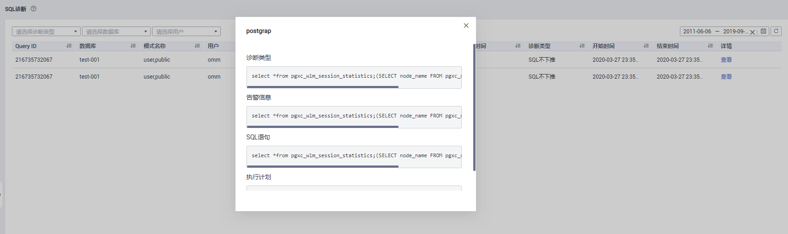

# SQL诊断

## 前提条件

启动SQL诊断功能需要在“监控设置\>监控采集”页面打开实时查询监控和历史查询监控两个监控指标项，操作详情请参见[监控采集](监控设置.md#zh-cn_topic_0000001076708691_section149871230683)。

## 查看SQL诊断结果

1.  登录GaussDB\(DWS\) 管理控制台。
2.  在“集群管理”页面，找到需要查看监控的集群。
3.  在指定集群所在行的“操作”列，单击“监控面板”，系统将显示数据库监控页面。
4.  在左侧导航栏选择“工具\>SQL诊断”，进入SQL诊断页面，其中包括：
    -   查询ID
    -   数据库
    -   模式名
    -   用户名称
    -   客户端
    -   客户端IP地址
    -   运行时间（ms）
    -   CPU时间（ms）
    -   开始时间
    -   完成时间
    -   详情

5.  在SQL诊断页面您可查看SQL的诊断信息。在所指定查询ID行的“详情”列，单击“查看”键，可浏览到SQL的详细诊断结果。其中包括：

    -   诊断类型
    -   告警信息
    -   SQL语句
    -   执行计划

    

## 相关GUC参数设置

SQL诊断指标采集的相关GUC参数如下，具体请参见《数据仓库服务开发指南》中“GUC参数”章节：

-   enable\_resource\_track
    -   取值范围：布尔型
    -   默认值：on
    -   DMS期望值：on（仅供参考）
    -   作用：控制是否开启资源实时监控功能。

        > **须知：** 
        >仅开启该参数，但没有正确配置其他相关联GUC参数，将不能记录实时资源消耗情况。

-   resource\_track\_cost
    -   取值范围：整型，-1\~INT\_MAX
    -   默认值：100000
    -   DMS期望值：0（仅供参考）
    -   作用：设置对当前会话的语句进行资源监控的最小执行代价，该参数只有当参数 enable\_resource\_track为on时才有效。

        > **须知：** 
        >当该值设置过小，会导致更多的语句被记录，引起记录膨胀，记录过程也会影响集群性能。

-   resource\_track\_level
    -   取值范围：枚举类型
    -   默认值：query
    -   DMS期望值：query（仅供参考）
    -   作用：设置当前会话的资源监控的等级；该参数只有当参数enable\_resource\_track为on时才有效。

        > **须知：** 
        >设置operator级别的资源监控会显著影响性能。

-   resource\_track\_duration
    -   取值范围：整型，0\~INT\_MAX，单位为秒（s）
    -   默认值：60
    -   DMS期望值：0（仅供参考）
    -   作用：设置资源监控实时视图中记录的语句执行结束后进行历史信息转存的最小执行时间。即，只有当执行时间超过该时间的语句才会被记入到历史视图中。该参数只有当enable\_resource\_track为on时才有效。

        > **须知：** 
        >当该值设置的过小，会导致内核语句转存的批处理机制失效，对内核性能产生影响。

-   topsql\_retention\_time
    -   取值范围：整型，0\~3650，单位为天
    -   默认值：0
    -   DMS期望值：1（仅供参考）
    -   作用：视图pgxc\_wlm\_session\_info数据老化时间。

        > **须知：** 
        >该时间设置为0时表示不会老化，这会导致存储膨胀。

-   enable\_resource\_record
    -   取值范围：布尔型
    -   默认值：off
    -   DMS期望值：on（仅供参考）
    -   作用：是否开启资源监控记录归档功能；开启时，对于history视图（GS\_WLM\_SESSION\_HISTORY和GS\_WLM\_OPERATOR\_HISTORY）中的记录，每隔3分钟会分别被归档到相应的info视图（GS\_WLM\_SESSION\_INFO和GS\_WLM\_OPERATOR\_INFO），归档后history视图中的记录会被清除。

        > **须知：** 
        >开启该功能时建议同时设置合适的topsql\_retention\_time参数值配置老化时间。否则，将会引起GS\_WLM\_SESSION\_INFO或GS\_WLM\_OPERATOR\_INFO表的数据膨胀。

