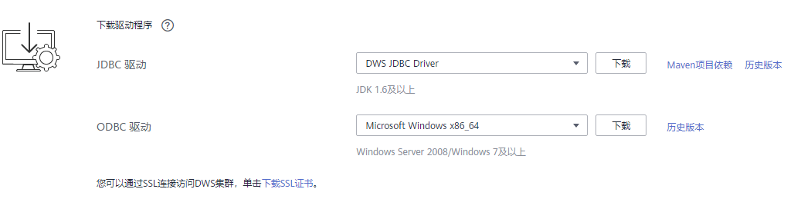

# 下载SSL证书

DWS支持SSL标准协议（TLS 1.2），SSL协议是安全性更高的协议标准，它们加入了数字签名和数字证书来实现客户端和服务器的双向身份验证，保证了通信双方更加安全的数据传输。为支持SSL连接方式，DWS已经从CA认证中心申请到正式的服务器、客户端的证书和密钥（假设服务器的私钥为server.key，证书为server.crt，客户端的私钥为client.key，证书为client.crt，CA根证书名称为cacert.pem。）。

DWS集群（即服务器端）默认已开启SSL功能允许来自客户端的SSL连接或非SSL连接，并且，DWS服务器端的证书、私钥以及根证书已经默认配置完成。

如果客户端或JDBC/ODBC应用程序要使用SSL连接方式，用户必须在客户端或应用程序代码中配置相关的SSL连接参数。DWS管理控制台提供了客户端所需的SSL证书，该SSL证书包含了客户端所需的默认证书、私钥、根证书以及私钥密码加密文件。请将该SSL证书下载到客户端所在的主机上，然后在客户端中指定证书所在的路径。

> **说明：**   
>使用默认的证书可能存在安全风险，为了提高系统安全性，强烈建议用户定期更换证书以避免被破解的风险。如果需要更换证书，请联系客服人员。  

本章节为您介绍如何下载SSL证书。

## 下载SSL证书

1.  登录[DWS管理控制台](https://console.huaweicloud.com/dws)。
2.  在左侧导航栏中，单击“连接管理“。
3.  在“下载驱动程序“区域，单击“这里“下载SSL证书文件。

    **图 1**  下载SSL证书  
    

