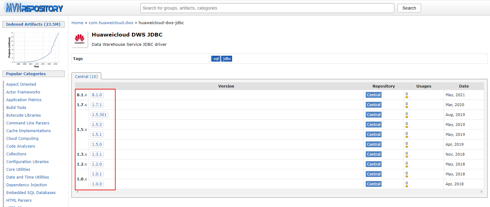
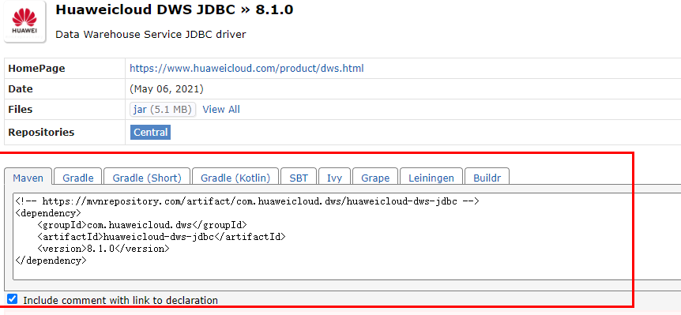

# 下载JDBC或ODBC驱动<a name="dws_01_0032"></a>

JDBC或ODBC驱动程序用于连接DWS集群，用户可以在管理控制台下载DWS提供的JDBC或ODBC驱动程序，也可以使用开源的JDBC或ODBC驱动程序。

## 支持的开源JDBC或ODBC驱动程序<a name="section583116715476"></a>

DWS也支持开源的JDBC驱动程序：PostgreSQL JDBC驱动程序9.3-1103或更高版本。

DWS也支持开源的ODBC驱动程序：PostgreSQL ODBC 09.01.0200或更高版本。

## 下载JDBC或ODBC驱动程序<a name="section8483877102527"></a>

1.  登录[DWS管理控制台](https://console.huaweicloud.com/dws)。
2.  在左侧导航栏中，单击“连接管理“。
3.  在“下载驱动程序“区域，选择一个驱动下载。
    -   **JDBC驱动**

        方式一：

        选择“DWS JDBC Driver“，然后单击“下载“。

        JDBC驱动包支持在所有平台所有版本中使用，且依赖JDK 1.6及以上版本。

        如果同时拥有不同版本的集群，系统会弹出对话框，提示您选择“集群版本“然后下载与集群版本相对应的驱动程序。在“集群管理“页面的集群列表中，单击指定集群的名称，再选择“基本信息“页签，可查看集群版本。

        方式二：

        用户还可以通过配置maven仓库的方式下载SDK包。单击“Maven项目依赖“，进入以下页面：

        **图 1**  Maven页面<a name="fig13562256111919"></a>  
        

        在[图1](#fig13562256111919)所示的列表中，第一列代表集群版本号，第二列代表DWS JDBC驱动包的版本号，请根据集群版本号，选择相应版本的驱动包，然后进入以下页面：

        **图 2**  Maven项目依赖<a name="fig101154223208"></a>  
        

        复制Maven库信息，并将其添加到pom.xml文件中。例如，在pom.xml文件中添加如下代码配置：

        ```
        <dependency>
            <groupId>com.huaweicloud.dws</groupId>
            <artifactId>huaweicloud-dws-jdbc</artifactId>
            <version>1.3.1</version>
        </dependency>
        ```

    -   **ODBC驱动**

        选择“Microsoft Windows x86/x64“或“Linux x64“，然后单击“下载“。

        如果同时拥有不同版本的集群，系统会弹出对话框，提示您选择“集群版本“然后下载与集群版本相对应的驱动程序。在“集群管理“页面的集群列表中，单击指定集群的名称，再选择“基本信息“页签，可查看集群版本。

        ODBC驱动支持在以下系统中使用：

        -   Windows Server 2008及以上，或Windows 7及以上。
        -   RHEL6.4、6.5、6.6、6.7、7.1、7.2。
        -   CentOS6.4、6.5、6.6、6.7。
        -   EulerOS 2.0 SP2
        -   SUSE11 SP1、11 SP2、11 SP3、11 SP4。

        > **说明：**   
        >Windows驱动只支持32位版本，可以在32或64位操作系统使用，但是应用程序必须为32位。  


