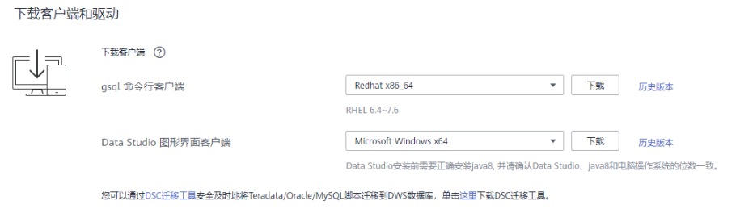

# 下载客户端

DWS提供了与集群版本配套的客户端工具包，用户可以在DWS管理控制台下载客户端工具包。

客户端工具包包含以下内容：

-   **数据库连接工具gsql和测试样例数据的脚本**

    gsql是一款运行在Linux环境上的命令行客户端，用于连接DWS集群中的数据库。

    测试样例数据的脚本是执行入门示例时用的。

-   **GDS工具包**

    GDS工具包是数据服务工具。用户可以使用GDS工具将普通文件系统中的数据文件导入到DWS数据库中，GDS工具包需要安装在数据源文件所在的服务器上。数据源文件所在的服务器称为数据服务器，也称为GDS服务器。

## 下载客户端

1.  通过访问以下地址登录DWS管理控制台：[https://console.huaweicloud.com/dws](https://console.huaweicloud.com/dws)。
2.  在左侧导航栏中，单击“连接管理“。
3.  在“gsql命令行客户端“的下拉列表中，选择对应版本的DWS客户端。

    请根据集群版本和安装客户端的操作系统，选择对应版本。

    -   “Redhat x86\_64“客户端工具支持在以下系统中使用：
        -   RHEL 6.4\~7.6。
        -   CentOS 6.4\~7.4。
        -   EulerOS 2.3。

    -   “SUSE x86\_64“客户端工具支持在以下系统中使用：
        -   SLES 11.1\~11.4。
        -   SLES 12.0\~12.3。

    -   “Euler Kunpeng\_64”客户端工具支持在以下系统中使用：
        -   EulerOS 2.8。

    -   “Stream Euler X86\_64“客户端工具支持在以下系统中使用：
        -   EulerOS 2.2。

    -   “Stream Euler Kunpeng\_64“客户端工具支持在以下系统中使用：
        -   EulerOS 2.8。

    **图 1**  下载gsql客户端  
    

    > **说明：** 
    >客户端CPU架构要和集群一致，如果集群是X86规格，则也应该选择X86客户端。

4.  单击“下载“可以下载与现有集群版本匹配的gsql。单击“历史版本”可根据集群版本下载相应版本的gsql。

    如果同时拥有不同版本的集群，单击“下载”时会下载与集群最低版本相对应的客户端工具。如果当前没有集群，单击“下载”时将下载到低版本的客户端工具。DWS集群可向下兼容低版本的客户端工具。

    > **说明：** 
    >-   在“集群管理“页面的集群列表中，单击指定集群的名称，再选择“基本信息“页签，可查看集群版本。

    [表1](#zh-cn_topic_0167984001_table9595434171818)列出了下载的工具包中的文件和文件夹。

    **表 1**  工具包目录及文件说明

    
    <table><thead align="left"><tr id="zh-cn_topic_0167984001_row059812340182"><th class="cellrowborder" valign="top" width="16.86%" id="mcps1.2.3.1.1">
<strong id="zh-cn_topic_0167984001_b4600173431818">文件或文件夹</strong>

    </th>
    <th class="cellrowborder" valign="top" width="83.14%" id="mcps1.2.3.1.2">
<strong id="zh-cn_topic_0167984001_b186031334141812">说明</strong>

    </th>
    </tr>
    </thead>
    <tbody><tr id="zh-cn_topic_0167984001_row10605183431818"><td class="cellrowborder" valign="top" width="16.86%" headers="mcps1.2.3.1.1 ">
bin

    </td>
    <td class="cellrowborder" valign="top" width="83.14%" headers="mcps1.2.3.1.2 ">
该文件夹中包含了gsql在Linux中的可执行文件。

    </td>
    </tr>
    <tr id="zh-cn_topic_0167984001_row76111434181820"><td class="cellrowborder" valign="top" width="16.86%" headers="mcps1.2.3.1.1 ">
gds

    </td>
    <td class="cellrowborder" valign="top" width="83.14%" headers="mcps1.2.3.1.2 ">
该文件夹中包括了GDS数据服务工具的相关文件，GDS工具用于并行数据加载，可将存储在普通文件系统中的数据文件导入到DWS数据库中。

    </td>
    </tr>
    <tr id="zh-cn_topic_0167984001_row20615133412187"><td class="cellrowborder" valign="top" width="16.86%" headers="mcps1.2.3.1.1 ">
lib

    </td>
    <td class="cellrowborder" valign="top" width="83.14%" headers="mcps1.2.3.1.2 ">
该文件夹中包括执行gsql所需依赖的lib库。

    </td>
    </tr>
    <tr id="zh-cn_topic_0167984001_row19617434121810"><td class="cellrowborder" valign="top" width="16.86%" headers="mcps1.2.3.1.1 ">
sample

    </td>
    <td class="cellrowborder" valign="top" width="83.14%" headers="mcps1.2.3.1.2 ">
该文件夹中包含了以下目录或文件：

    <ul id="ul5636131718426"><li>setup.sh：在使用gsql导入样例数据前所需执行的配置AK/SK访问密钥的脚本文件。</li><li>tpcds_load_data_from_obs.sql：使用gsql客户端导入TPC-DS样例数据的脚本文件。</li><li>query_sql目录：查询TPC-DS样例数据的脚本文件。</li></ul>
    </td>
    </tr>
    <tr id="zh-cn_topic_0167984001_row14623183441817"><td class="cellrowborder" valign="top" width="16.86%" headers="mcps1.2.3.1.1 ">
gsql_env.sh

    </td>
    <td class="cellrowborder" valign="top" width="83.14%" headers="mcps1.2.3.1.2 ">
在运行gsql前，配置环境变量的脚本文件。

    </td>
    </tr>
    </tbody>
    </table>

