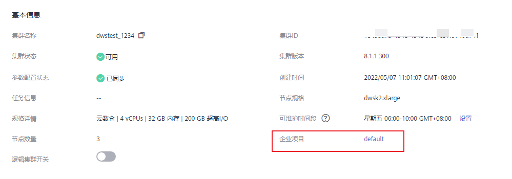
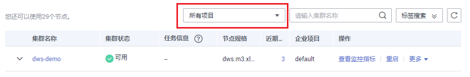

# 企业项目

企业项目是一种云资源管理方式。企业管理（Enterprise Management）提供面向企业客户的云上资源管理、人员管理、权限管理、财务管理等综合管理服务。区别于管理控制台独立操控、配置云产品的方式，企业管理控制台以面向企业资源管理为出发点，帮助企业以公司、部门、项目等分级管理方式实现企业云上的人员、资源、权限、财务的管理。

已开通企业项目服务的用户，可以使用企业项目管理华为云上的云服务资源。

## 绑定企业项目

在DWS中，用户可以在创建集群时，在“高级配置“中为集群选择所属的企业项目，从而将DWS集群与企业项目进行关联。在选择“企业项目“的下拉列表中，将显示用户在企业项目服务中已创建的项目。系统还内置了一个缺省的企业项目“default“，如果用户没有为集群选择企业项目，将使用缺省项目“default“。

注意，目前企业项目服务仍处于公测期间，仅允许有公测权限的用户设置企业项目，普通用户无法看到企业项目相关信息。

在集群创建过程中，如果集群与企业项目绑定成功，则集群创建成功，如果绑定失败，系统会发送告警，集群就会创建失败。

在为DWS集群创建快照时，会同时保存集群与企业项目的关联关系，在恢复集群时，也会恢复企业项目的关联关系。

当删除DWS集群时，DWS集群与企业项目的关联关系就会被自动删除。

## 查看企业项目

在集群创建成功后，您可以在集群列表和集群基本信息页面查看集群关联的企业项目。用户只能查询到有访问权限的项目下的集群资源。

在集群管理页面的集群列表中，查看集群所属的企业项目。

**图 1**  查看企业项目  

在集群列表中，找到所需要的集群，然后单击集群名称，进入集群“基本信息“页面，可以查看与集群关联的企业项目。单击企业项目的名称，可以跳转到企业管理的控制台页面对该企业项目进行查看或编辑。

**图 2**  查看集群的企业项目  

同时，在企业管理的控制台中，查询指定项目中的资源列表时，也可以查询到DWS服务的资源。

## 按企业项目搜索集群

登录DWS管理控制台，单击“集群管理“，在集群列表上方单击“所有项目“，然后在下拉列表中选择所需搜索的项目名称，即可查看与该项目关联的所有集群。

**图 3**  按企业项目搜索  

## 将集群迁入或迁出企业项目

一个DWS集群只能关联一个企业项目。当集群创建成功后，可以在企业管理的控制台中，执行迁出操作，将DWS集群从当前所属的企业项目中迁出到另一个企业项目中；或者执行迁入操作，在指定的企业项目中迁入另一个企业项目中的DWS集群。迁入迁出后，DWS集群与新的企业项目进行关联，DWS集群与原企业项目的关联关系将被自动解除。详细操作，请参考《企业管理用户指南》的“企业项目管理 \> 如何管理资源”章节。

## 企业项目级别细粒度授权

当系统预置的权限不能满足要求时，您可以创建自定义策略，并通过给用户组授予自定义策略来进行精细的访问控制。企业项目作为一个单独可管理的对象，可以和用户组绑定，策略可以授权给用户组，这就实现了企业项目级别的细粒度授权。

首先，登录IAM服务管理控制台，在策略页面中，基于系统预置的策略模板（例如DWS  Admin、DWS  Viewer等）创建自定义策略。然后，登录企业管理控制台，在用户组管理页面中将用户组加入到项目，并将已创建的自定义策略与企业项目所在的用户组进行绑定，再将子用户添加到用户组，这样就完成了企业项目级别的细粒度授权。详细操作，请参考《企业管理用户指南》的[用户组管理](https://support.huaweicloud.com/usermanual-em/zh-cn_topic_0108763972.html)。

用户可以在创建自定义策略时，在策略语句的Action列表中，增加[表1](#table42061239124614)所示的DWS操作对应的“IAM Action”，从而使策略获得相应的DWS操作权限。例如，在自定义策略语句的Action列表中，添加"dws:cluster:create"，那么该策略就拥有了创建/恢复集群的权限。

**表 1**  DWS细粒度权限列表

<table><thead align="left"><tr id="row126809551465"><th class="cellrowborder" valign="top" width="39.58%" id="mcps1.2.3.1.1">
DWS操作

</th>
<th class="cellrowborder" valign="top" width="60.419999999999995%" id="mcps1.2.3.1.2">
IAM Action

</th>
</tr>
</thead>
<tbody><tr id="row1251733919468"><td class="cellrowborder" valign="top" width="39.58%" headers="mcps1.2.3.1.1 ">
创建/恢复集群

</td>
<td class="cellrowborder" valign="top" width="60.419999999999995%" headers="mcps1.2.3.1.2 ">
"dws:cluster:create"

</td>
</tr>
<tr id="row17517439134615"><td class="cellrowborder" valign="top" width="39.58%" headers="mcps1.2.3.1.1 ">
设置自动快照

</td>
<td class="cellrowborder" valign="top" width="60.419999999999995%" headers="mcps1.2.3.1.2 ">
"dws:cluster:setAutomatedSnapshot"

</td>
</tr>
<tr id="row65171439164611"><td class="cellrowborder" valign="top" width="39.58%" headers="mcps1.2.3.1.1 ">
设置安全参数/参数组

</td>
<td class="cellrowborder" valign="top" width="60.419999999999995%" headers="mcps1.2.3.1.2 ">
"dws:cluster:setParameter"

</td>
</tr>
<tr id="row251718395468"><td class="cellrowborder" valign="top" width="39.58%" headers="mcps1.2.3.1.1 ">
重启集群

</td>
<td class="cellrowborder" valign="top" width="60.419999999999995%" headers="mcps1.2.3.1.2 ">
"dws:cluster:restart"

</td>
</tr>
<tr id="row15517143911462"><td class="cellrowborder" valign="top" width="39.58%" headers="mcps1.2.3.1.1 ">
扩容集群

</td>
<td class="cellrowborder" valign="top" width="60.419999999999995%" headers="mcps1.2.3.1.2 ">
"dws:cluster:scaleOut"

</td>
</tr>
<tr id="row19517193934617"><td class="cellrowborder" valign="top" width="39.58%" headers="mcps1.2.3.1.1 ">
重置密码

</td>
<td class="cellrowborder" valign="top" width="60.419999999999995%" headers="mcps1.2.3.1.2 ">
"dws:cluster:resetPassword"

</td>
</tr>
<tr id="row20517139104611"><td class="cellrowborder" valign="top" width="39.58%" headers="mcps1.2.3.1.1 ">
变更参数组

</td>
<td class="cellrowborder" valign="top" width="60.419999999999995%" headers="mcps1.2.3.1.2 ">
"dws:cluster:changeParameterGroup"

</td>
</tr>
<tr id="row15171539134619"><td class="cellrowborder" valign="top" width="39.58%" headers="mcps1.2.3.1.1 ">
删除集群

</td>
<td class="cellrowborder" valign="top" width="60.419999999999995%" headers="mcps1.2.3.1.2 ">
"dws:cluster:delete"

</td>
</tr>
<tr id="row15517339114613"><td class="cellrowborder" valign="top" width="39.58%" headers="mcps1.2.3.1.1 ">
设置可维护时间段

</td>
<td class="cellrowborder" valign="top" width="60.419999999999995%" headers="mcps1.2.3.1.2 ">
"dws:cluster:setMaintainceWindow"

</td>
</tr>
<tr id="row451733964610"><td class="cellrowborder" valign="top" width="39.58%" headers="mcps1.2.3.1.1 ">
绑定EIP

</td>
<td class="cellrowborder" valign="top" width="60.419999999999995%" headers="mcps1.2.3.1.2 ">
"dws:eip:operate"

</td>
</tr>
<tr id="row10517173919460"><td class="cellrowborder" valign="top" width="39.58%" headers="mcps1.2.3.1.1 ">
解绑EIP

</td>
<td class="cellrowborder" valign="top" width="60.419999999999995%" headers="mcps1.2.3.1.2 ">
"dws:eip:operate"

</td>
</tr>
<tr id="row1851710393464"><td class="cellrowborder" valign="top" width="39.58%" headers="mcps1.2.3.1.1 ">
创建DNS域名

</td>
<td class="cellrowborder" valign="top" width="60.419999999999995%" headers="mcps1.2.3.1.2 ">
"dws:dns:create"

</td>
</tr>
<tr id="row12517143964618"><td class="cellrowborder" valign="top" width="39.58%" headers="mcps1.2.3.1.1 ">
释放DNS域名

</td>
<td class="cellrowborder" valign="top" width="60.419999999999995%" headers="mcps1.2.3.1.2 ">
"dws:dns:release"

</td>
</tr>
<tr id="row851903916463"><td class="cellrowborder" valign="top" width="39.58%" headers="mcps1.2.3.1.1 ">
修改DNS域名

</td>
<td class="cellrowborder" valign="top" width="60.419999999999995%" headers="mcps1.2.3.1.2 ">
"dws:dns:edit"

</td>
</tr>
<tr id="row19519133914613"><td class="cellrowborder" valign="top" width="39.58%" headers="mcps1.2.3.1.1 ">
创建MRS连接

</td>
<td class="cellrowborder" valign="top" width="60.419999999999995%" headers="mcps1.2.3.1.2 ">
"dws:MRSConnection:create"

</td>
</tr>
<tr id="row165191739144619"><td class="cellrowborder" valign="top" width="39.58%" headers="mcps1.2.3.1.1 ">
更新MRS连接

</td>
<td class="cellrowborder" valign="top" width="60.419999999999995%" headers="mcps1.2.3.1.2 ">
"dws:MRSConnection:update"

</td>
</tr>
<tr id="row1951914391467"><td class="cellrowborder" valign="top" width="39.58%" headers="mcps1.2.3.1.1 ">
删除MRS连接

</td>
<td class="cellrowborder" valign="top" width="60.419999999999995%" headers="mcps1.2.3.1.2 ">
"dws:MRSConnection:delete"

</td>
</tr>
<tr id="row951943954612"><td class="cellrowborder" valign="top" width="39.58%" headers="mcps1.2.3.1.1 ">
添加/删除标签

</td>
<td class="cellrowborder" valign="top" width="60.419999999999995%" headers="mcps1.2.3.1.2 ">
"dws:tag:addAndDelete"

</td>
</tr>
<tr id="row1651993914460"><td class="cellrowborder" valign="top" width="39.58%" headers="mcps1.2.3.1.1 ">
编辑标签

</td>
<td class="cellrowborder" valign="top" width="60.419999999999995%" headers="mcps1.2.3.1.2 ">
"dws:tag:edit"

</td>
</tr>
<tr id="row5519639114610"><td class="cellrowborder" valign="top" width="39.58%" headers="mcps1.2.3.1.1 ">
创建扩展应用

</td>
<td class="cellrowborder" valign="top" width="60.419999999999995%" headers="mcps1.2.3.1.2 ">
"dws:extendedApplication:create"

</td>
</tr>
<tr id="row14519153964612"><td class="cellrowborder" valign="top" width="39.58%" headers="mcps1.2.3.1.1 ">
删除扩展应用

</td>
<td class="cellrowborder" valign="top" width="60.419999999999995%" headers="mcps1.2.3.1.2 ">
"dws:extendedApplication:delete"

</td>
</tr>
<tr id="row1251993924617"><td class="cellrowborder" valign="top" width="39.58%" headers="mcps1.2.3.1.1 ">
创建快照

</td>
<td class="cellrowborder" valign="top" width="60.419999999999995%" headers="mcps1.2.3.1.2 ">
"dws:snapshot:create"

</td>
</tr>
<tr id="row751993994619"><td class="cellrowborder" valign="top" width="39.58%" headers="mcps1.2.3.1.1 ">
删除快照

</td>
<td class="cellrowborder" valign="top" width="60.419999999999995%" headers="mcps1.2.3.1.2 ">
"dws:snapshot:delete"

</td>
</tr>
<tr id="row1451917394462"><td class="cellrowborder" valign="top" width="39.58%" headers="mcps1.2.3.1.1 ">
复制快照

</td>
<td class="cellrowborder" valign="top" width="60.419999999999995%" headers="mcps1.2.3.1.2 ">
"dws:snapshot:copy"

</td>
</tr>
<tr id="row85191339194617"><td class="cellrowborder" valign="top" width="39.58%" headers="mcps1.2.3.1.1 ">
创建参数组

</td>
<td class="cellrowborder" valign="top" width="60.419999999999995%" headers="mcps1.2.3.1.2 ">
"dws:parameterGroup:create"

</td>
</tr>
<tr id="row851983974610"><td class="cellrowborder" valign="top" width="39.58%" headers="mcps1.2.3.1.1 ">
删除参数组

</td>
<td class="cellrowborder" valign="top" width="60.419999999999995%" headers="mcps1.2.3.1.2 ">
"dws:parameterGroup:delete"

</td>
</tr>
<tr id="row105191239144619"><td class="cellrowborder" valign="top" width="39.58%" headers="mcps1.2.3.1.1 ">
修改参数组

</td>
<td class="cellrowborder" valign="top" width="60.419999999999995%" headers="mcps1.2.3.1.2 ">
"dws:parameterGroup:edit"

</td>
</tr>
<tr id="row12519183924620"><td class="cellrowborder" valign="top" width="39.58%" headers="mcps1.2.3.1.1 ">
调用OpenAPI创建集群

</td>
<td class="cellrowborder" valign="top" width="60.419999999999995%" headers="mcps1.2.3.1.2 ">
"dws:openAPICluster:create"

</td>
</tr>
<tr id="row1051920398462"><td class="cellrowborder" valign="top" width="39.58%" headers="mcps1.2.3.1.1 ">
调用OpenAPI删除集群

</td>
<td class="cellrowborder" valign="top" width="60.419999999999995%" headers="mcps1.2.3.1.2 ">
"dws:openAPICluster:delete"

</td>
</tr>
<tr id="row1351973920469"><td class="cellrowborder" valign="top" width="39.58%" headers="mcps1.2.3.1.1 ">
调用OpenAPI扩容集群

</td>
<td class="cellrowborder" valign="top" width="60.419999999999995%" headers="mcps1.2.3.1.2 ">
"dws:openAPICluster:resize"

</td>
</tr>
<tr id="row185191139104618"><td class="cellrowborder" valign="top" width="39.58%" headers="mcps1.2.3.1.1 ">
调用OpenAPI重启集群

</td>
<td class="cellrowborder" valign="top" width="60.419999999999995%" headers="mcps1.2.3.1.2 ">
"dws:openAPICluster:restart"

</td>
</tr>
<tr id="row155191539164615"><td class="cellrowborder" valign="top" width="39.58%" headers="mcps1.2.3.1.1 ">
调用OpenAPI重置密码

</td>
<td class="cellrowborder" valign="top" width="60.419999999999995%" headers="mcps1.2.3.1.2 ">
"dws:openAPICluster:resetPassword"

</td>
</tr>
<tr id="row1851923994619"><td class="cellrowborder" valign="top" width="39.58%" headers="mcps1.2.3.1.1 ">
调用OpenAPI创建快照

</td>
<td class="cellrowborder" valign="top" width="60.419999999999995%" headers="mcps1.2.3.1.2 ">
"dws:openAPISnapshot:create"

</td>
</tr>
<tr id="row8520133954611"><td class="cellrowborder" valign="top" width="39.58%" headers="mcps1.2.3.1.1 ">
调用OpenAPI删除快照

</td>
<td class="cellrowborder" valign="top" width="60.419999999999995%" headers="mcps1.2.3.1.2 ">
"dws:openAPISnapshot:delete"

</td>
</tr>
<tr id="row1520113994619"><td class="cellrowborder" valign="top" width="39.58%" headers="mcps1.2.3.1.1 ">
调用OpenAPI恢复集群

</td>
<td class="cellrowborder" valign="top" width="60.419999999999995%" headers="mcps1.2.3.1.2 ">
"dws:openAPISnapshot:restore"

</td>
</tr>
</tbody>
</table>

