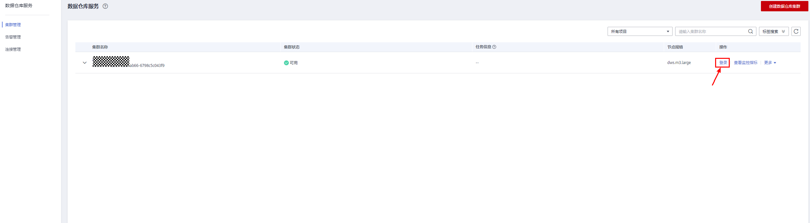
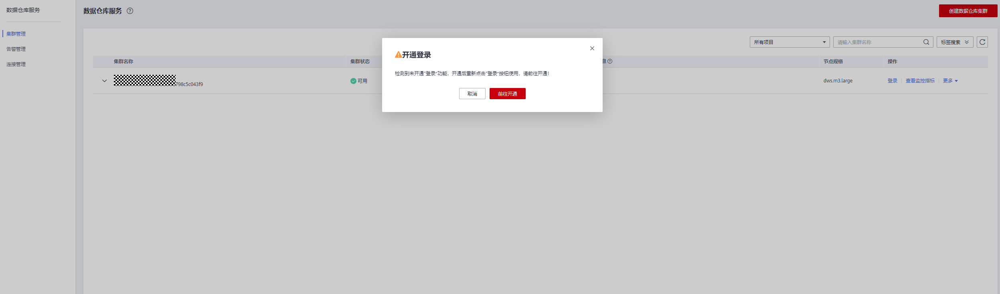
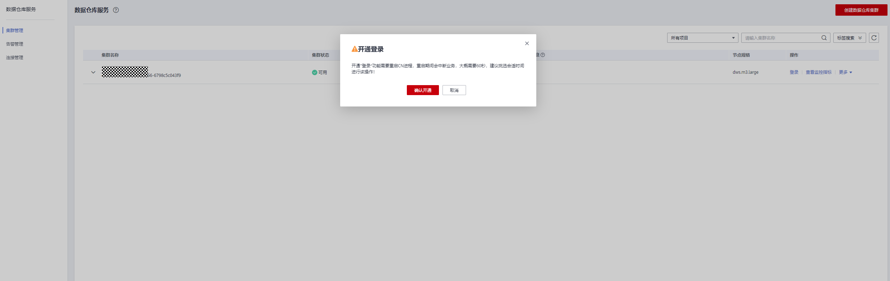
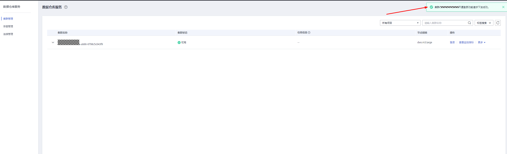
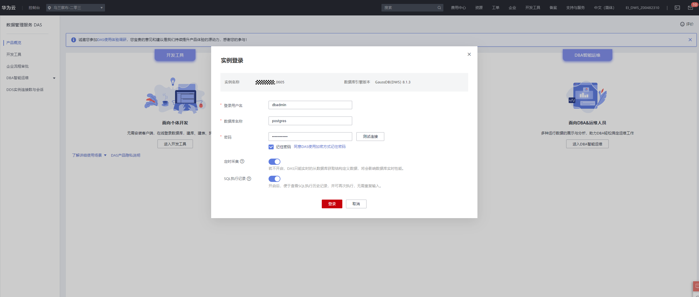
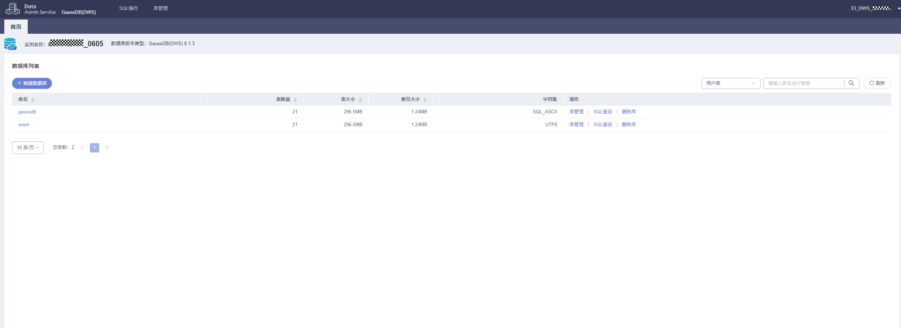

# 使用DAS连接集群

GaussDB\(DWS\)支持页面登录功能（WebSQL\)，该功能依赖数据管理服务（Data Admin Service，简称DAS），目前具体支持“库管理”和“SQL操作”。使用时，用户需填写数据库登录名和密码方可连接集群，查看元数据及执行SQL等操作。

> **说明：** 
>-   登录集群功能仅8.0.1及以上集群版本支持，同时需保证Agent升级为8.1.3.101及以上版本。
>-   Agent从低版本升级为8.1.3.101或以上版本的集群需[开通登录功能](#section12894103054611)后进行[登录操作](#section1675120913523)。
>-   区域支持范围：包含数据管理服务的华为云各区域。
>-   若集群欠费，可能会导致该功能被限制不可用，请用户及时充值确保集群可正常使用。

## 开通登录功能

1.  登录GaussDB\(DWS\) 管理控制台。
2.  在左侧导航栏中，单击“集群管理“。
3.  在集群列表中找到所需的集群，单击“操作”栏中的“登录”按钮。

    

4.  如未开通登录功能会弹出“开通登录”窗口，单击“前往开通”\>“确认开通”，触发开通登录功能任务。

    

    

    

    > **说明：** 
    >开通“登录”功能需重启CN进程，重启期间会中断业务，大概需要60秒左右，建议挑选合适时间进行该操作！

## 登录操作

1.  登录GaussDB\(DWS\) 管理控制台。
2.  在左侧导航栏中，单击“集群管理“。
3.  在集群列表中找到所需要的集群，单击“操作”栏中的“登录”按钮。

    

4.  跳转至数据库管理服务（DAS）页面，填写登录用户名、数据库名称、密码信息，开启定时采集、SQL执行记录功能。

    

    > **说明：** 
    >-   建议您打开定时采集开关，若不开启，DAS只能实时的从数据库获取结构定义数据，将会影响数据库实时性能。
    >    采集时间不支持自定义，启用“定时采集”后，系统会在UTC时间每天20:00点自动采集数据。如果您本地不是UTC时间，请根据本地时区转换成对应时间即可。即使未启用“定时采集”，您也可以根据需要随时单击“立即采集”采集数据。
    >-   建议您开启SQL执行记录，开启后，便于在“SQL操作\>SQL执行记录”查看，并可再次执行，无需重复输入。

5.  单击“测试连接”（必选操作步骤）。如测试连接成功，将提示“连接成功”，您可继续登录操作。如测试连接失败，将提示连接失败原因，您需根据提示信息进行修改，以便登录成功。
6.  设置完登录信息后，单击“登录”按钮，即完成登录连接，进入您的数据库进行管理。

    

