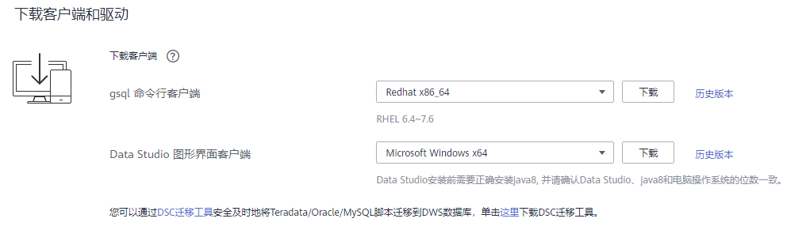
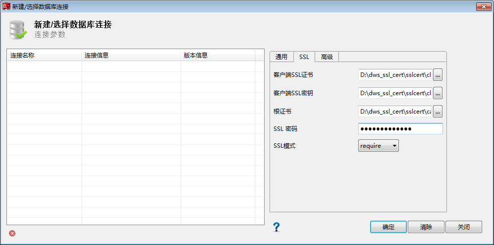

# 使用Data Studio图形界面客户端连接集群

Data Studio是一款运行在Windows操作系统上的SQL客户端工具，有着丰富的GUI界面，能够管理数据库和数据库对象，编辑、运行、调试SQL脚本，查看执行计划等。在GaussDB\(DWS\) 管理控制台下载Data Studio软件包，解压后免安装即可使用。

DataStudio可供下载的版本分为“Windows x86“和“Windows x64“两种版本，分别支持32位和64位Windows操作系统。

## 连接集群前的准备

-   已获取GaussDB\(DWS\) 集群的数据库管理员用户名和密码。
-   已获取GaussDB\(DWS\) 集群的公网访问地址，含IP地址和端口。具体请参见[获取集群连接地址](获取集群连接地址.md)。
-   已配置GaussDB\(DWS\) 集群所属的安全组，添加入规则允许用户的IP地址使用TCP访问端口。

    具体步骤，请参见《虚拟私有云用户指南》中的[添加安全组规则](https://support.huaweicloud.com/usermanual-vpc/zh-cn_topic_0030969470.html)章节。

## 使用Data Studio连接到集群数据库

1.  GaussDB\(DWS\) 提供了基于Windows平台的Data Studio图形界面客户端，该工具依赖JDK，请先在客户端主机上安装JDK。

    > **须知：** 
    >仅支持Java 1.8版本的JDK。

    在Windows操作系统中，您可以访问[JDK官网](https://www.oracle.com/technetwork/java/javase/downloads/jdk8-downloads-2133151.html)网站，下载符合操作系统版本的JDK，并根据指导进行安装。

2.  登录GaussDB\(DWS\) 管理控制台。
3.  单击“连接管理“。
4.  在“下载客户端和驱动“页面，下载“Data Studio图形界面客户端“。

    -   请根据操作系统类型，选择“Windows x86“或“Windows x64“，再单击“下载“，可以下载与现有集群版本匹配的Data Studio工具。

        如果同时拥有不同版本的集群，单击“下载”时会下载与集群最低版本相对应的Data Studio工具。如果当前没有集群，单击“下载”时将下载到低版本的Data Studio工具。GaussDB\(DWS\) 集群可向下兼容低版本的Data Studio工具。

    -   单击“历史版本”可根据集群版本下载相应版本的Data Studio工具，建议按集群版本下载配套的工具。

    **图 1**  下载客户端  
    

    如果同时拥有不同版本的集群，系统会弹出对话框，提示您选择“集群版本“然后下载与集群版本相对应的客户端。在“集群管理“页面的集群列表中，单击指定集群的名称，再选择“集群详情“页签，可查看集群版本。

5.  解压下载的客户端软件包（32位或64位）到需要安装的路径。
6.  打开安装目录，双击Data Studio.exe，启动Data Studio客户端，如[图2](#febe974d888e24ddd8948572b362f7ef2)所示。

    **图 2**  启动客户端  
    

    > **说明：** 
    >若您的电脑阻止应用运行，可对Data Studio.exe文件属性勾选解除锁定即可启动。

7.  在主菜单中选择 “文件\>新建连接” ，如[图3](#f5e30eb5f20c9434e971d8b2786b02dbf)所示。

    **图 3**  新建连接  
    

8.  在弹出的“新建/选择数据库连接“页面中，如下图所示，输入连接参数。

    **表 1**  配置连接参数

    
    <table><thead align="left"><tr id="r998b3685340648cdafff9b1fe232c000"><th class="cellrowborder" valign="top" width="19.01190119011901%" id="mcps1.2.4.1.1">
字段名称

    </th>
    <th class="cellrowborder" valign="top" width="58.8058805880588%" id="mcps1.2.4.1.2">
说明

    </th>
    <th class="cellrowborder" valign="top" width="22.182218221822183%" id="mcps1.2.4.1.3">
举例

    </th>
    </tr>
    </thead>
    <tbody><tr id="r666487d1871c4c67b803066814fc89a7"><td class="cellrowborder" valign="top" width="19.01190119011901%" headers="mcps1.2.4.1.1 ">
数据库类型

    </td>
    <td class="cellrowborder" valign="top" width="58.8058805880588%" headers="mcps1.2.4.1.2 ">
选择“HUAWEI CLOUD DWS ”。

    </td>
    <td class="cellrowborder" valign="top" width="22.182218221822183%" headers="mcps1.2.4.1.3 ">
HUAWEI CLOUD DWS

    </td>
    </tr>
    <tr id="rd489ffeb99f8442387250de8fae31af8"><td class="cellrowborder" valign="top" width="19.01190119011901%" headers="mcps1.2.4.1.1 ">
名称

    </td>
    <td class="cellrowborder" valign="top" width="58.8058805880588%" headers="mcps1.2.4.1.2 ">
连接名称。

    </td>
    <td class="cellrowborder" valign="top" width="22.182218221822183%" headers="mcps1.2.4.1.3 ">
dws-demo

    </td>
    </tr>
    <tr id="rb5e8545bc43e4b8a9a021ba41aeefe11"><td class="cellrowborder" valign="top" width="19.01190119011901%" headers="mcps1.2.4.1.1 ">
主机

    </td>
    <td class="cellrowborder" valign="top" width="58.8058805880588%" headers="mcps1.2.4.1.2 ">
所要连接的集群IP地址（IPv4）或域名。

    </td>
    <td class="cellrowborder" valign="top" width="22.182218221822183%" headers="mcps1.2.4.1.3 ">
-

    </td>
    </tr>
    <tr id="r7afbb93b02494aedacc0d5cd192407a7"><td class="cellrowborder" valign="top" width="19.01190119011901%" headers="mcps1.2.4.1.1 ">
端口号

    </td>
    <td class="cellrowborder" valign="top" width="58.8058805880588%" headers="mcps1.2.4.1.2 ">
数据库端口。

    </td>
    <td class="cellrowborder" valign="top" width="22.182218221822183%" headers="mcps1.2.4.1.3 ">
8000

    </td>
    </tr>
    <tr id="zh-cn_topic_0107187019_row9881783912"><td class="cellrowborder" valign="top" width="19.01190119011901%" headers="mcps1.2.4.1.1 ">
数据库

    </td>
    <td class="cellrowborder" valign="top" width="58.8058805880588%" headers="mcps1.2.4.1.2 ">
数据库名称。

    </td>
    <td class="cellrowborder" valign="top" width="22.182218221822183%" headers="mcps1.2.4.1.3 ">
gaussdb

    </td>
    </tr>
    <tr id="r616f149dd82b43129c47c6607bb17c91"><td class="cellrowborder" valign="top" width="19.01190119011901%" headers="mcps1.2.4.1.1 ">
用户名

    </td>
    <td class="cellrowborder" valign="top" width="58.8058805880588%" headers="mcps1.2.4.1.2 ">
所要连接数据库的用户名。

    </td>
    <td class="cellrowborder" valign="top" width="22.182218221822183%" headers="mcps1.2.4.1.3 ">
-

    </td>
    </tr>
    <tr id="r61966e4859c54422b07d0a6601282b76"><td class="cellrowborder" valign="top" width="19.01190119011901%" headers="mcps1.2.4.1.1 ">
密码

    </td>
    <td class="cellrowborder" valign="top" width="58.8058805880588%" headers="mcps1.2.4.1.2 ">
所要连接数据库的登录密码。

    </td>
    <td class="cellrowborder" valign="top" width="22.182218221822183%" headers="mcps1.2.4.1.3 ">
-

    </td>
    </tr>
    <tr id="r9e3e4f337acc4f61b15fa1e0e998bcce"><td class="cellrowborder" valign="top" width="19.01190119011901%" headers="mcps1.2.4.1.1 ">
保存密码

    </td>
    <td class="cellrowborder" valign="top" width="58.8058805880588%" headers="mcps1.2.4.1.2 ">
在下拉列表中选择：

    <ul id="zh-cn_topic_0107187019_ul37500309263"><li><strong id="adb2e6088264e456ca8cddd167d3663a5">“仅当前会话”</strong>：仅在当前会话中保存密码。</li><li><strong id="ac90e788518f64040948dace4fcd284ca">“不保存”</strong>：不保存密码。</li></ul>
    </td>
    <td class="cellrowborder" valign="top" width="22.182218221822183%" headers="mcps1.2.4.1.3 ">
-

    </td>
    </tr>
    <tr id="rb2cb4a7d7c254e898b8cf100733384c5"><td class="cellrowborder" valign="top" width="19.01190119011901%" headers="mcps1.2.4.1.1 ">
启用SSL

    </td>
    <td class="cellrowborder" valign="top" width="58.8058805880588%" headers="mcps1.2.4.1.2 ">
启用时，客户端将使用SSL加密连接方式。SSL连接方式安全性高于普通模式，建议开启。

    </td>
    <td class="cellrowborder" valign="top" width="22.182218221822183%" headers="mcps1.2.4.1.3 ">
-

    </td>
    </tr>
    </tbody>
    </table>

    当“启用SSL”设置为开启时，请先参见[下载SSL证书](https://support.huaweicloud.com/mgtg-dws/dws_01_0038.html)下载SSL证书，并解压证书文件。然后单击“SSL“页签，设置如下参数：

    **表 2**  配置SSL参数

    
    <table><thead align="left"><tr id="re85a10ea61f04c57a14374ca5c7d6050"><th class="cellrowborder" valign="top" width="19.38%" id="mcps1.2.3.1.1">
字段名称

    </th>
    <th class="cellrowborder" valign="top" width="80.62%" id="mcps1.2.3.1.2">
说明

    </th>
    </tr>
    </thead>
    <tbody><tr id="ra35932b78ca140b7a5439c9f7e3107ad"><td class="cellrowborder" valign="top" width="19.38%" headers="mcps1.2.3.1.1 ">
客户端SSL证书

    </td>
    <td class="cellrowborder" valign="top" width="80.62%" headers="mcps1.2.3.1.2 ">
选择SSL证书解压目录下的“sslcert\client.crt”文件。

    </td>
    </tr>
    <tr id="r4a637f73e2164fa1bb65347c59e962cf"><td class="cellrowborder" valign="top" width="19.38%" headers="mcps1.2.3.1.1 ">
客户端SSL密钥

    </td>
    <td class="cellrowborder" valign="top" width="80.62%" headers="mcps1.2.3.1.2 ">
客户端SSL秘钥只支持PK8格式，请选择SSL证书解压目录下的“sslcert\client.key.pk8”文件。

    </td>
    </tr>
    <tr id="re654cf33e6fd4162a322d30a10112453"><td class="cellrowborder" valign="top" width="19.38%" headers="mcps1.2.3.1.1 ">
根证书

    </td>
    <td class="cellrowborder" valign="top" width="80.62%" headers="mcps1.2.3.1.2 ">
当“SSL模式”设为“verify-ca”时，必须设置根证书，请选择SSL证书解压目录下的“sslcert\cacert.pem”文件。

    </td>
    </tr>
    <tr id="rc13e8815e6954b508b90480dd8dfc491"><td class="cellrowborder" valign="top" width="19.38%" headers="mcps1.2.3.1.1 ">
SSL密码

    </td>
    <td class="cellrowborder" valign="top" width="80.62%" headers="mcps1.2.3.1.2 ">
客户端pk8格式SSL秘钥密码。

    </td>
    </tr>
    <tr id="r422d1cb572a34d88ae84caa91c68f153"><td class="cellrowborder" valign="top" width="19.38%" headers="mcps1.2.3.1.1 ">
SSL模式

    </td>
    <td class="cellrowborder" valign="top" width="80.62%" headers="mcps1.2.3.1.2 ">
GaussDB(DWS) 支持的SSL模式有：

    <ul id="uef8cf175c60947de9f9cccfa40627114"><li>require</li><li>verify-ca</li></ul>
    
GaussDB(DWS) 不支持“verify-full”模式。

    </td>
    </tr>
    </tbody>
    </table>

    **图 4**  配置SSL参数  
    

9.  单击“确定“建立数据库连接。

    如果启用了SSL，在弹出的“连接安全告警“提示对话框中单击“继续“。

    登录成功后，将弹出“最近登录活动“提示框，表示Data Studio已经连接到数据库。用户即可在Data Studio界面的“SQL终端“窗口中执行SQL语句。

    **图 5**  登录成功  
    

    欲详细了解Data Studio其他功能的使用方法，请按“F1“查看Data Studio用户手册。

    > **说明：** 
    >Data Studio中执行增删改查操作后不支持回滚数据。

