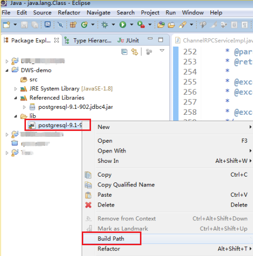

# 使用JDBC连接数据库<a name="dws_01_0077"></a>

DWS支持在Linux或Windows环境下使用JDBC应用程序连接数据库。应用程序可以在公有云环境的弹性云服务器中，或者互联网环境连接数据库。

用户通过JDBC连接DWS集群时，可以选择是否采用SSL认证方式。SSL认证用于加密客户端和服务器之间的通讯数据，为敏感数据在Internet上的传输提供了一种安全保障手段。DWS管理控制台提供了自签的证书供用户下载。使用该证书，用户需要配置客户端程序，使证书可用，此过程依赖于openssl工具以及java自带的keytool工具。

> **说明：**   
>SSL模式安全性高于普通模式，建议在使用JDBC连接DWS集群时采用SSL模式。  

JDBC接口的使用方法，请自行查阅官方文档。

## 前提条件<a name="section1584133941514"></a>

-   已安装JDK 1.6或以上版本，并配置环境变量。
-   已下载JDBC驱动，请参见[下载JDBC或ODBC驱动](下载JDBC或ODBC驱动.md)。

    DWS也支持开源的JDBC驱动程序：PostgreSQL JDBC驱动程序9.3-1103或更高版本。

-   已下载SSL证书文件，请参见[（可选）下载SSL证书](（可选）下载SSL证书.md)。

## 使用JDBC连接数据库<a name="section2993721114437"></a>

在Linux和Windows环境下操作方法相同，以下步骤以Windows环境为例。

1.  是否采用SSL方式连接DWS集群。
    -   是：
        1.  为DWS集群开启SSL连接，默认为开启。具体操作，请参见[（可选）设置SSL连接](（可选）设置SSL连接.md)。
        2.  请确认是采用证书认证方式还是密码认证方式。
            -   采用证书认证方式：执行[2](#li55435426144245)。
            -   采用密码认证方式：执行[4](#li19649431459)。

    -   否：
        1.  为DWS集群关闭SSL连接，默认为开启。具体操作，请参见[（可选）设置SSL连接](（可选）设置SSL连接.md)。
        2.  执行[4](#li19649431459)。

2.  <a name="li55435426144245"></a>（可选）如果使用Linux环境，使用WinScp工具将SSL证书上传到Linux环境上。
3.  配置证书以使用SSL加密连接。
    1.  解压压缩包得到证书文件。假设解压路径为“$SSL\_PATH”。

        证书文件建议保存在英文路径，配置证书时需要根据实际情况指定路径，否则可能提示文件不存在。

    2.  打开“命令提示符“程序，切换到“$SSL\_PATH\\dws\_ssl\_cert\\sslcert”路径下，执行以下两条命令，转化根证书并导入到trustStore中。

        **openssl** **x509** **-in** _cacert.pem_ **-out** _cacert.crt.der_ **-outform** _der_

        **keytool** **-keystore** _mytruststore_ **-alias** _cacert_ **-import** **-file** _cacert.crt.der_

        -   “cacert.pem“为解压后获取的根证书。
        -   “cacert.crt.der“为生成的中间文件。根据实际情况，可以填写保存到其他路径，也可以自定义文件名称。
        -   “mytruststore“为生成的可信库名称，“cacert“为别名用户，二者可以根据需要进行修改。

        请用户根据提示信息输入自定义的可信库密码并确认密码例如“truststore123“，然后输入“y“确认信任证书。

    3.  执行以下命令转化客户端私钥。

        **openssl** **pkcs12** **-export** **-out** _client.pkcs12_ **-in** _client.crt_ **-inkey** _client.key_

        需要输入客户端私钥的密码“Gauss@MppDB“，然后输入并确认用户自定义的私钥密码例如“key123“。

    4.  执行以下命令，将私钥导入到keyStore中。

        **keytool** **-importkeystore** **-deststorepass** _Gauss@MppDB_ **-destkeystore** _client.jks_ **-srckeystore** _client.pkcs12_ **-srcstorepass** _key123_ **-srcstoretype** _PKCS12_ **-alias** _1_

4.  <a name="li19649431459"></a>解压已下载的JDBC驱动得到“gsjdbc4.jar“，
5.  在应用程序的工程中，设置引用Jar包。

    以Eclipse工程为例，先将jar包存放在工程目录下，例如将jar包放在工程目录的lib目录下，然后在Eclipse工程中，右键单击lib目录下的该jar包，再选择菜单“Build Path”，即可引用此jar包。

    **图 1**  引用jar包<a name="fig18599113514410"></a>  
    

    或者，您也可以使用另一种方式，在Maven工程中，可以直接将DWS JDBC驱动作为依赖项添加进POM文件，配置如下所示：

    ```
    <dependency>
        <groupId>com.huaweicloud.dws</groupId>
        <artifactId>huaweicloud-dws-jdbc</artifactId>
        <version>1.0.0</version> 
    </dependency>
    ```

6.  加载驱动。

    支持以下两种方法加载：

    -   在代码中隐含装载：Class.forName\("org.postgresql.Driver"\);
    -   在JVM启动时参数传递：java -Djdbc.drivers=org.postgresql.Driver jdbctest

7.  调用JDBC的数据库连接方法DriverManager.getConnection\(\)连接DWS数据库。

    JDBC接口不提供重试连接的能力，您需要在业务代码中实现重试处理。

    DriverManager.getConnection\(\)方法支持以下重载：

    -   DriverManager.getConnection\(String url\);
    -   DriverManager.getConnection\(String url, Properties info\);
    -   DriverManager.getConnection\(String url, String user, String password\);

    **表 1**  数据库连接参数

    <a name="zh-cn_topic_0004406724_table51197761"></a>
    <table><thead align="left"><tr id="zh-cn_topic_0004406724_row61561215"><th class="cellrowborder" valign="top" width="13.44%" id="mcps1.2.3.1.1"><p id="zh-cn_topic_0004406724_p2535073"><a name="zh-cn_topic_0004406724_p2535073"></a><a name="zh-cn_topic_0004406724_p2535073"></a><strong id="b50623360142047"><a name="b50623360142047"></a><a name="b50623360142047"></a>参数</strong></p>
    </th>
    <th class="cellrowborder" valign="top" width="86.56%" id="mcps1.2.3.1.2"><p id="zh-cn_topic_0004406724_p33599649"><a name="zh-cn_topic_0004406724_p33599649"></a><a name="zh-cn_topic_0004406724_p33599649"></a><strong id="b6851456142047"><a name="b6851456142047"></a><a name="b6851456142047"></a>描述</strong></p>
    </th>
    </tr>
    </thead>
    <tbody><tr id="zh-cn_topic_0004406724_row42455976"><td class="cellrowborder" valign="top" width="13.44%" headers="mcps1.2.3.1.1 "><p id="zh-cn_topic_0004406724_p57939919"><a name="zh-cn_topic_0004406724_p57939919"></a><a name="zh-cn_topic_0004406724_p57939919"></a>url</p>
    </td>
    <td class="cellrowborder" valign="top" width="86.56%" headers="mcps1.2.3.1.2 "><p id="p61624548134633"><a name="p61624548134633"></a><a name="p61624548134633"></a>数据库连接描述符，可以在管理控制台查看，具体步骤请参见<a href="获取集群连接地址.md">获取集群连接地址</a>。</p>
    <p id="zh-cn_topic_0004406724_p59332072"><a name="zh-cn_topic_0004406724_p59332072"></a><a name="zh-cn_topic_0004406724_p59332072"></a>url的格式如下：</p>
    <p id="p190710141363"><a name="p190710141363"></a><a name="p190710141363"></a>jdbc:postgresql://host:port/database</p>
    <div class="note" id="zh-cn_topic_0004406724_note1343464"><a name="zh-cn_topic_0004406724_note1343464"></a><a name="zh-cn_topic_0004406724_note1343464"></a><span class="notetitle"> 说明： </span><div class="notebody"><a name="ul32509781145934"></a><a name="ul32509781145934"></a><ul id="ul32509781145934"><li>database为要连接的数据库名称。</li><li>host为数据库服务器名称。</li><li>port为数据库服务器端口。</li></ul>
    <p id="zh-cn_topic_0004406724_p45689763"><a name="zh-cn_topic_0004406724_p45689763"></a><a name="zh-cn_topic_0004406724_p45689763"></a>缺省情况下，会尝试连接到localhost的8000端口的database。</p>
    </div></div>
    </td>
    </tr>
    <tr id="zh-cn_topic_0004406724_row16695882"><td class="cellrowborder" valign="top" width="13.44%" headers="mcps1.2.3.1.1 "><p id="zh-cn_topic_0004406724_p14273515"><a name="zh-cn_topic_0004406724_p14273515"></a><a name="zh-cn_topic_0004406724_p14273515"></a>info</p>
    </td>
    <td class="cellrowborder" valign="top" width="86.56%" headers="mcps1.2.3.1.2 "><p id="zh-cn_topic_0004406724_p35914293"><a name="zh-cn_topic_0004406724_p35914293"></a><a name="zh-cn_topic_0004406724_p35914293"></a>数据库连接属性。常用的属性如下：</p>
    <a name="zh-cn_topic_0004406724_ul60523322"></a><a name="zh-cn_topic_0004406724_ul60523322"></a><ul id="zh-cn_topic_0004406724_ul60523322"><li>user：String类型。表示创建连接的数据库用户。</li><li>password：String类型。表示数据库用户的密码。</li><li>ssl：Boolean类型。表示是否使用SSL连接。</li><li>loglevel：Integer类型。确定对象LogStream或LogWriter对类DriverManager的当前值打印的日志量。目前支持：com.edb.Driver.DEBUG和com.edb.Driver.INFO。如果把参数loglevel的值设定为INFO，那么将只包含少量的日志信息，而如果设定为DEBUG，那么将产生详细的日志信息。</li><li>charSet：String类型。表示在向数据库发送数据或从数据库接收数据时使用到的字符集。</li><li>prepareThreshold：Integer类型。用于确定在转换为服务器端的预备语句之前，要求执行方法PreparedStatement的次数。缺省值是5。</li></ul>
    </td>
    </tr>
    <tr id="zh-cn_topic_0004406724_row63199906"><td class="cellrowborder" valign="top" width="13.44%" headers="mcps1.2.3.1.1 "><p id="zh-cn_topic_0004406724_p5711640"><a name="zh-cn_topic_0004406724_p5711640"></a><a name="zh-cn_topic_0004406724_p5711640"></a>user</p>
    </td>
    <td class="cellrowborder" valign="top" width="86.56%" headers="mcps1.2.3.1.2 "><p id="zh-cn_topic_0004406724_p4700076"><a name="zh-cn_topic_0004406724_p4700076"></a><a name="zh-cn_topic_0004406724_p4700076"></a>数据库用户。</p>
    </td>
    </tr>
    <tr id="zh-cn_topic_0004406724_row58485413"><td class="cellrowborder" valign="top" width="13.44%" headers="mcps1.2.3.1.1 "><p id="zh-cn_topic_0004406724_p66603434"><a name="zh-cn_topic_0004406724_p66603434"></a><a name="zh-cn_topic_0004406724_p66603434"></a>password</p>
    </td>
    <td class="cellrowborder" valign="top" width="86.56%" headers="mcps1.2.3.1.2 "><p id="zh-cn_topic_0004406724_p22788321"><a name="zh-cn_topic_0004406724_p22788321"></a><a name="zh-cn_topic_0004406724_p22788321"></a>数据库用户的密码。</p>
    </td>
    </tr>
    </tbody>
    </table>

    以SSL证书方式加密连接样例代码如下：

    ```
    //以下代码将获取数据库SSL连接操作封装为一个接口。
    
    public static Connection GetConnection(String username, String passwd)
        {
            //定义驱动类。
            String driver = "org.postgresql.Driver";
            //设置keystore。
            System.setProperty("javax.net.ssl.trustStore", "mytruststore");
            System.setProperty("javax.net.ssl.keyStore", "client.jks");
            System.setProperty("javax.net.ssl.trustStorePassword", "password");
            System.setProperty("javax.net.ssl.keyStorePassword", "password");
    
            Properties props = new Properties();
            props.setProperty("user", username);
            props.setProperty("password", passwd);
            props.setProperty("ssl", "true");
    
            String  url = "jdbc:postgresql://" + "10.10.0.13" + ':'
                        + "8000" + '/'
                        + "postgres";
            Connection conn = null;
            
            try
            {
                //加载驱动。
                Class.forName(driver);
            }
            catch( Exception e )
            {
                e.printStackTrace();
                return null;
            }
            
            try
            {
                 //创建连接。
                conn = DriverManager.getConnection(url, props );
                System.out.println("Connection succeed!");
            }
            catch(Exception e)
            {
                e.printStackTrace();
                return null;
            }
            
            return conn;
        }
    ```

    以SSL密码方式加密连接样例代码如下：

    ```
    public static Connection GetConnection(String username, String passwd)
        {
            //定义驱动类。
            String driver = "org.postgresql.Driver";
        
            Properties props = new Properties();
            props.setProperty("user", username);
            props.setProperty("password", passwd);
            String  url = "jdbc:postgresql://" + "10.10.0.13" + ':'
                        + "8000" + '/'
                        + "postgres";
            Connection conn = null;
            
            try
            {
                //加载驱动。
                Class.forName(driver);
            }
            catch( Exception e )
            {
                e.printStackTrace();
                return null;
            }
            
            try
            {
                 //创建连接。
                conn = DriverManager.getConnection(url, props );
                System.out.println("Connection succeed!");
            }
            catch(Exception e)
            {
                e.printStackTrace();
                return null;
            }
            
            return conn;
        }
    ```

8.  执行SQL语句。
    1.  创建语句对象。

        ```
        Statement stmt = con.createStatement();
        ```

    2.  执行语句对象。

        ```
        int rc = stmt.executeUpdate("CREATE TABLE tab1(id INTEGER, name VARCHAR(32));");
        ```

    3.  释放语句对象。

        ```
        stmt.close();
        ```

9.  调用方法close\(\)关闭连接。

## 示例代码<a name="section12107104719399"></a>

此示例将演示如何基于DWS提供的JDBC接口开发应用程序。

```
//DBtest.java
//演示基于JDBC开发的主要步骤，会涉及创建数据库、创建表、插入数据等。

import java.sql.Connection;
import java.sql.DriverManager;
import java.sql.PreparedStatement;
import java.sql.SQLException;
import java.sql.Statement;
import java.sql.CallableStatement;

public class DBTest {

  //创建数据库连接。
  public static Connection GetConnection(String username, String passwd) {
    String driver = "org.postgresql.Driver";
    String sourceURL = "jdbc:postgresql://10.10.0.13:8000/postgres";
    Connection conn = null;
    try {
      //加载数据库驱动。
      Class.forName(driver).newInstance();
    } catch (Exception e) {
      e.printStackTrace();
      return null;
    }

    try {
      //创建数据库连接。
      conn = DriverManager.getConnection(sourceURL, username, passwd);
      System.out.println("Connection succeed!");
    } catch (Exception e) {
      e.printStackTrace();
      return null;
    }

    return conn;
  };

  //执行普通SQL语句，创建customer_t1表。
  public static void CreateTable(Connection conn) {
    Statement stmt = null;
    try {
      stmt = conn.createStatement();

      //执行普通SQL语句。
      int rc = stmt
          .executeUpdate("CREATE TABLE customer_t1(c_customer_sk INTEGER, c_customer_name VARCHAR(32));");

      stmt.close();
    } catch (SQLException e) {
      if (stmt != null) {
        try {
          stmt.close();
        } catch (SQLException e1) {
          e1.printStackTrace();
        }
      }
      e.printStackTrace();
    }
  }

  //执行预处理语句，批量插入数据。
  public static void BatchInsertData(Connection conn) {
    PreparedStatement pst = null;

    try {
      //生成预处理语句。
      pst = conn.prepareStatement("INSERT INTO customer_t1 VALUES (?,?)");
      for (int i = 0; i < 3; i++) {
        //添加参数。
        pst.setInt(1, i);
        pst.setString(2, "data " + i);
        pst.addBatch();
      }
      //执行批处理。
      pst.executeBatch();
      pst.close();
    } catch (SQLException e) {
      if (pst != null) {
        try {
          pst.close();
        } catch (SQLException e1) {
        e1.printStackTrace();
        }
      }
      e.printStackTrace();
    }
  }

  //执行预编译语句，更新数据。
  public static void ExecPreparedSQL(Connection conn) {
    PreparedStatement pstmt = null;
    try {
      pstmt = conn
          .prepareStatement("UPDATE customer_t1 SET c_customer_name = ? WHERE c_customer_sk = 1");
      pstmt.setString(1, "new Data");
      int rowcount = pstmt.executeUpdate();
      pstmt.close();
    } catch (SQLException e) {
      if (pstmt != null) {
        try {
          pstmt.close();
        } catch (SQLException e1) {
          e1.printStackTrace();
        }
      }
      e.printStackTrace();
    }
  }


//执行存储过程。
  public static void ExecCallableSQL(Connection conn) {
    CallableStatement cstmt = null;
    try {
      
      cstmt=conn.prepareCall("{? = CALL TESTPROC(?,?,?)}");
      cstmt.setInt(2, 50); 
      cstmt.setInt(1, 20);
      cstmt.setInt(3, 90);
      cstmt.registerOutParameter(4, Types.INTEGER);  //注册out类型的参数，类型为整型。
      cstmt.execute();
      int out = cstmt.getInt(4);  //获取out参数
      System.out.println("The CallableStatment TESTPROC returns:"+out);
      cstmt.close();
    } catch (SQLException e) {
      if (cstmt != null) {
        try {
          cstmt.close();
        } catch (SQLException e1) {
          e1.printStackTrace();
        }
      }
      e.printStackTrace();
    }
  }
  

  /**
   * 主程序，逐步调用各静态方法。
   * @param args
  */
  public static void main(String[] args) {
    //创建数据库连接。
    Connection conn = GetConnection("tester", "Password1234");

    //创建表。
    CreateTable(conn);

    //批插数据。
    BatchInsertData(conn);

    //执行预编译语句，更新数据。
    ExecPreparedSQL(conn);

    //执行存储过程。
    ExecCallableSQL(conn);

    //关闭数据库连接。
    try {
      conn.close();
    } catch (SQLException e) {
      e.printStackTrace();
    }

  }

}
```

