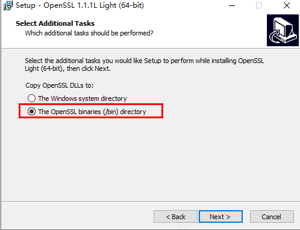
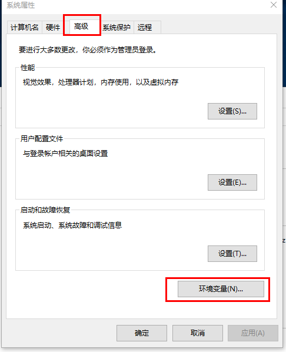
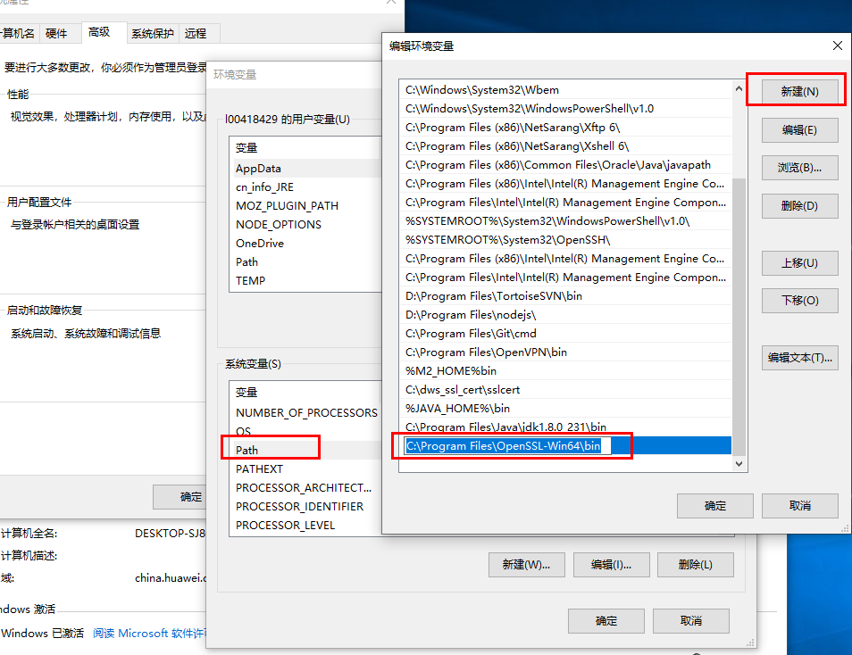
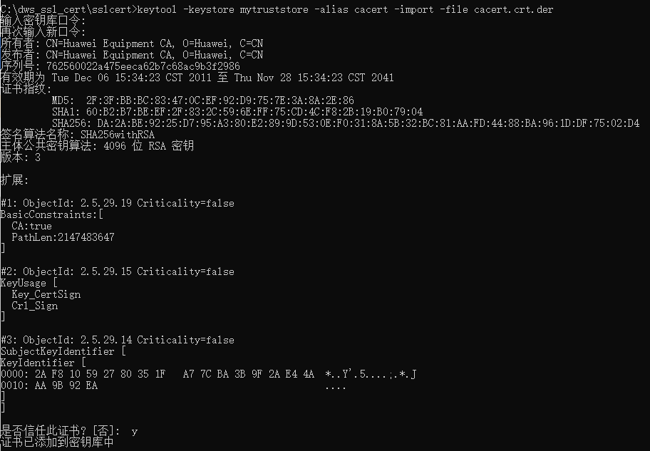
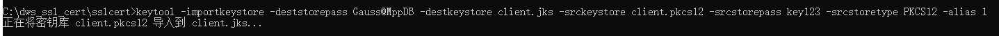
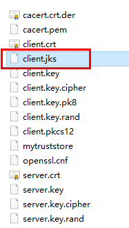

# 使用JDBC连接数据库<a name="ZH-CN_TOPIC_0000001405476774"></a>

GaussDB\(DWS\) 支持在Linux或Windows环境下使用JDBC应用程序连接数据库。应用程序可以在华为云平台环境的弹性云服务器中，或者互联网环境连接数据库。

用户通过JDBC连接GaussDB\(DWS\) 集群时，可以选择是否采用SSL认证方式。SSL认证用于加密客户端和服务器之间的通讯数据，为敏感数据在Internet上的传输提供了一种安全保障手段。GaussDB\(DWS\) 管理控制台提供了自签的证书供用户下载。使用该证书，用户需要配置客户端程序，使证书可用，此过程依赖于openssl工具以及java自带的keytool工具。

> **说明：** 
>SSL模式安全性高于普通模式，建议在使用JDBC连接GaussDB\(DWS\) 集群时采用SSL模式。

JDBC接口的使用方法，请自行查阅官方文档。

## 前提条件<a name="section1584133941514"></a>

-   已安装JDK 1.6或以上版本，并配置环境变量。
-   已下载JDBC驱动，请参见[下载JDBC或ODBC驱动](下载JDBC或ODBC驱动.md)。

    GaussDB\(DWS\) 也支持开源的JDBC驱动程序：PostgreSQL JDBC驱动程序9.3-1103或更高版本。

-   已下载SSL证书文件，请参见[下载SSL证书](使用SSL进行安全的TCP-IP连接.md#li13478842115911)。

## 使用JDBC连接数据库<a name="section2993721114437"></a>

在Linux和Windows环境下操作方法相同，以下步骤以Windows环境为例。

1.  是否采用SSL方式连接GaussDB\(DWS\) 集群。
    -   是，参见[设置SSL连接](使用SSL进行安全的TCP-IP连接.md#section131774823014)开启SSL连接，默认为开启。执行[2](#li55435426144245)。
    -   否，参见[设置SSL连接](使用SSL进行安全的TCP-IP连接.md#section131774823014)关闭SSL连接，执行[4](#li19193115114292)。

2.  <a name="li55435426144245"></a>（可选）如果使用Linux环境，使用WinScp工具将SSL证书上传到Linux环境上。
3.  配置证书以使用SSL加密连接。
    1.  下载windows版本的OpenSSL工具。下载地址：[https://slproweb.com/products/Win32OpenSSL.html](https://slproweb.com/products/Win32OpenSSL.html)，当前不支持OpenSSL 3.0.0，请选择下载“Win64 OpenSSL v1.1.1L Light”版本。
    2.  双击安装包“Win64OpenSSL\_Light-1\_1\_1L.exe”安装到C盘默认路径即可，选择复制DLLs文件到OpenSSL目录下，如下图，剩余步骤默认单击下一步直到安装成功。

        

    3.  安装环境变量。单击本地PC左下角“开始”，右击“此电脑”，选择“更多 \> 属性 \> 高级系统设置”，切换到“高级”，单击“环境变量”。

        

    4.  在下方“系统变量”，双击“Path”变量，单击“新建”，在最后一行增加Openssl的bin路径，例如“C:\\Program Files\\OpenSSL-Win64\\bin”，单击“确定”，再次单击“确定”，配置变量成功。

        

    5.  解压压缩包得到证书文件。假设解压路径为“C:\\”。

        证书文件建议保存在英文路径，配置证书时需要根据实际情况指定路径，否则可能提示文件不存在。

    6.  打开“命令提示符“程序，切换到“C:\\dws\_ssl\_cert\\sslcert”路径下，执行以下两条命令，转化根证书并导入到trustStore中。

        ```
        openssl x509 -in cacert.pem -out cacert.crt.der -outform der
        keytool -keystore mytruststore -alias cacert -import -file cacert.crt.der
        ```

        -   “cacert.pem“为解压后获取的根证书。
        -   “cacert.crt.der“为生成的中间文件。根据实际情况，可以填写保存到其他路径，也可以自定义文件名称。
        -   “mytruststore“为生成的可信库名称，“cacert“为别名用户，二者可以根据需要进行修改。

        请用户根据提示信息输入自定义的可信库密码并确认密码，然后输入“y“确认信任证书。

        

    7.  执行以下命令转化客户端私钥。

        ```
        openssl pkcs12 -export -out client.pkcs12 -in client.crt -inkey client.key
        ```

        需要输入客户端私钥的密码“Gauss@MppDB“，然后输入并确认用户自定义的私钥密码。

    8.  执行以下命令，将私钥导入到keyStore中。

        ```
        keytool -importkeystore -deststorepass Gauss@MppDB -destkeystore client.jks -srckeystore client.pkcs12 -srcstorepass password -srcstoretype PKCS12 -alias 1
        ```

        > **说明：** 
        >-   命令中“_password_”为示例自定义密码，具体请根据用户实际输入密码为准。
        >-   回显如下类似信息且没有报错，则表示导入成功。此时“C:\\dws\_ssl\_cert\\sslcert”下会生成目标密钥文件：client.jks。
        >    
        >    


4.  <a name="li19193115114292"></a>下载包名为dws\_8.1.x\_jdbc\_driver.zip的驱动包，解压后有两个JDBC的驱动jar包“gsjdbc4.jar”和“gsjdbc200.jar”，用户可根据需求选择。
5.  在应用程序的工程中，设置引用Jar包。

    以Eclipse工程为例，先将jar包存放在工程目录下，例如将jar包放在工程目录的lib目录下，然后在Eclipse工程中，右键单击lib目录下的该jar包，再选择菜单“Build Path”，即可引用此jar包。

    **图 1**  引用jar包<a name="fig18599113514410"></a>  
    

    或者，您也可以使用另一种方式，在Maven工程中，可以直接将GaussDB\(DWS\)  JDBC驱动作为依赖项添加进POM文件，配置如下所示：

    -   gsjdbc4.jar

        ```
        <dependency>
            <groupId>com.huaweicloud.dws </groupId>
            <artifactId>huaweicloud-dws-jdbc</artifactId>
            <version>8.1.0</version> 
        </dependency>
        ```

    -   gsjdbc200.jar

        ```
        <dependency>
            <groupId>com.huaweicloud.dws</groupId>
            <artifactId>huaweicloud-dws-jdbc</artifactId>
            <version>8.1.1.1-200</version>
        </dependency>  
        ```

6.  加载驱动。

    支持以下两种方法加载：

    -   在代码中隐含装载：Class.forName\("org.postgresql.Driver"\);
    -   在JVM启动时参数传递：java -Djdbc.drivers=org.postgresql.Driver jdbctest

        > **说明：** 
        >GaussDB\(DWS\) 下载的JDBC驱动包中，同时提供gsjdbc4.jar和gsjdbc200.jar。
        >-   gsjdbc4.jar：与PostgreSQL保持兼容，其中类名、类结构与PostgreSQL驱动完全一致，曾经运行于PostgreSQL的应用程序可以直接移植到当前系统中使用。
        >-   gsjdbc200.jar：如果同一JVM进程内需要同时访问PostgreSQL及GaussDB\(DWS\) 请使用该驱动包。该包主类名为“com.huawei.gauss200.jdbc.Driver”（即将“org.postgresql”替换为“com.huawei.gauss200.jdbc”） ,数据库连接的URL前缀为“jdbc:gaussdb”，其余与gsjdbc4.jar相同。
        >-   从Maven仓库中下载的GaussDB\(DWS\) 驱动包和gsjdbc4相同。


7.  调用JDBC的数据库连接方法DriverManager.getConnection\(\)连接GaussDB\(DWS\) 数据库。

    JDBC接口不提供重试连接的能力，您需要在业务代码中实现重试处理。

    DriverManager.getConnection\(\)方法支持以下重载：

    -   DriverManager.getConnection\(String url\);
    -   DriverManager.getConnection\(String url, Properties info\);
    -   DriverManager.getConnection\(String url, String user, String password\);

    **表 1**  数据库连接参数

    <a name="zh-cn_topic_0004406724_table51197761"></a>
    <table><thead align="left"><tr id="zh-cn_topic_0004406724_row61561215"><th class="cellrowborder" valign="top" width="13.44%" id="mcps1.2.3.1.1"><p id="zh-cn_topic_0004406724_p2535073"><a name="zh-cn_topic_0004406724_p2535073"></a><a name="zh-cn_topic_0004406724_p2535073"></a><strong id="b50623360142047"><a name="b50623360142047"></a><a name="b50623360142047"></a>参数</strong></p>
    </th>
    <th class="cellrowborder" valign="top" width="86.56%" id="mcps1.2.3.1.2"><p id="zh-cn_topic_0004406724_p33599649"><a name="zh-cn_topic_0004406724_p33599649"></a><a name="zh-cn_topic_0004406724_p33599649"></a><strong id="b6851456142047"><a name="b6851456142047"></a><a name="b6851456142047"></a>描述</strong></p>
    </th>
    </tr>
    </thead>
    <tbody><tr id="zh-cn_topic_0004406724_row42455976"><td class="cellrowborder" valign="top" width="13.44%" headers="mcps1.2.3.1.1 "><p id="zh-cn_topic_0004406724_p57939919"><a name="zh-cn_topic_0004406724_p57939919"></a><a name="zh-cn_topic_0004406724_p57939919"></a>url</p>
    </td>
    <td class="cellrowborder" valign="top" width="86.56%" headers="mcps1.2.3.1.2 "><p id="p20249474372"><a name="p20249474372"></a><a name="p20249474372"></a>数据库连接描述符，可以在管理控制台查看，具体步骤请参见<a href="获取集群连接地址.md">获取集群连接地址</a>。</p>
    <p id="p524947173710"><a name="p524947173710"></a><a name="p524947173710"></a>url的格式如下：</p>
    <a name="ude90174d20344cc1aa2bffac0ce922db"></a><a name="ude90174d20344cc1aa2bffac0ce922db"></a><ul id="ude90174d20344cc1aa2bffac0ce922db"><li>jdbc:postgresql:database</li><li>jdbc:postgresql://host/database</li><li>jdbc:postgresql://host:port/database</li><li>jdbc:postgresql://host:port[,host:port][...]/database</li></ul>
    <div class="note" id="note11251117103713"><a name="note11251117103713"></a><a name="note11251117103713"></a><span class="notetitle"> 说明： </span><div class="notebody"><a name="ul14251376376"></a><a name="ul14251376376"></a><ul id="ul14251376376"><li>使用gsjdbc200.jar时，将“jdbc:postgresql”修改为“jdbc:gaussdb”<a name="ue24edf2cc0a9448495fbf4a286ba0e10"></a><a name="ue24edf2cc0a9448495fbf4a286ba0e10"></a><ul id="ue24edf2cc0a9448495fbf4a286ba0e10"><li>database为要连接的数据库名称。</li><li>host为数据库服务器名称或IP地址。<p id="zh-cn_topic_0059779354_p461072082618"><a name="zh-cn_topic_0059779354_p461072082618"></a><a name="zh-cn_topic_0059779354_p461072082618"></a><span id="text13769170184720"><a name="text13769170184720"></a><a name="text13769170184720"></a>GaussDB(DWS)</span>管理控制台上集群的连接IP，根据网络环境判断，如果连接<span id="text6504155284713"><a name="text6504155284713"></a><a name="text6504155284713"></a>GaussDB(DWS)</span>的机器跟<span id="text19939356184718"><a name="text19939356184718"></a><a name="text19939356184718"></a>GaussDB(DWS)</span>集群在同一个网络下，则选择内网IP，不在同一个网络下，则选择公网IP。</p>
    </li><li>port为数据库服务器端口。缺省情况下，会尝试连接到localhost的8000端口的database。</li><li>支持多ip端口配置形式，jdbc自动实现了负载均衡，多ip端口配置形式是采取随机访问+failover的方式，这个过程系统会自动忽略不可达IP。<p id="p168955922812"><a name="p168955922812"></a><a name="p168955922812"></a>以","隔开，例如jdbc:postgresql://10.10.0.13:8000,10.10.0.14:8000/database</p>
    </li></ul>
    </li><li>使用JDBC连接集群时集群链接地址只支持指定jdbc连接参数，不支持增加变量参数。</li></ul>
    </div></div>
    </td>
    </tr>
    <tr id="zh-cn_topic_0004406724_row16695882"><td class="cellrowborder" valign="top" width="13.44%" headers="mcps1.2.3.1.1 "><p id="zh-cn_topic_0004406724_p14273515"><a name="zh-cn_topic_0004406724_p14273515"></a><a name="zh-cn_topic_0004406724_p14273515"></a>info</p>
    </td>
    <td class="cellrowborder" valign="top" width="86.56%" headers="mcps1.2.3.1.2 "><p id="a3fac73fcef9f445e90ab567819781679"><a name="a3fac73fcef9f445e90ab567819781679"></a><a name="a3fac73fcef9f445e90ab567819781679"></a>数据库连接属性。常用的属性如下：</p>
    <a name="ue7508e5a1b3a4615a5eff8dc9eac753a"></a><a name="ue7508e5a1b3a4615a5eff8dc9eac753a"></a><ul id="ue7508e5a1b3a4615a5eff8dc9eac753a"><li>user：String类型。表示创建连接的数据库用户。</li><li>password：String类型。表示数据库用户的密码。</li><li>ssl：Boolean类型。表示是否使用SSL连接。</li><li>loggerLevel：string类型。为LogStream或LogWriter设置记录进DriverManager当前值的日志信息量。目前支持"OFF"、"DEBUG"和"TRACE"。 值为"DEBUG"时，表示只打印DEBUG级别以上的日志，将记录非常少的信息。值等于TRACE时，表示打印DEBUG和TRACE级别的日志，将产生详细的日志信息。默认值为OFF，表示不打印日志。</li><li>prepareThreshold：integer类型。用于确定在转换为服务器端的预备语句之前，要求执行方法PreparedStatement的次数。缺省值是5。</li><li>batchMode : boolean类型，用于确定是否使用batch模式连接。</li><li>fetchsize ： integer类型，用于设置数据库链接所创建statement的默认fetchsize。</li><li>ApplicationName：string类型。应用名称，在不做设置时，缺省值为PostgreSQL JDBC Driver。</li><li>allowReadOnly:boolean类型，用于设置connection是否允许设置readonly模式，默认为false，若该参数不被设置为true，则执行connection.setReadOnly不生效。</li><li>blobMode:string类型，用于设置setBinaryStream方法为不同的数据类型赋值，设置为on时表示为blob数据类型赋值，设置为off时表示为bytea数据类型赋值，默认为on。</li><li>connectionExtraInfo：Boolean类型。表示驱动是否上报当前驱动的部署路径、进程属主用户到数据库。<div class="note" id="note177665024418"><a name="note177665024418"></a><a name="note177665024418"></a><span class="notetitle"> 说明： </span><div class="notebody"><p id="p197674018449"><a name="p197674018449"></a><a name="p197674018449"></a>取值范围：true或false，默认值为true。设置connectionExtraInfo为true，JDBC驱动会将当前驱动的部署路径、进程属主用户上报到数据库中，记录在connection_info参数里；同时可以在PG_STAT_ACTIVITY和PGXC_STAT_ACTIVITY中查询到。</p>
    </div></div>
    </li></ul>
    </td>
    </tr>
    <tr id="zh-cn_topic_0004406724_row63199906"><td class="cellrowborder" valign="top" width="13.44%" headers="mcps1.2.3.1.1 "><p id="zh-cn_topic_0004406724_p5711640"><a name="zh-cn_topic_0004406724_p5711640"></a><a name="zh-cn_topic_0004406724_p5711640"></a>user</p>
    </td>
    <td class="cellrowborder" valign="top" width="86.56%" headers="mcps1.2.3.1.2 "><p id="zh-cn_topic_0004406724_p4700076"><a name="zh-cn_topic_0004406724_p4700076"></a><a name="zh-cn_topic_0004406724_p4700076"></a>数据库用户。</p>
    </td>
    </tr>
    <tr id="zh-cn_topic_0004406724_row58485413"><td class="cellrowborder" valign="top" width="13.44%" headers="mcps1.2.3.1.1 "><p id="zh-cn_topic_0004406724_p66603434"><a name="zh-cn_topic_0004406724_p66603434"></a><a name="zh-cn_topic_0004406724_p66603434"></a>password</p>
    </td>
    <td class="cellrowborder" valign="top" width="86.56%" headers="mcps1.2.3.1.2 "><p id="zh-cn_topic_0004406724_p22788321"><a name="zh-cn_topic_0004406724_p22788321"></a><a name="zh-cn_topic_0004406724_p22788321"></a>数据库用户的密码。</p>
    </td>
    </tr>
    </tbody>
    </table>

    以SSL证书方式加密连接样例代码如下：

    ```
    //以下代码将获取数据库SSL连接操作封装为一个接口。
    public static Connection GetConnection(String username, String passwd)
        {
            //定义驱动类。
            String driver = "org.postgresql.Driver";
            //设置keystore。
            System.setProperty("javax.net.ssl.trustStore", "mytruststore");
            System.setProperty("javax.net.ssl.keyStore", "client.jks");
            System.setProperty("javax.net.ssl.trustStorePassword", "password");
            System.setProperty("javax.net.ssl.keyStorePassword", "password");
    
            Properties props = new Properties();
            props.setProperty("user", username);
            props.setProperty("password", passwd);
            props.setProperty("ssl", "true");
    
            String  url = "jdbc:postgresql://" + "10.10.0.13" + ':'
                        + "8000" + '/'
                        + "gaussdb";
            Connection conn = null;
            
            try
            {
                //加载驱动。
                Class.forName(driver);
            }
            catch( Exception e )
            {
                e.printStackTrace();
                return null;
            }
            
            try
            {
                 //创建连接。
                conn = DriverManager.getConnection(url, props );
                System.out.println("Connection succeed!");
            }
            catch(Exception e)
            {
                e.printStackTrace();
                return null;
            }
            
            return conn;
        }
    ```

8.  执行SQL语句。
    1.  创建语句对象。

        ```
        Statement stmt = con.createStatement();
        ```

    2.  执行语句对象。

        ```
        int rc = stmt.executeUpdate("CREATE TABLE tab1(id INTEGER, name VARCHAR(32));");
        ```

    3.  释放语句对象。

        ```
        stmt.close();
        ```

9.  调用方法close\(\)关闭连接。

## 示例代码<a name="section12107104719399"></a>

此示例将演示如何基于GaussDB\(DWS\) 提供的JDBC接口开发应用程序。

> **说明：** 
>在完成以下示例前，需要先创建存储过程。具体请参见[教程：使用JDBC或ODBC开发](https://support.huaweicloud.com/devg-dws/dws_04_0680.html)。
>```
>create or replace procedure testproc 
>(
>    psv_in1 in integer,
>    psv_in2 in integer,
>    psv_inout in out integer
>)
>as
>begin
>    psv_inout := psv_in1 + psv_in2 + psv_inout;
>end;
>/
>```

```
//DBtest.java
//以下用例以gsjdbc4.jar为例，如果要使用gsjdbc200.jar，请替换驱动类名（将代码中的“org.postgresql”替换成“com.huawei.gauss200.jdbc”）与连接URL串前缀（将“jdbc:postgresql”替换为“jdbc:gaussdb”）。
//演示基于JDBC开发的主要步骤，会涉及创建数据库、创建表、插入数据等。

import java.sql.Connection;
import java.sql.DriverManager;
import java.sql.PreparedStatement;
import java.sql.SQLException;
import java.sql.Statement;
import java.sql.CallableStatement;
import java.sql.Types;

public class DBTest {
  //创建数据库连接，以下IP地址和database替换为对应的数据库连接地址和数据库名称。
  public static Connection GetConnection(String username, String passwd) {
    String driver = "org.postgresql.Driver";
    String sourceURL = "jdbc:postgresql://10.10.0.13:8000/database";
    Connection conn = null;
    try {
      //加载数据库驱动。
      Class.forName(driver).newInstance();
    } catch (Exception e) {
      e.printStackTrace();
      return null;
    }

    try {
      //创建数据库连接。
      conn = DriverManager.getConnection(sourceURL, username, passwd);
      System.out.println("Connection succeed!");
    } catch (Exception e) {
      e.printStackTrace();
      return null;
    }

    return conn;
  };

  //执行普通SQL语句，创建customer_t1表。
  public static void CreateTable(Connection conn) {
    Statement stmt = null;
    try {
      stmt = conn.createStatement();

      //执行普通SQL语句。
      int rc = stmt
          .executeUpdate("CREATE TABLE customer_t1(c_customer_sk INTEGER, c_customer_name VARCHAR(32));");

      stmt.close();
    } catch (SQLException e) {
      if (stmt != null) {
        try {
          stmt.close();
        } catch (SQLException e1) {
          e1.printStackTrace();
        }
      }
      e.printStackTrace();
    }
  }

  //执行预处理语句，批量插入数据。
  public static void BatchInsertData(Connection conn) {
    PreparedStatement pst = null;

    try {
      //生成预处理语句。
      pst = conn.prepareStatement("INSERT INTO customer_t1 VALUES (?,?)");
      for (int i = 0; i < 3; i++) {
        //添加参数。
        pst.setInt(1, i);
        pst.setString(2, "data " + i);
        pst.addBatch();
      }
      //执行批处理。
      pst.executeBatch();
      pst.close();
    } catch (SQLException e) {
      if (pst != null) {
        try {
          pst.close();
        } catch (SQLException e1) {
        e1.printStackTrace();
        }
      }
      e.printStackTrace();
    }
  }

  //执行预编译语句，更新数据。
  public static void ExecPreparedSQL(Connection conn) {
    PreparedStatement pstmt = null;
    try {
      pstmt = conn
          .prepareStatement("UPDATE customer_t1 SET c_customer_name = ? WHERE c_customer_sk = 1");
      pstmt.setString(1, "new Data");
      int rowcount = pstmt.executeUpdate();
      pstmt.close();
    } catch (SQLException e) {
      if (pstmt != null) {
        try {
          pstmt.close();
        } catch (SQLException e1) {
          e1.printStackTrace();
        }
      }
      e.printStackTrace();
    }
  }


//执行存储过程。
  public static void ExecCallableSQL(Connection conn) {
    CallableStatement cstmt = null;
    try {
      
      cstmt=conn.prepareCall("{? = CALL TESTPROC(?,?,?)}");
      cstmt.setInt(2, 50); 
      cstmt.setInt(1, 20);
      cstmt.setInt(3, 90);
      cstmt.registerOutParameter(4, Types.INTEGER);  //注册out类型的参数，类型为整型。
      cstmt.execute();
      int out = cstmt.getInt(4);  //获取out参数
      System.out.println("The CallableStatment TESTPROC returns:"+out);
      cstmt.close();
    } catch (SQLException e) {
      if (cstmt != null) {
        try {
          cstmt.close();
        } catch (SQLException e1) {
          e1.printStackTrace();
        }
      }
      e.printStackTrace();
    }
  }
  

  /**
   * 主程序，逐步调用各静态方法。
   * @param args
  */
  public static void main(String[] args) {
    //创建数据库连接，以下User、Password替换为实际连接的数据库用户和密码。
    Connection conn = GetConnection("User", "Password");

    //创建表。
    CreateTable(conn);

    //批插数据。
    BatchInsertData(conn);

    //执行预编译语句，更新数据。
    ExecPreparedSQL(conn);

    //执行存储过程。
    ExecCallableSQL(conn);

    //关闭数据库连接。
    try {
      conn.close();
    } catch (SQLException e) {
      e.printStackTrace();
    }

  }

}
```

