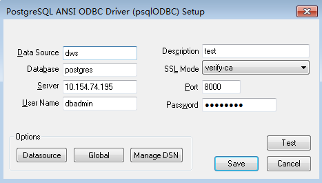

# 使用ODBC连接数据库<a name="dws_01_0086"></a>

DWS支持使用ODBC应用程序连接数据库。应用程序可以在公有云环境的弹性云服务器中，或者互联网环境连接数据库。

ODBC接口的使用方法，请自行查阅官方文档。

## 前提条件<a name="section17871125219214"></a>

-   已下载Linux版本的ODBC驱动包“dws\_odbc\_driver\_for\_linux.tar.gz“和Windows版本的ODBC驱动包“dws\_odbc\_driver\_for\_windows.tar.gz“，请参见[下载JDBC或ODBC驱动](下载JDBC或ODBC驱动.md)。

    DWS也支持开源的ODBC驱动程序：PostgreSQL ODBC 09.01.0200或更高版本。

-   已下载开源unixODBC代码文件，支持版本为2.3.0，下载地址：[https://sourceforge.net/projects/unixodbc/files/unixODBC/2.3.0/unixODBC-2.3.0.tar.gz/download](https://sourceforge.net/projects/unixodbc/files/unixODBC/2.3.0/unixODBC-2.3.0.tar.gz/download)
-   已下载SSL证书文件，请参见[（可选）下载SSL证书](（可选）下载SSL证书.md)。

## 在Linux环境使用ODBC连接<a name="section42307202184151"></a>

1.  将ODBC驱动包和代码文件上传到Linux环境，并解压到指定目录。
2.  以**root**用户登录Linux环境。
3.  准备unixODBC。
    1.  解压unixODBC代码文件。

        ```
        tar -xvf unixODBC-2.3.0.tar.gz
        ```

    2.  修改配置。

        ```
        cd unixODBC-2.3.0
        vi configure
        ```

        将“LIB\_VERSION“修改为如下内容，并保存退出。

        ```
        LIB_VERSION="1:0:0"
        ```

    3.  编译并安装。

        ```
        ./configure --enable-gui=no
        make
        make install
        ```

4.  替换驱动文件。
    1.  解压“dws\_odbc\_driver\_for\_linux.tar.gz“。

        ```
        tar -xvf dws_odbc_driver_for_linux.tar.gz
        ```

    2.  将“dws\_odbc\_driver\_for\_linux.tar.gz“解压后“lib“目录下所有文件，替换到“/usr/local/lib“。
    3.  将“dws\_odbc\_driver\_for\_linux.tar.gz“解压后“odbc/lib“目录下的“psqlodbcw.la“和“psqlodbcw.so“，保存到“/usr/local/lib“。

5.  执行以下命令，修改驱动文件配置。

    ```
    vi /usr/local/etc/odbcinst.ini
    ```

    将以下内容保存到配置中

    ```
    [DWS] 
    Driver64=/usr/local/lib/psqlodbcw.so
    ```

    参数说明如下：

    -   “\[DWS\]“：表示驱动器名称，支持自定义。
    -   “Driver64“或“Driver“：表示驱动动态库的路径。64位系统优先查找“Driver64“配置项，如果未配置则会继续查找“Driver“。

6.  执行以下命令，修改数据源文件。

    ```
    vi /usr/local/etc/odbc.ini
    ```

    将以下内容保存到配置文件中，并退出修改。

    ```
    [DWSODBC]
    Driver=DWS
    Servername=10.10.0.13
    Database=postgres
    Username=dbadmin
    Password=Abcd@123
    Port=8000
    Sslmode=allow
    ```

    <a name="table698016191057"></a>
    <table><thead align="left"><tr id="row43688892191057"><th class="cellrowborder" valign="top" width="20%" id="mcps1.1.4.1.1"><p id="p49139350191057"><a name="p49139350191057"></a><a name="p49139350191057"></a><strong id="b4331210191910"><a name="b4331210191910"></a><a name="b4331210191910"></a>参数名</strong></p>
    </th>
    <th class="cellrowborder" valign="top" width="40%" id="mcps1.1.4.1.2"><p id="p53562174191057"><a name="p53562174191057"></a><a name="p53562174191057"></a><strong id="b1861928191910"><a name="b1861928191910"></a><a name="b1861928191910"></a>说明</strong></p>
    </th>
    <th class="cellrowborder" valign="top" width="40%" id="mcps1.1.4.1.3"><p id="p56575432191057"><a name="p56575432191057"></a><a name="p56575432191057"></a><strong id="b3176675391910"><a name="b3176675391910"></a><a name="b3176675391910"></a>参数值样例</strong></p>
    </th>
    </tr>
    </thead>
    <tbody><tr id="row38648128191057"><td class="cellrowborder" valign="top" width="20%" headers="mcps1.1.4.1.1 "><p id="p43490644191057"><a name="p43490644191057"></a><a name="p43490644191057"></a>[DSN]</p>
    </td>
    <td class="cellrowborder" valign="top" width="40%" headers="mcps1.1.4.1.2 "><p id="p33081269191057"><a name="p33081269191057"></a><a name="p33081269191057"></a>数据源的名称。</p>
    </td>
    <td class="cellrowborder" valign="top" width="40%" headers="mcps1.1.4.1.3 "><p id="p62337098191057"><a name="p62337098191057"></a><a name="p62337098191057"></a>[DWSODBC]</p>
    </td>
    </tr>
    <tr id="row24162971191057"><td class="cellrowborder" valign="top" width="20%" headers="mcps1.1.4.1.1 "><p id="p11043674191057"><a name="p11043674191057"></a><a name="p11043674191057"></a>Driver</p>
    </td>
    <td class="cellrowborder" valign="top" width="40%" headers="mcps1.1.4.1.2 "><p id="p22122434191057"><a name="p22122434191057"></a><a name="p22122434191057"></a>驱动名称，对应<span class="filepath" id="filepath5796887584523"><a name="filepath5796887584523"></a><a name="filepath5796887584523"></a>“odbcinst.ini”</span>中的DriverName。</p>
    </td>
    <td class="cellrowborder" valign="top" width="40%" headers="mcps1.1.4.1.3 "><p id="p47086714191057"><a name="p47086714191057"></a><a name="p47086714191057"></a>Driver=DWS</p>
    </td>
    </tr>
    <tr id="row21127243191057"><td class="cellrowborder" valign="top" width="20%" headers="mcps1.1.4.1.1 "><p id="p33585151191057"><a name="p33585151191057"></a><a name="p33585151191057"></a>Servername</p>
    </td>
    <td class="cellrowborder" valign="top" width="40%" headers="mcps1.1.4.1.2 "><p id="p36042711191057"><a name="p36042711191057"></a><a name="p36042711191057"></a>服务器的IP地址。</p>
    </td>
    <td class="cellrowborder" valign="top" width="40%" headers="mcps1.1.4.1.3 "><p id="p33778492191057"><a name="p33778492191057"></a><a name="p33778492191057"></a>Servername=10.10.0.13</p>
    </td>
    </tr>
    <tr id="row35570974191057"><td class="cellrowborder" valign="top" width="20%" headers="mcps1.1.4.1.1 "><p id="p62676673191057"><a name="p62676673191057"></a><a name="p62676673191057"></a>Database</p>
    </td>
    <td class="cellrowborder" valign="top" width="40%" headers="mcps1.1.4.1.2 "><p id="p43645732191057"><a name="p43645732191057"></a><a name="p43645732191057"></a>要连接的数据库的名称。</p>
    </td>
    <td class="cellrowborder" valign="top" width="40%" headers="mcps1.1.4.1.3 "><p id="p45643375191057"><a name="p45643375191057"></a><a name="p45643375191057"></a>Database=postgres</p>
    </td>
    </tr>
    <tr id="row8137195191057"><td class="cellrowborder" valign="top" width="20%" headers="mcps1.1.4.1.1 "><p id="p55133095191057"><a name="p55133095191057"></a><a name="p55133095191057"></a>Username</p>
    </td>
    <td class="cellrowborder" valign="top" width="40%" headers="mcps1.1.4.1.2 "><p id="p36595678191057"><a name="p36595678191057"></a><a name="p36595678191057"></a>数据库用户名称。</p>
    </td>
    <td class="cellrowborder" valign="top" width="40%" headers="mcps1.1.4.1.3 "><p id="p11459962191057"><a name="p11459962191057"></a><a name="p11459962191057"></a>Username=dbadmin</p>
    </td>
    </tr>
    <tr id="row36030802191057"><td class="cellrowborder" valign="top" width="20%" headers="mcps1.1.4.1.1 "><p id="p32813824191057"><a name="p32813824191057"></a><a name="p32813824191057"></a>Password</p>
    </td>
    <td class="cellrowborder" valign="top" width="40%" headers="mcps1.1.4.1.2 "><p id="p40674054191057"><a name="p40674054191057"></a><a name="p40674054191057"></a>数据库用户密码。</p>
    </td>
    <td class="cellrowborder" valign="top" width="40%" headers="mcps1.1.4.1.3 "><p id="p6264077191057"><a name="p6264077191057"></a><a name="p6264077191057"></a>Password=Abcd@123</p>
    </td>
    </tr>
    <tr id="row56376696191057"><td class="cellrowborder" valign="top" width="20%" headers="mcps1.1.4.1.1 "><p id="p3109667191057"><a name="p3109667191057"></a><a name="p3109667191057"></a>Port</p>
    </td>
    <td class="cellrowborder" valign="top" width="40%" headers="mcps1.1.4.1.2 "><p id="p50556450191057"><a name="p50556450191057"></a><a name="p50556450191057"></a>服务器的端口号。</p>
    </td>
    <td class="cellrowborder" valign="top" width="40%" headers="mcps1.1.4.1.3 "><p id="p1431774191057"><a name="p1431774191057"></a><a name="p1431774191057"></a>Port=8000</p>
    </td>
    </tr>
    <tr id="row12885966191057"><td class="cellrowborder" valign="top" width="20%" headers="mcps1.1.4.1.1 "><p id="p37130287191057"><a name="p37130287191057"></a><a name="p37130287191057"></a>Sslmode</p>
    </td>
    <td class="cellrowborder" valign="top" width="40%" headers="mcps1.1.4.1.2 "><p id="p54763265191057"><a name="p54763265191057"></a><a name="p54763265191057"></a>SSL认证工作模式。集群默认开启。</p>
    <p id="p1442353513431"><a name="p1442353513431"></a><a name="p1442353513431"></a>取值及含义：</p>
    <a name="ul1438325020436"></a><a name="ul1438325020436"></a><ul id="ul1438325020436"><li>disable：只尝试非SSL连接。</li><li>allow：首先尝试非SSL连接，如果连接失败，再尝试SSL连接。</li><li>prefer：首先尝试SSL连接，如果连接失败，将尝试非SSL连接。</li><li>require：只尝试SSL连接。如果存在CA文件，则按设置成verify-ca的方式验证。</li><li>verify-ca：只尝试SSL连接，并且验证服务器是否具有由可信任的证书机构签发的证书。</li><li>verify-full：DWS不支持此模式。</li></ul>
    <div class="note" id="note94497271018"><a name="note94497271018"></a><a name="note94497271018"></a><span class="notetitle"> 说明： </span><div class="notebody"><p id="p444916277012"><a name="p444916277012"></a><a name="p444916277012"></a>SSL模式安全性高于普通模式，建议在使用ODBC连接DWS集群时采用SSL模式。</p>
    </div></div>
    </td>
    <td class="cellrowborder" valign="top" width="40%" headers="mcps1.1.4.1.3 "><p id="p6639467191057"><a name="p6639467191057"></a><a name="p6639467191057"></a>Sslmode=allow</p>
    </td>
    </tr>
    </tbody>
    </table>

    > **说明：** 
    >其中，参数“Servername”和“Port”的值，可以在DWS的管理控制台查看。请登录DWS管理控制台，单击“连接管理”， 在“数据仓库连接字符串”区域，选择指定的集群，获取该集群的“内网访问地址“或“公网访问地址“。具体步骤请参见[获取集群连接地址](获取集群连接地址.md)。

7.  配置环境变量。

    ```
    vi ~/.bashrc
    ```

    在配置文件中追加以下内容。

    ```
    export LD_LIBRARY_PATH=/usr/local/lib/:$LD_LIBRARY_PATH 
    export ODBCSYSINI=/usr/local/etc 
    export ODBCINI=/usr/local/etc/odbc.ini
    ```

8.  导入环境变量。

    ```
    source ~/.bashrc
    ```

9.  执行以下命令，开始连接。

    ```
    /usr/local/bin/isql -v DWSODBC
    ```

    界面显示以下信息表示连接成功：

    ```
    +---------------------------------------+ 
    | Connected!                            | 
    |                                       | 
    | sql-statement                         | 
    | help [tablename]                      | 
    | quit                                  | 
    |                                       | 
    +---------------------------------------+  
    SQL> 
    ```


## 在Windows环境使用ODBC连接<a name="section31086112145338"></a>

1.  解压Windows版本的ODBC驱动包“dws\_odbc\_driver\_for\_windows.tar.gz“，并安装“psqlodbc.msi“。
2.  解压SSL证书压缩包，并准备证书文件。

    用户可以根据实际情况选择自动或手动部署方法

    自动部署：

    双击"sslcert\_env.bat"文件，即可完成证书的默认位置的部署。

    > **说明：** 
    >该sslcert\_env.bat为了保证证书环境的纯净，在%APPDATA%\\postgresql目录存在时，会提示是否需要移除相关目录。如果有需要，请备份该目录中的文件。

    手动部署：

    1.  在“%APPDATA%\\“目录创建一个新文件夹，并命名为“postgresql“。
    2.  将证书文件包中的“client.crt“、“client.key“、“client.key.cipher“、“client.key.rand“文件保存至“%APPDATA%\\postgresql“目录，并且将文件名中的**client**改为**postgres**，例如“client.key“修改为“postgres.key“。
    3.  将“cacert.pem“文件保存至“%APPDATA%\\postgresql“目录，并更名为“root.crt“。

3.  打开驱动管理器

    因为目前DWS只提供了32位的ODBC驱动程序，**所以只支持32位的应用程序开发**；在配置数据源时，也请使用32位的驱动管理器（假设操作系统安装盘符为C:盘，如果是其他盘符，请对路径做相应修改）：

    -   64位操作系统请使用：C:\\Windows\\SysWOW64\\odbcad32.exe

        请勿直接使用“控制面板-\>系统和安全-\>管理工具-\>数据源\(ODBC\)”。

        > **说明：** 
        >WoW64的全称是"Windows 32-bit on Windows 64-bit"，C:\\Windows\\SysWOW64\\存放的是64位系统上的32位运行环境。而C:\\Windows\\System32\\存放的是与操作系统一致的运行环境，具体的技术信息请查阅Windows的相关技术文档。

    -   32位操作系统请使用：C:\\Windows\\System32\\odbcad32.exe

        或者单击“开始菜单-\>控制面板-\>系统和安全-\>管理工具-\>数据源\(ODBC\)”打开驱动管理器。

4.  配置连接数据源。
    1.  在打开的驱动管理器上，选择“用户DSN-\>添加-\>PostgreSQL Unicode“，然后进行配置。

        **图 1**  配置连接数据源<a name="fig46625912141933"></a>  
        

        其中，配置项“Server“和“Port“的值，可以在DWS的管理控制台查看。请登录DWS管理控制台，单击“连接管理“， 在“数据仓库连接字符串“区域，选择指定的集群，获取该集群的“内网访问地址“或“公网访问地址“。具体步骤请参见[获取集群连接地址](获取集群连接地址.md)。

    2.  单击“Test“验证连接正确，界面提示“Connection successful“。

5.  编写ODBC样例程序连接数据源。

    ODBC接口不提供重试连接数据库的能力，您需要在业务代码中实现重试连接的处理。

    样例代码如下：

    ```
    // 此示例演示如何通过ODBC方式获取DWS中的数据。
    // DBtest.c (compile with: libodbc.so)  
    #include <stdlib.h> 
    #include <stdio.h> 
    #include <sqlext.h>
    #ifdef WIN32
    #include <windows.h>
    #endif 
    SQLHENV       V_OD_Env;        // Handle ODBC environment 
    SQLHSTMT      V_OD_hstmt;      // Handle statement 
    SQLHDBC       V_OD_hdbc;       // Handle connection     
    char          typename[100];
    SQLINTEGER    value = 100;
    SQLINTEGER    V_OD_erg,V_OD_buffer,V_OD_err,V_OD_id;
    int main(int argc,char *argv[]) 
    {         
          // 1. 申请环境句柄       
          V_OD_erg = SQLAllocHandle(SQL_HANDLE_ENV,SQL_NULL_HANDLE,&V_OD_Env);     
          if ((V_OD_erg != SQL_SUCCESS) && (V_OD_erg != SQL_SUCCESS_WITH_INFO))        
          {           
               printf("Error AllocHandle\n");           
               exit(0);        
          } 
          // 2. 设置环境属性（版本信息）         
          SQLSetEnvAttr(V_OD_Env, SQL_ATTR_ODBC_VERSION, (void*)SQL_OV_ODBC3, 0);      
          // 3. 申请连接句柄        
          V_OD_erg = SQLAllocHandle(SQL_HANDLE_DBC, V_OD_Env, &V_OD_hdbc);     
          if ((V_OD_erg != SQL_SUCCESS) && (V_OD_erg != SQL_SUCCESS_WITH_INFO))      
          {                     
               SQLFreeHandle(SQL_HANDLE_ENV, V_OD_Env);          
               exit(0);       
          }
          // 4. 设置连接属性
          SQLSetConnectAttr(V_OD_hdbc, SQL_ATTR_AUTOCOMMIT, SQL_AUTOCOMMIT_ON, 0);          
          // 5. 连接数据源，其中的用户名和用户密码等信息之所以能省略，是因为在odbc.ini文件中进行了配置，若没配置需要在SQLConnect函数参数中具体写明要连接数据库的用户名和用户密码等信息。      
          V_OD_erg = SQLConnect(V_OD_hdbc, (SQLCHAR*) "gaussdb", SQL_NTS,  
                               (SQLCHAR*) "", SQL_NTS,  (SQLCHAR*) "", SQL_NTS);        
          if ((V_OD_erg != SQL_SUCCESS) && (V_OD_erg != SQL_SUCCESS_WITH_INFO))      
          {           
              printf("Error SQLConnect %d\n",V_OD_erg);            
              SQLFreeHandle(SQL_HANDLE_ENV, V_OD_Env);       
              exit(0);        
          }     
          printf("Connected !\n"); 
          // 6. 设置语句属性
          SQLSetStmtAttr(V_OD_hstmt,SQL_ATTR_QUERY_TIMEOUT,(SQLPOINTER *)3,0);
          // 7. 申请语句句柄
          SQLAllocHandle(SQL_HANDLE_STMT, V_OD_hdbc, &V_OD_hstmt);       
          // 8. 直接执行SQL语句。
          SQLExecDirect(V_OD_hstmt,"drop table IF EXISTS testtable",SQL_NTS);
          SQLExecDirect(V_OD_hstmt,"create table testtable(id int)",SQL_NTS);
          SQLExecDirect(V_OD_hstmt,"insert into testtable values(25)",SQL_NTS);
          // 9. 准备执行
          SQLPrepare(V_OD_hstmt,"insert into testtable values(?)",SQL_NTS); 
          // 10. 绑定参数
          SQLBindParameter(V_OD_hstmt,1,SQL_PARAM_INPUT,SQL_C_SLONG,SQL_INTEGER,0,0,
                           &value,0,NULL);
          // 11. 执行准备好的语句
          SQLExecute(V_OD_hstmt);
          SQLExecDirect(V_OD_hstmt,"select id from testtable",SQL_NTS);
          // 12. 获取结果集某一列的属性
          SQLColAttribute(V_OD_hstmt,1,SQL_DESC_TYPE,typename,100,NULL,NULL);                 
          printf("SQLColAtrribute %s\n",typename);
          // 13. 绑定结果集
          SQLBindCol(V_OD_hstmt,1,SQL_C_SLONG, (SQLPOINTER)&V_OD_buffer,150,
                    (SQLLEN *)&V_OD_err);
          // 14. 通过SQLFetch取结果集中数据
          V_OD_erg=SQLFetch(V_OD_hstmt);
          // 15. 通过SQLGetData获取并返回数据。
          while(V_OD_erg != SQL_NO_DATA)
          {
              SQLGetData(V_OD_hstmt,1,SQL_C_SLONG,(SQLPOINTER)&V_OD_id,0,NULL);
              printf("SQLGetData ----ID = %d\n",V_OD_id);
              V_OD_erg=SQLFetch(V_OD_hstmt);
          };
          printf("Done !\n");pgadmin
          // 16. 断开数据源连接并释放句柄资源
          SQLFreeHandle(SQL_HANDLE_STMT,V_OD_hstmt);    
          SQLDisconnect(V_OD_hdbc);         
          SQLFreeHandle(SQL_HANDLE_DBC,V_OD_hdbc);       
          SQLFreeHandle(SQL_HANDLE_ENV, V_OD_Env);  
          return(0);
     }
    
    ```


