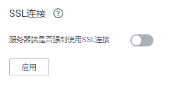

# 使用SSL进行安全的TCP/IP连接<a name="ZH-CN_TOPIC_0000001405476914"></a>

GaussDB\(DWS\)支持SSL标准协议，SSL协议是安全性更高的协议标准，它们加入了数字签名和数字证书来实现客户端和服务器的双向身份验证，保证了通信双方更加安全的数据传输。为支持SSL连接方式，GaussDB\(DWS\)已经从CA认证中心申请到正式的服务器、客户端的证书和密钥（假设服务器的私钥为server.key，证书为server.crt，客户端的私钥为client.key，证书为client.crt，CA根证书名称为cacert.pem）。

SSL连接方式的安全性高于普通模式，集群默认开启SSL功能允许来自客户端的SSL连接或非SSL连接，从安全性考虑，建议用户在客户端使用SSL连接方式。并且GaussDB\(DWS\)服务器端的证书、私钥以及根证书已经默认配置完成。如果要强制使用SSL连接，需要在集群“安全设置”页面开启“服务器端是否强制使用SSL连接”，操作详情可参见[设置SSL连接](#section131774823014)，客户端和服务器端SSL连接参数组合情况可请见[客户端和服务器端SSL连接参数组合情况](#section1916311515557)。

客户端或JDBC/ODBC应用程序使用SSL连接方式，用户必须在客户端或应用程序代码中配置相关的SSL连接参数。GaussDB\(DWS\)管理控制台提供了客户端所需的SSL证书，该SSL证书包含了客户端所需的默认证书、私钥、根证书以及私钥密码加密文件。请将该SSL证书下载到客户端所在的主机上，然后在客户端中指定证书所在的路径，操作详情请参见[在gsql客户端配置SSL认证相关的数字证书参数](#s6d3b0bb119894929810147678d9c67a5)，SSL认证及客户端参数介绍可参见[SSL认证方式及客户端参数介绍](#s3a228fb4ac9c48ec8bc34e812c8879e8)。

> **说明：** 
>使用默认的证书可能存在安全风险，为了提高系统安全性，强烈建议用户定期更换证书以避免被破解的风险。如果需要更换证书，请联系数据库客服。

## 设置SSL连接<a name="section131774823014"></a>

**前提条件**

-   修改安全配置参数并保存生效可能需要重启集群，将导致集群暂时不可用。
-   修改集群安全配置必须同时满足以下两个条件：
    -   集群状态为“可用”或“非均衡”。
    -   任务信息不能处于“创建快照中”、“节点扩容”、“配置中”或“重启中”。


**操作步骤**

1.  登录GaussDB\(DWS\) 管理控制台。
2.  在左侧导航树中，单击“集群管理“。
3.  在集群列表中，单击指定集群的名称，然后单击“安全设置“。

    默认显示“配置状态“为“已同步“，表示页面显示的是数据库当前最新结果。

4.  在“SSL连接“区域中，单击“服务器端是否强制使用SSL连接“的设置开关进行设置，建议开启。

    ：开启，设置参数**require\_ssl**=1，表示服务器端强制要求SSL连接。

    ：关闭，设置参数**require\_ssl**=0，表示服务器端对是否通过SSL连接不作强制要求，默认为关闭。设置require\_ssl参数详情请参见[•require\_ssl（服务器）](#li107621516191913)。

    **图 1**  SSL连接<a name="fig168181335124718"></a>  
    

    > **说明：** 
    >-   如果使用GaussDB\(DWS\)提供的gsql客户端或ODBC驱动，GaussDB\(DWS\)支持的SSL协议为TLSv1.2。
    >-   如果使用GaussDB\(DWS\)提供的JDBC驱动，支持的SSL协议有SSLv3、TLSv1、TLSv1.1、TLSv1.2。客户端与数据库之间实际使用何种SSL协议，依赖客户端使用的JDK（Java Development Kit）版本，一般JDK支持多个SSL协议。

5.  单击“应用“。

    系统将自动应用保存SSL连接设置，在“安全设置“页面，“配置状态“显示“应用中“。当“配置状态“显示为“已同步“，表示配置已保存生效。


## 在gsql客户端配置SSL认证相关的数字证书参数<a name="s6d3b0bb119894929810147678d9c67a5"></a>

GaussDB\(DWS\) 在集群部署完成后，默认已开启SSL认证模式。服务器端证书，私钥以及根证书已经默认配置完成。用户需要配置客户端的相关参数。

1.  登录GaussDB\(DWS\) 管理控制台，在左侧导航栏中，进入“连接管理”页面。
2.  在“下载驱动程序”区域，单击“下载SSL证书”进行下载。

    **图 2**  SSL证书下载<a name="fig156649439910"></a>  
    

3.  使用文件传输工具（例如WinSCP工具）将SSL证书上传到客户端主机。

    例如，将下载的证书“dws\_ssl\_cert.zip”存放到“/home/dbadmin/dws\_ssl/”目录下。

4.  使用SSH远程连接工具（例如PuTTY）登录gsql客户端主机，然后执行以下命令进入SSL证书的存放目录，并解压SSL证书：

    ```
    cd /home/dbadmin/dws_ssl/
    unzip dws_ssl_cert.zip
    ```

5.  在gsql客户端主机上，执行export命令，配置SSL认证相关的数字证书参数。

    SSL认证有两种认证方式：双向认证和单向认证，认证方式不同用户所需配置的客户端环境变量也不同，详细介绍请参见[SSL认证方式及客户端参数介绍](#s3a228fb4ac9c48ec8bc34e812c8879e8)。

    双向认证需配置如下参数：

    ```
    export PGSSLCERT="/home/dbadmin/dws_ssl/sslcert/client.crt"
    export PGSSLKEY="/home/dbadmin/dws_ssl/sslcert/client.key"
    export PGSSLMODE="verify-ca"
    export PGSSLROOTCERT="/home/dbadmin/dws_ssl/sslcert/cacert.pem"
    ```

    单向认证需要配置如下参数：

    ```
    export PGSSLMODE="verify-ca"
    export PGSSLROOTCERT="/home/dbadmin/dws_ssl/sslcert/cacert.pem"
    ```

    > **须知：** 
    >-   从安全性考虑，建议使用双向认证方式。
    >-   配置客户端环境变量，必须包含文件的绝对路径。

6.  修改客户端密钥的权限。

    客户端根证书，密钥，证书以及密钥密码加密文件的权限，需保证权限为600。如果权限不满足要求，则客户端无法以SSL连接到集群。

    ```
    chmod 600 client.key
    chmod 600 client.crt
    chmod 600 client.key.cipher
    chmod 600 client.key.rand
    chmod 600 cacert.pem
    ```


## SSL认证方式及客户端参数介绍<a name="s3a228fb4ac9c48ec8bc34e812c8879e8"></a>

SSL认证有两种认证方式，如[表1](#table267519441727)所示。从安全性考虑，建议使用双向认证方式。

**表 1**  认证方式

<a name="table267519441727"></a>
<table><thead align="left"><tr id="row1569712441123"><th class="cellrowborder" valign="top" width="11.991199119911991%" id="mcps1.2.5.1.1"><p id="p6706134413210"><a name="p6706134413210"></a><a name="p6706134413210"></a>认证方式</p>
</th>
<th class="cellrowborder" valign="top" width="29.24292429242924%" id="mcps1.2.5.1.2"><p id="p187063441212"><a name="p187063441212"></a><a name="p187063441212"></a>含义</p>
</th>
<th class="cellrowborder" valign="top" width="18.74187418741874%" id="mcps1.2.5.1.3"><p id="p17149441227"><a name="p17149441227"></a><a name="p17149441227"></a>配置客户端环境变量</p>
</th>
<th class="cellrowborder" valign="top" width="40.02400240024002%" id="mcps1.2.5.1.4"><p id="p371410441425"><a name="p371410441425"></a><a name="p371410441425"></a>维护建议</p>
</th>
</tr>
</thead>
<tbody><tr id="row167211244327"><td class="cellrowborder" valign="top" width="11.991199119911991%" headers="mcps1.2.5.1.1 "><p id="p20721184419215"><a name="p20721184419215"></a><a name="p20721184419215"></a>双向认证（推荐）</p>
</td>
<td class="cellrowborder" valign="top" width="29.24292429242924%" headers="mcps1.2.5.1.2 "><p id="p1772914441226"><a name="p1772914441226"></a><a name="p1772914441226"></a>客户端验证服务器证书的有效性，同时服务器端也要验证客户端证书的有效性，只有认证成功，连接才能建立。</p>
</td>
<td class="cellrowborder" valign="top" width="18.74187418741874%" headers="mcps1.2.5.1.3 "><p id="p872910441723"><a name="p872910441723"></a><a name="p872910441723"></a>设置如下环境变量：</p>
<a name="ul2072910443216"></a><a name="ul2072910443216"></a><ul id="ul2072910443216"><li>PGSSLCERT</li><li>PGSSLKEY</li><li>PGSSLROOTCERT</li><li>PGSSLMODE</li></ul>
</td>
<td class="cellrowborder" valign="top" width="40.02400240024002%" headers="mcps1.2.5.1.4 "><p id="p1575364414211"><a name="p1575364414211"></a><a name="p1575364414211"></a>该方式应用于安全性要求较高的场景。使用此方式时，建议设置客户端的PGSSLMODE变量为verify-ca。确保了网络数据的安全性。</p>
</td>
</tr>
<tr id="row1475394418216"><td class="cellrowborder" valign="top" width="11.991199119911991%" headers="mcps1.2.5.1.1 "><p id="p67533441527"><a name="p67533441527"></a><a name="p67533441527"></a>单向认证</p>
</td>
<td class="cellrowborder" valign="top" width="29.24292429242924%" headers="mcps1.2.5.1.2 "><p id="p27601449217"><a name="p27601449217"></a><a name="p27601449217"></a>客户端只验证服务器证书的有效性，而服务器端不验证客户端证书的有效性。服务器加载证书信息并发送给客户端，客户端使用根证书来验证服务器端证书的有效性。</p>
</td>
<td class="cellrowborder" valign="top" width="18.74187418741874%" headers="mcps1.2.5.1.3 "><p id="p976014441621"><a name="p976014441621"></a><a name="p976014441621"></a>设置如下环境变量：</p>
<a name="ul117605446218"></a><a name="ul117605446218"></a><ul id="ul117605446218"><li>PGSSLROOTCERT</li><li>PGSSLMODE</li></ul>
</td>
<td class="cellrowborder" valign="top" width="40.02400240024002%" headers="mcps1.2.5.1.4 "><p id="p8776154411212"><a name="p8776154411212"></a><a name="p8776154411212"></a>为防止基于TCP链接的欺骗，建议使用SSL证书认证功能。除配置客户端根证书外，建议客户端使用PGSSLMODE变量为verify-ca方式连接。</p>
</td>
</tr>
</tbody>
</table>

在客户端配置SSL认证相关的环境变量，详细信息请参见[表2](#t8b0644779e4c40009b6fb1ad6a8ea986)。

> **说明：** 
>客户端环境变量的路径以“_/home/dbadmin_/dws\_ssl/”为例，在实际操作中请使用实际路径进行替换。

**表 2**  客户端参数

<a name="t8b0644779e4c40009b6fb1ad6a8ea986"></a>
<table><thead align="left"><tr id="r43822a39dba648828fe49912078f1cb2"><th class="cellrowborder" valign="top" width="13.059999999999999%" id="mcps1.2.4.1.1"><p id="ad17d7af1c3de4d729bf57312c91e6974"><a name="ad17d7af1c3de4d729bf57312c91e6974"></a><a name="ad17d7af1c3de4d729bf57312c91e6974"></a>环境变量</p>
</th>
<th class="cellrowborder" valign="top" width="30.5%" id="mcps1.2.4.1.2"><p id="ac380e0ec1bd34540bfbfd4e6cb96972f"><a name="ac380e0ec1bd34540bfbfd4e6cb96972f"></a><a name="ac380e0ec1bd34540bfbfd4e6cb96972f"></a>描述</p>
</th>
<th class="cellrowborder" valign="top" width="56.44%" id="mcps1.2.4.1.3"><p id="ac9474bec612d44f08a364a81701c28a1"><a name="ac9474bec612d44f08a364a81701c28a1"></a><a name="ac9474bec612d44f08a364a81701c28a1"></a>取值范围</p>
</th>
</tr>
</thead>
<tbody><tr id="r972797e6e649495cac959b5ec60d1dca"><td class="cellrowborder" valign="top" width="13.059999999999999%" headers="mcps1.2.4.1.1 "><p id="ae1ed5b266db84f2d9556f32663a3be24"><a name="ae1ed5b266db84f2d9556f32663a3be24"></a><a name="ae1ed5b266db84f2d9556f32663a3be24"></a>PGSSLCERT</p>
</td>
<td class="cellrowborder" valign="top" width="30.5%" headers="mcps1.2.4.1.2 "><p id="a01cc006c5316402e8f6a4a9296d2c8bf"><a name="a01cc006c5316402e8f6a4a9296d2c8bf"></a><a name="a01cc006c5316402e8f6a4a9296d2c8bf"></a>指定客户端证书文件，包含客户端的公钥。客户端证书用以表明客户端身份的合法性，公钥将发送给对端用来对数据进行加密。</p>
</td>
<td class="cellrowborder" valign="top" width="56.44%" headers="mcps1.2.4.1.3 "><div class="p" id="a156de78bab614d698e120a40cc086b45"><a name="a156de78bab614d698e120a40cc086b45"></a><a name="a156de78bab614d698e120a40cc086b45"></a>必须包含文件的绝对路径，如：<pre class="screen" id="s24de87000fcf43b0b5531d835b2dae56"><a name="s24de87000fcf43b0b5531d835b2dae56"></a><a name="s24de87000fcf43b0b5531d835b2dae56"></a>export PGSSLCERT='<em id="a2d5b5f13eb5b43aeb17f6a00d3a858d2"><a name="a2d5b5f13eb5b43aeb17f6a00d3a858d2"></a><a name="a2d5b5f13eb5b43aeb17f6a00d3a858d2"></a>/home/dbadmin/dws_ssl/sslcert/client.crt</em>'</pre>
</div>
<p id="acdf675a9057d403c917bc1dcc49806c2"><a name="acdf675a9057d403c917bc1dcc49806c2"></a><a name="acdf675a9057d403c917bc1dcc49806c2"></a><strong id="adb8d89b5174145f597004b424d407c5b"><a name="adb8d89b5174145f597004b424d407c5b"></a><a name="adb8d89b5174145f597004b424d407c5b"></a>默认值</strong>：空</p>
</td>
</tr>
<tr id="rc98ff95b80ef4f88bc66c12fe5410d32"><td class="cellrowborder" valign="top" width="13.059999999999999%" headers="mcps1.2.4.1.1 "><p id="a51893fa2bd9b4568a84f40fb815973aa"><a name="a51893fa2bd9b4568a84f40fb815973aa"></a><a name="a51893fa2bd9b4568a84f40fb815973aa"></a>PGSSLKEY</p>
</td>
<td class="cellrowborder" valign="top" width="30.5%" headers="mcps1.2.4.1.2 "><p id="a9de3b54755c444c1b6c0ae8431197b62"><a name="a9de3b54755c444c1b6c0ae8431197b62"></a><a name="a9de3b54755c444c1b6c0ae8431197b62"></a>指定客户端私钥文件，用以数字签名和对公钥加密的数据进行解密。</p>
</td>
<td class="cellrowborder" valign="top" width="56.44%" headers="mcps1.2.4.1.3 "><div class="p" id="a8da9a9daae1a4ece8be3ad6b44637ec5"><a name="a8da9a9daae1a4ece8be3ad6b44637ec5"></a><a name="a8da9a9daae1a4ece8be3ad6b44637ec5"></a>必须包含文件的绝对路径，如：<pre class="screen" id="sc413cfb21de442cd9a16f1129e591f3b"><a name="sc413cfb21de442cd9a16f1129e591f3b"></a><a name="sc413cfb21de442cd9a16f1129e591f3b"></a>export PGSSLKEY='<em id="aca6668f8e3bb4b87857021cded5fad09"><a name="aca6668f8e3bb4b87857021cded5fad09"></a><a name="aca6668f8e3bb4b87857021cded5fad09"></a>/home/dbadmin/dws_ssl/sslcert/client.key</em>'</pre>
</div>
<p id="a39ee87ea493d4270b5f44b92d991148d"><a name="a39ee87ea493d4270b5f44b92d991148d"></a><a name="a39ee87ea493d4270b5f44b92d991148d"></a><strong id="a5313240e7ed54529a3b7367949a153ab"><a name="a5313240e7ed54529a3b7367949a153ab"></a><a name="a5313240e7ed54529a3b7367949a153ab"></a>默认值</strong>：空</p>
</td>
</tr>
<tr id="r85fe97858f3943ecae36f9597d96a226"><td class="cellrowborder" valign="top" width="13.059999999999999%" headers="mcps1.2.4.1.1 "><p id="a28fb67e3d7874c55a98063af0ad3f8ef"><a name="a28fb67e3d7874c55a98063af0ad3f8ef"></a><a name="a28fb67e3d7874c55a98063af0ad3f8ef"></a>PGSSLMODE</p>
</td>
<td class="cellrowborder" valign="top" width="30.5%" headers="mcps1.2.4.1.2 "><p id="abee299539baa4dfcbbdced408c233f87"><a name="abee299539baa4dfcbbdced408c233f87"></a><a name="abee299539baa4dfcbbdced408c233f87"></a>设置是否和服务器进行SSL连接协商，以及指定SSL连接的优先级。</p>
</td>
<td class="cellrowborder" valign="top" width="56.44%" headers="mcps1.2.4.1.3 "><p id="a5d279ea1261e4998a2d42805bf535ad3"><a name="a5d279ea1261e4998a2d42805bf535ad3"></a><a name="a5d279ea1261e4998a2d42805bf535ad3"></a><strong id="ab9953869fbfd4250aecb5dfc7aee682d"><a name="ab9953869fbfd4250aecb5dfc7aee682d"></a><a name="ab9953869fbfd4250aecb5dfc7aee682d"></a>取值及含义：</strong></p>
<a name="u48e2dabb7bdc47eea753bf8035b63f2a"></a><a name="u48e2dabb7bdc47eea753bf8035b63f2a"></a><ul id="u48e2dabb7bdc47eea753bf8035b63f2a"><li>disable：只尝试非SSL连接。</li><li>allow：首先尝试非SSL连接，如果连接失败，再尝试SSL连接。</li><li>prefer：首先尝试SSL连接，如果连接失败，将尝试非SSL连接。</li><li>require：只尝试SSL连接。如果存在CA文件，则按设置成verify-ca的方式验证。</li><li>verify-ca：只尝试SSL连接，并且验证服务器是否具有由可信任的证书机构签发的证书。</li><li>verify-full：GaussDB(DWS) 不支持此模式。</li></ul>
<p id="aa440c62ceb0e49b396c7289c5149fd58"><a name="aa440c62ceb0e49b396c7289c5149fd58"></a><a name="aa440c62ceb0e49b396c7289c5149fd58"></a><strong id="a46cf326b8e1a4eeaa03f1dba7cd5d5f1"><a name="a46cf326b8e1a4eeaa03f1dba7cd5d5f1"></a><a name="a46cf326b8e1a4eeaa03f1dba7cd5d5f1"></a>默认值：</strong>prefer</p>
<div class="note" id="note026143815011"><a name="note026143815011"></a><a name="note026143815011"></a><span class="notetitle"> 说明： </span><div class="notebody"><p id="p10261838603"><a name="p10261838603"></a><a name="p10261838603"></a>若集群外访问客户端时，部分节点出现报错：ssl SYSCALL error。则可执行export PGSSLMODE="allow" 或 export PGSSLMODE="prefer"。</p>
</div></div>
</td>
</tr>
<tr id="r705a9febfc4e4eca8059bc5b91dc733f"><td class="cellrowborder" valign="top" width="13.059999999999999%" headers="mcps1.2.4.1.1 "><p id="a86405aec64294a4c8feaf5fa7155363d"><a name="a86405aec64294a4c8feaf5fa7155363d"></a><a name="a86405aec64294a4c8feaf5fa7155363d"></a>PGSSLROOTCERT</p>
</td>
<td class="cellrowborder" valign="top" width="30.5%" headers="mcps1.2.4.1.2 "><p id="a6a09560a39d14ed8b4755dce027303d3"><a name="a6a09560a39d14ed8b4755dce027303d3"></a><a name="a6a09560a39d14ed8b4755dce027303d3"></a>指定为客户端颁发证书的根证书文件，根证书用于验证服务器证书的有效性。</p>
</td>
<td class="cellrowborder" valign="top" width="56.44%" headers="mcps1.2.4.1.3 "><div class="p" id="a8bffd67e95b24511b2c9c6ba23949e26"><a name="a8bffd67e95b24511b2c9c6ba23949e26"></a><a name="a8bffd67e95b24511b2c9c6ba23949e26"></a>必须包含文件的绝对路径，如：<pre class="screen" id="s52013b02b46c4f7dac1fcadc8e5caa0e"><a name="s52013b02b46c4f7dac1fcadc8e5caa0e"></a><a name="s52013b02b46c4f7dac1fcadc8e5caa0e"></a>export PGSSLROOTCERT='<em id="a6a6171cbc744465188da02c71fa55f68"><a name="a6a6171cbc744465188da02c71fa55f68"></a><a name="a6a6171cbc744465188da02c71fa55f68"></a>/home<em id="a2658be24cedf49d789f052315ae826e7"><a name="a2658be24cedf49d789f052315ae826e7"></a><a name="a2658be24cedf49d789f052315ae826e7"></a>/dbadmin</em>/dws_ssl/sslcert/certca.pem</em>'</pre>
</div>
<p id="a19a2340265474308a47f45edbba76799"><a name="a19a2340265474308a47f45edbba76799"></a><a name="a19a2340265474308a47f45edbba76799"></a><strong id="aa6b88800f677424cab9faa2016bf7a68"><a name="aa6b88800f677424cab9faa2016bf7a68"></a><a name="aa6b88800f677424cab9faa2016bf7a68"></a>默认值：</strong>空</p>
</td>
</tr>
<tr id="r8204337653ba459d96d1ed621f76bf9a"><td class="cellrowborder" valign="top" width="13.059999999999999%" headers="mcps1.2.4.1.1 "><p id="a77efe9c8ef7c4214accae3549749a432"><a name="a77efe9c8ef7c4214accae3549749a432"></a><a name="a77efe9c8ef7c4214accae3549749a432"></a>PGSSLCRL</p>
</td>
<td class="cellrowborder" valign="top" width="30.5%" headers="mcps1.2.4.1.2 "><p id="a502b2159a2984570942c2b09a82420a9"><a name="a502b2159a2984570942c2b09a82420a9"></a><a name="a502b2159a2984570942c2b09a82420a9"></a>指定证书吊销列表文件，用于验证服务器证书是否在废弃证书列表中，如果在，则服务器证书将会被视为无效证书。</p>
</td>
<td class="cellrowborder" valign="top" width="56.44%" headers="mcps1.2.4.1.3 "><div class="p" id="a09da1ca77fee42e6b12a1fcb99a1bd79"><a name="a09da1ca77fee42e6b12a1fcb99a1bd79"></a><a name="a09da1ca77fee42e6b12a1fcb99a1bd79"></a>必须包含文件的绝对路径，如：<pre class="screen" id="s1f366c2716294b6aa3001bcefdf49a8c"><a name="s1f366c2716294b6aa3001bcefdf49a8c"></a><a name="s1f366c2716294b6aa3001bcefdf49a8c"></a>export PGSSLCRL='<em id="af59ff6d8b5df42e19f48cd38e33e6d8f"><a name="af59ff6d8b5df42e19f48cd38e33e6d8f"></a><a name="af59ff6d8b5df42e19f48cd38e33e6d8f"></a>/home/dbadmin/dws_ssl/sslcert/sslcrl-file.crl</em>'</pre>
</div>
<p id="a2d42b29a92c1423b8d72964822e22bbd"><a name="a2d42b29a92c1423b8d72964822e22bbd"></a><a name="a2d42b29a92c1423b8d72964822e22bbd"></a><strong id="ae96ba33130f348829f1179a60850469d"><a name="ae96ba33130f348829f1179a60850469d"></a><a name="ae96ba33130f348829f1179a60850469d"></a>默认值：</strong>空</p>
</td>
</tr>
</tbody>
</table>

## 客户端和服务器端SSL连接参数组合情况<a name="section1916311515557"></a>

客户端最终是否使用SSL加密连接方式、是否验证服务器证书，取决于客户端参数sslmode与服务器端（即GaussDB\(DWS\) 集群侧）参数ssl、require\_ssl。参数说明如下：

-   **ssl（服务器）**

    ssl参数表示是否开启SSL功能。on表示开启，off表示关闭。

    -   对于集群版本高于1.3.1（包括1.3.1）的集群，默认为on，不支持在GaussDB\(DWS\) 管理控制台上设置。
    -   对于集群版本低于1.3.1的集群，默认为on。ssl参数可通过GaussDB\(DWS\) 管理控制台上集群的“安全设置“页面中的“SSL连接“进行设置。

-   <a name="li107621516191913"></a>**require\_ssl（服务器）**

    require\_ssl参数是设置服务器端是否强制要求SSL连接，该参数只有当ssl为on时才有效。on表示服务器端强制要求SSL连接。off表示服务器端对是否通过SSL连接不作强制要求。

    -   对于集群版本高于1.3.1（包括1.3.1）的集群，默认为off。require\_ssl参数可通过GaussDB\(DWS\) 管理控制台上集群的“安全设置“页面中的“服务器端是否强制使用SSL连接“进行设置。
    -   对于集群版本低于1.3.1的集群，默认为off，不支持在GaussDB\(DWS\) 管理控制台上设置。

-   **sslmode（客户端）**

    可在SQL客户端工具中进行设置。

    -   在gsql命令行客户端中，为“PGSSLMODE“参数。
    -   在Data Studio客户端中，为“SSL模式“参数。


客户端参数sslmode与服务器端参数ssl、require\_ssl配置组合结果如下：

**表 3**  客户端与服务器端SSL参数组合结果

<a name="table15451139114317"></a>
<table><thead align="left"><tr id="r355add9c9a7f41bda915ac600dac576c"><th class="cellrowborder" valign="top" width="10.66%" id="mcps1.2.5.1.1"><p id="a7b70a0fb1cf54e2b9f5a848f2f620524"><a name="a7b70a0fb1cf54e2b9f5a848f2f620524"></a><a name="a7b70a0fb1cf54e2b9f5a848f2f620524"></a>ssl（服务器）</p>
</th>
<th class="cellrowborder" valign="top" width="14.85%" id="mcps1.2.5.1.2"><p id="af54a777133684c8d88584ba3c148d570"><a name="af54a777133684c8d88584ba3c148d570"></a><a name="af54a777133684c8d88584ba3c148d570"></a>sslmode（客户端）</p>
</th>
<th class="cellrowborder" valign="top" width="17.119999999999997%" id="mcps1.2.5.1.3"><p id="a4f4b48b5c8c94c01ba3cebcd3f604899"><a name="a4f4b48b5c8c94c01ba3cebcd3f604899"></a><a name="a4f4b48b5c8c94c01ba3cebcd3f604899"></a>require_ssl（服务器）</p>
</th>
<th class="cellrowborder" valign="top" width="57.37%" id="mcps1.2.5.1.4"><p id="a8b5c97f6e3eb452c938c6a2cff74c38f"><a name="a8b5c97f6e3eb452c938c6a2cff74c38f"></a><a name="a8b5c97f6e3eb452c938c6a2cff74c38f"></a>结果</p>
</th>
</tr>
</thead>
<tbody><tr id="r62ddf2bbc75b4079b1a2ec62f0692d6b"><td class="cellrowborder" rowspan="10" valign="top" width="10.66%" headers="mcps1.2.5.1.1 "><p id="a3e78fc2918b34a6f8a717dde92f3fc2a"><a name="a3e78fc2918b34a6f8a717dde92f3fc2a"></a><a name="a3e78fc2918b34a6f8a717dde92f3fc2a"></a>on</p>
</td>
<td class="cellrowborder" valign="top" width="14.85%" headers="mcps1.2.5.1.2 "><p id="a33fee70f27ae4b91a31daa855b8ed9a0"><a name="a33fee70f27ae4b91a31daa855b8ed9a0"></a><a name="a33fee70f27ae4b91a31daa855b8ed9a0"></a>disable</p>
</td>
<td class="cellrowborder" valign="top" width="17.119999999999997%" headers="mcps1.2.5.1.3 "><p id="a8e8d0be8175d47918d0829af2781e983"><a name="a8e8d0be8175d47918d0829af2781e983"></a><a name="a8e8d0be8175d47918d0829af2781e983"></a>on</p>
</td>
<td class="cellrowborder" valign="top" width="57.37%" headers="mcps1.2.5.1.4 "><p id="adabec5d250d2412bb0eeca24199da945"><a name="adabec5d250d2412bb0eeca24199da945"></a><a name="adabec5d250d2412bb0eeca24199da945"></a>由于服务器端要求使用 SSL，但客户端针对该连接禁用了 SSL，因此无法建立连接。</p>
</td>
</tr>
<tr id="rd1415aba4c6141cc8d4a9d9ee74dc80d"><td class="cellrowborder" valign="top" headers="mcps1.2.5.1.1 "><p id="a25f23ee3007f4fcc9044b75afd7c9954"><a name="a25f23ee3007f4fcc9044b75afd7c9954"></a><a name="a25f23ee3007f4fcc9044b75afd7c9954"></a>disable</p>
</td>
<td class="cellrowborder" valign="top" headers="mcps1.2.5.1.2 "><p id="a665fb82ed5de4de09ea9be0553daedab"><a name="a665fb82ed5de4de09ea9be0553daedab"></a><a name="a665fb82ed5de4de09ea9be0553daedab"></a>off</p>
</td>
<td class="cellrowborder" valign="top" headers="mcps1.2.5.1.3 "><p id="a86de0a2f9a5049c083cfd07ec10153a1"><a name="a86de0a2f9a5049c083cfd07ec10153a1"></a><a name="a86de0a2f9a5049c083cfd07ec10153a1"></a>连接未加密。</p>
</td>
</tr>
<tr id="r9eb0e52c41d74b10b9c2c0b486f513dd"><td class="cellrowborder" valign="top" headers="mcps1.2.5.1.1 "><p id="a7131377f60394c7a9e3b19c6171dd019"><a name="a7131377f60394c7a9e3b19c6171dd019"></a><a name="a7131377f60394c7a9e3b19c6171dd019"></a>allow</p>
</td>
<td class="cellrowborder" valign="top" headers="mcps1.2.5.1.2 "><p id="af9962f4ead2a4f158e2028064e8fa4ef"><a name="af9962f4ead2a4f158e2028064e8fa4ef"></a><a name="af9962f4ead2a4f158e2028064e8fa4ef"></a>on</p>
</td>
<td class="cellrowborder" valign="top" headers="mcps1.2.5.1.3 "><p id="ab8d0f618c92a4140a9c1d9eae41b8ae9"><a name="ab8d0f618c92a4140a9c1d9eae41b8ae9"></a><a name="ab8d0f618c92a4140a9c1d9eae41b8ae9"></a>连接经过加密。</p>
</td>
</tr>
<tr id="r647075f1e10c4c198317ecd0b83aca5c"><td class="cellrowborder" valign="top" headers="mcps1.2.5.1.1 "><p id="aa0eee6d2caa049709669990d5430ebb7"><a name="aa0eee6d2caa049709669990d5430ebb7"></a><a name="aa0eee6d2caa049709669990d5430ebb7"></a>allow</p>
</td>
<td class="cellrowborder" valign="top" headers="mcps1.2.5.1.2 "><p id="ad4739683696e4954afad8c5bcc52901c"><a name="ad4739683696e4954afad8c5bcc52901c"></a><a name="ad4739683696e4954afad8c5bcc52901c"></a>off</p>
</td>
<td class="cellrowborder" valign="top" headers="mcps1.2.5.1.3 "><p id="ab4c8bb6ca01a4bd5bbae27bc36e0788d"><a name="ab4c8bb6ca01a4bd5bbae27bc36e0788d"></a><a name="ab4c8bb6ca01a4bd5bbae27bc36e0788d"></a>连接未加密。</p>
</td>
</tr>
<tr id="r19c24691a02e4d328d0bd356da8767d5"><td class="cellrowborder" valign="top" headers="mcps1.2.5.1.1 "><p id="aa9cb9ff881e9432683e93016dd10b6da"><a name="aa9cb9ff881e9432683e93016dd10b6da"></a><a name="aa9cb9ff881e9432683e93016dd10b6da"></a>prefer</p>
</td>
<td class="cellrowborder" valign="top" headers="mcps1.2.5.1.2 "><p id="a480653a387d44a67a72fc6ccfa586eee"><a name="a480653a387d44a67a72fc6ccfa586eee"></a><a name="a480653a387d44a67a72fc6ccfa586eee"></a>on</p>
</td>
<td class="cellrowborder" valign="top" headers="mcps1.2.5.1.3 "><p id="a4bda372df21844e5b891ae07b3acefe6"><a name="a4bda372df21844e5b891ae07b3acefe6"></a><a name="a4bda372df21844e5b891ae07b3acefe6"></a>连接经过加密。</p>
</td>
</tr>
<tr id="racc4977e5ce341e79fb08358ab9b8c2d"><td class="cellrowborder" valign="top" headers="mcps1.2.5.1.1 "><p id="a4891f1b8e4c744c3b1c2358f1b6b70a1"><a name="a4891f1b8e4c744c3b1c2358f1b6b70a1"></a><a name="a4891f1b8e4c744c3b1c2358f1b6b70a1"></a>prefer</p>
</td>
<td class="cellrowborder" valign="top" headers="mcps1.2.5.1.2 "><p id="a9422603a15e14af08884d086d5fb18b5"><a name="a9422603a15e14af08884d086d5fb18b5"></a><a name="a9422603a15e14af08884d086d5fb18b5"></a>off</p>
</td>
<td class="cellrowborder" valign="top" headers="mcps1.2.5.1.3 "><p id="a128e4e83906246a08e3ca36a1c737b49"><a name="a128e4e83906246a08e3ca36a1c737b49"></a><a name="a128e4e83906246a08e3ca36a1c737b49"></a>连接经过加密。</p>
</td>
</tr>
<tr id="r15f4c4a8ebb14afbafa099d85ef39298"><td class="cellrowborder" valign="top" headers="mcps1.2.5.1.1 "><p id="a9a9746a997944cee8349e6751c5e7099"><a name="a9a9746a997944cee8349e6751c5e7099"></a><a name="a9a9746a997944cee8349e6751c5e7099"></a>require</p>
</td>
<td class="cellrowborder" valign="top" headers="mcps1.2.5.1.2 "><p id="a51a659efccb84491b56a756c7213fc33"><a name="a51a659efccb84491b56a756c7213fc33"></a><a name="a51a659efccb84491b56a756c7213fc33"></a>on</p>
</td>
<td class="cellrowborder" valign="top" headers="mcps1.2.5.1.3 "><p id="ad1da2821861d4f74807b2a231d74f776"><a name="ad1da2821861d4f74807b2a231d74f776"></a><a name="ad1da2821861d4f74807b2a231d74f776"></a>连接经过加密。</p>
</td>
</tr>
<tr id="re3cb0b7aa7d147e8b9cddc4f8772e588"><td class="cellrowborder" valign="top" headers="mcps1.2.5.1.1 "><p id="a3ee91e2d35d447abaaa654fdfb2c1cda"><a name="a3ee91e2d35d447abaaa654fdfb2c1cda"></a><a name="a3ee91e2d35d447abaaa654fdfb2c1cda"></a>require</p>
</td>
<td class="cellrowborder" valign="top" headers="mcps1.2.5.1.2 "><p id="a2417da5d11b34e6eb22c5e23abd964a8"><a name="a2417da5d11b34e6eb22c5e23abd964a8"></a><a name="a2417da5d11b34e6eb22c5e23abd964a8"></a>off</p>
</td>
<td class="cellrowborder" valign="top" headers="mcps1.2.5.1.3 "><p id="af733535d0a3547708898d100034ead60"><a name="af733535d0a3547708898d100034ead60"></a><a name="af733535d0a3547708898d100034ead60"></a>连接经过加密。</p>
</td>
</tr>
<tr id="r6ad7de0dd0c14d2a9da79957f8e88a0c"><td class="cellrowborder" valign="top" headers="mcps1.2.5.1.1 "><p id="a7248e51cabc84b38927a8523b6f21137"><a name="a7248e51cabc84b38927a8523b6f21137"></a><a name="a7248e51cabc84b38927a8523b6f21137"></a>verify-ca</p>
</td>
<td class="cellrowborder" valign="top" headers="mcps1.2.5.1.2 "><p id="ad1897b8a87a94fd69a4f1140c5898813"><a name="ad1897b8a87a94fd69a4f1140c5898813"></a><a name="ad1897b8a87a94fd69a4f1140c5898813"></a>on</p>
</td>
<td class="cellrowborder" valign="top" headers="mcps1.2.5.1.3 "><p id="a74366920fd6447d49377258bf6b1b264"><a name="a74366920fd6447d49377258bf6b1b264"></a><a name="a74366920fd6447d49377258bf6b1b264"></a>连接经过加密，且验证了服务器证书。</p>
</td>
</tr>
<tr id="rc33abe03abec4a2a8f57d3d3a64d7be3"><td class="cellrowborder" valign="top" headers="mcps1.2.5.1.1 "><p id="a80805b432a4f4eea8cc86766f78b2d15"><a name="a80805b432a4f4eea8cc86766f78b2d15"></a><a name="a80805b432a4f4eea8cc86766f78b2d15"></a>verify-ca</p>
</td>
<td class="cellrowborder" valign="top" headers="mcps1.2.5.1.2 "><p id="a483b735d07a04335a08e3cab6f92a97a"><a name="a483b735d07a04335a08e3cab6f92a97a"></a><a name="a483b735d07a04335a08e3cab6f92a97a"></a>off</p>
</td>
<td class="cellrowborder" valign="top" headers="mcps1.2.5.1.3 "><p id="a264a3332f3944e9a9f2b34db9b345b21"><a name="a264a3332f3944e9a9f2b34db9b345b21"></a><a name="a264a3332f3944e9a9f2b34db9b345b21"></a>连接经过加密，且验证了服务器证书。</p>
</td>
</tr>
<tr id="rf72d3e2843934cd9b8dd59548cd3be1c"><td class="cellrowborder" rowspan="10" valign="top" width="10.66%" headers="mcps1.2.5.1.1 "><p id="a217430f24485439393825ecceec13e0c"><a name="a217430f24485439393825ecceec13e0c"></a><a name="a217430f24485439393825ecceec13e0c"></a>off</p>
</td>
<td class="cellrowborder" valign="top" width="14.85%" headers="mcps1.2.5.1.2 "><p id="a07fb6a03fd5a4007bd85a6328c4a9c6b"><a name="a07fb6a03fd5a4007bd85a6328c4a9c6b"></a><a name="a07fb6a03fd5a4007bd85a6328c4a9c6b"></a>disable</p>
</td>
<td class="cellrowborder" valign="top" width="17.119999999999997%" headers="mcps1.2.5.1.3 "><p id="a6034b6a1a82a4d9e8e789e5d34d2d8b2"><a name="a6034b6a1a82a4d9e8e789e5d34d2d8b2"></a><a name="a6034b6a1a82a4d9e8e789e5d34d2d8b2"></a>on</p>
</td>
<td class="cellrowborder" valign="top" width="57.37%" headers="mcps1.2.5.1.4 "><p id="a9e933492038b455a9d32758cb7933c32"><a name="a9e933492038b455a9d32758cb7933c32"></a><a name="a9e933492038b455a9d32758cb7933c32"></a>连接未加密。</p>
</td>
</tr>
<tr id="re61e3ac813784038a929a41f4575f52f"><td class="cellrowborder" valign="top" headers="mcps1.2.5.1.1 "><p id="a889b21370a404bd4858140173ed02376"><a name="a889b21370a404bd4858140173ed02376"></a><a name="a889b21370a404bd4858140173ed02376"></a>disable</p>
</td>
<td class="cellrowborder" valign="top" headers="mcps1.2.5.1.2 "><p id="a6b83c26f620f403b8c575243b1f75513"><a name="a6b83c26f620f403b8c575243b1f75513"></a><a name="a6b83c26f620f403b8c575243b1f75513"></a>off</p>
</td>
<td class="cellrowborder" valign="top" headers="mcps1.2.5.1.3 "><p id="a078607c627c640079c7072c634fc362d"><a name="a078607c627c640079c7072c634fc362d"></a><a name="a078607c627c640079c7072c634fc362d"></a>连接未加密。</p>
</td>
</tr>
<tr id="r954d308f6bd043beb3ea0ef02ce60721"><td class="cellrowborder" valign="top" headers="mcps1.2.5.1.1 "><p id="a1c8ac46fc0c24cf68ce77d2a7f60c7e1"><a name="a1c8ac46fc0c24cf68ce77d2a7f60c7e1"></a><a name="a1c8ac46fc0c24cf68ce77d2a7f60c7e1"></a>allow</p>
</td>
<td class="cellrowborder" valign="top" headers="mcps1.2.5.1.2 "><p id="abe34e8f39ad24a4ea9a2649d00bb8ec9"><a name="abe34e8f39ad24a4ea9a2649d00bb8ec9"></a><a name="abe34e8f39ad24a4ea9a2649d00bb8ec9"></a>on</p>
</td>
<td class="cellrowborder" valign="top" headers="mcps1.2.5.1.3 "><p id="afa8a5bb9f3114e43bcb5fa9b0e68faad"><a name="afa8a5bb9f3114e43bcb5fa9b0e68faad"></a><a name="afa8a5bb9f3114e43bcb5fa9b0e68faad"></a>连接未加密。</p>
</td>
</tr>
<tr id="rad2d9b9a419042599a3742e0f4c64b9f"><td class="cellrowborder" valign="top" headers="mcps1.2.5.1.1 "><p id="aa1db3dde5ffe46f29bf2ac88e0af8528"><a name="aa1db3dde5ffe46f29bf2ac88e0af8528"></a><a name="aa1db3dde5ffe46f29bf2ac88e0af8528"></a>allow</p>
</td>
<td class="cellrowborder" valign="top" headers="mcps1.2.5.1.2 "><p id="a18671a2e86c24c9093ecc0f070d5cec7"><a name="a18671a2e86c24c9093ecc0f070d5cec7"></a><a name="a18671a2e86c24c9093ecc0f070d5cec7"></a>off</p>
</td>
<td class="cellrowborder" valign="top" headers="mcps1.2.5.1.3 "><p id="a23067107fce2405899e18da68f250634"><a name="a23067107fce2405899e18da68f250634"></a><a name="a23067107fce2405899e18da68f250634"></a>连接未加密。</p>
</td>
</tr>
<tr id="rbe2f3d97ccda4da7a94bd8aaea8c7c36"><td class="cellrowborder" valign="top" headers="mcps1.2.5.1.1 "><p id="a9f5bd8414de046b9b2ee868314e3bd58"><a name="a9f5bd8414de046b9b2ee868314e3bd58"></a><a name="a9f5bd8414de046b9b2ee868314e3bd58"></a>prefer</p>
</td>
<td class="cellrowborder" valign="top" headers="mcps1.2.5.1.2 "><p id="a44de2784e3c94135a54e65e76e0c54cc"><a name="a44de2784e3c94135a54e65e76e0c54cc"></a><a name="a44de2784e3c94135a54e65e76e0c54cc"></a>on</p>
</td>
<td class="cellrowborder" valign="top" headers="mcps1.2.5.1.3 "><p id="a54497bbf08d647738ef678f5616489a5"><a name="a54497bbf08d647738ef678f5616489a5"></a><a name="a54497bbf08d647738ef678f5616489a5"></a>连接未加密。</p>
</td>
</tr>
<tr id="rb3edfcc877a940968323e421099419d4"><td class="cellrowborder" valign="top" headers="mcps1.2.5.1.1 "><p id="ab3790c4c627447d5badb67c8688913dc"><a name="ab3790c4c627447d5badb67c8688913dc"></a><a name="ab3790c4c627447d5badb67c8688913dc"></a>prefer</p>
</td>
<td class="cellrowborder" valign="top" headers="mcps1.2.5.1.2 "><p id="af831647acfb845f6a9e4cd4aa95c295b"><a name="af831647acfb845f6a9e4cd4aa95c295b"></a><a name="af831647acfb845f6a9e4cd4aa95c295b"></a>off</p>
</td>
<td class="cellrowborder" valign="top" headers="mcps1.2.5.1.3 "><p id="a5f855c85aade49e8a36bf05255ed55f6"><a name="a5f855c85aade49e8a36bf05255ed55f6"></a><a name="a5f855c85aade49e8a36bf05255ed55f6"></a>连接未加密。</p>
</td>
</tr>
<tr id="r2632f81144f9406a87a2cc6c89011d82"><td class="cellrowborder" valign="top" headers="mcps1.2.5.1.1 "><p id="ac35bbd9317c9416ab238cc122ce97d47"><a name="ac35bbd9317c9416ab238cc122ce97d47"></a><a name="ac35bbd9317c9416ab238cc122ce97d47"></a>require</p>
</td>
<td class="cellrowborder" valign="top" headers="mcps1.2.5.1.2 "><p id="a6e6e3cfa03d64e4abf4fc3995ae646f3"><a name="a6e6e3cfa03d64e4abf4fc3995ae646f3"></a><a name="a6e6e3cfa03d64e4abf4fc3995ae646f3"></a>on</p>
</td>
<td class="cellrowborder" valign="top" headers="mcps1.2.5.1.3 "><p id="adfac91a6ac2246b0bb27b06c636dc232"><a name="adfac91a6ac2246b0bb27b06c636dc232"></a><a name="adfac91a6ac2246b0bb27b06c636dc232"></a>由于客户端要求使用 SSL，但服务器端禁用了 SSL，因此无法建立连接。</p>
</td>
</tr>
<tr id="r1e457ea33fec4cac9e77887ffdf27622"><td class="cellrowborder" valign="top" headers="mcps1.2.5.1.1 "><p id="a29780e72f6c34caf8d1e89edd7a3dd19"><a name="a29780e72f6c34caf8d1e89edd7a3dd19"></a><a name="a29780e72f6c34caf8d1e89edd7a3dd19"></a>require</p>
</td>
<td class="cellrowborder" valign="top" headers="mcps1.2.5.1.2 "><p id="a7a2cd8bc207c4849964f69d1c05d898b"><a name="a7a2cd8bc207c4849964f69d1c05d898b"></a><a name="a7a2cd8bc207c4849964f69d1c05d898b"></a>off</p>
</td>
<td class="cellrowborder" valign="top" headers="mcps1.2.5.1.3 "><p id="a1053e4dc3c5c4c5885d7c49c82a21623"><a name="a1053e4dc3c5c4c5885d7c49c82a21623"></a><a name="a1053e4dc3c5c4c5885d7c49c82a21623"></a>由于客户端要求使用 SSL，但服务器端禁用了 SSL，因此无法建立连接。</p>
</td>
</tr>
<tr id="rf8ca62c481a3440d96e3be781d3c3da8"><td class="cellrowborder" valign="top" headers="mcps1.2.5.1.1 "><p id="a29a9174257c84b0e97d85d9bc7467bac"><a name="a29a9174257c84b0e97d85d9bc7467bac"></a><a name="a29a9174257c84b0e97d85d9bc7467bac"></a>verify-ca</p>
</td>
<td class="cellrowborder" valign="top" headers="mcps1.2.5.1.2 "><p id="aaea7b0943815449085e4317001a96c5b"><a name="aaea7b0943815449085e4317001a96c5b"></a><a name="aaea7b0943815449085e4317001a96c5b"></a>on</p>
</td>
<td class="cellrowborder" valign="top" headers="mcps1.2.5.1.3 "><p id="a6fe94346112f44d99e3509134ee3bc6d"><a name="a6fe94346112f44d99e3509134ee3bc6d"></a><a name="a6fe94346112f44d99e3509134ee3bc6d"></a>由于客户端要求使用 SSL，但服务器端禁用了 SSL，因此无法建立连接。</p>
</td>
</tr>
<tr id="rb81f0e36ee9b4433a08a6df14f302ff9"><td class="cellrowborder" valign="top" headers="mcps1.2.5.1.1 "><p id="a04d6064a2900404dbefd08bc70081503"><a name="a04d6064a2900404dbefd08bc70081503"></a><a name="a04d6064a2900404dbefd08bc70081503"></a>verify-ca</p>
</td>
<td class="cellrowborder" valign="top" headers="mcps1.2.5.1.2 "><p id="aa46206d00ff042dcb6e3054447adaa5c"><a name="aa46206d00ff042dcb6e3054447adaa5c"></a><a name="aa46206d00ff042dcb6e3054447adaa5c"></a>off</p>
</td>
<td class="cellrowborder" valign="top" headers="mcps1.2.5.1.3 "><p id="a3974806634b94ce49ae43e69f48fa246"><a name="a3974806634b94ce49ae43e69f48fa246"></a><a name="a3974806634b94ce49ae43e69f48fa246"></a>由于客户端要求使用 SSL，但服务器端禁用了 SSL，因此无法建立连接。</p>
</td>
</tr>
</tbody>
</table>

