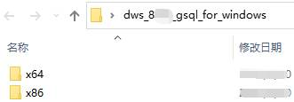
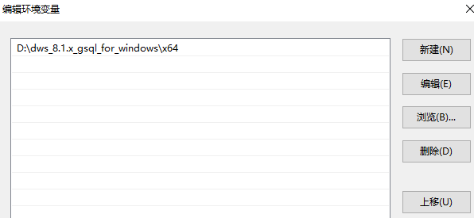

# 使用Windows gsql客户端连接集群<a name="ZH-CN_TOPIC_0000001405636914"></a>

用户在创建好数据仓库集群，开始使用集群数据库之前，需要使用数据库SQL客户端连接到数据库。GaussDB\(DWS\) 提供了与集群版本配套的Windows gsql命令行客户端工具，您可以使用Windows gsql客户端通过集群的公网地址或者内网地址访问集群。

## 操作步骤<a name="section12411851132117"></a>

1.  准备一个Windows操作系统服务器，用于安装和运行gsql客户端。Windows操作系统支持Windows Server 2008/Windows 7及以上。
2.  请参见[下载客户端](下载客户端.md)下载Windows gsql客户端，并将压缩包解压到本地文件夹中。

    **图 1**  Windows gsql客户端文件夹<a name="fig16636173273210"></a>  
    

3.  设置环境变量，32位选择x86文件夹；64位选择x64文件夹。

    方式一：命令行设置环境变量，打开电脑cmd窗口，执行set path=<window gsql\>;%path%，其中<window gsql\>为上一步骤解压Windows gsql客户端的文件夹路径。例如：

    ```
    set path=C:\Users\xx\Desktop\dws_8.1.x_gsql_for_windows\x64;%path%
    ```

    方式二：在控制面板中选择“系统-\>高级系统设置-\>高级-\>环境变量”，在系统环境变量Path中增加gsql路径。例如：

    **图 2**  设置Windows环境变量<a name="fig133013019481"></a>  
    

4.  （可选）如果要使用SSL方式连接集群，请参考[使用SSL进行安全的TCP/IP连接](使用SSL进行安全的TCP-IP连接.md)章节，在客户端主机配置SSL认证相关的参数。

    > **说明：** 
    >SSL连接方式的安全性高于非SSL方式，建议在客户端使用SSL连接方式。

5.  执行以下命令，使用gsql客户端连接GaussDB\(DWS\) 集群中的数据库。

    ```
    gsql -d <数据库名称> -h <集群地址> -U <数据库用户> -p <数据库端口> -r
    ```

    参数说明如下：

    -   “数据库名称“：输入所要连接的数据库名称。首次使用客户端连接集群时，请指定为集群的默认数据库“gaussdb“。
    -   “集群地址“：请参见[获取集群连接地址](获取集群连接地址.md)进行获取。如果通过公网地址连接，请指定为集群“公网访问域名“，如果通过内网地址连接，请指定为集群“内网访问域名“。如果通过弹性负载均衡连接，请指定为“弹性负载均衡地址“。
    -   “数据库用户“：输入集群数据库的用户名。首次使用客户端连接集群时，请指定为创建集群时设置的默认管理员用户，例如“dbadmin“。
    -   “数据库端口“：输入创建集群时设置的“数据库端口“。

    例如，执行以下命令连接GaussDB\(DWS\) 集群的默认数据库gaussdb：

    ```
    gsql -d gaussdb -h 10.168.0.74 -U dbadmin -p 8000 -W password -r
    ```

    显示如下信息表示gsql工具已经连接成功：

    ```
    gaussdb=>
    ```


## 注意事项<a name="section1524374734016"></a>

1.  Windows cmd默认的字符集是GBK，所以Windows gsql默认的client\_encoding为GBK，部分UTF-8编码的字符无法在Windows gsql中显示。

    建议：-f执行的文件使用UTF-8编码，并设置默认的编码格式为UTF-8（set client\_encoding=’utf-8’;）

2.  Windows gsql中的路径需要使用‘/’作为分隔符，否则会报错。因为在元命令中‘\\’是作为元命令开始的标志，在一般的单引号中，‘\\’起转义作用。

    ```
    gaussdb=> \i D:\test.sql
    D:: Permission denied
    postgres=> \i D:/test.sql
    id
    ----
      1
    (1 row)
    ```

3.  Windows gsql使用\\!元命令执行系统命令时，需要使用系统命令要求的路径分隔符，一般是‘\\’。

    ```
    gaussdb=> \! type D:/test.sql
    命令语法不正确。
    gaussdb=> \! type D:\test.sql
    select 1 as id;
    ```

4.  Windows gsql不支持元命令\\parallel。

    ```
    gaussdb=> \parallel
    ERROR: "\parallel" is not supported in Windows.
    ```

5.  Linux shell中可以使用单引号和双引号作为字符串边界，但在Windows必须使用双引号作为字符串边界。

    ```
    gsql -h 192.168.233.189 -p 8109 -d postgres -U odbcuser -W odbc_234 -c "select 1 as id"
     id
    ----
      1
    (1 row)
    ```

    使用单引号时报错，并忽略输入。

    ```
    gsql -h 192.168.233.189 -p 8109 -d postgres -U odbcuser -W odbc_234 -c 'select 1 as id'
    gsql: warning: extra command-line argument "1" ignored
    gsql: warning: extra command-line argument "as" ignored
    gsql: warning: extra command-line argument "id'" ignored
    ERROR:  unterminated quoted string at or near "'select"
    LINE 1: 'select
    ```

6.  Windows gsql在建立连接之后长时间未使用，连接session超时，会出现SSL报错，需要重新登录。报错如下：

    ```
    SSL SYSCALL error: Software caused connection abort (0x00002745/10053), remote datanode <NULL>, error: Result too large
    ```

7.  Windows下Ctrl+C退出gsql。在当前行输入SQL语句时，若捕获到Ctrl+C信号后，无法将状态调整到重新输入的状态，会按照当前没有输入处理，将直接退出gsql。

    在输入as后执行Ctrl+C，输出\\q后退出gsql。

    ```
    gaussdb=> select 1
    gaussdb=> as \q
    ```

8.  Windows gsql不支持连接字符集为LATIN1的数据库，报错信息为：

    ```
    gsql: FATAL: conversion between GBK and LATIN1 is not supported
    ```

9.  gsqlrc.conf文件的位置。

    默认的gsqlrc路径为%APPDATA%/postgresql/gsqlrc.conf，也可通过PSQLRC变量设置。

    ```
    set PSQLRC=C:\Users\xx\Desktop\dws_8.1.x_gsql_for_windows\x64\gsqlrc.conf
    ```


## gsql命令参考<a name="section41003216539"></a>

有关gsql的命令参考和更多信息，请参见[《数据仓库服务工具指南》](https://support.huaweicloud.com/tg-dws/dws_07_0001.html)。

