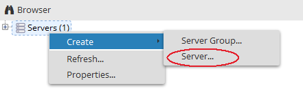
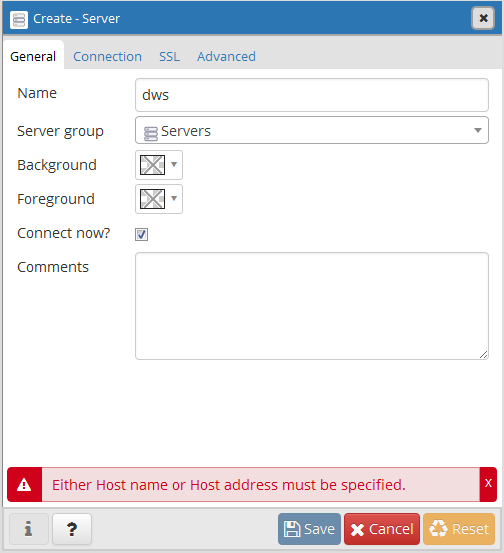
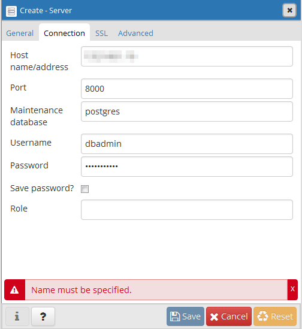
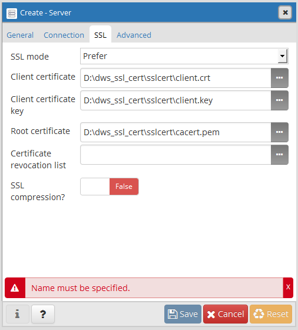
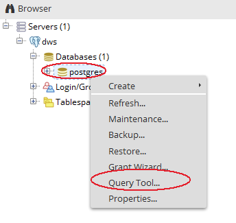
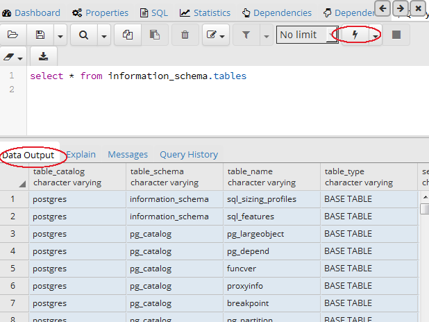

# 使用pgAdmin连接集群

pgAdmin是一款常用的开源PostgreSQL客户端工具。DWS支持的更多开源客户端工具，请参见[DWS支持的开源客户端](使用pgadmin连接集群.md#section6082040915224)。

本章节主要介绍在Windows操作系统下如何使用pgAdmin客户端连接集群。

## DWS支持的开源客户端

用户在创建好数据仓库集群，开始使用数据库服务前，需要使用数据库客户端连接到数据库。

DWS支持开源PostgreSQL客户端。

兼容的开源客户端有：

-   PostgreSQL的psql 9.2.4或更高版本

    有关使用psql的信息，请参见：[https://www.postgresql.org/](https://www.postgresql.org/)。

-   pgadmin

    有关使用pgadmin的信息，请参见：[https://www.pgadmin.org/](https://www.pgadmin.org/)

-   dbeaver

    有关使用dbeaver的信息，请参见：[https://dbeaver.jkiss.org/download/](https://dbeaver.jkiss.org/download/)。

## 连接集群前的准备

-   DWS集群已绑定弹性IP。
-   已获取DWS集群的数据库管理员用户名和密码。
-   已获取DWS集群的公网访问地址，含IP地址和端口。具体请参见[获取集群连接地址](获取集群连接地址.md)。
-   已配置DWS集群所属的安全组，添加入规则允许用户的IP地址使用TCP访问端口。

    具体步骤，请参见[《虚拟私有云用户指南》](https://support.huaweicloud.com/vpc/index.html)中“安全性 \> 安全组 \> 添加安全组规则“章节。

## 使用pgAdmin连接集群

DWS支持在互联网环境中使用pgAdmin工具连接集群中的数据库。如下操作以在Windows操作系统下使用pgAdmin客户端为例。

1.  访问如下链接下载合适的pgAdmin客户端：[https://www.pgadmin.org/download/](https://www.pgadmin.org/download/)。

    建议下载最新版本客户端，以下操作以pgAdmin 4 英文版为例。

2.  安装pgAdmin客户端。
3.  打开已安装完成的pgAdmin客户端。
4.  在左侧导航栏中，单击“Servers \> Create \> Server“。

    **图 1**  Create Server  
    

5.  在创建服务器连接窗口的“General“页签，填写“Name“。

    **图 2**  Create Server - General  
    

6.  在“Connection“页签，填写如下集群相关信息。

    -   “Host name/address“：输入集群的访问地址。请参见[获取集群连接地址](获取集群连接地址.md)，获取集群的“公网访问地址“、“公网访问域名“或“内网访问地址“、“内网访问域名“。在本例中请输入“公网访问地址“。
    -   “Port“：输入集群的端口号。
    -   “Maintenance database“：输入所要连接的数据库名称。首次使用客户端连接集群时，请指定为集群的默认数据库“postgres“。
    -   “Username“：输入集群数据库的用户名。首次使用客户端连接集群时，请指定为创建集群时设置的默认管理员用户，例如“dbadmin“。
    -   “Password“：输入对应数据库用户的密码。

    **图 3**  Create Server - Connection  
    

7.  （可选）在“SSL“页签，填写如下集群相关信息。SSL模式安全性高于普通模式，建议在客户端使用SSL模式。

    下载SSL证书，参见[下载SSL证书](下载ssl证书.md)，解压证书文件到指定路径。

    -   “SSL mode“：在下拉列表中选择SSL模式：“Allow“，“Prefer“，“Require“，“Disable“，“Verify-CA“\(DWS不支持“Verify-Full“模式\)。如果将“SSL mode“设为“Verify-CA“，则必须选择根证书。
    -   “Client certificate“：单击，选择解压目录下的“sslcert\\client.crt“文件。
    -   “Client certificate key“：单击，选择解压目录下的“sslcert\\client.key“文件。
    -   “Root certificate“：根据所选的“SSL模式“，单击，选择解压目录下的“sslcert\\cacert.pem“文件。
    -   “Certificate revocation list“：（可选）被撤销的数字证书列表。一个由认证中心废除的所有认证的时间戳组成的列表。
    -   “SSL compression“：是否启用证书压缩传送。选择“True“开启压缩传送，选择“False“不启用压缩传送。在本例中选择默认状态“False“。

        **图 4**  Create Server - SSL  
        

8.  连接配置完成后，单击“Save“。

    系统将尝试连接集群数据库，成功连接后在左侧导航栏会显示刚创建的DWS服务数据库。

9.  左侧导航栏节点开展至数据库节点，选中postgres，鼠标右键单击“Query Tool“。

    **图 5**  打开Query Tool  
    

10. 在Query Tool界面，输入如下查询命令，单击或者按F5执行命令，测试连接是否成功。

    **select \* from information\_schema.tables**

    如果连接成功，“Data Output“页签中将显示一系列记录。

    **图 6**  执行命令测试连接是否成功  
    

