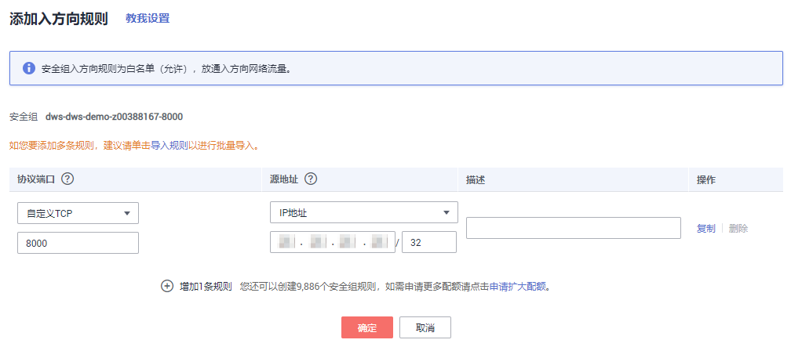

# 使用扩展应用pgAdmin4连接集群

DWS集成了扩展应用开源客户端工具pgAdmin4 Web版，用户无需下载和安装pgAdmin4工具，只要在DWS管理控制台为集群添加扩展应用，就可以使用扩展应用pgAdmin4连接集群。该特性目前正在公测中，用户可以提交工单申请公测。

通过扩展应用连接集群，只支持通过集群的内网地址或内网域名进行连接，连接时，您必须指定集群连接地址、数据库名称、端口以及数据库用户名和密码。

## 连接集群前的准备

-   已获取DWS集群的数据库名称、用户名和密码。
-   已获取DWS集群的内网访问地址（含IP地址和端口）或内网域名。具体请参见[获取集群连接地址](获取集群连接地址.md)。
-   DWS集群的安全组规则需要确保DWS能接受来自客户端的网络访问。

    请确认DWS集群的安全组中存在符合如下要求的规则，如果不存在，请在DWS集群的安全组中添加相应的规则。

    -   方向：入方向
    -   协议：必须包含TCP，例如TCP、全部。
    -   端口：设置为DWS集群提供服务的数据库端口，例如“8000”。
    -   源地址：设置的IP地址需要包含DWS客户端主机的IP地址，例如“192.168.0.10/32”。

        **图 1**  入方向的规则  
        

## 添加扩展应用

1.  通过访问以下地址登录DWS管理控制台：[https://console.huaweicloud.com/dws](https://console.huaweicloud.com/dws)。
2.  在左侧导航栏中，单击“集群管理“。

    默认显示用户所有的集群列表。

3.  在集群列表中，单击指定集群的名称，打开“扩展应用“页面。
4.  单击“添加应用“。
5.  在“添加应用“页面填写以下参数。然后勾选“已了解pgAdmin4的使用限制，了解更多...“。
    -   “应用名称“：选择要添加的扩展应用，如pgAdmin4。
    -   “应用登录账号“：设置注册的登录账号，请使用邮箱地址作为登录账号。
    -   “应用登录密码“：设置注册的登录密码。
    -   “确认密码“：再次输入密码。

        **图 2**  添加扩展应用  
        

6.  单击“确定“，在“扩展应用“页面显示系统开始创建扩展应用。

    等待约15分钟，当新添加的扩展应用的“运行状态“显示为“可用“时，表示扩展应用添加成功。

## 使用扩展应用连接集群中的数据库

1.  在“集群管理“页面中，单击指定集群的名称，打开“扩展应用“页面。
2.  单击指定扩展应用所在行的“应用访问地址“，打开pgAdmin4 Web客户端登录界面。
3.  在登录界面中分别输入添加扩展应用时设置的“应用登录账号“和“应用登录密码“。

    **图 3**  登录pgAdmin4 Web客户端  
    

4.  单击“Login“，登录到pgAdmin4 Web客户端。
5.  在左侧导航栏中，单击“Servers \> Create \> Server“。

    **图 4**  Create Server  
    

6.  在创建服务器连接窗口的“General“页签，填写“Name“。

    **图 5**  Create Server - General  
    

7.  在“Connection“页签，填写如下集群相关信息。

    -   “Host name/address“：输入集群的访问地址。请参见[获取集群连接地址](获取集群连接地址.md)，获取集群的“内网访问地址“、“内网访问域名“。在本例中请输入“内网访问地址“。
    -   “Port“：输入集群的端口号。
    -   “Maintenance database“：输入所要连接的数据库名称。首次使用客户端连接集群时，请指定为集群的默认数据库“postgres“。
    -   “Username“：输入集群数据库的用户名。首次使用客户端连接集群时，请指定为创建集群时设置的默认管理员用户，例如“dbadmin“。
    -   “Password“：输入对应数据库用户的密码。

    **图 6**  配置Connection参数  
    

8.  （可选）在“SSL“页签，填写如下集群相关信息。SSL模式安全性高于普通模式，建议在客户端使用SSL模式。

    下载SSL证书，参见[（可选）下载SSL证书](（可选）下载SSL证书.md)，解压证书文件到指定路径。

    -   “SSL mode“：在下拉列表中选择SSL模式：“Allow“，“Prefer“，“Require“，“Disable“，“Verify-CA“\(DWS不支持“Verify-Full“模式\)。如果将“SSL mode“设为“Verify-CA“，则必须选择根证书。
    -   “Client certificate“：单击，选择解压目录下的“sslcert\\client.crt“文件。
    -   “Client certificate key“：单击，选择解压目录下的“sslcert\\client.key“文件。
    -   “Root certificate“：根据所选的“SSL模式“，单击，选择解压目录下的“sslcert\\cacert.pem“文件。
    -   “Certificate revocation list“：（可选）被撤销的数字证书列表。一个由认证中心废除的所有认证的时间戳组成的列表。
    -   “SSL compression“：是否启用证书压缩传送。选择“True“开启压缩传送，选择“False“不启用压缩传送。在本例中选择默认状态“False“。

        **图 7**  Create Server - SSL  
        

9.  连接配置完成后，单击“Save“。

    系统将尝试连接集群数据库，成功连接后在左侧导航栏会显示刚创建的DWS服务数据库。

