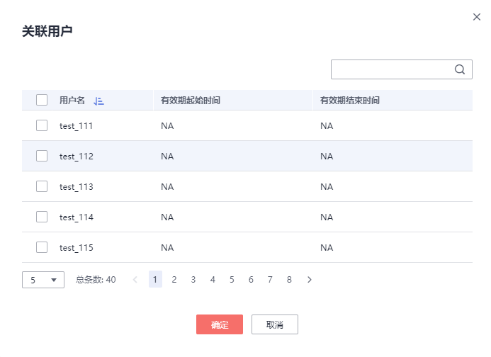

# 修改工作负载队列

在工作负载队列中，您可以对某个工作负载队列的参数进行修改。

1.  登录GaussDB\(DWS\) 管理控制台。
2.  在集群列表中单击需要访问“工作负载管理”页面的集群名称。
3.  切换至“工作负载管理”页签。
4.  在左侧“工作负载队列”中单击需要修改的队列名称，出现如下页面，包括“短查询配置”、“资源配置”、“异常规则”、“关联用户”。

    

5.  修改短查询配置。修改为相应取值，单击右侧“保存”。

    
    <table><thead align="left"><tr id="zh-cn_topic_0000001076579461_rf4055d66fedf4e67a18bbeb7fc36673d"><th class="cellrowborder" valign="top" width="19.439999999999998%" id="mcps1.1.4.1.1">
参数项

    </th>
    <th class="cellrowborder" valign="top" width="38.12%" id="mcps1.1.4.1.2">
描述

    </th>
    <th class="cellrowborder" valign="top" width="42.44%" id="mcps1.1.4.1.3">
取值

    </th>
    </tr>
    </thead>
    <tbody><tr id="zh-cn_topic_0000001076579461_r98dced66bcc84251a847d2c6b878fb71"><td class="cellrowborder" valign="top" width="19.439999999999998%" headers="mcps1.1.4.1.1 ">
短查询加速

    </td>
    <td class="cellrowborder" valign="top" width="38.12%" headers="mcps1.1.4.1.2 ">
短查询加速开关，默认打开

    </td>
    <td class="cellrowborder" valign="top" width="42.44%" headers="mcps1.1.4.1.3 ">
打开

    </td>
    </tr>
    <tr id="zh-cn_topic_0000001076579461_r3bc9f4d4300148e1818e8ee875ee3010"><td class="cellrowborder" valign="top" width="19.439999999999998%" headers="mcps1.1.4.1.1 ">
短查询并发

    </td>
    <td class="cellrowborder" valign="top" width="38.12%" headers="mcps1.1.4.1.2 ">
短查询作业为执行估算内存小于32MB的查询作业，默认值“-1”表示不管控。

    </td>
    <td class="cellrowborder" valign="top" width="42.44%" headers="mcps1.1.4.1.3 ">
10

    </td>
    </tr>
    </tbody>
    </table>

6.  修改资源配置。
    1.  单击右侧“编辑”，参见[表1](#zh-cn_topic_0000001076579461_ta522b79e7bfd48449164cef2eadd83b4)修改相应参数。

        **表 1**  工作负载队列参数

        
        <table><thead align="left"><tr id="zh-cn_topic_0000001076579461_r45c4609ae0df47bfa1bb36943077276a"><th class="cellrowborder" valign="top" width="18.28%" id="mcps1.2.4.1.1">
参数项

        </th>
        <th class="cellrowborder" valign="top" width="65.36000000000001%" id="mcps1.2.4.1.2">
描述

        </th>
        <th class="cellrowborder" valign="top" width="16.360000000000003%" id="mcps1.2.4.1.3">
取值

        </th>
        </tr>
        </thead>
        <tbody><tr id="zh-cn_topic_0000001076579461_rccecdb3f69424915b2a90ae48134b9dd"><td class="cellrowborder" valign="top" width="18.28%" headers="mcps1.2.4.1.1 ">
名称

        </td>
        <td class="cellrowborder" valign="top" width="65.36000000000001%" headers="mcps1.2.4.1.2 ">
工作负载队列的名称。

        </td>
        <td class="cellrowborder" valign="top" width="16.360000000000003%" headers="mcps1.2.4.1.3 ">
queue_test

        </td>
        </tr>
        <tr id="zh-cn_topic_0000001076579461_zh-cn_topic_0254317224_row6175638125"><td class="cellrowborder" valign="top" width="18.28%" headers="mcps1.2.4.1.1 ">
CPU资源（%）

        </td>
        <td class="cellrowborder" valign="top" width="65.36000000000001%" headers="mcps1.2.4.1.2 ">
队列中的数据库用户在执行作业时可使用的CPU时间片比例。

        </td>
        <td class="cellrowborder" valign="top" width="16.360000000000003%" headers="mcps1.2.4.1.3 ">
20

        </td>
        </tr>
        <tr id="zh-cn_topic_0000001076579461_rb9afdcb77de5450f991ad26596962299"><td class="cellrowborder" valign="top" width="18.28%" headers="mcps1.2.4.1.1 ">
内存资源（%）

        </td>
        <td class="cellrowborder" valign="top" width="65.36000000000001%" headers="mcps1.2.4.1.2 ">
队列所占用的内存百分比。

        
 注意： 

内存和查询并发支持单独管控和联合管控，联合管控时必须同时满足并发和内存要求作业才能下发。

        

        </td>
        <td class="cellrowborder" valign="top" width="16.360000000000003%" headers="mcps1.2.4.1.3 ">
20

        </td>
        </tr>
        <tr id="zh-cn_topic_0000001076579461_rfc6a58e60ad5428fa32064926e00f43f"><td class="cellrowborder" valign="top" width="18.28%" headers="mcps1.2.4.1.1 ">
储存资源（MB）

        </td>
        <td class="cellrowborder" valign="top" width="65.36000000000001%" headers="mcps1.2.4.1.2 ">
可使用的永久表空间大小。

        
 注意： 

该值是队列下所有DN的表空间总值，单DN节点可用空间=设置值 / DN节点数。

        

        </td>
        <td class="cellrowborder" valign="top" width="16.360000000000003%" headers="mcps1.2.4.1.3 ">
1024

        </td>
        </tr>
        <tr id="zh-cn_topic_0000001076579461_r1aabed4322f84ee68229882568cef559"><td class="cellrowborder" valign="top" width="18.28%" headers="mcps1.2.4.1.1 ">
查询并发

        </td>
        <td class="cellrowborder" valign="top" width="65.36000000000001%" headers="mcps1.2.4.1.2 ">
队列中的最大查询并发数。

        
 注意： 

内存和查询并发支持单独管控和联合管控，联合管控时必须同时满足并发和内存要求作业才能下发。

        

        </td>
        <td class="cellrowborder" valign="top" width="16.360000000000003%" headers="mcps1.2.4.1.3 ">
10

        </td>
        </tr>
        </tbody>
        </table>

    2.  单击“确定”。

7.  修改异常规则。
    1.  参见[表2](#zh-cn_topic_0000001076579461_td5051ec72c7e48ae9c996ef77489b2db)修改相应参数。

        > **说明：** 
        >异常规则允许您对队列中用户执行的作业做异常控制，目前支持[表2](#zh-cn_topic_0000001076579461_td5051ec72c7e48ae9c996ef77489b2db)的相关配置。
        >-   如选择“终止”，则需要设置相应时间或百分比。
        >-   如选择“不约束”，则无异常规则约束。

        **表 2**  异常规则参数

        
        <table><thead align="left"><tr id="zh-cn_topic_0000001076579461_rb7a406162401464e980e665118974ef6"><th class="cellrowborder" valign="top" width="32.54325432543255%" id="mcps1.2.4.1.1">
参数项

        </th>
        <th class="cellrowborder" valign="top" width="45.25452545254526%" id="mcps1.2.4.1.2">
描述

        </th>
        <th class="cellrowborder" valign="top" width="22.202220222022202%" id="mcps1.2.4.1.3">
取值

        </th>
        </tr>
        </thead>
        <tbody><tr id="zh-cn_topic_0000001076579461_rfb3c0b2a5d2d40f19e43b595c0a4bcf0"><td class="cellrowborder" valign="top" width="32.54325432543255%" headers="mcps1.2.4.1.1 ">
阻塞时间

        </td>
        <td class="cellrowborder" valign="top" width="45.25452545254526%" headers="mcps1.2.4.1.2 ">
作业的阻塞时间，单位秒。包括全局并发排队以及局部并发排队的总时间。

        
例如，如果配置“阻塞时间”为300秒，那么当该队列中的用户执行的某个作业在阻塞300秒后将会被杀死。

        </td>
        <td class="cellrowborder" valign="top" width="22.202220222022202%" headers="mcps1.2.4.1.3 ">
1200

        </td>
        </tr>
        <tr id="zh-cn_topic_0000001076579461_r131d522c52544483aed16ff1c9efd4e2"><td class="cellrowborder" valign="top" width="32.54325432543255%" headers="mcps1.2.4.1.1 ">
执行所消耗时间

        </td>
        <td class="cellrowborder" valign="top" width="45.25452545254526%" headers="mcps1.2.4.1.2 ">
作业的已被执行时间，单位秒。从开始执行到当前所消耗的时间。

        
例如，如果配置“执行所消耗时间”为100秒，那么当该队列中的用户执行的某个作业在执行超过100秒后将被杀死。

        </td>
        <td class="cellrowborder" valign="top" width="22.202220222022202%" headers="mcps1.2.4.1.3 ">
2400

        </td>
        </tr>
        <tr id="zh-cn_topic_0000001076579461_rb7ab3e319e2346968eaff5edb94cfe8d"><td class="cellrowborder" valign="top" width="32.54325432543255%" headers="mcps1.2.4.1.1 ">
所有DN上CPU总时间

        </td>
        <td class="cellrowborder" valign="top" width="45.25452545254526%" headers="mcps1.2.4.1.2 ">
作业在所有DN上执行时所耗费的CPU总时间，单位秒。

        </td>
        <td class="cellrowborder" valign="top" width="22.202220222022202%" headers="mcps1.2.4.1.3 ">
100

        </td>
        </tr>
        <tr id="zh-cn_topic_0000001076579461_rf6b27522669b485aafeef05749e9445e"><td class="cellrowborder" valign="top" width="32.54325432543255%" headers="mcps1.2.4.1.1 ">
检查倾斜率的时间间隔

        </td>
        <td class="cellrowborder" valign="top" width="45.25452545254526%" headers="mcps1.2.4.1.2 ">
检查作业执行CPU倾斜率的间隔时间，单位秒，需同“所有DN上CPU时间的倾斜率”一起设置。

        </td>
        <td class="cellrowborder" valign="top" width="22.202220222022202%" headers="mcps1.2.4.1.3 ">
2400

        </td>
        </tr>
        <tr id="zh-cn_topic_0000001076579461_r4f30da48347e4439b90793b61b05cc8d"><td class="cellrowborder" valign="top" width="32.54325432543255%" headers="mcps1.2.4.1.1 ">
所有DN上CPU总时间倾斜率

        </td>
        <td class="cellrowborder" valign="top" width="45.25452545254526%" headers="mcps1.2.4.1.2 ">
作业在DN上执行时的CPU时间的倾斜率，依赖于“检查倾斜率的时间间隔”的设置。

        </td>
        <td class="cellrowborder" valign="top" width="22.202220222022202%" headers="mcps1.2.4.1.3 ">
90

        </td>
        </tr>
        </tbody>
        </table>

    2.  单击“保存”。

8.  关联用户。

    > **说明：** 
    >-   一个数据库用户只有被添加到某个队列中之后，该用户运行作业所使用的资源才能被管控。
    >-   一个数据库用户只能被添加至一个队列中，从队列中移除的用户可以再次添加至其他队列。
    >-   管理员用户不可关联。

    1.  单击右侧“添加”。
    2.  从当前用户列表中，勾选需要添加的用户，一次可勾选多个。

        

    3.  单击“确定”。
    4.  如果需要删除用户，则单击待删除用户所在行右边的“删除”即可。

