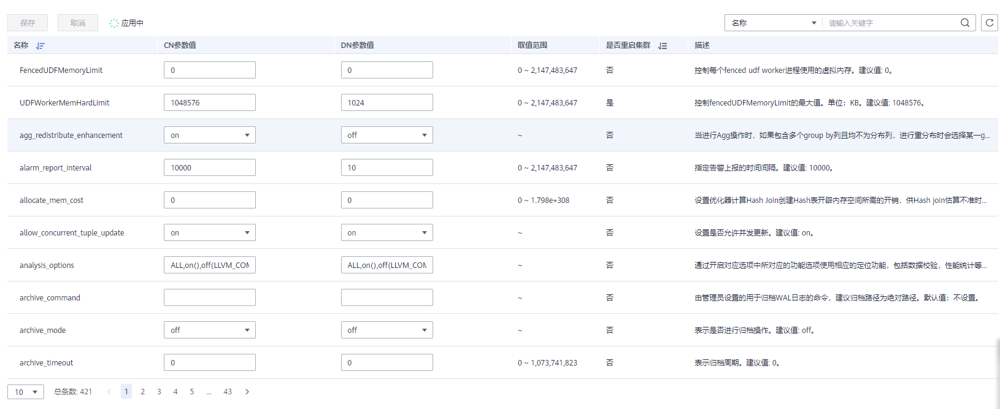
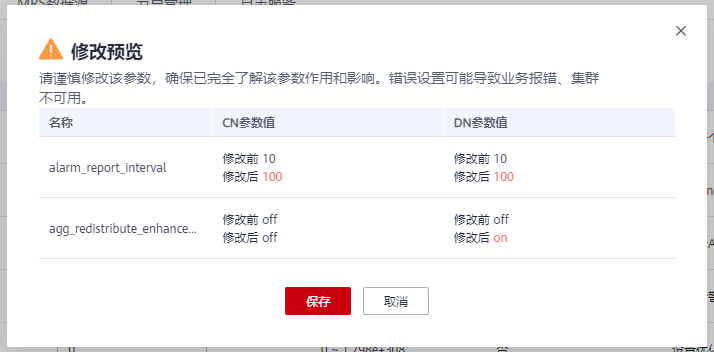

# 修改数据库参数

集群创建成功后，用户可以根据实际需要修改集群的数据库参数。在GaussDB\(DWS\) 管理控制台，您可以查看或设置一些常用的数据库参数，详情请参见[操作步骤](#section10522114017574)。如需查看或设置其他数据库参数，您可以通过SQL命令的方式，详情请参见[配置GUC参数](https://support.huaweicloud.com/devg-dws/dws_04_0885.html)。

## 前提条件

只有当集群无运行中的任务时，才能修改参数。

## 操作步骤

1.  登录GaussDB\(DWS\) 管理控制台。
2.  在左侧导航栏中，单击“集群管理“。
3.  在集群列表中找到所需要的集群，单击集群名称，进入“集群详情“页面。
4.  单击“参数修改“页签，修改相应的参数值，然后单击“保存“。

    

    

5.  在“修改预览“窗口，确认修改无误后，单击“保存“。
6.  用户可根据修改参数所在行的“是否重启集群”列，判断集群是否进行重启操作。

    

    > **说明：** 
    >-   若修改参数无需进行重启集群操作，则参数修改后立即生效。
    >-   若修改参数需进行重启集群操作，参数修改任务下发成功后页面显示修改后的参数值，待集群重启成功后修改的参数值生效；同时集群状态会显示”待重启”并禁用部分运维操作，重启集群后状态会恢复正常。

## 参数说明

由于数据库参数较多，下表仅显示部分参数说明，用户可在控制台集群参数修改页面搜索查看，操作详情请参见[操作步骤](#section10522114017574)。

> **说明：** 
>以下参数默认值仅为参考值，具体与当前集群版本有关。详情请参见《数据仓库服务开发指南》的[GUC参数](https://support.huaweicloud.com/devg-dws/dws_04_0883.html)章节。

**表 1**  参数说明

<table><thead align="left"><tr id="row92716201567"><th class="cellrowborder" valign="top" width="24.752475247524753%" id="mcps1.2.4.1.1">
<strong id="b192968471772">参数名称</strong>

</th>
<th class="cellrowborder" valign="top" width="57.821782178217816%" id="mcps1.2.4.1.2">
<strong id="b6296747077">参数描述</strong>

</th>
<th class="cellrowborder" valign="top" width="17.425742574257423%" id="mcps1.2.4.1.3">
<strong id="b429614479717">默认值</strong>

</th>
</tr>
</thead>
<tbody><tr id="row1632012371100"><td class="cellrowborder" valign="top" width="24.752475247524753%" headers="mcps1.2.4.1.1 ">
session_timeout

</td>
<td class="cellrowborder" valign="top" width="57.821782178217816%" headers="mcps1.2.4.1.2 ">
Session闲置超时时间，单位为秒，0表示关闭超时限制。取值范围：0 ~ 86400。

</td>
<td class="cellrowborder" valign="top" width="17.425742574257423%" headers="mcps1.2.4.1.3 ">
600

</td>
</tr>
<tr id="row7775151941619"><td class="cellrowborder" valign="top" width="24.752475247524753%" headers="mcps1.2.4.1.1 ">
datestyle

</td>
<td class="cellrowborder" valign="top" width="57.821782178217816%" headers="mcps1.2.4.1.2 ">
设置日期和时间值的显示格式。

</td>
<td class="cellrowborder" valign="top" width="17.425742574257423%" headers="mcps1.2.4.1.3 ">
ISO,MDY

</td>
</tr>
<tr id="row82351014638"><td class="cellrowborder" valign="top" width="24.752475247524753%" headers="mcps1.2.4.1.1 ">
failed_login_attempts

</td>
<td class="cellrowborder" valign="top" width="57.821782178217816%" headers="mcps1.2.4.1.2 ">
输入密码错误的次数达到该参数所设置的值时，帐户将会被自动锁定。配置为0时表示不限制密码输入错误的次数。取值范围：0 ~ 1000。

</td>
<td class="cellrowborder" valign="top" width="17.425742574257423%" headers="mcps1.2.4.1.3 ">
10

</td>
</tr>
<tr id="row19369518336"><td class="cellrowborder" valign="top" width="24.752475247524753%" headers="mcps1.2.4.1.1 ">
timezone

</td>
<td class="cellrowborder" valign="top" width="57.821782178217816%" headers="mcps1.2.4.1.2 ">
设置显示和解释时间类型数值时使用的时区。

</td>
<td class="cellrowborder" valign="top" width="17.425742574257423%" headers="mcps1.2.4.1.3 ">
UTC

</td>
</tr>
<tr id="row12638592033"><td class="cellrowborder" valign="top" width="24.752475247524753%" headers="mcps1.2.4.1.1 ">
log_timezone

</td>
<td class="cellrowborder" valign="top" width="57.821782178217816%" headers="mcps1.2.4.1.2 ">
设置服务器写日志文件时使用的时区。

</td>
<td class="cellrowborder" valign="top" width="17.425742574257423%" headers="mcps1.2.4.1.3 ">
UTC

</td>
</tr>
<tr id="row25788021713"><td class="cellrowborder" valign="top" width="24.752475247524753%" headers="mcps1.2.4.1.1 ">
enable_resource_record

</td>
<td class="cellrowborder" valign="top" width="57.821782178217816%" headers="mcps1.2.4.1.2 ">
设置是否开启资源记录功能。

当SQL语句实际执行时间大于resource_track_duration参数值（默认为60s，可自行设置）时，监控信息将会归档。

此功能开启后会引起存储空间膨胀及轻微性能影响，不用时请关闭。

 说明： 
<ul id="ul1659251813173"><li>归档：监控信息保存在history视图，归档在info表。归档时间为三分钟，归档后history视图中的记录会被清除。</li><li>history视图GS_WLM_SESSION_HISTORY，对应存入info表GS_WLM_SESSION_INFO。</li><li>history视图GS_WLM_OPERATOR_HISTORY，对应存入info表GS_WLM_OPERATOR_INFO。</li></ul>

</td>
<td class="cellrowborder" valign="top" width="17.425742574257423%" headers="mcps1.2.4.1.3 ">
off

</td>
</tr>
<tr id="row9271201464"><td class="cellrowborder" valign="top" width="24.752475247524753%" headers="mcps1.2.4.1.1 ">
query_dop

</td>
<td class="cellrowborder" valign="top" width="57.821782178217816%" headers="mcps1.2.4.1.2 ">
用户自定义的查询并行度。

<ul id="ul89106417554"><li>配置为0表示查询并行度自适应。</li><li>配置为1表示查询不并行。</li><li>配置为2表示查询并行度为2。</li></ul>
</td>
<td class="cellrowborder" valign="top" width="17.425742574257423%" headers="mcps1.2.4.1.3 ">
0

</td>
</tr>
<tr id="row6271820468"><td class="cellrowborder" valign="top" width="24.752475247524753%" headers="mcps1.2.4.1.1 ">
resource_track_cost

</td>
<td class="cellrowborder" valign="top" width="57.821782178217816%" headers="mcps1.2.4.1.2 ">
设置对语句进行资源监控的最小执行代价。值为-1或者执行语句代价小于10时，不进行资源监控。值大于等于0时，执行语句的代价大于等于10并且超过这个参数的设定值就会进行资源监控。

SQL语句的预估执行代价可通过执行SQL命令Explain进行查询。

</td>
<td class="cellrowborder" valign="top" width="17.425742574257423%" headers="mcps1.2.4.1.3 ">
100000

</td>
</tr>
<tr id="row24934861917"><td class="cellrowborder" valign="top" width="24.752475247524753%" headers="mcps1.2.4.1.1 ">
resource_track_duration

</td>
<td class="cellrowborder" valign="top" width="57.821782178217816%" headers="mcps1.2.4.1.2 ">
设置当前会话资源监控实时视图中记录的语句执行结束后进行归档的最小执行时间，单位为秒。

<ul id="ul295922416142"><li>值为0时，资源监控实时视图中记录的所有语句都会进行历史信息归档。</li><li>值大于0时，资源监控实时视图中记录的语句的执行时间超过设定值就会进行历史信息归档。</li></ul>
</td>
<td class="cellrowborder" valign="top" width="17.425742574257423%" headers="mcps1.2.4.1.3 ">
60

</td>
</tr>
<tr id="row129915481845"><td class="cellrowborder" valign="top" width="24.752475247524753%" headers="mcps1.2.4.1.1 ">
password_effect_time

</td>
<td class="cellrowborder" valign="top" width="57.821782178217816%" headers="mcps1.2.4.1.2 ">
设置帐户密码的有效时间，临近或超过有效期系统会提示用户修改密码。

取值范围为0 ~999，单位为天。设置为0表示不开启有效期限制功能。

</td>
<td class="cellrowborder" valign="top" width="17.425742574257423%" headers="mcps1.2.4.1.3 ">
90

</td>
</tr>
<tr id="row157152131359"><td class="cellrowborder" valign="top" width="24.752475247524753%" headers="mcps1.2.4.1.1 ">
update_lockwait_timeout

</td>
<td class="cellrowborder" valign="top" width="57.821782178217816%" headers="mcps1.2.4.1.2 ">
该参数控制并发更新同一行时单个锁的最长等待时间。当申请的锁等待时间超过设定值时，系统会报错。0表示不等待，有锁时直接报错，单位为毫秒。

</td>
<td class="cellrowborder" valign="top" width="17.425742574257423%" headers="mcps1.2.4.1.3 ">
120000

</td>
</tr>
<tr id="row166561350135913"><td class="cellrowborder" valign="top" width="24.752475247524753%" headers="mcps1.2.4.1.1 ">
enable_resource_track

</td>
<td class="cellrowborder" valign="top" width="57.821782178217816%" headers="mcps1.2.4.1.2 ">
设置是否开启资源监控功能。开启后可以对SQL语句进行监控。

</td>
<td class="cellrowborder" valign="top" width="17.425742574257423%" headers="mcps1.2.4.1.3 ">
on

</td>
</tr>
<tr id="row2981103432718"><td class="cellrowborder" valign="top" width="24.752475247524753%" headers="mcps1.2.4.1.1 ">
password_policy

</td>
<td class="cellrowborder" valign="top" width="57.821782178217816%" headers="mcps1.2.4.1.2 ">
使用CREATE ROLE/USER命令创建或ALTER ROLE/USER命令修改GaussDB(DWS)帐户时，该参数决定是否进行密码复杂度检查。

<ul id="ul1094871714136"><li>0表示不采用任何密码复杂度策略。</li><li>1表示采用默认密码复杂度校验策略。</li></ul>
</td>
<td class="cellrowborder" valign="top" width="17.425742574257423%" headers="mcps1.2.4.1.3 ">
1

</td>
</tr>
<tr id="row57721813154619"><td class="cellrowborder" valign="top" width="24.752475247524753%" headers="mcps1.2.4.1.1 ">
password_reuse_time

</td>
<td class="cellrowborder" valign="top" width="57.821782178217816%" headers="mcps1.2.4.1.2 ">
在使用ALTER USER或ALTER ROLE修改用户密码时，该参数指定是否对新密码进行可重用天数检查。取值范围：0~3650，单位为天。

<ul id="ul28651948171910"><li>0表示不检查密码可重用天数。</li><li>正数表示新密码不能为该值指定的天数内使用过的密码。</li></ul>

 说明： 

修改密码时会检查配置参数password_reuse_time和password_reuse_max。

<ul id="ul4228143112815"><li>password_reuse_time和password_reuse_max只要满足其中任一个为正数时，即认为密码可重用。</li><li>password_reuse_time为0时，表示不限制密码重用天数，仅限制密码重用次数。</li><li>password_reuse_time和password_reuse_max都为0时，表示不对密码重用进行限制。</li></ul>

</td>
<td class="cellrowborder" valign="top" width="17.425742574257423%" headers="mcps1.2.4.1.3 ">
60

</td>
</tr>
<tr id="row97271944174914"><td class="cellrowborder" valign="top" width="24.752475247524753%" headers="mcps1.2.4.1.1 ">
password_reuse_max

</td>
<td class="cellrowborder" valign="top" width="57.821782178217816%" headers="mcps1.2.4.1.2 ">
在使用ALTER USER或ALTER ROLE修改用户密码时，该参数指定是否对新密码进行可重用次数检查。

<ul id="ul18616194719292"><li>0表示不检查密码可重用次数。</li><li>正整数表示新密码不能为该值指定的次数内使用过的密码。</li></ul>

 说明： 

修改密码时会检查配置参数password_reuse_time和password_reuse_max。

<ul id="ul46669653116"><li>password_reuse_time和password_reuse_max只要满足其中任一个为正数时，即认为密码可重用。</li><li>password_reuse_max为0时，表示不限制密码重用次数，仅限制密码重用天数。</li><li>password_reuse_time和password_reuse_max都为0时，表示不对密码重用进行限制。</li></ul>

</td>
<td class="cellrowborder" valign="top" width="17.425742574257423%" headers="mcps1.2.4.1.3 ">
0

</td>
</tr>
<tr id="row20706918532"><td class="cellrowborder" valign="top" width="24.752475247524753%" headers="mcps1.2.4.1.1 ">
password_lock_time

</td>
<td class="cellrowborder" valign="top" width="57.821782178217816%" headers="mcps1.2.4.1.2 ">
该参数指定帐户被锁定后自动解锁的时间。

<ul id="ul1361613462329"><li>0表示密码验证失败时，自动锁定功能不生效。</li><li>正数表示帐户被锁定后，当锁定时间超过该参数设定的值时，帐户将会被自行解锁。</li></ul>
</td>
<td class="cellrowborder" valign="top" width="17.425742574257423%" headers="mcps1.2.4.1.3 ">
1

</td>
</tr>
<tr id="row244112281005"><td class="cellrowborder" valign="top" width="24.752475247524753%" headers="mcps1.2.4.1.1 ">
password_encryption_type

</td>
<td class="cellrowborder" valign="top" width="57.821782178217816%" headers="mcps1.2.4.1.2 ">
该字段决定采用何种加密方式对用户密码进行加密存储。

<ul id="ul7436440173516"><li>0表示采用md5方式对密码加密。</li><li>1表示采用sha256方式对密码加密，兼容postgres客户端的md5用户认证方式。</li><li>2表示采用sha256方式对密码加密。md5为不安全的加密算法，不建议用户使用。</li></ul>
</td>
<td class="cellrowborder" valign="top" width="17.425742574257423%" headers="mcps1.2.4.1.3 ">
2

</td>
</tr>
<tr id="row18401124514518"><td class="cellrowborder" valign="top" width="24.752475247524753%" headers="mcps1.2.4.1.1 ">
password_notify_time

</td>
<td class="cellrowborder" valign="top" width="57.821782178217816%" headers="mcps1.2.4.1.2 ">
该字段决定帐户密码到期前提醒的天数。

<ul id="ul99138299375"><li>0表示不开启提醒功能。</li><li>1~999表示帐户密码到期前提醒的天数。</li></ul>
</td>
<td class="cellrowborder" valign="top" width="17.425742574257423%" headers="mcps1.2.4.1.3 ">
7

</td>
</tr>
<tr id="row15722204114610"><td class="cellrowborder" valign="top" width="24.752475247524753%" headers="mcps1.2.4.1.1 ">
enable_stateless_pooler_reuse

</td>
<td class="cellrowborder" valign="top" width="57.821782178217816%" headers="mcps1.2.4.1.2 ">
pooler复用切换开关，重启集群生效。

<ul id="ul194517344012"><li>on表示使用pooler复用模式。</li><li>off表示关闭pooler复用模式。</li></ul>

 说明： 

CN和DN需要同步设置。如果CN设置为off，DN设置为on时会导致集群不能正常通信，因此必须对该参数做CN和DN全局相同的配置，重启集群才会生效。

</td>
<td class="cellrowborder" valign="top" width="17.425742574257423%" headers="mcps1.2.4.1.3 ">
off

</td>
</tr>
<tr id="row199878017108"><td class="cellrowborder" valign="top" width="24.752475247524753%" headers="mcps1.2.4.1.1 ">
work_mem

</td>
<td class="cellrowborder" valign="top" width="57.821782178217816%" headers="mcps1.2.4.1.2 ">
设置内部排序操作和Hash表在开始写入临时磁盘文件之前使用的内存大小，单位为KB。

ORDER BY，DISTINCT和merge joins都要用到排序操作。

Hash表在散列连接、散列为基础的聚集、散列为基础的IN子查询处理中都要用到。

对于复杂的查询，可能会同时并发运行好几个排序或者散列操作，每个都可以使用此参数所声明的内存量，不足时会使用临时文件。同样，好几个正在运行的会话可能会同时进行排序操作。因此使用的总内存可能是work_mem的好几倍。

</td>
<td class="cellrowborder" valign="top" width="17.425742574257423%" headers="mcps1.2.4.1.3 ">
64MB

</td>
</tr>
<tr id="row1268601512132"><td class="cellrowborder" valign="top" width="24.752475247524753%" headers="mcps1.2.4.1.1 ">
maintenance_work_mem

</td>
<td class="cellrowborder" valign="top" width="57.821782178217816%" headers="mcps1.2.4.1.2 ">
设置在维护性操作（比如VACUUM、CREATE INDEX、ALTER TABLE ADD FOREIGN KEY等中可使用的最大的内存，单位为KB。

 说明： 

该参数的设置会影响VACUUM、VACUUMFULL、CLUSTER、CREATE INDEX的执行效率。

</td>
<td class="cellrowborder" valign="top" width="17.425742574257423%" headers="mcps1.2.4.1.3 ">
128MB

</td>
</tr>
<tr id="row925355615311"><td class="cellrowborder" valign="top" width="24.752475247524753%" headers="mcps1.2.4.1.1 ">
enable_orc_cache

</td>
<td class="cellrowborder" valign="top" width="57.821782178217816%" headers="mcps1.2.4.1.2 ">
设置是否允许在初始化cstore_buffers时，将1/4的cstore_buffers空间预留，用于缓存orc元数据。

<ul id="ul415615291316"><li>on表示开启缓存orc元数据，可提升hdfs表的查询性能，但是会占用列存buffer资源，导致列存性能下降。</li><li>off表示关闭缓存orc元数据。</li></ul>
</td>
<td class="cellrowborder" valign="top" width="17.425742574257423%" headers="mcps1.2.4.1.3 ">
on

</td>
</tr>
<tr id="row27207121190"><td class="cellrowborder" valign="top" width="24.752475247524753%" headers="mcps1.2.4.1.1 ">
sql_use_spacelimit

</td>
<td class="cellrowborder" valign="top" width="57.821782178217816%" headers="mcps1.2.4.1.2 ">
限制单个SQL在单个DN上，触发落盘操作时，落盘文件的空间大小，管控的空间包括普通表、临时表及中间结果集落盘占用的空间，单位为KB。其中-1表示没有限制。

</td>
<td class="cellrowborder" valign="top" width="17.425742574257423%" headers="mcps1.2.4.1.3 ">
-1

</td>
</tr>
<tr id="row434631915916"><td class="cellrowborder" valign="top" width="24.752475247524753%" headers="mcps1.2.4.1.1 ">
enable_bitmapscan

</td>
<td class="cellrowborder" valign="top" width="57.821782178217816%" headers="mcps1.2.4.1.2 ">
控制优化器对位图扫描规划类型的使用。

<ul id="ul1592617422028"><li>on表示使用。</li><li>off表示不使用。</li></ul>
</td>
<td class="cellrowborder" valign="top" width="17.425742574257423%" headers="mcps1.2.4.1.3 ">
on

</td>
</tr>
<tr id="row1634617191696"><td class="cellrowborder" valign="top" width="24.752475247524753%" headers="mcps1.2.4.1.1 ">
enable_hashagg

</td>
<td class="cellrowborder" valign="top" width="57.821782178217816%" headers="mcps1.2.4.1.2 ">
控制优化器对Hash聚集规划类型的使用。

<ul id="ul1533474712218"><li>on表示使用。</li><li>off表示不使用。</li></ul>
</td>
<td class="cellrowborder" valign="top" width="17.425742574257423%" headers="mcps1.2.4.1.3 ">
on

</td>
</tr>
<tr id="row1655418267919"><td class="cellrowborder" valign="top" width="24.752475247524753%" headers="mcps1.2.4.1.1 ">
enable_hashjoin

</td>
<td class="cellrowborder" valign="top" width="57.821782178217816%" headers="mcps1.2.4.1.2 ">
控制优化器对Hash连接规划类型的使用。

<ul id="ul973515522022"><li>on表示使用。</li><li>off表示不使用。</li></ul>
</td>
<td class="cellrowborder" valign="top" width="17.425742574257423%" headers="mcps1.2.4.1.3 ">
on

</td>
</tr>
<tr id="row17554126692"><td class="cellrowborder" valign="top" width="24.752475247524753%" headers="mcps1.2.4.1.1 ">
enable_indexscan

</td>
<td class="cellrowborder" valign="top" width="57.821782178217816%" headers="mcps1.2.4.1.2 ">
控制优化器对索引扫描规划类型的使用。

<ul id="ul159021923439"><li>on表示使用。</li><li>off表示不使用。</li></ul>
</td>
<td class="cellrowborder" valign="top" width="17.425742574257423%" headers="mcps1.2.4.1.3 ">
on

</td>
</tr>
<tr id="row135541261092"><td class="cellrowborder" valign="top" width="24.752475247524753%" headers="mcps1.2.4.1.1 ">
enable_indexonlyscan

</td>
<td class="cellrowborder" valign="top" width="57.821782178217816%" headers="mcps1.2.4.1.2 ">
控制优化器对仅索引扫描规划类型的使用。

<ul id="ul229616292313"><li>on表示使用。</li><li>off表示不使用。</li></ul>
</td>
<td class="cellrowborder" valign="top" width="17.425742574257423%" headers="mcps1.2.4.1.3 ">
on

</td>
</tr>
<tr id="row1943633314918"><td class="cellrowborder" valign="top" width="24.752475247524753%" headers="mcps1.2.4.1.1 ">
enable_mergejoin

</td>
<td class="cellrowborder" valign="top" width="57.821782178217816%" headers="mcps1.2.4.1.2 ">
控制优化器对融合连接规划类型的使用。

<ul id="ul145047348319"><li>on表示使用。</li><li>off表示不使用。</li></ul>
</td>
<td class="cellrowborder" valign="top" width="17.425742574257423%" headers="mcps1.2.4.1.3 ">
off

</td>
</tr>
<tr id="row1143653310916"><td class="cellrowborder" valign="top" width="24.752475247524753%" headers="mcps1.2.4.1.1 ">
enable_nestloop

</td>
<td class="cellrowborder" valign="top" width="57.821782178217816%" headers="mcps1.2.4.1.2 ">
控制优化器对内表全表扫描嵌套循环连接规划类型的使用。虽然不能完全消除嵌套循环连接，但关闭该参数会使优化器在存在其他方法的时候优先选择其他方法。

<ul id="ul19721224611"><li>on表示使用。</li><li>off表示不使用。</li></ul>
</td>
<td class="cellrowborder" valign="top" width="17.425742574257423%" headers="mcps1.2.4.1.3 ">
off

</td>
</tr>
<tr id="row174366333914"><td class="cellrowborder" valign="top" width="24.752475247524753%" headers="mcps1.2.4.1.1 ">
enable_seqscan

</td>
<td class="cellrowborder" valign="top" width="57.821782178217816%" headers="mcps1.2.4.1.2 ">
控制优化器对顺序扫描规划类型的使用。虽然不能完全消除顺序扫描，但关闭该参数会让优化器在存在其他方法的时候优先选择其他方法。

<ul id="ul881210388815"><li>on表示使用。</li><li>off表示不使用。</li></ul>
</td>
<td class="cellrowborder" valign="top" width="17.425742574257423%" headers="mcps1.2.4.1.3 ">
on

</td>
</tr>
<tr id="row1943619333910"><td class="cellrowborder" valign="top" width="24.752475247524753%" headers="mcps1.2.4.1.1 ">
enable_tidscan

</td>
<td class="cellrowborder" valign="top" width="57.821782178217816%" headers="mcps1.2.4.1.2 ">
控制优化器对TID扫描规划类型的使用。

<ul id="ul1699719481881"><li>on表示使用。</li><li>off表示不使用。</li></ul>
</td>
<td class="cellrowborder" valign="top" width="17.425742574257423%" headers="mcps1.2.4.1.3 ">
on

</td>
</tr>
<tr id="row24362033994"><td class="cellrowborder" valign="top" width="24.752475247524753%" headers="mcps1.2.4.1.1 ">
enable_kill_query

</td>
<td class="cellrowborder" valign="top" width="57.821782178217816%" headers="mcps1.2.4.1.2 ">
CASCADE模式删除用户时，会删除此用户拥有的所有对象。此参数标识是否允许在删除用户的时候，取消锁定此用户所属对象的query。

<ul id="ul4566833392"><li>on表示允许取消锁定。</li><li>off表示不允许取消锁定。</li></ul>
</td>
<td class="cellrowborder" valign="top" width="17.425742574257423%" headers="mcps1.2.4.1.3 ">
off

</td>
</tr>
<tr id="row194361233192"><td class="cellrowborder" valign="top" width="24.752475247524753%" headers="mcps1.2.4.1.1 ">
enable_vector_engine

</td>
<td class="cellrowborder" valign="top" width="57.821782178217816%" headers="mcps1.2.4.1.2 ">
控制优化器对向量化执行引擎的使用。

<ul id="ul1747611361013"><li>on表示使用。</li><li>off表示不使用。</li></ul>
</td>
<td class="cellrowborder" valign="top" width="17.425742574257423%" headers="mcps1.2.4.1.3 ">
on

</td>
</tr>
<tr id="row114061046195511"><td class="cellrowborder" valign="top" width="24.752475247524753%" headers="mcps1.2.4.1.1 ">
enable_broadcast

</td>
<td class="cellrowborder" valign="top" width="57.821782178217816%" headers="mcps1.2.4.1.2 ">
控制优化器对stream代价估算时对broadcast分布方式的使用。

<ul id="ul13448183010102"><li>on表示使用。</li><li>off表示不使用。</li></ul>
</td>
<td class="cellrowborder" valign="top" width="17.425742574257423%" headers="mcps1.2.4.1.3 ">
on

</td>
</tr>
<tr id="row23347565116"><td class="cellrowborder" valign="top" width="24.752475247524753%" headers="mcps1.2.4.1.1 ">
skew_option

</td>
<td class="cellrowborder" valign="top" width="57.821782178217816%" headers="mcps1.2.4.1.2 ">
控制是否使用优化策略。

<ul id="ul713181131113"><li>off：关闭策略。</li><li>normal：采用激进策略。对于不确定是否出现倾斜的场景，认为存在倾斜，并进行相应优化。</li><li>lazy：采用保守策略。对于不确定是否出现倾斜场景，认为不存在倾斜，不进行优化。</li></ul>
</td>
<td class="cellrowborder" valign="top" width="17.425742574257423%" headers="mcps1.2.4.1.3 ">
normal

</td>
</tr>
<tr id="row1042611517115"><td class="cellrowborder" valign="top" width="24.752475247524753%" headers="mcps1.2.4.1.1 ">
default_statistics_target

</td>
<td class="cellrowborder" valign="top" width="57.821782178217816%" headers="mcps1.2.4.1.2 ">
为没有用ALTER TABLE SET STATISTICS设置字段目标的表设置缺省统计目标。此参数设置为正数是代表统计信息的样本数量，为负数时，代表使用百分比的形式设置统计目标，负数转换为对应的百分比，即-5代表5%。

</td>
<td class="cellrowborder" valign="top" width="17.425742574257423%" headers="mcps1.2.4.1.3 ">
100

</td>
</tr>
<tr id="row13471645101111"><td class="cellrowborder" valign="top" width="24.752475247524753%" headers="mcps1.2.4.1.1 ">
enable_codegen

</td>
<td class="cellrowborder" valign="top" width="57.821782178217816%" headers="mcps1.2.4.1.2 ">
标识是否允许开启代码生成优化，目前代码生成使用的是LLVM优化。

<ul id="ul9247123101117"><li>on表示允许开启代码生成优化。</li><li>off表示不允许开启代码生成优化。</li></ul>
</td>
<td class="cellrowborder" valign="top" width="17.425742574257423%" headers="mcps1.2.4.1.3 ">
on

</td>
</tr>
<tr id="row62960389323"><td class="cellrowborder" valign="top" width="24.752475247524753%" headers="mcps1.2.4.1.1 ">
autoanalyze

</td>
<td class="cellrowborder" valign="top" width="57.821782178217816%" headers="mcps1.2.4.1.2 ">
标识是否允许在生成计划的时候，对于没有统计信息的表进行统计信息自动收集。

<ul id="ul743610406122"><li>on表示允许自动进行统计信息收集。</li><li>off表示不允许自动进行统计信息收集。</li></ul>

 说明： 
<ul id="ul3421823131313"><li>当前不支持对外表触发autoanalyze，如需收集，需用户手动执行analyze操作。</li><li>不支持对带有ON COMMIT [DELETE ROWS|DROP]选项的临时表触发autoanalyze，如需收集，需用户手动执行analyze操作。</li><li>如果在autoanalyze某个表的过程中数据库发生异常，当数据库正常运行之后再执行语句有可能仍提示需要收集此表的统计信息。此时需要用户对该表手动执行一次analyze操作，以同步统计信息数据。</li></ul>

</td>
<td class="cellrowborder" valign="top" width="17.425742574257423%" headers="mcps1.2.4.1.3 ">
off

</td>
</tr>
<tr id="row1199223283213"><td class="cellrowborder" valign="top" width="24.752475247524753%" headers="mcps1.2.4.1.1 ">
enable_sonic_hashagg

</td>
<td class="cellrowborder" valign="top" width="57.821782178217816%" headers="mcps1.2.4.1.2 ">
标识是否依据规则约束使用基于面向列的hash表设计的Hash Agg算子。

<ul id="ul145921169145"><li>on表示在满足约束条件时使用基于面向列的hash表设计的Hash Agg算子。</li><li>off表示不使用面向列的hash表设计的Hash Agg算子。</li></ul>
</td>
<td class="cellrowborder" valign="top" width="17.425742574257423%" headers="mcps1.2.4.1.3 ">
on

</td>
</tr>
<tr id="row1427233913118"><td class="cellrowborder" valign="top" width="24.752475247524753%" headers="mcps1.2.4.1.1 ">
log_hostname

</td>
<td class="cellrowborder" valign="top" width="57.821782178217816%" headers="mcps1.2.4.1.2 ">
默认状态下，连接消息日志只显示正在连接主机的IP地址。打开此选项同时可以记录主机名。由于解析主机名可能需要一定的时间，可能影响数据库的性能。

<ul id="ul1153210232184"><li>on表示可以同时记录主机名。</li><li>off表示不可以同时记录主机名。</li></ul>
</td>
<td class="cellrowborder" valign="top" width="17.425742574257423%" headers="mcps1.2.4.1.3 ">
off

</td>
</tr>
<tr id="row57625131041"><td class="cellrowborder" valign="top" width="24.752475247524753%" headers="mcps1.2.4.1.1 ">
max_active_statements

</td>
<td class="cellrowborder" valign="top" width="57.821782178217816%" headers="mcps1.2.4.1.2 ">
设置全局的最大并发数量。此参数只应用到CN，且针对一个CN上的执行作业。设置为-1和0表示对最大并发数不做限制。

</td>
<td class="cellrowborder" valign="top" width="17.425742574257423%" headers="mcps1.2.4.1.3 ">
60

</td>
</tr>
<tr id="row185241221044"><td class="cellrowborder" valign="top" width="24.752475247524753%" headers="mcps1.2.4.1.1 ">
enable_resource_track

</td>
<td class="cellrowborder" valign="top" width="57.821782178217816%" headers="mcps1.2.4.1.2 ">
是否开启资源监控功能。

</td>
<td class="cellrowborder" valign="top" width="17.425742574257423%" headers="mcps1.2.4.1.3 ">
on

</td>
</tr>
<tr id="row4524152118414"><td class="cellrowborder" valign="top" width="24.752475247524753%" headers="mcps1.2.4.1.1 ">
resource_track_level

</td>
<td class="cellrowborder" valign="top" width="57.821782178217816%" headers="mcps1.2.4.1.2 ">
设置当前会话的资源监控的等级。该参数只有当参数enable_resource_track为on时才有效。

<ul id="ul764361414196"><li>none，不开启资源监控功能。</li><li>query，开启query级别资源监控功能，开启此功能会把SQL语句的计划信息（类似explain输出信息）记录到top SQL中。</li><li>perf，开启perf级别资源监控功能，开启此功能会把包含实际执行时间和执行行数的计划信息（类似explain analyze输出信息）记录到top SQL中。</li><li>operator，开启operator级别资源监控功能，开启此功能不仅会把包含实际执行时间和执行行数的信息记录到top SQL中，还会把算子级别执行信息刷新到top SQL中。</li></ul>
</td>
<td class="cellrowborder" valign="top" width="17.425742574257423%" headers="mcps1.2.4.1.3 ">
query

</td>
</tr>
<tr id="row121254311347"><td class="cellrowborder" valign="top" width="24.752475247524753%" headers="mcps1.2.4.1.1 ">
enable_dynamic_workload

</td>
<td class="cellrowborder" valign="top" width="57.821782178217816%" headers="mcps1.2.4.1.2 ">
是否开启动态负载管理功能。

<ul id="ul1665615524207"><li>on表示打开动态负载管理功能。</li><li>off表示关闭动态负载管理功能。</li></ul>
</td>
<td class="cellrowborder" valign="top" width="17.425742574257423%" headers="mcps1.2.4.1.3 ">
on

</td>
</tr>
<tr id="row51269311242"><td class="cellrowborder" valign="top" width="24.752475247524753%" headers="mcps1.2.4.1.1 ">
topsql_retention_time

</td>
<td class="cellrowborder" valign="top" width="57.821782178217816%" headers="mcps1.2.4.1.2 ">
设置历史TopSQL中gs_wlm_session_info和gs_wlm_operator_info表中数据的保存时间。单位为天。

<ul id="ul10368113617215"><li>值为0时，表示数据永久保存。</li><li>值大于0时，表示数据能够保存的对应天数。</li></ul>
</td>
<td class="cellrowborder" valign="top" width="17.425742574257423%" headers="mcps1.2.4.1.3 ">
0

</td>
</tr>
<tr id="row31263315411"><td class="cellrowborder" valign="top" width="24.752475247524753%" headers="mcps1.2.4.1.1 ">
track_counts

</td>
<td class="cellrowborder" valign="top" width="57.821782178217816%" headers="mcps1.2.4.1.2 ">
控制收集数据库活动的统计数据。

<ul id="ul62311624172511"><li>on表示开启收集功能。</li><li>off表示关闭收集功能。</li></ul>
</td>
<td class="cellrowborder" valign="top" width="17.425742574257423%" headers="mcps1.2.4.1.3 ">
off

</td>
</tr>
<tr id="row512612314419"><td class="cellrowborder" valign="top" width="24.752475247524753%" headers="mcps1.2.4.1.1 ">
autovacuum

</td>
<td class="cellrowborder" valign="top" width="57.821782178217816%" headers="mcps1.2.4.1.2 ">
控制数据库自动清理进程（autovacuum）的启动。自动清理进程运行的前提是将track_counts设置为on。

<ul id="ul186081037172519"><li>on表示开启数据库自动清理进程。</li><li>off表示关闭数据库自动清理进程。</li></ul>
</td>
<td class="cellrowborder" valign="top" width="17.425742574257423%" headers="mcps1.2.4.1.3 ">
off

</td>
</tr>
<tr id="row11195943182711"><td class="cellrowborder" valign="top" width="24.752475247524753%" headers="mcps1.2.4.1.1 ">
autovacuum_mode

</td>
<td class="cellrowborder" valign="top" width="57.821782178217816%" headers="mcps1.2.4.1.2 ">
该参数仅在autovacuum设置为on的场景下生效，它控制autoanalyze或autovacuum的打开情况。

<ul id="ul1488952762617"><li>analyze表示只做autoanalyze。</li><li>vacuum表示只做autovacuum。</li><li>mix表示autoanalyze和autovacuum都做。</li><li>none表示二者都不做。</li></ul>
</td>
<td class="cellrowborder" valign="top" width="17.425742574257423%" headers="mcps1.2.4.1.3 ">
mix

</td>
</tr>
<tr id="row7507154982719"><td class="cellrowborder" valign="top" width="24.752475247524753%" headers="mcps1.2.4.1.1 ">
autoanalyze_timeout

</td>
<td class="cellrowborder" valign="top" width="57.821782178217816%" headers="mcps1.2.4.1.2 ">
设置autoanalyze的超时时间。在对某张表做autoanalyze时，如果该表的analyze时长超过了autoanalyze_timeout，则自动取消该表此次analyze，单位为秒。

</td>
<td class="cellrowborder" valign="top" width="17.425742574257423%" headers="mcps1.2.4.1.3 ">
5min

</td>
</tr>
<tr id="row1650864932715"><td class="cellrowborder" valign="top" width="24.752475247524753%" headers="mcps1.2.4.1.1 ">
autovacuum_io_limits

</td>
<td class="cellrowborder" valign="top" width="57.821782178217816%" headers="mcps1.2.4.1.2 ">
控制autovacuum进程每秒触发IO的上限。其中-1表示不控制，而是使用系统默认控制组。

</td>
<td class="cellrowborder" valign="top" width="17.425742574257423%" headers="mcps1.2.4.1.3 ">
-1

</td>
</tr>
<tr id="row172411455202720"><td class="cellrowborder" valign="top" width="24.752475247524753%" headers="mcps1.2.4.1.1 ">
autovacuum_max_workers

</td>
<td class="cellrowborder" valign="top" width="57.821782178217816%" headers="mcps1.2.4.1.2 ">
设置能同时运行的自动清理线程的最大数量。其中0表示不会自动进行autovacuum。

</td>
<td class="cellrowborder" valign="top" width="17.425742574257423%" headers="mcps1.2.4.1.3 ">
3

</td>
</tr>
<tr id="row12241195514272"><td class="cellrowborder" valign="top" width="24.752475247524753%" headers="mcps1.2.4.1.1 ">
autovacuum_naptime

</td>
<td class="cellrowborder" valign="top" width="57.821782178217816%" headers="mcps1.2.4.1.2 ">
设置两次自动清理操作的时间间隔，单位为秒。

</td>
<td class="cellrowborder" valign="top" width="17.425742574257423%" headers="mcps1.2.4.1.3 ">
10min

</td>
</tr>
<tr id="row172420559271"><td class="cellrowborder" valign="top" width="24.752475247524753%" headers="mcps1.2.4.1.1 ">
autovacuum_vacuum_threshold

</td>
<td class="cellrowborder" valign="top" width="57.821782178217816%" headers="mcps1.2.4.1.2 ">
设置触发VACUUM的阈值。当表上被删除或更新的记录数超过设定的阈值时才会对这个表执行VACUUM操作。

</td>
<td class="cellrowborder" valign="top" width="17.425742574257423%" headers="mcps1.2.4.1.3 ">
50

</td>
</tr>
<tr id="row15242115512710"><td class="cellrowborder" valign="top" width="24.752475247524753%" headers="mcps1.2.4.1.1 ">
autovacuum_analyze_threshold

</td>
<td class="cellrowborder" valign="top" width="57.821782178217816%" headers="mcps1.2.4.1.2 ">
设置触发ANALYZE操作的阈值。当表上被删除、插入或更新的记录数超过设定的阈值时才会对这个表执行ANALYZE操作。

</td>
<td class="cellrowborder" valign="top" width="17.425742574257423%" headers="mcps1.2.4.1.3 ">
50

</td>
</tr>
<tr id="row121621132816"><td class="cellrowborder" valign="top" width="24.752475247524753%" headers="mcps1.2.4.1.1 ">
autovacuum_analyze_scale_factor

</td>
<td class="cellrowborder" valign="top" width="57.821782178217816%" headers="mcps1.2.4.1.2 ">
设置触发一个ANALYZE时增加到autovacuum_analyze_threshold的表大小的缩放系数。

</td>
<td class="cellrowborder" valign="top" width="17.425742574257423%" headers="mcps1.2.4.1.3 ">
0.1

</td>
</tr>
<tr id="row31719116286"><td class="cellrowborder" valign="top" width="24.752475247524753%" headers="mcps1.2.4.1.1 ">
statement_timeout

</td>
<td class="cellrowborder" valign="top" width="57.821782178217816%" headers="mcps1.2.4.1.2 ">
当语句执行时间超过该参数设置的时间（从服务器收到命令时开始计时）时，该语句将会报错并退出执行，单位为毫秒。

</td>
<td class="cellrowborder" valign="top" width="17.425742574257423%" headers="mcps1.2.4.1.3 ">
0

</td>
</tr>
<tr id="row917181172814"><td class="cellrowborder" valign="top" width="24.752475247524753%" headers="mcps1.2.4.1.1 ">
deadlock_timeout

</td>
<td class="cellrowborder" valign="top" width="57.821782178217816%" headers="mcps1.2.4.1.2 ">
设置死锁超时检测时间。当申请的锁超过设定值时，系统会检查是否产生了死锁，单位为毫秒。

</td>
<td class="cellrowborder" valign="top" width="17.425742574257423%" headers="mcps1.2.4.1.3 ">
1s

</td>
</tr>
<tr id="row71715112287"><td class="cellrowborder" valign="top" width="24.752475247524753%" headers="mcps1.2.4.1.1 ">
lockwait_timeout

</td>
<td class="cellrowborder" valign="top" width="57.821782178217816%" headers="mcps1.2.4.1.2 ">
控制单个锁的最长等待时间。当申请的锁等待时间超过设定值时，系统会报错，单位为毫秒。

</td>
<td class="cellrowborder" valign="top" width="17.425742574257423%" headers="mcps1.2.4.1.3 ">
20min

</td>
</tr>
<tr id="row141714119289"><td class="cellrowborder" valign="top" width="24.752475247524753%" headers="mcps1.2.4.1.1 ">
max_query_retry_times

</td>
<td class="cellrowborder" valign="top" width="57.821782178217816%" headers="mcps1.2.4.1.2 ">
指定SQL语句出错自动重试功能的最大重跑次数（目前支持重跑的错误类型为“Connection reset by peer”、“Lock wait timeout”和“Connection timed out”等，设定为0时关闭重跑功能。

</td>
<td class="cellrowborder" valign="top" width="17.425742574257423%" headers="mcps1.2.4.1.3 ">
6

</td>
</tr>
<tr id="row31717172817"><td class="cellrowborder" valign="top" width="24.752475247524753%" headers="mcps1.2.4.1.1 ">
max_pool_size

</td>
<td class="cellrowborder" valign="top" width="57.821782178217816%" headers="mcps1.2.4.1.2 ">
CN的连接池与其它某个CN/DN的最大连接数。

</td>
<td class="cellrowborder" valign="top" width="17.425742574257423%" headers="mcps1.2.4.1.3 ">
800

</td>
</tr>
<tr id="row5172119286"><td class="cellrowborder" valign="top" width="24.752475247524753%" headers="mcps1.2.4.1.1 ">
enable_gtm_free

</td>
<td class="cellrowborder" valign="top" width="57.821782178217816%" headers="mcps1.2.4.1.2 ">
大并发场景下同一时刻存在活跃事务较多，GTM下发的快照变大且快照请求变多的情况下，瓶颈卡在GTM与CN通讯的网络上。为消除该瓶颈，引入GTM-FREE模式。取消CN和GTM的交互，取消CN下发GTM获取的事务信息给DN。CN只向各个DN发送query，各个DN由本地产生快照及xid等信息，开启该参数支持分布式事务读最终一致性，即分布式事务只有写外部一致性，不具有读外部一致性。

</td>
<td class="cellrowborder" valign="top" width="17.425742574257423%" headers="mcps1.2.4.1.3 ">
off

</td>
</tr>
<tr id="row617511289"><td class="cellrowborder" valign="top" width="24.752475247524753%" headers="mcps1.2.4.1.1 ">
enable_fast_query_shipping

</td>
<td class="cellrowborder" valign="top" width="57.821782178217816%" headers="mcps1.2.4.1.2 ">
控制查询优化器是否使用分布式框架。

</td>
<td class="cellrowborder" valign="top" width="17.425742574257423%" headers="mcps1.2.4.1.3 ">
on

</td>
</tr>
<tr id="row194851299310"><td class="cellrowborder" valign="top" width="24.752475247524753%" headers="mcps1.2.4.1.1 ">
enable_crc_check

</td>
<td class="cellrowborder" valign="top" width="57.821782178217816%" headers="mcps1.2.4.1.2 ">
设置是否允许开启数据校验功能。写入表数据时生成校验信息，读取表数据时检查校验信息。不建议用户修改设置。

</td>
<td class="cellrowborder" valign="top" width="17.425742574257423%" headers="mcps1.2.4.1.3 ">
on

</td>
</tr>
<tr id="row1148609193117"><td class="cellrowborder" valign="top" width="24.752475247524753%" headers="mcps1.2.4.1.1 ">
explain_perf_mode

</td>
<td class="cellrowborder" valign="top" width="57.821782178217816%" headers="mcps1.2.4.1.2 ">
此参数用来指定explain的显示格式。

<ul id="ul87841622133415"><li>normal：代表使用默认的打印格式。</li><li>pretty：代表使用GaussDB(DWS)改进后的新显示格式。新的格式层次清晰，计划包含了plan node id，性能分析简单直接。</li><li>summary：是在pretty的基础上增加了对打印信息的分析。</li><li>run：在summary的基础上，将统计的信息输出到csv格式的文件中，以便于进一步分析。</li></ul>
</td>
<td class="cellrowborder" valign="top" width="17.425742574257423%" headers="mcps1.2.4.1.3 ">
pretty

</td>
</tr>
<tr id="row1148619983112"><td class="cellrowborder" valign="top" width="24.752475247524753%" headers="mcps1.2.4.1.1 ">
udf_memory_limit

</td>
<td class="cellrowborder" valign="top" width="57.821782178217816%" headers="mcps1.2.4.1.2 ">
控制每个CN、DN执行UDF时可用的最大物理内存量，单位为KB。

</td>
<td class="cellrowborder" valign="top" width="17.425742574257423%" headers="mcps1.2.4.1.3 ">
200MB

</td>
</tr>
<tr id="row14486490313"><td class="cellrowborder" valign="top" width="24.752475247524753%" headers="mcps1.2.4.1.1 ">
default_transaction_read_only

</td>
<td class="cellrowborder" valign="top" width="57.821782178217816%" headers="mcps1.2.4.1.2 ">
设置每个新创建事务是否是只读状态。

<ul id="ul6320813376"><li>on表示只读状态。</li><li>off表示非只读状态。</li></ul>
</td>
<td class="cellrowborder" valign="top" width="17.425742574257423%" headers="mcps1.2.4.1.3 ">
off

</td>
</tr>
</tbody>
</table>

