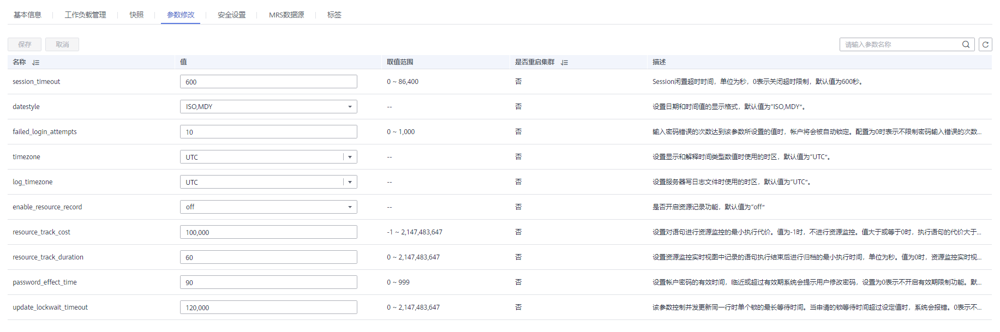

# 修改数据库参数

集群创建成功后，用户可以根据实际需要修改集群的数据库参数。在GaussDB\(DWS\) 管理控制台，您可以查看或设置一些常用的数据库参数，详情请参见[修改参数](#section10522114017574)。如需查看或设置其他数据库参数，您可以通过SQL命令的方式，详情请参见[配置GUC参数](https://support.huaweicloud.com/devg-dws/dws_04_0133.html)。

只有当集群状态为“可用“或“低性能“并且任务信息不处于“创建快照中“、“节点扩容“、“配置中“或“重启中“状态时，才能修改参数。

## 修改参数

1.  登录GaussDB\(DWS\) 管理控制台。
2.  在左侧导航栏中，单击“集群管理“。
3.  在集群列表中找到所需要的集群，单击集群名称，进入集群“基本信息“页面。
4.  单击“参数修改“页签，修改相应的参数值，然后单击“保存“。参数的详细说明请参见[参数说明](管理参数模板.md#section926416313488)。

    **图 1**  参数修改  
    

5.  在“修改预览“窗口，确认修改无误后，单击“保存“。

