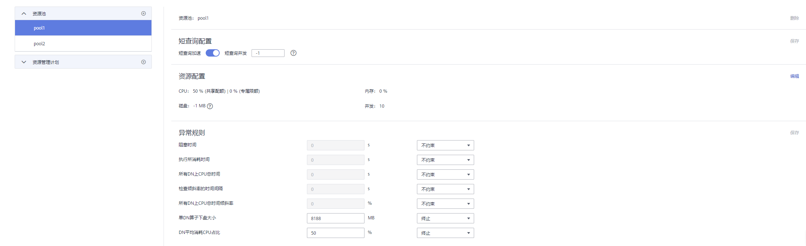
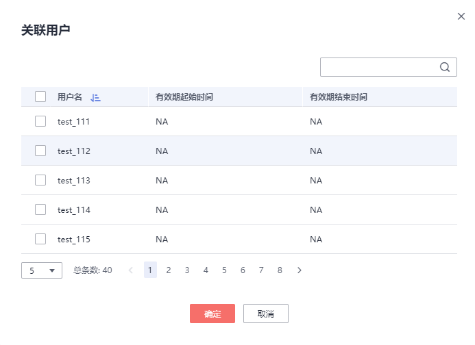

# 修改资源池

在资源管理中，您可以对某个资源池的参数进行修改。

1.  登录GaussDB\(DWS\) 管理控制台。
2.  在集群列表中单击需要访问“资源管理”页面的集群名称。
3.  切换至“资源管理”页签。
4.  在左侧“资源池”中单击需要修改的资源池名称，出现如下页面，包括“短查询配置”、“资源配置”、“异常规则”、“关联用户”。

    

5.  修改短查询配置。修改为相应取值，单击右侧“保存”。

    
    <table><thead align="left"><tr id="zh-cn_topic_0000001076579461_rf4055d66fedf4e67a18bbeb7fc36673d"><th class="cellrowborder" valign="top" width="19.439999999999998%" id="mcps1.1.4.1.1">
参数项

    </th>
    <th class="cellrowborder" valign="top" width="55.35%" id="mcps1.1.4.1.2">
描述

    </th>
    <th class="cellrowborder" valign="top" width="25.21%" id="mcps1.1.4.1.3">
取值

    </th>
    </tr>
    </thead>
    <tbody><tr id="zh-cn_topic_0000001076579461_r98dced66bcc84251a847d2c6b878fb71"><td class="cellrowborder" valign="top" width="19.439999999999998%" headers="mcps1.1.4.1.1 ">
短查询加速

    </td>
    <td class="cellrowborder" valign="top" width="55.35%" headers="mcps1.1.4.1.2 ">
短查询加速开关，默认打开

    </td>
    <td class="cellrowborder" valign="top" width="25.21%" headers="mcps1.1.4.1.3 ">
打开

    </td>
    </tr>
    <tr id="zh-cn_topic_0000001076579461_r3bc9f4d4300148e1818e8ee875ee3010"><td class="cellrowborder" valign="top" width="19.439999999999998%" headers="mcps1.1.4.1.1 ">
短查询并发

    </td>
    <td class="cellrowborder" valign="top" width="55.35%" headers="mcps1.1.4.1.2 ">
短查询作业为执行估算内存小于32MB的查询作业，默认值“-1”表示不管控。

    </td>
    <td class="cellrowborder" valign="top" width="25.21%" headers="mcps1.1.4.1.3 ">
10

    </td>
    </tr>
    </tbody>
    </table>

6.  修改资源配置。
    1.  单击右侧“编辑”，详情请参见[表 资源池参数](#table1380933134011)修改相应参数。

        **表 1**  资源池参数

        
        <table><thead align="left"><tr id="zh-cn_topic_0000001405476938_zh-cn_topic_0000001076708629_r45c4609ae0df47bfa1bb36943077276a"><th class="cellrowborder" valign="top" width="18.28%" id="mcps1.2.4.1.1">
参数项

        </th>
        <th class="cellrowborder" valign="top" width="65.36000000000001%" id="mcps1.2.4.1.2">
描述

        </th>
        <th class="cellrowborder" valign="top" width="16.360000000000003%" id="mcps1.2.4.1.3">
取值

        </th>
        </tr>
        </thead>
        <tbody><tr id="zh-cn_topic_0000001405476938_zh-cn_topic_0000001076708629_rccecdb3f69424915b2a90ae48134b9dd"><td class="cellrowborder" valign="top" width="18.28%" headers="mcps1.2.4.1.1 ">
名称

        </td>
        <td class="cellrowborder" valign="top" width="65.36000000000001%" headers="mcps1.2.4.1.2 ">
资源池的名称。

        </td>
        <td class="cellrowborder" valign="top" width="16.360000000000003%" headers="mcps1.2.4.1.3 ">
queue_test

        </td>
        </tr>
        <tr id="zh-cn_topic_0000001405476938_row1833914319256"><td class="cellrowborder" valign="top" width="18.28%" headers="mcps1.2.4.1.1 ">
CPU资源（%）

        </td>
        <td class="cellrowborder" valign="top" width="65.36000000000001%" headers="mcps1.2.4.1.2 "><ul id="zh-cn_topic_0000001405476938_ul14235101682820"><li>共享配额：关联在当前资源池的用户在执行作业时可以使用的CPU时间比例。</li><li>专属限额：限定资源池中数据库用户在执行作业时可使用的最大CPU核数占总核数的百分比。</li></ul>
        
 说明： 
<ul id="zh-cn_topic_0000001405476938_ul6756113052718"><li>所有资源池的总和不能超过99%。当配置CPU共享配额后，如果当前只有一个资源池时，该参数不生效。</li><li>共享配额非绝对限制，只有在发生CPU竞争时才生效。例如，资源池A和B被绑定在CPU1运行，当AB均运行时参数生效，只有A运行则参数不生效。</li><li>所有资源池的CPU专属限额总和最大不能超过100%，系统默认的CPU专属限额（%）为0。</li></ul>
        

        </td>
        <td class="cellrowborder" valign="top" width="16.360000000000003%" headers="mcps1.2.4.1.3 ">
-

        </td>
        </tr>
        <tr id="zh-cn_topic_0000001405476938_zh-cn_topic_0000001076708629_rb9afdcb77de5450f991ad26596962299"><td class="cellrowborder" valign="top" width="18.28%" headers="mcps1.2.4.1.1 ">
内存资源（%）

        </td>
        <td class="cellrowborder" valign="top" width="65.36000000000001%" headers="mcps1.2.4.1.2 ">
资源池所占用的内存百分比。

        
 注意： 

内存和查询并发支持单独管控和联合管控，联合管控时必须同时满足并发和内存要求时作业才能下发。

        

        </td>
        <td class="cellrowborder" valign="top" width="16.360000000000003%" headers="mcps1.2.4.1.3 ">
20

        </td>
        </tr>
        <tr id="zh-cn_topic_0000001405476938_zh-cn_topic_0000001076708629_rfc6a58e60ad5428fa32064926e00f43f"><td class="cellrowborder" valign="top" width="18.28%" headers="mcps1.2.4.1.1 ">
存储资源（MB）

        </td>
        <td class="cellrowborder" valign="top" width="65.36000000000001%" headers="mcps1.2.4.1.2 ">
可使用的永久表空间大小。

        
 注意： 

该值是资源池下所有DN的表空间总值，单DN节点可用空间=设置值 / DN节点数。

        

        </td>
        <td class="cellrowborder" valign="top" width="16.360000000000003%" headers="mcps1.2.4.1.3 ">
1024

        </td>
        </tr>
        <tr id="zh-cn_topic_0000001405476938_zh-cn_topic_0000001076708629_r1aabed4322f84ee68229882568cef559"><td class="cellrowborder" valign="top" width="18.28%" headers="mcps1.2.4.1.1 ">
查询并发

        </td>
        <td class="cellrowborder" valign="top" width="65.36000000000001%" headers="mcps1.2.4.1.2 ">
资源池中的最大查询并发数。

        
 注意： 

内存和查询并发支持单独管控和联合管控，联合管控时必须同时满足并发和内存要求时作业才能下发。

        

        </td>
        <td class="cellrowborder" valign="top" width="16.360000000000003%" headers="mcps1.2.4.1.3 ">
10

        </td>
        </tr>
        </tbody>
        </table>

        > **说明：** 
        >CPU专属限额仅8.1.3及以上版本支持。

    2.  单击“确定”。

7.  修改异常规则。
    1.  参见[表2](#table450693015419)修改相应参数。

        **表 2**  异常规则参数

        
        <table><thead align="left"><tr id="zh-cn_topic_0000001455917109_row14955536172317"><th class="cellrowborder" valign="top" width="20%" id="mcps1.2.5.1.1">
参数项

        </th>
        <th class="cellrowborder" valign="top" width="40%" id="mcps1.2.5.1.2">
描述

        </th>
        <th class="cellrowborder" valign="top" width="20%" id="mcps1.2.5.1.3">
取值范围（0表示不约束）

        </th>
        <th class="cellrowborder" valign="top" width="20%" id="mcps1.2.5.1.4">
操作

        </th>
        </tr>
        </thead>
        <tbody><tr id="zh-cn_topic_0000001455917109_row19955113692312"><td class="cellrowborder" valign="top" width="20%" headers="mcps1.2.5.1.1 ">
阻塞时间

        </td>
        <td class="cellrowborder" valign="top" width="40%" headers="mcps1.2.5.1.2 ">
作业的阻塞时间，包括全局并发排队以及局部并发排队的总时间，单位秒。

        
例如，如果配置“阻塞时间”为300秒，那么当该资源池中的用户执行的某个作业在阻塞300秒后将被终止。

        </td>
        <td class="cellrowborder" valign="top" width="20%" headers="mcps1.2.5.1.3 ">
1~2147483647的整数。0表示不约束。

        </td>
        <td class="cellrowborder" valign="top" width="20%" headers="mcps1.2.5.1.4 ">
终止或不约束

        </td>
        </tr>
        <tr id="zh-cn_topic_0000001455917109_row15611153115475"><td class="cellrowborder" valign="top" width="20%" headers="mcps1.2.5.1.1 ">
执行所消耗时间

        </td>
        <td class="cellrowborder" valign="top" width="40%" headers="mcps1.2.5.1.2 ">
已经执行的作业从开始执行到当前所消耗的时间，单位为秒。

        
例如，如果配置“执行所消耗时间”为100秒，那么当该资源池中的用户执行的某个作业在执行超过100秒后将被终止。

        </td>
        <td class="cellrowborder" valign="top" width="20%" headers="mcps1.2.5.1.3 ">
1~2147483647的整数。0表示不约束。

        </td>
        <td class="cellrowborder" valign="top" width="20%" headers="mcps1.2.5.1.4 ">
终止或不约束

        </td>
        </tr>
        <tr id="zh-cn_topic_0000001455917109_row1961111313473"><td class="cellrowborder" valign="top" width="20%" headers="mcps1.2.5.1.1 ">
所有DN上CPU总时间

        </td>
        <td class="cellrowborder" valign="top" width="40%" headers="mcps1.2.5.1.2 ">
作业在所有DN上执行时所耗费的CPU总时间，单位为秒。

        </td>
        <td class="cellrowborder" valign="top" width="20%" headers="mcps1.2.5.1.3 ">
1~2147483647的整数。0表示不约束。

        </td>
        <td class="cellrowborder" valign="top" width="20%" headers="mcps1.2.5.1.4 ">
终止或不约束

        </td>
        </tr>
        <tr id="zh-cn_topic_0000001455917109_row46117310476"><td class="cellrowborder" valign="top" width="20%" headers="mcps1.2.5.1.1 ">
检查倾斜率的时间间隔

        </td>
        <td class="cellrowborder" valign="top" width="40%" headers="mcps1.2.5.1.2 ">
检查作业执行的CPU倾斜率的间隔时间，单位为秒，需同“所有DN上CPU时间的倾斜率”一起设置。

        </td>
        <td class="cellrowborder" valign="top" width="20%" headers="mcps1.2.5.1.3 ">
1~2147483647的整数。0表示不约束。

        </td>
        <td class="cellrowborder" valign="top" width="20%" headers="mcps1.2.5.1.4 ">
终止或不约束

        </td>
        </tr>
        <tr id="zh-cn_topic_0000001455917109_row8988125711397"><td class="cellrowborder" valign="top" width="20%" headers="mcps1.2.5.1.1 ">
所有DN上CPU总时间倾斜率

        </td>
        <td class="cellrowborder" valign="top" width="40%" headers="mcps1.2.5.1.2 ">
作业在DN上执行时的CPU时间的倾斜率，依赖于“检查倾斜率的时间间隔”的设置。

        </td>
        <td class="cellrowborder" valign="top" width="20%" headers="mcps1.2.5.1.3 ">
1~100的整数。0表示不约束。

        </td>
        <td class="cellrowborder" valign="top" width="20%" headers="mcps1.2.5.1.4 ">
终止或不约束

        </td>
        </tr>
        <tr id="zh-cn_topic_0000001455917109_row52801184451"><td class="cellrowborder" valign="top" width="20%" headers="mcps1.2.5.1.1 ">
单DN算子下盘大小

        </td>
        <td class="cellrowborder" valign="top" width="40%" headers="mcps1.2.5.1.2 ">
作业在单个DN上最大下盘的数据量，单位MB。

        </td>
        <td class="cellrowborder" valign="top" width="20%" headers="mcps1.2.5.1.3 ">
1~2147483647的整数。0表示不约束。

        </td>
        <td class="cellrowborder" valign="top" width="20%" headers="mcps1.2.5.1.4 ">
终止或不约束

        </td>
        </tr>
        <tr id="zh-cn_topic_0000001455917109_row1238293519473"><td class="cellrowborder" valign="top" width="20%" headers="mcps1.2.5.1.1 ">
DN平均消耗CPU占比

        </td>
        <td class="cellrowborder" valign="top" width="40%" headers="mcps1.2.5.1.2 ">
作业在所有DN上执行时的平均CPU使用率，检测周期不强依赖"检查倾斜率的时间间隔"，若配置将使用该检查间隔，否则系统默认30秒间隔

        </td>
        <td class="cellrowborder" valign="top" width="20%" headers="mcps1.2.5.1.3 ">
1~100的整数。0表示不约束

        </td>
        <td class="cellrowborder" valign="top" width="20%" headers="mcps1.2.5.1.4 ">
终止或不约束

        </td>
        </tr>
        </tbody>
        </table>

        > **说明：** 
        >异常规则允许您对资源池中用户执行的作业做异常控制，目前支持[表2](#table450693015419)的相关配置。
        >-   如选择“终止”，则需要设置相应时间或百分比。
        >-   如选择“不约束”，则无异常规则约束。

    2.  单击“保存”。

8.  关联用户。

    > **说明：** 
    >-   一个数据库用户只有被添加到某个资源池中之后，该用户运行作业所使用的资源才能被管控。
    >-   一个数据库用户只能被添加至一个资源池中，从资源池中移除的用户可以再次添加至其他资源池。
    >-   数据库管理员用户不可关联。

    1.  单击右侧“添加”。
    2.  从当前用户列表中，勾选需要添加的用户，一次可勾选多个。

        

    3.  单击“确定”。
    4.  如果需要删除用户，则单击待删除用户所在行右边的“删除”即可。

