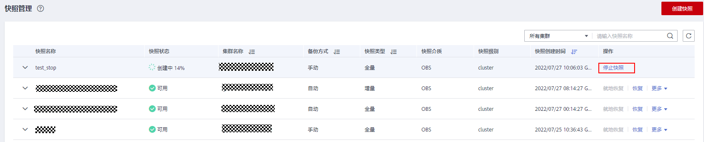
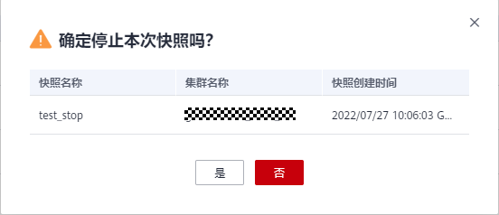
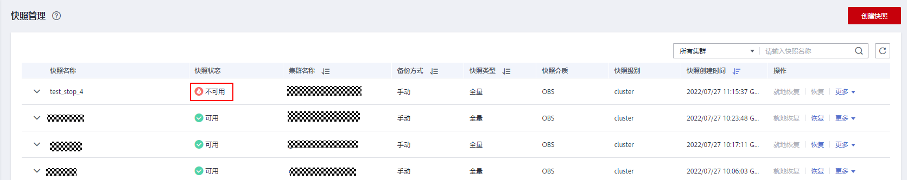

# 停止快照

用户创建快照开始后，可以根据需求在“快照管理“页面手动停止本次快照。

> **说明：** 
>-   停止快照功能仅8.1.3.200及以上版本支持。
>-   若快照即将完成，停止快照命令将不再生效，快照会正常结束。

## 前提条件

停止快照仅支持快照状态显示为“创建中”的快照。在快照创建启动时与快照即将创建完成时无法进行停止快照操作。

## 操作步骤

1.  登录GaussDB\(DWS\) 管理控制台。
2.  在左侧导航栏中，单击“快照管理“。

    在快照列表中，选择指定“创建中”快照所在行的“操作”列，单击“停止快照”按钮。

    

3.  在弹出的提示框中，单击“是“将停止本次快照，快照停止后状态将变为“不可用”状态。

    

    

