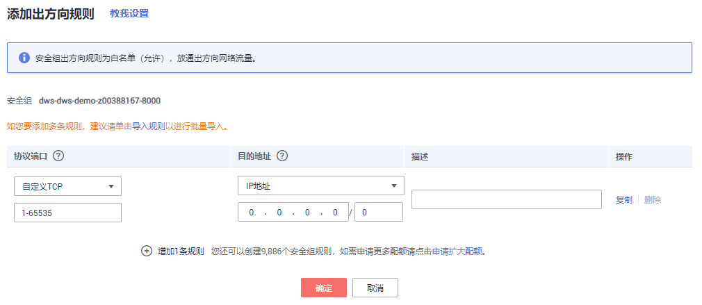

# 准备ECS作为gsql客户端主机

DWS提供的gsql命令行客户端，它的运行环境是Linux操作系统，在使用gsql客户端远程连接DWS集群之前，需要准备一个Linux主机用于安装和运行gsql客户端。如果通过公网地址访问集群，也可以将gsql客户端安装在用户自己的Linux主机上，但是该Linux主机必须具有公网地址。为方便起见，推荐您创建一台Linux弹性云服务器（简称ECS）。本章节将为您介绍如何准备弹性云服务器。如果用户已有符合条件的弹性云服务器，则可以跳过此步骤。

## 准备弹性云服务器

购买弹性云服务器的操作步骤，请参见《弹性云服务器快速入门》中的[购买并登录Linux弹性云服务器](https://support.huaweicloud.com/qs-ecs/zh-cn_topic_0132727313.html)章节。

购买的弹性云服务器需要满足如下要求：

-   弹性云服务器需要与DWS集群具有相同的区域、可用区。
-   如果使用DWS提供的gsql命令行客户端连接DWS集群，弹性云服务器的镜像必须满足如下要求：

    对镜像的规格没有特殊要求。镜像的操作系统必须是gsql客户端所支持的下列Linux操作系统：

    -   “Redhat x86\_64“客户端工具支持在以下系统中使用：
        -   RHEL 6.4\~7.6。
        -   CentOS 6.4\~7.4。
        -   EulerOS 2.3。

    -   “SUSE x86\_64“客户端工具支持在以下系统中使用：
        -   SLES 11.1\~11.4。
        -   SLES 12.0\~12.3。

    -   “Euler Kunpeng\_64”客户端工具支持在以下系统中使用：
        -   EulerOS 2.8。

    -   “Stream Euler X86\_64“客户端工具支持在以下系统中使用：
        -   EulerOS 2.2。

    -   “Stream Euler Kunpeng\_64“客户端工具支持在以下系统中使用：
        -   EulerOS 2.8。

-   如果客户端通过内网地址访问集群，请确保创建的弹性云服务器与DWS集群在同一虚拟私有云里。

    虚拟私有云相关操作请参见《虚拟私有云用户指南》中“虚拟私有云和子网”。

-   如果客户端通过公网地址访问集群，请确保创建的弹性云服务器和DWS集群都要有弹性IP。

    购买弹性云服务器时，参数“弹性公网IP”需选择“现在购买”或“使用已有”。

-   弹性云服务器对应的安全组规则需要确保能与DWS集群提供服务的端口网络互通。

    安全组相关操作请参见《虚拟私有云用户指南》中“安全性 \> 安全组”。

    请确认弹性云服务器的安全组中存在符合如下要求的规则，如果不存在，请在弹性云服务器的安全组中添加相应的规则：

    -   方向：出方向
    -   协议：必须包含TCP，例如TCP、全部。
    -   端口：需要包含DWS集群提供服务的数据库端口，例如，设置为“1-65535“或者具体的DWS数据库端口。
    -   目的地址：设置的IP地址需要包含所要连接的DWS集群的地址，例如，设置为“0.0.0.0/0“或者具体的DWS集群的连接地址。

        **图 1**  出方向的规则  
        

-   DWS集群的安全组规则需要确保DWS能接受来自客户端的网络访问。

    请确认DWS集群的安全组中存在符合如下要求的规则，如果不存在，请在DWS集群的安全组中添加相应的规则。

    -   方向：入方向
    -   协议：必须包含TCP，例如TCP、全部。
    -   端口：设置为DWS集群提供服务的数据库端口，例如“8000”。
    -   源地址：设置的IP地址需要包含DWS客户端主机的IP地址，例如“192.168.0.10/32”。

        **图 2**  入方向的规则  
        

