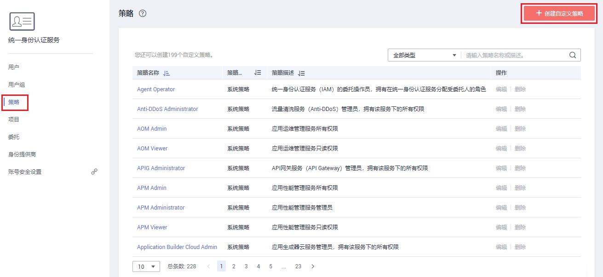
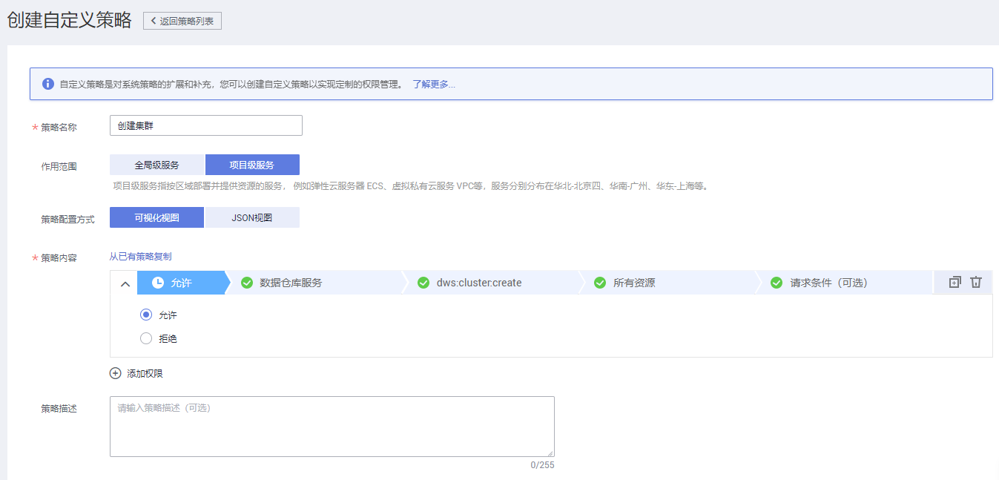
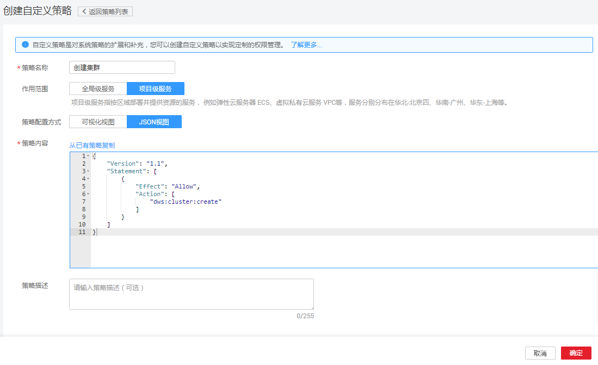

# 创建DWS自定义策略<a name="dws_01_0148"></a>

如果系统预置的DWS权限，不满足您的授权要求，可以创建自定义策略。自定义策略中可以添加的授权项（Action）请参考[权限策略和授权项](#section20504546151912)。

目前华为云支持以下两种方式创建自定义策略：

-   可视化视图创建自定义策略：无需了解策略语法，按可视化视图导航栏选择云服务、操作、资源、条件等策略内容，可自动生成策略。
-   JSON视图创建自定义策略：可以在选择策略模板后，根据具体需求编辑策略内容；也可以直接在编辑框内编写JSON格式的策略内容。

如下以定制一个用户仅能创建集群的策略为例，分别采用可视化视图和JSON视图的配置方式创建自定义策略。

## 前提条件<a name="section1783020250912"></a>

-   请先在IAM控制台中开通细粒度策略，开通方法请参见：[申请细粒度访问控制公测](https://support.huaweicloud.com/usermanual-iam/iam_01_019.html)。
-   如需使用JSON视图创建自定义策略，请您先熟悉策略结构，具体请参见[策略语法：细粒度策略](策略语法-细粒度策略.md)。
-   请确定自定义策略需要允许哪些操作，拒绝哪些操作，并获取操作对应的授权项。授权项请参见[DWS细粒度策略授权项列表](#section20504546151912)。

## 可视化视图配置自定义策略<a name="section81471324479"></a>

1.  在IAM控制台，单击左侧导航栏的“策略”，在右上角选择“创建自定义策略”。

    **图 1**  创建自定义策略<a name="fig3635195245012"></a>  
    

2.  在“创建自定义策略”中，配置如下信息：

    **图 2**  可视化视图<a name="fig5361518115113"></a>  
    

    -   “策略名称”：填写“创建集群“。
    -   “作用范围”：根据服务的属性填写，DWS为项目级服务，选择“项目级服务“。
    -   “策略配置方式”：选择“可视化视图“。
    -   “策略内容”：
        1.  选择“允许“。
        2.  在“云服务”中选择“数据仓库服务“。
        3.  在“操作”中勾选“ReadWrite”中的“dws:cluster:create”，即“创建集群”。
        4.  单击“确定“后，自定义策略创建成功。


## JSON视图配置自定义策略<a name="section1685812251199"></a>

如下以创建名为“创建集群”的策略为例，创建一个仅支持创建DWS集群的自定义策略。

1.  在IAM控制台，单击左侧导航栏的“策略”，在右上角选择“创建自定义策略”。

    **图 3**  创建策略<a name="fig6551162711515"></a>  
    

2.  在“创建自定义策略”中，填写如下参数。

    **图 4**  JSON视图<a name="fig80203335115"></a>  
    

    -   “策略名称”：填写“创建集群”。
    -   “作用范围”：根据服务的属性填写，DWS为项目级服务，选择“项目级服务”。
    -   “策略配置方式”：JSON视图。
    -   “策略信息”：将如下内容拷贝至策略信息中，并单击“检验语法”。如下策略表示允许创建DWS集群。

        ```
        {
            "Version": "1.1",
            "Statement": [
                {
                    "Effect": "Allow",
                    "Action": [
                        "dws:cluster:create"
                    ]
                }
            ]
        }
        ```

3.  单击“确定”后，系统会自动校验语法，如跳转到策略列表，则自定义策略创建成功；如提示“策略内容错误”，请按照语法规范进行修改。

## 验证自定义策略权限<a name="section5953111010146"></a>

1.  将新创建的自定义策略授予用户组，使得用户组中的用户仅具备创建集群的权限。
2.  用户登录并验证自定义策略定义的权限：创建集群。

    权限授予成功后，用户可以通过控制台以及REST API等多种方式验证。此处以登录控制台为例，介绍用户如何验证创建集群的权限。

    1.  使用新创建的用户登录华为云，登录方法选择为“IAM用户登录”。
        -   账号名为该IAM用户所属华为云账号的名称。
        -   用户名和密码为账号在IAM创建用户时输入的用户名和密码。

    2.  在DWS管理控制台，进行创建集群的操作，操作成功，权限配置正确并已生效。
    3.  尝试进行其他操作，例如：创建快照。

        系统显示“权限不足”，权限配置正确并已生效。


## 策略样例<a name="section1493518251395"></a>

-   示例1：授权用户创建/恢复集群、重启集群、删除集群、设置安全参数、重置密码的权限。

    ```
    {
          "Version": "1.1",
          "Statement": [
                {
                      "Effect": "Allow",
                      "Action": [
                            "dws:cluster:create",
                            "dws:cluster:restart",
                            "dws:cluster:delete",
                            "dws:cluster:setParameter",
                            "dws:cluster:resetPassword",
                            "ecs:*:get*",
                            "ecs:*:list*",
                            "vpc:*:get*",
                            "vpc:*:list*"
                      ]
                }
          ]
    }
    ```

-   示例2：拒绝用户删除集群

    拒绝策略需要同时配合其他策略使用，否则没有实际作用。用户被授予的策略中，一个授权项的作用如果同时存在Allow和Deny，则遵循Deny优先。

    如果您给用户授予DWS Administrator的系统策略，但不希望用户拥有DWS Administrator中定义的删除集群权限，您可以创建一条拒绝删除集群的自定义策略，然后同时将DWS Administrator和拒绝策略授予用户，根据Deny优先原则，则用户可以对DWS执行除了删除集群外的所有操作。拒绝策略示例如下：

    ```
    { 
          "Version": "1.1", 
          "Statement": [ 
                { 
    		  "Effect": "Deny", 
                      "Action": [ 
                            "dws:cluster:delete"
                      ] 
                } 
          ] 
    }
    ```


## DWS细粒度策略授权项列表<a name="section20504546151912"></a>

在IAM中创建自定义策略时，您可以根据需求在策略授权语句的Action列表中添加DWS资源操作或REST API所对应的“授权项”，使得该策略具有相应的操作权限。DWS细粒度策略的授权项列表如下：

-   **REST API**

    DWS REST API的授权项列表，请参见[权限策略和授权项](https://support.huaweicloud.com/api-dws/dws_02_0056.html)。

-   **管理控制台操作**

    DWS资源操作及对应的授权项如[表1](#dws_01_0143_table42061239124614)所示。


**表 1**  DWS资源操作授权项列表

<a name="dws_01_0143_table42061239124614"></a>
<table><thead align="left"><tr id="dws_01_0143_row126809551465"><th class="cellrowborder" valign="top" width="22.6%" id="mcps1.2.5.1.1"><p id="dws_01_0143_p6682105517467"><a name="dws_01_0143_p6682105517467"></a><a name="dws_01_0143_p6682105517467"></a>DWS资源操作</p>
</th>
<th class="cellrowborder" valign="top" width="31.830000000000002%" id="mcps1.2.5.1.2"><p id="dws_01_0143_p1568215520468"><a name="dws_01_0143_p1568215520468"></a><a name="dws_01_0143_p1568215520468"></a>授权项</p>
</th>
<th class="cellrowborder" valign="top" width="26.19%" id="mcps1.2.5.1.3"><p id="dws_01_0143_p19816133712378"><a name="dws_01_0143_p19816133712378"></a><a name="dws_01_0143_p19816133712378"></a>依赖的授权项</p>
</th>
<th class="cellrowborder" valign="top" width="19.38%" id="mcps1.2.5.1.4"><p id="dws_01_0143_p29118351780"><a name="dws_01_0143_p29118351780"></a><a name="dws_01_0143_p29118351780"></a>授权项作用域</p>
</th>
</tr>
</thead>
<tbody><tr id="dws_01_0143_row1251733919468"><td class="cellrowborder" valign="top" width="22.6%" headers="mcps1.2.5.1.1 "><p id="dws_01_0143_p1951710394465"><a name="dws_01_0143_p1951710394465"></a><a name="dws_01_0143_p1951710394465"></a>创建/恢复集群</p>
</td>
<td class="cellrowborder" valign="top" width="31.830000000000002%" headers="mcps1.2.5.1.2 "><p id="dws_01_0143_p251773918465"><a name="dws_01_0143_p251773918465"></a><a name="dws_01_0143_p251773918465"></a>"dws:cluster:create"</p>
</td>
<td class="cellrowborder" valign="top" width="26.19%" headers="mcps1.2.5.1.3 "><p id="dws_01_0143_p18466195820403"><a name="dws_01_0143_p18466195820403"></a><a name="dws_01_0143_p18466195820403"></a>"dws:*:get*",</p>
<p id="dws_01_0143_p124661058174012"><a name="dws_01_0143_p124661058174012"></a><a name="dws_01_0143_p124661058174012"></a>"dws:*:list*",</p>
<p id="dws_01_0143_p446655811403"><a name="dws_01_0143_p446655811403"></a><a name="dws_01_0143_p446655811403"></a>"ecs:*:get*",</p>
<p id="dws_01_0143_p174662585409"><a name="dws_01_0143_p174662585409"></a><a name="dws_01_0143_p174662585409"></a>"ecs:*:list*",</p>
<p id="dws_01_0143_p5437182411460"><a name="dws_01_0143_p5437182411460"></a><a name="dws_01_0143_p5437182411460"></a>"ecs:*:create*",</p>
<p id="dws_01_0143_p8466458154015"><a name="dws_01_0143_p8466458154015"></a><a name="dws_01_0143_p8466458154015"></a>"vpc:*:get*",</p>
<p id="dws_01_0143_p846605874012"><a name="dws_01_0143_p846605874012"></a><a name="dws_01_0143_p846605874012"></a>"vpc:*:list*",</p>
<p id="dws_01_0143_p175636481462"><a name="dws_01_0143_p175636481462"></a><a name="dws_01_0143_p175636481462"></a>"vpc:*:create*",</p>
<p id="dws_01_0143_p9466155818405"><a name="dws_01_0143_p9466155818405"></a><a name="dws_01_0143_p9466155818405"></a>"evs:*:get*",</p>
<p id="dws_01_0143_p746625854020"><a name="dws_01_0143_p746625854020"></a><a name="dws_01_0143_p746625854020"></a>"evs:*:list*",</p>
<p id="dws_01_0143_p11641633174712"><a name="dws_01_0143_p11641633174712"></a><a name="dws_01_0143_p11641633174712"></a>"evs:*:create*",</p>
</td>
<td class="cellrowborder" valign="top" width="19.38%" headers="mcps1.2.5.1.4 "><a name="dws_01_0143_ul256051910917"></a><a name="dws_01_0143_ul256051910917"></a><ul id="dws_01_0143_ul256051910917"><li>支持：<a name="dws_01_0143_ul116171620113612"></a><a name="dws_01_0143_ul116171620113612"></a><ul id="dws_01_0143_ul116171620113612"><li>项目(Project)</li><li>企业项目(Enterprise Project)</li></ul>
</li></ul>
</td>
</tr>
<tr id="dws_01_0143_row66381515377"><td class="cellrowborder" valign="top" width="22.6%" headers="mcps1.2.5.1.1 "><p id="dws_01_0143_p1664915153712"><a name="dws_01_0143_p1664915153712"></a><a name="dws_01_0143_p1664915153712"></a>获取集群列表</p>
</td>
<td class="cellrowborder" valign="top" width="31.830000000000002%" headers="mcps1.2.5.1.2 "><p id="dws_01_0143_p1337420187387"><a name="dws_01_0143_p1337420187387"></a><a name="dws_01_0143_p1337420187387"></a>"dws:cluster:list"</p>
</td>
<td class="cellrowborder" valign="top" width="26.19%" headers="mcps1.2.5.1.3 "><p id="dws_01_0143_p18345331134114"><a name="dws_01_0143_p18345331134114"></a><a name="dws_01_0143_p18345331134114"></a>"dws:*:get*",</p>
<p id="dws_01_0143_p17346123114113"><a name="dws_01_0143_p17346123114113"></a><a name="dws_01_0143_p17346123114113"></a>"dws:*:list*",</p>
</td>
<td class="cellrowborder" valign="top" width="19.38%" headers="mcps1.2.5.1.4 "><a name="dws_01_0143_ul59551841194911"></a><a name="dws_01_0143_ul59551841194911"></a><ul id="dws_01_0143_ul59551841194911"><li>支持：<a name="dws_01_0143_ul79551541144912"></a><a name="dws_01_0143_ul79551541144912"></a><ul id="dws_01_0143_ul79551541144912"><li>项目(Project)</li><li>企业项目(Enterprise Project)</li></ul>
</li></ul>
</td>
</tr>
<tr id="dws_01_0143_row3462101724118"><td class="cellrowborder" valign="top" width="22.6%" headers="mcps1.2.5.1.1 "><p id="dws_01_0143_p2462217134117"><a name="dws_01_0143_p2462217134117"></a><a name="dws_01_0143_p2462217134117"></a>获取单个集群详情</p>
</td>
<td class="cellrowborder" valign="top" width="31.830000000000002%" headers="mcps1.2.5.1.2 "><p id="dws_01_0143_p32111415193917"><a name="dws_01_0143_p32111415193917"></a><a name="dws_01_0143_p32111415193917"></a>"dws:cluster:getDetail"</p>
</td>
<td class="cellrowborder" valign="top" width="26.19%" headers="mcps1.2.5.1.3 "><p id="dws_01_0143_p39402517421"><a name="dws_01_0143_p39402517421"></a><a name="dws_01_0143_p39402517421"></a>"dws:*:get*",</p>
<p id="dws_01_0143_p794010510424"><a name="dws_01_0143_p794010510424"></a><a name="dws_01_0143_p794010510424"></a>"dws:*:list*",</p>
</td>
<td class="cellrowborder" valign="top" width="19.38%" headers="mcps1.2.5.1.4 "><a name="dws_01_0143_ul185353433497"></a><a name="dws_01_0143_ul185353433497"></a><ul id="dws_01_0143_ul185353433497"><li>支持：<a name="dws_01_0143_ul125351643194910"></a><a name="dws_01_0143_ul125351643194910"></a><ul id="dws_01_0143_ul125351643194910"><li>项目(Project)</li><li>企业项目(Enterprise Project)</li></ul>
</li></ul>
</td>
</tr>
<tr id="dws_01_0143_row17517439134615"><td class="cellrowborder" valign="top" width="22.6%" headers="mcps1.2.5.1.1 "><p id="dws_01_0143_p1051710394469"><a name="dws_01_0143_p1051710394469"></a><a name="dws_01_0143_p1051710394469"></a>设置自动快照</p>
</td>
<td class="cellrowborder" valign="top" width="31.830000000000002%" headers="mcps1.2.5.1.2 "><p id="dws_01_0143_p951715398468"><a name="dws_01_0143_p951715398468"></a><a name="dws_01_0143_p951715398468"></a>"dws:cluster:setAutomatedSnapshot"</p>
</td>
<td class="cellrowborder" valign="top" width="26.19%" headers="mcps1.2.5.1.3 "><p id="dws_01_0143_p1857671614216"><a name="dws_01_0143_p1857671614216"></a><a name="dws_01_0143_p1857671614216"></a>"dws:*:get*",</p>
<p id="dws_01_0143_p165761016124218"><a name="dws_01_0143_p165761016124218"></a><a name="dws_01_0143_p165761016124218"></a>"dws:*:list*",</p>
</td>
<td class="cellrowborder" valign="top" width="19.38%" headers="mcps1.2.5.1.4 "><a name="dws_01_0143_ul4837194617495"></a><a name="dws_01_0143_ul4837194617495"></a><ul id="dws_01_0143_ul4837194617495"><li>支持：<a name="dws_01_0143_ul158371946144910"></a><a name="dws_01_0143_ul158371946144910"></a><ul id="dws_01_0143_ul158371946144910"><li>项目(Project)</li><li>企业项目(Enterprise Project)</li></ul>
</li></ul>
</td>
</tr>
<tr id="dws_01_0143_row65171439164611"><td class="cellrowborder" valign="top" width="22.6%" headers="mcps1.2.5.1.1 "><p id="dws_01_0143_p651703920469"><a name="dws_01_0143_p651703920469"></a><a name="dws_01_0143_p651703920469"></a>设置安全参数/参数组</p>
</td>
<td class="cellrowborder" valign="top" width="31.830000000000002%" headers="mcps1.2.5.1.2 "><p id="dws_01_0143_p451733910466"><a name="dws_01_0143_p451733910466"></a><a name="dws_01_0143_p451733910466"></a>"dws:cluster:setParameter"</p>
</td>
<td class="cellrowborder" valign="top" width="26.19%" headers="mcps1.2.5.1.3 "><p id="dws_01_0143_p141711925154215"><a name="dws_01_0143_p141711925154215"></a><a name="dws_01_0143_p141711925154215"></a>"dws:*:get*",</p>
<p id="dws_01_0143_p51711250428"><a name="dws_01_0143_p51711250428"></a><a name="dws_01_0143_p51711250428"></a>"dws:*:list*",</p>
</td>
<td class="cellrowborder" valign="top" width="19.38%" headers="mcps1.2.5.1.4 "><a name="dws_01_0143_ul6124749134914"></a><a name="dws_01_0143_ul6124749134914"></a><ul id="dws_01_0143_ul6124749134914"><li>支持：<a name="dws_01_0143_ul412417497499"></a><a name="dws_01_0143_ul412417497499"></a><ul id="dws_01_0143_ul412417497499"><li>项目(Project)</li><li>企业项目(Enterprise Project)</li></ul>
</li></ul>
</td>
</tr>
<tr id="dws_01_0143_row251718395468"><td class="cellrowborder" valign="top" width="22.6%" headers="mcps1.2.5.1.1 "><p id="dws_01_0143_p9517639154610"><a name="dws_01_0143_p9517639154610"></a><a name="dws_01_0143_p9517639154610"></a>重启集群</p>
</td>
<td class="cellrowborder" valign="top" width="31.830000000000002%" headers="mcps1.2.5.1.2 "><p id="dws_01_0143_p18517639104615"><a name="dws_01_0143_p18517639104615"></a><a name="dws_01_0143_p18517639104615"></a>"dws:cluster:restart"</p>
</td>
<td class="cellrowborder" valign="top" width="26.19%" headers="mcps1.2.5.1.3 "><p id="dws_01_0143_p15218633184217"><a name="dws_01_0143_p15218633184217"></a><a name="dws_01_0143_p15218633184217"></a>"dws:*:get*",</p>
<p id="dws_01_0143_p721815339423"><a name="dws_01_0143_p721815339423"></a><a name="dws_01_0143_p721815339423"></a>"dws:*:list*",</p>
</td>
<td class="cellrowborder" valign="top" width="19.38%" headers="mcps1.2.5.1.4 "><a name="dws_01_0143_ul142518516492"></a><a name="dws_01_0143_ul142518516492"></a><ul id="dws_01_0143_ul142518516492"><li>支持：<a name="dws_01_0143_ul62615134919"></a><a name="dws_01_0143_ul62615134919"></a><ul id="dws_01_0143_ul62615134919"><li>项目(Project)</li><li>企业项目(Enterprise Project)</li></ul>
</li></ul>
</td>
</tr>
<tr id="dws_01_0143_row15517143911462"><td class="cellrowborder" valign="top" width="22.6%" headers="mcps1.2.5.1.1 "><p id="dws_01_0143_p451710393460"><a name="dws_01_0143_p451710393460"></a><a name="dws_01_0143_p451710393460"></a>扩容集群</p>
</td>
<td class="cellrowborder" valign="top" width="31.830000000000002%" headers="mcps1.2.5.1.2 "><p id="dws_01_0143_p14517183912467"><a name="dws_01_0143_p14517183912467"></a><a name="dws_01_0143_p14517183912467"></a>"dws:cluster:scaleOut"</p>
</td>
<td class="cellrowborder" valign="top" width="26.19%" headers="mcps1.2.5.1.3 "><p id="dws_01_0143_p1949819717431"><a name="dws_01_0143_p1949819717431"></a><a name="dws_01_0143_p1949819717431"></a>"dws:*:get*",</p>
<p id="dws_01_0143_p24981571437"><a name="dws_01_0143_p24981571437"></a><a name="dws_01_0143_p24981571437"></a>"dws:*:list*",</p>
<p id="dws_01_0143_p1498273439"><a name="dws_01_0143_p1498273439"></a><a name="dws_01_0143_p1498273439"></a>"ecs:*:get*",</p>
<p id="dws_01_0143_p94988764311"><a name="dws_01_0143_p94988764311"></a><a name="dws_01_0143_p94988764311"></a>"ecs:*:list*",</p>
<p id="dws_01_0143_p16416112665110"><a name="dws_01_0143_p16416112665110"></a><a name="dws_01_0143_p16416112665110"></a>"ecs:*:create*",</p>
<p id="dws_01_0143_p84983716432"><a name="dws_01_0143_p84983716432"></a><a name="dws_01_0143_p84983716432"></a>"vpc:*:get*",</p>
<p id="dws_01_0143_p849867174316"><a name="dws_01_0143_p849867174316"></a><a name="dws_01_0143_p849867174316"></a>"vpc:*:list*",</p>
<p id="dws_01_0143_p889573435111"><a name="dws_01_0143_p889573435111"></a><a name="dws_01_0143_p889573435111"></a>"vpc:*:create*",</p>
<p id="dws_01_0143_p1049815714316"><a name="dws_01_0143_p1049815714316"></a><a name="dws_01_0143_p1049815714316"></a>"evs:*:get*",</p>
<p id="dws_01_0143_p16498177194313"><a name="dws_01_0143_p16498177194313"></a><a name="dws_01_0143_p16498177194313"></a>"evs:*:list*",</p>
<p id="dws_01_0143_p8586174419515"><a name="dws_01_0143_p8586174419515"></a><a name="dws_01_0143_p8586174419515"></a>"evs:*:create*",</p>
</td>
<td class="cellrowborder" valign="top" width="19.38%" headers="mcps1.2.5.1.4 "><a name="dws_01_0143_ul63713520492"></a><a name="dws_01_0143_ul63713520492"></a><ul id="dws_01_0143_ul63713520492"><li>支持：<a name="dws_01_0143_ul1372155215493"></a><a name="dws_01_0143_ul1372155215493"></a><ul id="dws_01_0143_ul1372155215493"><li>项目(Project)</li><li>企业项目(Enterprise Project)</li></ul>
</li></ul>
</td>
</tr>
<tr id="dws_01_0143_row934253544214"><td class="cellrowborder" valign="top" width="22.6%" headers="mcps1.2.5.1.1 "><p id="dws_01_0143_p7342035134218"><a name="dws_01_0143_p7342035134218"></a><a name="dws_01_0143_p7342035134218"></a>调整大小</p>
</td>
<td class="cellrowborder" valign="top" width="31.830000000000002%" headers="mcps1.2.5.1.2 "><p id="dws_01_0143_p477434513919"><a name="dws_01_0143_p477434513919"></a><a name="dws_01_0143_p477434513919"></a>dws:openAPICluster:resize</p>
</td>
<td class="cellrowborder" valign="top" width="26.19%" headers="mcps1.2.5.1.3 "><p id="dws_01_0143_p19263164914435"><a name="dws_01_0143_p19263164914435"></a><a name="dws_01_0143_p19263164914435"></a>"dws:*:get*",</p>
<p id="dws_01_0143_p10263134964313"><a name="dws_01_0143_p10263134964313"></a><a name="dws_01_0143_p10263134964313"></a>"dws:*:list*",</p>
<p id="dws_01_0143_p1326424904314"><a name="dws_01_0143_p1326424904314"></a><a name="dws_01_0143_p1326424904314"></a>"ecs:*:get*",</p>
<p id="dws_01_0143_p1726404917435"><a name="dws_01_0143_p1726404917435"></a><a name="dws_01_0143_p1726404917435"></a>"ecs:*:list*",</p>
<p id="dws_01_0143_p66782026115716"><a name="dws_01_0143_p66782026115716"></a><a name="dws_01_0143_p66782026115716"></a>"ecs:*:create*",</p>
<p id="dws_01_0143_p426474994320"><a name="dws_01_0143_p426474994320"></a><a name="dws_01_0143_p426474994320"></a>"vpc:*:get*",</p>
<p id="dws_01_0143_p326415494436"><a name="dws_01_0143_p326415494436"></a><a name="dws_01_0143_p326415494436"></a>"vpc:*:list*",</p>
<p id="dws_01_0143_p17349202025719"><a name="dws_01_0143_p17349202025719"></a><a name="dws_01_0143_p17349202025719"></a>"vpc:*:create*",</p>
<p id="dws_01_0143_p182642491433"><a name="dws_01_0143_p182642491433"></a><a name="dws_01_0143_p182642491433"></a>"evs:*:get*",</p>
<p id="dws_01_0143_p102642499438"><a name="dws_01_0143_p102642499438"></a><a name="dws_01_0143_p102642499438"></a>"evs:*:list*",</p>
<p id="dws_01_0143_p5281213145712"><a name="dws_01_0143_p5281213145712"></a><a name="dws_01_0143_p5281213145712"></a>"evs:*:create*",</p>
</td>
<td class="cellrowborder" valign="top" width="19.38%" headers="mcps1.2.5.1.4 "><a name="dws_01_0143_ul3911185410496"></a><a name="dws_01_0143_ul3911185410496"></a><ul id="dws_01_0143_ul3911185410496"><li>支持：<a name="dws_01_0143_ul7911354184920"></a><a name="dws_01_0143_ul7911354184920"></a><ul id="dws_01_0143_ul7911354184920"><li>项目(Project)</li><li>企业项目(Enterprise Project)</li></ul>
</li></ul>
</td>
</tr>
<tr id="dws_01_0143_row19517193934617"><td class="cellrowborder" valign="top" width="22.6%" headers="mcps1.2.5.1.1 "><p id="dws_01_0143_p4517173917468"><a name="dws_01_0143_p4517173917468"></a><a name="dws_01_0143_p4517173917468"></a>重置密码</p>
</td>
<td class="cellrowborder" valign="top" width="31.830000000000002%" headers="mcps1.2.5.1.2 "><p id="dws_01_0143_p1751703919469"><a name="dws_01_0143_p1751703919469"></a><a name="dws_01_0143_p1751703919469"></a>"dws:cluster:resetPassword"</p>
</td>
<td class="cellrowborder" valign="top" width="26.19%" headers="mcps1.2.5.1.3 "><p id="dws_01_0143_p1664710159444"><a name="dws_01_0143_p1664710159444"></a><a name="dws_01_0143_p1664710159444"></a>"dws:*:get*",</p>
<p id="dws_01_0143_p6647121524416"><a name="dws_01_0143_p6647121524416"></a><a name="dws_01_0143_p6647121524416"></a>"dws:*:list*",</p>
</td>
<td class="cellrowborder" valign="top" width="19.38%" headers="mcps1.2.5.1.4 "><a name="dws_01_0143_ul1150035714492"></a><a name="dws_01_0143_ul1150035714492"></a><ul id="dws_01_0143_ul1150035714492"><li>支持：<a name="dws_01_0143_ul750045714493"></a><a name="dws_01_0143_ul750045714493"></a><ul id="dws_01_0143_ul750045714493"><li>项目(Project)</li><li>企业项目(Enterprise Project)</li></ul>
</li></ul>
</td>
</tr>
<tr id="dws_01_0143_row20517139104611"><td class="cellrowborder" valign="top" width="22.6%" headers="mcps1.2.5.1.1 "><p id="dws_01_0143_p12517739134610"><a name="dws_01_0143_p12517739134610"></a><a name="dws_01_0143_p12517739134610"></a>应用参数模板</p>
</td>
<td class="cellrowborder" valign="top" width="31.830000000000002%" headers="mcps1.2.5.1.2 "><p id="dws_01_0143_p2517103924618"><a name="dws_01_0143_p2517103924618"></a><a name="dws_01_0143_p2517103924618"></a>"dws:cluster:changeParameterGroup"</p>
</td>
<td class="cellrowborder" valign="top" width="26.19%" headers="mcps1.2.5.1.3 "><p id="dws_01_0143_p36920325443"><a name="dws_01_0143_p36920325443"></a><a name="dws_01_0143_p36920325443"></a>"dws:*:get*",</p>
<p id="dws_01_0143_p1369932104412"><a name="dws_01_0143_p1369932104412"></a><a name="dws_01_0143_p1369932104412"></a>"dws:*:list*",</p>
</td>
<td class="cellrowborder" valign="top" width="19.38%" headers="mcps1.2.5.1.4 "><a name="dws_01_0143_ul222165964917"></a><a name="dws_01_0143_ul222165964917"></a><ul id="dws_01_0143_ul222165964917"><li>支持：<a name="dws_01_0143_ul62217592496"></a><a name="dws_01_0143_ul62217592496"></a><ul id="dws_01_0143_ul62217592496"><li>项目(Project)</li><li>企业项目(Enterprise Project)</li></ul>
</li></ul>
</td>
</tr>
<tr id="dws_01_0143_row15171539134619"><td class="cellrowborder" valign="top" width="22.6%" headers="mcps1.2.5.1.1 "><p id="dws_01_0143_p13517123912467"><a name="dws_01_0143_p13517123912467"></a><a name="dws_01_0143_p13517123912467"></a>删除集群</p>
</td>
<td class="cellrowborder" valign="top" width="31.830000000000002%" headers="mcps1.2.5.1.2 "><p id="dws_01_0143_p5517163913466"><a name="dws_01_0143_p5517163913466"></a><a name="dws_01_0143_p5517163913466"></a>"dws:cluster:delete"</p>
</td>
<td class="cellrowborder" valign="top" width="26.19%" headers="mcps1.2.5.1.3 "><p id="dws_01_0143_p11694149154715"><a name="dws_01_0143_p11694149154715"></a><a name="dws_01_0143_p11694149154715"></a>"dws:*:get*",</p>
<p id="dws_01_0143_p186945495478"><a name="dws_01_0143_p186945495478"></a><a name="dws_01_0143_p186945495478"></a>"dws:*:list*",</p>
<p id="dws_01_0143_p369415495472"><a name="dws_01_0143_p369415495472"></a><a name="dws_01_0143_p369415495472"></a>"ecs:*:get*",</p>
<p id="dws_01_0143_p10694249174712"><a name="dws_01_0143_p10694249174712"></a><a name="dws_01_0143_p10694249174712"></a>"ecs:*:list*",</p>
<p id="dws_01_0143_p124571814125813"><a name="dws_01_0143_p124571814125813"></a><a name="dws_01_0143_p124571814125813"></a>"ecs:*:delete*",</p>
<p id="dws_01_0143_p1169411493474"><a name="dws_01_0143_p1169411493474"></a><a name="dws_01_0143_p1169411493474"></a>"vpc:*:get*",</p>
<p id="dws_01_0143_p6694164915478"><a name="dws_01_0143_p6694164915478"></a><a name="dws_01_0143_p6694164915478"></a>"vpc:*:list*",</p>
<p id="dws_01_0143_p1810913316580"><a name="dws_01_0143_p1810913316580"></a><a name="dws_01_0143_p1810913316580"></a>"vpc:*:delete*",</p>
<p id="dws_01_0143_p12694124984715"><a name="dws_01_0143_p12694124984715"></a><a name="dws_01_0143_p12694124984715"></a>"evs:*:get*",</p>
<p id="dws_01_0143_p4694949194716"><a name="dws_01_0143_p4694949194716"></a><a name="dws_01_0143_p4694949194716"></a>"evs:*:list*",</p>
<p id="dws_01_0143_p522917717592"><a name="dws_01_0143_p522917717592"></a><a name="dws_01_0143_p522917717592"></a>"evs:*:delete*",</p>
</td>
<td class="cellrowborder" valign="top" width="19.38%" headers="mcps1.2.5.1.4 "><a name="dws_01_0143_ul1791612175018"></a><a name="dws_01_0143_ul1791612175018"></a><ul id="dws_01_0143_ul1791612175018"><li>支持：<a name="dws_01_0143_ul891681175012"></a><a name="dws_01_0143_ul891681175012"></a><ul id="dws_01_0143_ul891681175012"><li>项目(Project)</li><li>企业项目(Enterprise Project)</li></ul>
</li></ul>
</td>
</tr>
<tr id="dws_01_0143_row15517339114613"><td class="cellrowborder" valign="top" width="22.6%" headers="mcps1.2.5.1.1 "><p id="dws_01_0143_p1551763904612"><a name="dws_01_0143_p1551763904612"></a><a name="dws_01_0143_p1551763904612"></a>设置可维护时间段</p>
</td>
<td class="cellrowborder" valign="top" width="31.830000000000002%" headers="mcps1.2.5.1.2 "><p id="dws_01_0143_p17517183954617"><a name="dws_01_0143_p17517183954617"></a><a name="dws_01_0143_p17517183954617"></a>"dws:cluster:setMaintainceWindow"</p>
</td>
<td class="cellrowborder" valign="top" width="26.19%" headers="mcps1.2.5.1.3 "><p id="dws_01_0143_p1272392440"><a name="dws_01_0143_p1272392440"></a><a name="dws_01_0143_p1272392440"></a>"dws:*:get*",</p>
<p id="dws_01_0143_p17271539194415"><a name="dws_01_0143_p17271539194415"></a><a name="dws_01_0143_p17271539194415"></a>"dws:*:list*",</p>
</td>
<td class="cellrowborder" valign="top" width="19.38%" headers="mcps1.2.5.1.4 "><a name="dws_01_0143_ul192601942507"></a><a name="dws_01_0143_ul192601942507"></a><ul id="dws_01_0143_ul192601942507"><li>支持：<a name="dws_01_0143_ul13260134115011"></a><a name="dws_01_0143_ul13260134115011"></a><ul id="dws_01_0143_ul13260134115011"><li>项目(Project)</li><li>企业项目(Enterprise Project)</li></ul>
</li></ul>
</td>
</tr>
<tr id="dws_01_0143_row451733964610"><td class="cellrowborder" valign="top" width="22.6%" headers="mcps1.2.5.1.1 "><p id="dws_01_0143_p6517173919466"><a name="dws_01_0143_p6517173919466"></a><a name="dws_01_0143_p6517173919466"></a>绑定EIP</p>
</td>
<td class="cellrowborder" valign="top" width="31.830000000000002%" headers="mcps1.2.5.1.2 "><p id="dws_01_0143_p15179392462"><a name="dws_01_0143_p15179392462"></a><a name="dws_01_0143_p15179392462"></a>"dws:eip:operate"</p>
</td>
<td class="cellrowborder" valign="top" width="26.19%" headers="mcps1.2.5.1.3 "><p id="dws_01_0143_p17401124204418"><a name="dws_01_0143_p17401124204418"></a><a name="dws_01_0143_p17401124204418"></a>"dws:*:get*",</p>
<p id="dws_01_0143_p5401124220447"><a name="dws_01_0143_p5401124220447"></a><a name="dws_01_0143_p5401124220447"></a>"dws:*:list*",</p>
</td>
<td class="cellrowborder" valign="top" width="19.38%" headers="mcps1.2.5.1.4 "><a name="dws_01_0143_ul118106135015"></a><a name="dws_01_0143_ul118106135015"></a><ul id="dws_01_0143_ul118106135015"><li>支持：<a name="dws_01_0143_ul1418116125017"></a><a name="dws_01_0143_ul1418116125017"></a><ul id="dws_01_0143_ul1418116125017"><li>项目(Project)</li><li>企业项目(Enterprise Project)</li></ul>
</li></ul>
</td>
</tr>
<tr id="dws_01_0143_row10517173919460"><td class="cellrowborder" valign="top" width="22.6%" headers="mcps1.2.5.1.1 "><p id="dws_01_0143_p2051763964619"><a name="dws_01_0143_p2051763964619"></a><a name="dws_01_0143_p2051763964619"></a>解绑EIP</p>
</td>
<td class="cellrowborder" valign="top" width="31.830000000000002%" headers="mcps1.2.5.1.2 "><p id="dws_01_0143_p20517183974617"><a name="dws_01_0143_p20517183974617"></a><a name="dws_01_0143_p20517183974617"></a>"dws:eip:operate"</p>
</td>
<td class="cellrowborder" valign="top" width="26.19%" headers="mcps1.2.5.1.3 "><p id="dws_01_0143_p3468174674411"><a name="dws_01_0143_p3468174674411"></a><a name="dws_01_0143_p3468174674411"></a>"dws:*:get*",</p>
<p id="dws_01_0143_p446864674412"><a name="dws_01_0143_p446864674412"></a><a name="dws_01_0143_p446864674412"></a>"dws:*:list*",</p>
</td>
<td class="cellrowborder" valign="top" width="19.38%" headers="mcps1.2.5.1.4 "><a name="dws_01_0143_ul109106817502"></a><a name="dws_01_0143_ul109106817502"></a><ul id="dws_01_0143_ul109106817502"><li>支持：<a name="dws_01_0143_ul1691018812506"></a><a name="dws_01_0143_ul1691018812506"></a><ul id="dws_01_0143_ul1691018812506"><li>项目(Project)</li><li>企业项目(Enterprise Project)</li></ul>
</li></ul>
</td>
</tr>
<tr id="dws_01_0143_row1851710393464"><td class="cellrowborder" valign="top" width="22.6%" headers="mcps1.2.5.1.1 "><p id="dws_01_0143_p1851716395462"><a name="dws_01_0143_p1851716395462"></a><a name="dws_01_0143_p1851716395462"></a>创建DNS域名</p>
</td>
<td class="cellrowborder" valign="top" width="31.830000000000002%" headers="mcps1.2.5.1.2 "><p id="dws_01_0143_p65172039164617"><a name="dws_01_0143_p65172039164617"></a><a name="dws_01_0143_p65172039164617"></a>"dws:dns:create"</p>
</td>
<td class="cellrowborder" valign="top" width="26.19%" headers="mcps1.2.5.1.3 "><p id="dws_01_0143_p1175313499443"><a name="dws_01_0143_p1175313499443"></a><a name="dws_01_0143_p1175313499443"></a>"dws:*:get*",</p>
<p id="dws_01_0143_p12753349144416"><a name="dws_01_0143_p12753349144416"></a><a name="dws_01_0143_p12753349144416"></a>"dws:*:list*",</p>
</td>
<td class="cellrowborder" valign="top" width="19.38%" headers="mcps1.2.5.1.4 "><a name="dws_01_0143_ul8740101065011"></a><a name="dws_01_0143_ul8740101065011"></a><ul id="dws_01_0143_ul8740101065011"><li>支持：<a name="dws_01_0143_ul15740141065016"></a><a name="dws_01_0143_ul15740141065016"></a><ul id="dws_01_0143_ul15740141065016"><li>项目(Project)</li><li>企业项目(Enterprise Project)</li></ul>
</li></ul>
</td>
</tr>
<tr id="dws_01_0143_row12517143964618"><td class="cellrowborder" valign="top" width="22.6%" headers="mcps1.2.5.1.1 "><p id="dws_01_0143_p5517439164619"><a name="dws_01_0143_p5517439164619"></a><a name="dws_01_0143_p5517439164619"></a>释放DNS域名</p>
</td>
<td class="cellrowborder" valign="top" width="31.830000000000002%" headers="mcps1.2.5.1.2 "><p id="dws_01_0143_p65191439194611"><a name="dws_01_0143_p65191439194611"></a><a name="dws_01_0143_p65191439194611"></a>"dws:dns:release"</p>
</td>
<td class="cellrowborder" valign="top" width="26.19%" headers="mcps1.2.5.1.3 "><p id="dws_01_0143_p583855364415"><a name="dws_01_0143_p583855364415"></a><a name="dws_01_0143_p583855364415"></a>"dws:*:get*",</p>
<p id="dws_01_0143_p178381253174410"><a name="dws_01_0143_p178381253174410"></a><a name="dws_01_0143_p178381253174410"></a>"dws:*:list*",</p>
</td>
<td class="cellrowborder" valign="top" width="19.38%" headers="mcps1.2.5.1.4 "><a name="dws_01_0143_ul1214511345013"></a><a name="dws_01_0143_ul1214511345013"></a><ul id="dws_01_0143_ul1214511345013"><li>支持：<a name="dws_01_0143_ul111451713185010"></a><a name="dws_01_0143_ul111451713185010"></a><ul id="dws_01_0143_ul111451713185010"><li>项目(Project)</li><li>企业项目(Enterprise Project)</li></ul>
</li></ul>
</td>
</tr>
<tr id="dws_01_0143_row851903916463"><td class="cellrowborder" valign="top" width="22.6%" headers="mcps1.2.5.1.1 "><p id="dws_01_0143_p135191739104613"><a name="dws_01_0143_p135191739104613"></a><a name="dws_01_0143_p135191739104613"></a>修改DNS域名</p>
</td>
<td class="cellrowborder" valign="top" width="31.830000000000002%" headers="mcps1.2.5.1.2 "><p id="dws_01_0143_p2519139114618"><a name="dws_01_0143_p2519139114618"></a><a name="dws_01_0143_p2519139114618"></a>"dws:dns:edit"</p>
</td>
<td class="cellrowborder" valign="top" width="26.19%" headers="mcps1.2.5.1.3 "><p id="dws_01_0143_p915917575448"><a name="dws_01_0143_p915917575448"></a><a name="dws_01_0143_p915917575448"></a>"dws:*:get*",</p>
<p id="dws_01_0143_p21594579449"><a name="dws_01_0143_p21594579449"></a><a name="dws_01_0143_p21594579449"></a>"dws:*:list*",</p>
</td>
<td class="cellrowborder" valign="top" width="19.38%" headers="mcps1.2.5.1.4 "><a name="dws_01_0143_ul171718159508"></a><a name="dws_01_0143_ul171718159508"></a><ul id="dws_01_0143_ul171718159508"><li>支持：<a name="dws_01_0143_ul91718156508"></a><a name="dws_01_0143_ul91718156508"></a><ul id="dws_01_0143_ul91718156508"><li>项目(Project)</li><li>企业项目(Enterprise Project)</li></ul>
</li></ul>
</td>
</tr>
<tr id="dws_01_0143_row19519133914613"><td class="cellrowborder" valign="top" width="22.6%" headers="mcps1.2.5.1.1 "><p id="dws_01_0143_p14519133974620"><a name="dws_01_0143_p14519133974620"></a><a name="dws_01_0143_p14519133974620"></a>创建MRS连接</p>
</td>
<td class="cellrowborder" valign="top" width="31.830000000000002%" headers="mcps1.2.5.1.2 "><p id="dws_01_0143_p17519839134612"><a name="dws_01_0143_p17519839134612"></a><a name="dws_01_0143_p17519839134612"></a>"dws:MRSConnection:create"</p>
</td>
<td class="cellrowborder" valign="top" width="26.19%" headers="mcps1.2.5.1.3 "><p id="dws_01_0143_p63537134515"><a name="dws_01_0143_p63537134515"></a><a name="dws_01_0143_p63537134515"></a>"dws:*:get*",</p>
<p id="dws_01_0143_p0353315459"><a name="dws_01_0143_p0353315459"></a><a name="dws_01_0143_p0353315459"></a>"dws:*:list*",</p>
</td>
<td class="cellrowborder" valign="top" width="19.38%" headers="mcps1.2.5.1.4 "><a name="dws_01_0143_ul1589631705018"></a><a name="dws_01_0143_ul1589631705018"></a><ul id="dws_01_0143_ul1589631705018"><li>支持：<a name="dws_01_0143_ul148971417115011"></a><a name="dws_01_0143_ul148971417115011"></a><ul id="dws_01_0143_ul148971417115011"><li>项目(Project)</li><li>企业项目(Enterprise Project)</li></ul>
</li></ul>
</td>
</tr>
<tr id="dws_01_0143_row165191739144619"><td class="cellrowborder" valign="top" width="22.6%" headers="mcps1.2.5.1.1 "><p id="dws_01_0143_p14519183917463"><a name="dws_01_0143_p14519183917463"></a><a name="dws_01_0143_p14519183917463"></a>更新MRS连接</p>
</td>
<td class="cellrowborder" valign="top" width="31.830000000000002%" headers="mcps1.2.5.1.2 "><p id="dws_01_0143_p4519153914614"><a name="dws_01_0143_p4519153914614"></a><a name="dws_01_0143_p4519153914614"></a>"dws:MRSConnection:update"</p>
</td>
<td class="cellrowborder" valign="top" width="26.19%" headers="mcps1.2.5.1.3 "><p id="dws_01_0143_p12506849455"><a name="dws_01_0143_p12506849455"></a><a name="dws_01_0143_p12506849455"></a>"dws:*:get*",</p>
<p id="dws_01_0143_p1150612414459"><a name="dws_01_0143_p1150612414459"></a><a name="dws_01_0143_p1150612414459"></a>"dws:*:list*",</p>
</td>
<td class="cellrowborder" valign="top" width="19.38%" headers="mcps1.2.5.1.4 "><a name="dws_01_0143_ul1716141905012"></a><a name="dws_01_0143_ul1716141905012"></a><ul id="dws_01_0143_ul1716141905012"><li>支持：<a name="dws_01_0143_ul11717161920508"></a><a name="dws_01_0143_ul11717161920508"></a><ul id="dws_01_0143_ul11717161920508"><li>项目(Project)</li><li>企业项目(Enterprise Project)</li></ul>
</li></ul>
</td>
</tr>
<tr id="dws_01_0143_row1951914391467"><td class="cellrowborder" valign="top" width="22.6%" headers="mcps1.2.5.1.1 "><p id="dws_01_0143_p125191539154618"><a name="dws_01_0143_p125191539154618"></a><a name="dws_01_0143_p125191539154618"></a>删除MRS连接</p>
</td>
<td class="cellrowborder" valign="top" width="31.830000000000002%" headers="mcps1.2.5.1.2 "><p id="dws_01_0143_p12519113915465"><a name="dws_01_0143_p12519113915465"></a><a name="dws_01_0143_p12519113915465"></a>"dws:MRSConnection:delete"</p>
</td>
<td class="cellrowborder" valign="top" width="26.19%" headers="mcps1.2.5.1.3 "><p id="dws_01_0143_p83521582455"><a name="dws_01_0143_p83521582455"></a><a name="dws_01_0143_p83521582455"></a>"dws:*:get*",</p>
<p id="dws_01_0143_p13531683451"><a name="dws_01_0143_p13531683451"></a><a name="dws_01_0143_p13531683451"></a>"dws:*:list*",</p>
</td>
<td class="cellrowborder" valign="top" width="19.38%" headers="mcps1.2.5.1.4 "><a name="dws_01_0143_ul11249102245014"></a><a name="dws_01_0143_ul11249102245014"></a><ul id="dws_01_0143_ul11249102245014"><li>支持：<a name="dws_01_0143_ul122506225502"></a><a name="dws_01_0143_ul122506225502"></a><ul id="dws_01_0143_ul122506225502"><li>项目(Project)</li><li>企业项目(Enterprise Project)</li></ul>
</li></ul>
</td>
</tr>
<tr id="dws_01_0143_row951943954612"><td class="cellrowborder" valign="top" width="22.6%" headers="mcps1.2.5.1.1 "><p id="dws_01_0143_p55191839174618"><a name="dws_01_0143_p55191839174618"></a><a name="dws_01_0143_p55191839174618"></a>添加/删除标签</p>
</td>
<td class="cellrowborder" valign="top" width="31.830000000000002%" headers="mcps1.2.5.1.2 "><p id="dws_01_0143_p175191139194616"><a name="dws_01_0143_p175191139194616"></a><a name="dws_01_0143_p175191139194616"></a>"dws:tag:addAndDelete"</p>
</td>
<td class="cellrowborder" valign="top" width="26.19%" headers="mcps1.2.5.1.3 "><p id="dws_01_0143_p352351194520"><a name="dws_01_0143_p352351194520"></a><a name="dws_01_0143_p352351194520"></a>"dws:*:get*",</p>
<p id="dws_01_0143_p652313117456"><a name="dws_01_0143_p652313117456"></a><a name="dws_01_0143_p652313117456"></a>"dws:*:list*",</p>
</td>
<td class="cellrowborder" valign="top" width="19.38%" headers="mcps1.2.5.1.4 "><a name="dws_01_0143_ul19144624165010"></a><a name="dws_01_0143_ul19144624165010"></a><ul id="dws_01_0143_ul19144624165010"><li>支持：<a name="dws_01_0143_ul3144624195016"></a><a name="dws_01_0143_ul3144624195016"></a><ul id="dws_01_0143_ul3144624195016"><li>项目(Project)</li><li>企业项目(Enterprise Project)</li></ul>
</li></ul>
</td>
</tr>
<tr id="dws_01_0143_row1651993914460"><td class="cellrowborder" valign="top" width="22.6%" headers="mcps1.2.5.1.1 "><p id="dws_01_0143_p951953984616"><a name="dws_01_0143_p951953984616"></a><a name="dws_01_0143_p951953984616"></a>编辑标签</p>
</td>
<td class="cellrowborder" valign="top" width="31.830000000000002%" headers="mcps1.2.5.1.2 "><p id="dws_01_0143_p125197391461"><a name="dws_01_0143_p125197391461"></a><a name="dws_01_0143_p125197391461"></a>"dws:tag:edit"</p>
</td>
<td class="cellrowborder" valign="top" width="26.19%" headers="mcps1.2.5.1.3 "><p id="dws_01_0143_p13388171594515"><a name="dws_01_0143_p13388171594515"></a><a name="dws_01_0143_p13388171594515"></a>"dws:*:get*",</p>
<p id="dws_01_0143_p153886151456"><a name="dws_01_0143_p153886151456"></a><a name="dws_01_0143_p153886151456"></a>"dws:*:list*",</p>
</td>
<td class="cellrowborder" valign="top" width="19.38%" headers="mcps1.2.5.1.4 "><a name="dws_01_0143_ul165545115502"></a><a name="dws_01_0143_ul165545115502"></a><ul id="dws_01_0143_ul165545115502"><li>支持：<a name="dws_01_0143_ul165519511504"></a><a name="dws_01_0143_ul165519511504"></a><ul id="dws_01_0143_ul165519511504"><li>项目(Project)</li><li>企业项目(Enterprise Project)</li></ul>
</li></ul>
</td>
</tr>
<tr id="dws_01_0143_row1251993924617"><td class="cellrowborder" valign="top" width="22.6%" headers="mcps1.2.5.1.1 "><p id="dws_01_0143_p551923934612"><a name="dws_01_0143_p551923934612"></a><a name="dws_01_0143_p551923934612"></a>创建快照</p>
</td>
<td class="cellrowborder" valign="top" width="31.830000000000002%" headers="mcps1.2.5.1.2 "><p id="dws_01_0143_p1051910399466"><a name="dws_01_0143_p1051910399466"></a><a name="dws_01_0143_p1051910399466"></a>"dws:snapshot:create"</p>
</td>
<td class="cellrowborder" valign="top" width="26.19%" headers="mcps1.2.5.1.3 "><p id="dws_01_0143_p82031917457"><a name="dws_01_0143_p82031917457"></a><a name="dws_01_0143_p82031917457"></a>"dws:*:get*",</p>
<p id="dws_01_0143_p1520131954515"><a name="dws_01_0143_p1520131954515"></a><a name="dws_01_0143_p1520131954515"></a>"dws:*:list*",</p>
</td>
<td class="cellrowborder" valign="top" width="19.38%" headers="mcps1.2.5.1.4 "><a name="dws_01_0143_ul7706115315012"></a><a name="dws_01_0143_ul7706115315012"></a><ul id="dws_01_0143_ul7706115315012"><li>支持：<a name="dws_01_0143_ul47069535503"></a><a name="dws_01_0143_ul47069535503"></a><ul id="dws_01_0143_ul47069535503"><li>项目(Project)</li><li>企业项目(Enterprise Project)</li></ul>
</li></ul>
</td>
</tr>
<tr id="dws_01_0143_row16984715449"><td class="cellrowborder" valign="top" width="22.6%" headers="mcps1.2.5.1.1 "><p id="dws_01_0143_p698519113443"><a name="dws_01_0143_p698519113443"></a><a name="dws_01_0143_p698519113443"></a>获取快照列表</p>
</td>
<td class="cellrowborder" valign="top" width="31.830000000000002%" headers="mcps1.2.5.1.2 "><p id="dws_01_0143_p8756712407"><a name="dws_01_0143_p8756712407"></a><a name="dws_01_0143_p8756712407"></a>"dws:snapshot:list"</p>
</td>
<td class="cellrowborder" valign="top" width="26.19%" headers="mcps1.2.5.1.3 "><p id="dws_01_0143_p13101131534716"><a name="dws_01_0143_p13101131534716"></a><a name="dws_01_0143_p13101131534716"></a>"dws:*:get*"</p>
</td>
<td class="cellrowborder" valign="top" width="19.38%" headers="mcps1.2.5.1.4 "><a name="dws_01_0143_ul6881455205019"></a><a name="dws_01_0143_ul6881455205019"></a><ul id="dws_01_0143_ul6881455205019"><li>支持：<a name="dws_01_0143_ul15881145514505"></a><a name="dws_01_0143_ul15881145514505"></a><ul id="dws_01_0143_ul15881145514505"><li>项目(Project)</li><li>企业项目(Enterprise Project)</li></ul>
</li></ul>
</td>
</tr>
<tr id="dws_01_0143_row751993994619"><td class="cellrowborder" valign="top" width="22.6%" headers="mcps1.2.5.1.1 "><p id="dws_01_0143_p751973915466"><a name="dws_01_0143_p751973915466"></a><a name="dws_01_0143_p751973915466"></a>删除快照</p>
</td>
<td class="cellrowborder" valign="top" width="31.830000000000002%" headers="mcps1.2.5.1.2 "><p id="dws_01_0143_p11519173964616"><a name="dws_01_0143_p11519173964616"></a><a name="dws_01_0143_p11519173964616"></a>"dws:snapshot:delete"</p>
</td>
<td class="cellrowborder" valign="top" width="26.19%" headers="mcps1.2.5.1.3 "><p id="dws_01_0143_p242145114716"><a name="dws_01_0143_p242145114716"></a><a name="dws_01_0143_p242145114716"></a>"dws:snapshot:list"</p>
</td>
<td class="cellrowborder" valign="top" width="19.38%" headers="mcps1.2.5.1.4 "><a name="dws_01_0143_ul6928058105010"></a><a name="dws_01_0143_ul6928058105010"></a><ul id="dws_01_0143_ul6928058105010"><li>支持：<a name="dws_01_0143_ul17928458145014"></a><a name="dws_01_0143_ul17928458145014"></a><ul id="dws_01_0143_ul17928458145014"><li>项目(Project)</li><li>企业项目(Enterprise Project)</li></ul>
</li></ul>
</td>
</tr>
<tr id="dws_01_0143_row1451917394462"><td class="cellrowborder" valign="top" width="22.6%" headers="mcps1.2.5.1.1 "><p id="dws_01_0143_p18519123915462"><a name="dws_01_0143_p18519123915462"></a><a name="dws_01_0143_p18519123915462"></a>复制快照</p>
</td>
<td class="cellrowborder" valign="top" width="31.830000000000002%" headers="mcps1.2.5.1.2 "><p id="dws_01_0143_p145192039134616"><a name="dws_01_0143_p145192039134616"></a><a name="dws_01_0143_p145192039134616"></a>"dws:snapshot:copy"</p>
</td>
<td class="cellrowborder" valign="top" width="26.19%" headers="mcps1.2.5.1.3 "><p id="dws_01_0143_p131752194713"><a name="dws_01_0143_p131752194713"></a><a name="dws_01_0143_p131752194713"></a>"dws:snapshot:list"</p>
</td>
<td class="cellrowborder" valign="top" width="19.38%" headers="mcps1.2.5.1.4 "><a name="dws_01_0143_ul978660135116"></a><a name="dws_01_0143_ul978660135116"></a><ul id="dws_01_0143_ul978660135116"><li>支持：<a name="dws_01_0143_ul878620145119"></a><a name="dws_01_0143_ul878620145119"></a><ul id="dws_01_0143_ul878620145119"><li>项目(Project)</li><li>企业项目(Enterprise Project)</li></ul>
</li></ul>
</td>
</tr>
<tr id="dws_01_0143_row85191339194617"><td class="cellrowborder" valign="top" width="22.6%" headers="mcps1.2.5.1.1 "><p id="dws_01_0143_p151911399466"><a name="dws_01_0143_p151911399466"></a><a name="dws_01_0143_p151911399466"></a>创建参数模板</p>
</td>
<td class="cellrowborder" valign="top" width="31.830000000000002%" headers="mcps1.2.5.1.2 "><p id="dws_01_0143_p125199398465"><a name="dws_01_0143_p125199398465"></a><a name="dws_01_0143_p125199398465"></a>"dws:parameterGroup:create"</p>
</td>
<td class="cellrowborder" valign="top" width="26.19%" headers="mcps1.2.5.1.3 "><p id="dws_01_0143_p1832762417459"><a name="dws_01_0143_p1832762417459"></a><a name="dws_01_0143_p1832762417459"></a>"dws:*:get*",</p>
<p id="dws_01_0143_p1132719241459"><a name="dws_01_0143_p1132719241459"></a><a name="dws_01_0143_p1132719241459"></a>"dws:*:list*",</p>
</td>
<td class="cellrowborder" valign="top" width="19.38%" headers="mcps1.2.5.1.4 "><a name="dws_01_0143_ul18618313517"></a><a name="dws_01_0143_ul18618313517"></a><ul id="dws_01_0143_ul18618313517"><li>支持：<a name="dws_01_0143_ul136273135117"></a><a name="dws_01_0143_ul136273135117"></a><ul id="dws_01_0143_ul136273135117"><li>项目(Project)</li><li>企业项目(Enterprise Project)</li></ul>
</li></ul>
</td>
</tr>
<tr id="dws_01_0143_row851983974610"><td class="cellrowborder" valign="top" width="22.6%" headers="mcps1.2.5.1.1 "><p id="dws_01_0143_p15519183924619"><a name="dws_01_0143_p15519183924619"></a><a name="dws_01_0143_p15519183924619"></a>删除参数模板</p>
</td>
<td class="cellrowborder" valign="top" width="31.830000000000002%" headers="mcps1.2.5.1.2 "><p id="dws_01_0143_p105191339114610"><a name="dws_01_0143_p105191339114610"></a><a name="dws_01_0143_p105191339114610"></a>"dws:parameterGroup:delete"</p>
</td>
<td class="cellrowborder" valign="top" width="26.19%" headers="mcps1.2.5.1.3 "><p id="dws_01_0143_p9974182754516"><a name="dws_01_0143_p9974182754516"></a><a name="dws_01_0143_p9974182754516"></a>"dws:*:get*",</p>
<p id="dws_01_0143_p9975427134516"><a name="dws_01_0143_p9975427134516"></a><a name="dws_01_0143_p9975427134516"></a>"dws:*:list*",</p>
</td>
<td class="cellrowborder" valign="top" width="19.38%" headers="mcps1.2.5.1.4 "><a name="dws_01_0143_ul19641148513"></a><a name="dws_01_0143_ul19641148513"></a><ul id="dws_01_0143_ul19641148513"><li>支持：<a name="dws_01_0143_ul1164113414516"></a><a name="dws_01_0143_ul1164113414516"></a><ul id="dws_01_0143_ul1164113414516"><li>项目(Project)</li><li>企业项目(Enterprise Project)</li></ul>
</li></ul>
</td>
</tr>
<tr id="dws_01_0143_row105191239144619"><td class="cellrowborder" valign="top" width="22.6%" headers="mcps1.2.5.1.1 "><p id="dws_01_0143_p125191839184611"><a name="dws_01_0143_p125191839184611"></a><a name="dws_01_0143_p125191839184611"></a>修改参数模板</p>
</td>
<td class="cellrowborder" valign="top" width="31.830000000000002%" headers="mcps1.2.5.1.2 "><p id="dws_01_0143_p1951923914615"><a name="dws_01_0143_p1951923914615"></a><a name="dws_01_0143_p1951923914615"></a>"dws:parameterGroup:edit"</p>
</td>
<td class="cellrowborder" valign="top" width="26.19%" headers="mcps1.2.5.1.3 "><p id="dws_01_0143_p63341934114515"><a name="dws_01_0143_p63341934114515"></a><a name="dws_01_0143_p63341934114515"></a>"dws:*:get*",</p>
<p id="dws_01_0143_p1334173474510"><a name="dws_01_0143_p1334173474510"></a><a name="dws_01_0143_p1334173474510"></a>"dws:*:list*",</p>
</td>
<td class="cellrowborder" valign="top" width="19.38%" headers="mcps1.2.5.1.4 "><a name="dws_01_0143_ul1066636195111"></a><a name="dws_01_0143_ul1066636195111"></a><ul id="dws_01_0143_ul1066636195111"><li>支持：<a name="dws_01_0143_ul1366620616517"></a><a name="dws_01_0143_ul1366620616517"></a><ul id="dws_01_0143_ul1366620616517"><li>项目(Project)</li><li>企业项目(Enterprise Project)</li></ul>
</li></ul>
</td>
</tr>
</tbody>
</table>

