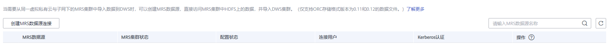
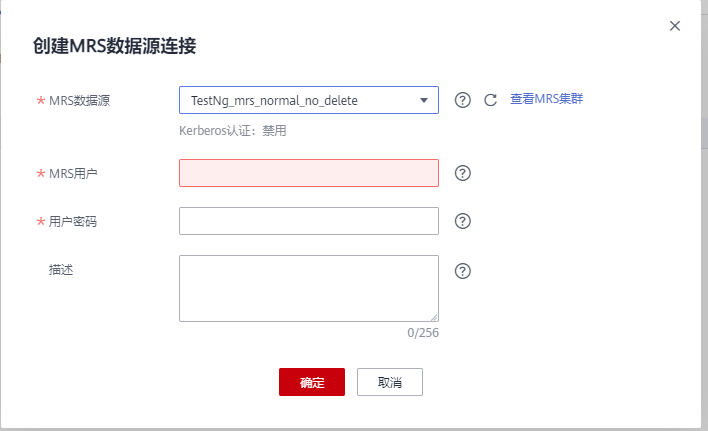

# 创建MRS数据源连接

## 操作场景

DWS从MRS的HDFS读取数据前，需要先创建一个MRS数据源连接，作为DWS集群与MRS集群的数据通道。

## 对系统的影响

-   一个DWS集群在创建MRS数据源连接时，不能同时创建第二个连接。
-   创建MRS数据源连接时，系统默认自动为DWS集群和MRS集群的安全组增加出规则和入规则，允许相同子网中节点的访问。
-   启用Kerberos认证的MRS集群，系统会自动增加一个类型为“机机“的用户，属于“supergroup“用户组。

## 前提条件

DWS集群已创建好，并记录集群所在的可用区、虚拟私有云和子网。

## 操作步骤

1.  登录[公有云管理控制台](https://console.huaweicloud.com)。
2.  单击“服务列表 \> EI 企业智能  \> MapReduce服务“，打开MRS管理控制台，创建MRS集群。

    创建集群时，请按要求配置以下参数，其他配置无特别要求，具体操作请参见《MapReduce服务用户指南》中的“配置集群 \> 创建集群“章节。

    -   MRS集群的可用区、虚拟私有云和子网需要和DWS集群相同。
    -   MRS集群类型，需要为“分析集群“。
    -   MRS集群版本，支持“1.2“、“1.3.0“、“1.5.0“、“1.5.1“、1.6.\*、1.7.\*、1.8.\*、2.0.\*。“\*”代表的是数字。
    -   组件选择，需要选择“Hive“和“Spark“。

    > **说明：**   
    >如果MRS集群启用Kerberos认证，则在MRS集群创建完成后，使用MRS Manager为DWS准备一个用于连接的用户，类型需要为“人机“，且绑定用户组“hadoop“和角色“Manager\_administrator“。此用户必须在创建后通过MRS Manager页面修改过密码。  

    如果已有符合如上条件的MRS集群，则可跳过此步骤。

3.  选择“服务列表 \> EI企业智能 \> 数据仓库服务”，进入DWS管理控制台页面。
4.  在DWS管理控制台，单击“集群管理“。
5.  在集群列表，单击指定集群的名称，然后单击“MRS数据源“页签。

    **图 1**  MRS数据源  
    

6.  单击“创建MRS数据源连接“，填写配置参数。

    **图 2**  创建MRS数据源  
    

    **表 1**  MRS连接参数说明

    
    <table><thead align="left"><tr id="row53231825142621"><th class="cellrowborder" valign="top" width="20.57%" id="mcps1.2.3.1.1">
参数名

    </th>
    <th class="cellrowborder" valign="top" width="79.43%" id="mcps1.2.3.1.2">
说明

    </th>
    </tr>
    </thead>
    <tbody><tr id="row14104303142621"><td class="cellrowborder" valign="top" width="20.57%" headers="mcps1.2.3.1.1 ">
MRS数据源

    </td>
    <td class="cellrowborder" valign="top" width="79.43%" headers="mcps1.2.3.1.2 ">
表示DWS可以连接的MRS集群，默认显示当前用户可连接的，与当前DWS集群在相同虚拟私有云和子网下且为可用状态的分析型MRS集群。

    
选择一个MRS集群后，将自动显示已选择的MRS是否启用了Kerberos认证。单击“查看MRS集群”可进入MRS查看该MRS集群信息。

    
如果“MRS数据源”下拉框为空，用户可以单击“创建MRS集群”进行创建。

    </td>
    </tr>
    <tr id="row22977368142941"><td class="cellrowborder" valign="top" width="20.57%" headers="mcps1.2.3.1.1 ">
MRS用户

    </td>
    <td class="cellrowborder" valign="top" width="79.43%" headers="mcps1.2.3.1.2 ">
表示DWS集群连接MRS集群时使用的用户名。仅选择Kerberos认证的MRS集群时有效。

    </td>
    </tr>
    <tr id="row65192618142942"><td class="cellrowborder" valign="top" width="20.57%" headers="mcps1.2.3.1.1 ">
用户密码

    </td>
    <td class="cellrowborder" valign="top" width="79.43%" headers="mcps1.2.3.1.2 ">
填写连接用户的密码。如果此用户密码被修改，需要重新创建连接。仅选择启用Kerberos认证的MRS集群时该参数有效。

    </td>
    </tr>
    <tr id="row895856614324"><td class="cellrowborder" valign="top" width="20.57%" headers="mcps1.2.3.1.1 ">
描述

    </td>
    <td class="cellrowborder" valign="top" width="79.43%" headers="mcps1.2.3.1.2 ">
表示此连接的说明信息。

    </td>
    </tr>
    </tbody>
    </table>

7.  单击“提交“保存连接。

    创建连接需要一段时间，此时“配置状态“显示为“创建中“，成功后在MRS数据源列表中可看到已创建的连接，且状态为“可用“。

    > **说明：**   
    >-   在“操作“列，可以单击“更新配置“，更新当前连接的“MRS集群状态“和“配置状态“。在更新配置时，无法创建新的连接，且会检查安全组规则是否正常并自助修复。具体请参见[更新MRS数据源配置](更新MRS数据源配置.md)。  
    >-   在“操作“列，可以单击“删除“将不再使用的连接删除释放。删除连接时，不会自动删除安全组规则，请根据需要手工删除。  

