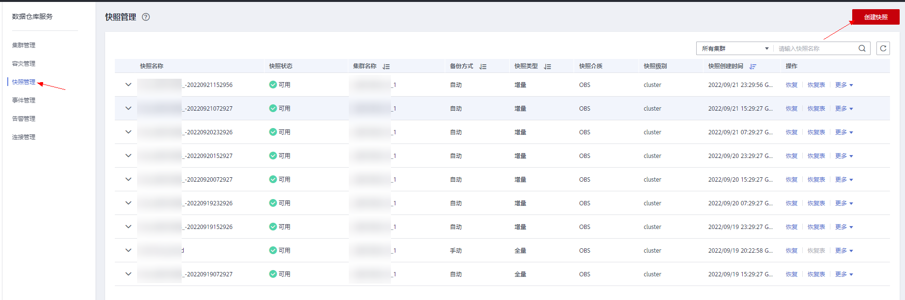
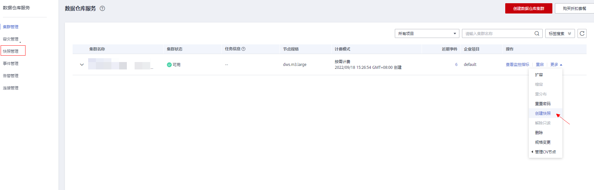

# 创建手动快照

## 前提条件

集群快照是GaussDB\(DWS\)集群在某一时间点的完整备份，记录了这一时刻指定集群的所有配置数据和业务数据。用户根据业务需要备份集群数据时，可以在“快照管理“页面创建集群的快照。

手动快照可以随时创建，在创建成功后会一直保存，直到GaussDB\(DWS\)控制台将此快照删除。由于创建手动快照采用全量备份的方式，因此备份时间较长。

> **说明：** 
>-   手动创建的集群粒度快照支持备份到OBS服务。
>-   待创建的集群粒度快照的集群状态必须为“可用”、“待重启”或“非均衡”中的任意一种，当版本低于8.1.3.101时，“只读”状态的集群也可创建集群粒度的快照。

## 系统影响

正在创建快照的集群，暂时无法提供完整服务，如无法执行重启、扩容、重置密码、修改集群配置信息等操作。

> **说明：** 
>为了保证快照数据的完整性，建议创建快照时暂停写入新数据。

## 操作步骤

1.  登录GaussDB\(DWS\) 管理控制台。
2.  在左侧导航栏中，单击“快照管理”页面右上角的“创建快照”或在集群管理页面选择指定集群所在行操作列“更多\>创建快照”。

    

    

3.  在快照创建页面完善快照信息：

    -   **“集群名称”**：选择一个指定的GaussDB\(DWS\) 集群。只有状态为“可用”的集群会在下拉列表中显示。
    -   **“快照名称”**：填写快照的名称。快照名称长度为4～64个字符，必须以字母开头，不区分大小写，可以包含字母、数字、中划线或者下划线，不能包含其他的特殊字符。
    -   **“快照级别”：**选择快照的级别，创建集群粒度的快照，快照级别需要选择为“cluster”。
    -   “**快照描述”**：填写快照的描述信息。此参数为可选参数。快照描述的字符长度为0～256，不支持特殊字符!<\>'=&"。

    

4.  确认无误后，单击“立即创建”，集群开始创建快照。

    创建快照时，正在创建快照的集群任务状态变为“创建快照中”。同时正在创建的快照，状态显示为“创建中”。快照创建完成后，快照的状态为“可用”。

    > **说明：** 
    >如果快照大小明显大于集群当前存储数据的大小，可能存在数据仅标记为删除但未真实清理回收，建议执行清理并重新创建快照，详情请参见[如何清理与回收存储空间](https://support.huaweicloud.com/dws_faq/dws_03_0033.html)。

