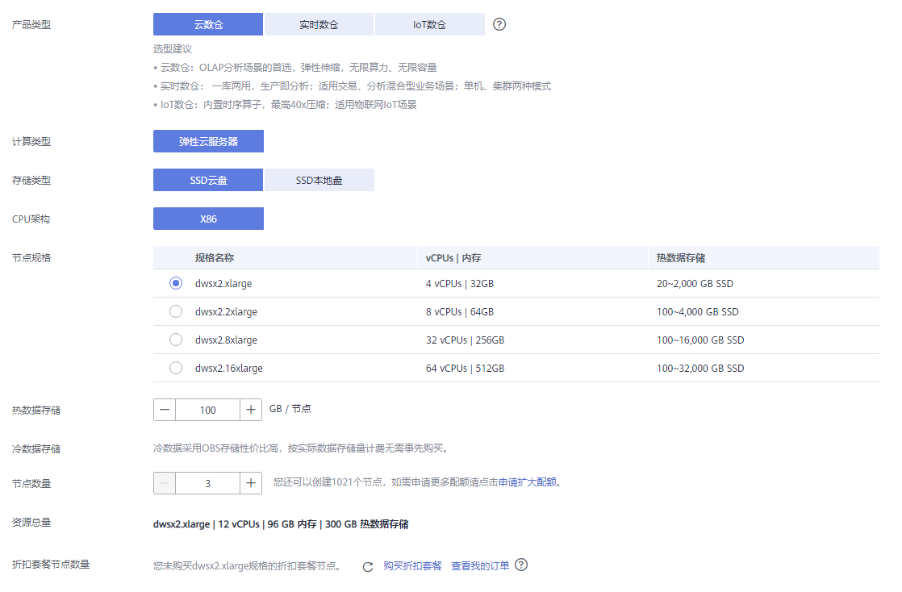
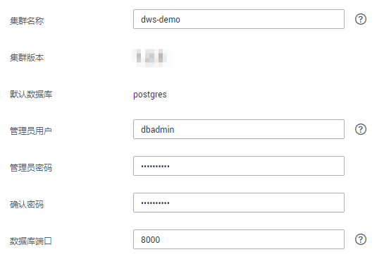
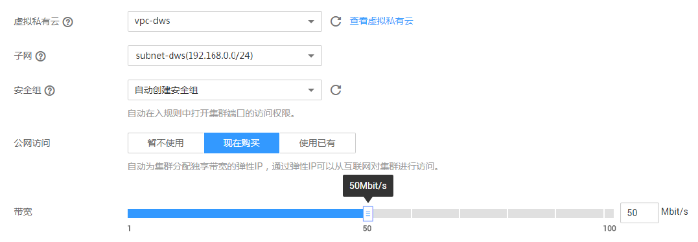
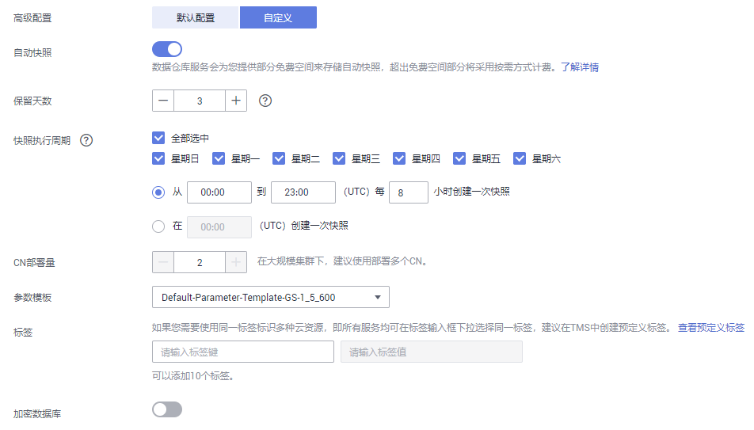

# 创建集群

如果用户需要在公有云环境中使用DWS，首先要创建一个数据仓库集群。创建数据仓库集群时默认采用按需付费方式，即节点按实际使用时长计费，计费周期为一小时。这种购买方式比较灵活，可以即开即停，按实际使用时长计费。您可根据业务需要，定制相应计算能力和存储空间的DWS集群。您也可以购买包年包月套餐，这种购买方式是按月/按年预付费，相比按需付费方式更优惠，具体操作请参见[购买包年包月套餐](购买包年包月套餐.md)。

本章节为您介绍如何在DWS管理控制台创建一个数据仓库集群。

## 创建集群前的准备

-   评估集群节点规格

    您可以根据数据量、业务负载以及性能需求，选择能够支撑业务应用的节点数量，数量越多，存储与计算能力越强。一个DWS集群节点上有两个DataNode实例。DataNode实例负责存储业务数据（支持行存、列存、混合存储）、执行数据查询任务以及返回执行结果的模块。

    刚开始使用DWS服务时，您也可以先创建一个规格较小的集群，今后随着数据量和业务负载的变化，再自由调整集群规模和节点规格，自由扩展而不中断业务。详情请参见[调整集群大小](调整集群大小.md)。

-   设计网络访问拓扑

    根据业务应用需要，规划合适的可用区并准备网络配置，使数据仓库集群与用户的其他公有云业务隔离。

-   请确定用户可使用的节点数满足如下条件，否则系统会提示无法创建集群。
    -   用户可使用的节点数大于或者等于3，因为创建集群至少需要3个节点。用户可使用的节点数可在“集群管理“页面查看。
    -   计划创建的集群的节点数小于或等于用户可使用的节点数。

## 创建集群

1.  通过访问以下地址登录DWS管理控制台：[https://console.huaweicloud.com/dws](https://console.huaweicloud.com/dws)。
2.  左侧导航栏单击“集群管理“，进入页面后，单击右上角的“创建数据仓库集群“按钮。
3.  选择“区域“。

    **表 1**  区域参数说明

    
    <table><thead align="left"><tr id="row11089193597"><th class="cellrowborder" valign="top" width="21.782178217821784%" id="mcps1.2.4.1.1">
<strong id="b31171919155917">参数名</strong>

    </th>
    <th class="cellrowborder" valign="top" width="53.46534653465347%" id="mcps1.2.4.1.2">
<strong id="b1712871995917">参数解释</strong>

    </th>
    <th class="cellrowborder" valign="top" width="24.752475247524753%" id="mcps1.2.4.1.3">
<strong id="b61373199593">样例值</strong>

    </th>
    </tr>
    </thead>
    <tbody><tr id="row8143819165910"><td class="cellrowborder" valign="top" width="21.782178217821784%" headers="mcps1.2.4.1.1 ">
区域

    </td>
    <td class="cellrowborder" valign="top" width="53.46534653465347%" headers="mcps1.2.4.1.2 ">
选择集群节点实际工作区域。

    
有关区域的详细信息，请参见<a href="https://developer.huaweicloud.com/endpoint?DWS" target="_blank" rel="noopener noreferrer">地区和终端节点</a>。

    </td>
    <td class="cellrowborder" valign="top" width="24.752475247524753%" headers="mcps1.2.4.1.3 ">
华北-北京一

    </td>
    </tr>
    <tr id="row521517197596"><td class="cellrowborder" valign="top" width="21.782178217821784%" headers="mcps1.2.4.1.1 ">
可用区

    </td>
    <td class="cellrowborder" valign="top" width="53.46534653465347%" headers="mcps1.2.4.1.2 ">
选择集群工作区域下关联的可用区。

    
关于区域和可用区的描述，请参见<a href="https://support.huaweicloud.com/dws_faq/dws_03_0052.html" target="_blank" rel="noopener noreferrer">区域和可用区</a>。

    </td>
    <td class="cellrowborder" valign="top" width="24.752475247524753%" headers="mcps1.2.4.1.3 ">
可用区1

    </td>
    </tr>
    </tbody>
    </table>

4.  选择“节点规格“。

    > **说明：**   
    >设置的节点数量不能大于用户可使用的节点配额或32个。如果可使用的节点配额不足，用户可以单击“申请更多配额“以提工单的形式申请更多节点配额。  
    >如果有符合业务需求的包年包月节点，建议先使用包年包月节点，节约费用。如果没有，单击“购买包年包月套餐“进行购买。  

    **图 1**  选择节点规格  
    

    **表 2**  主机规格参数说明

    
    <table><thead align="left"><tr id="row1858451161414"><th class="cellrowborder" valign="top" width="20.41%" id="mcps1.2.4.1.1">
<strong id="b759471114147">参数名</strong>

    </th>
    <th class="cellrowborder" valign="top" width="60.4%" id="mcps1.2.4.1.2">
<strong id="b560014116143">参数解释</strong>

    </th>
    <th class="cellrowborder" valign="top" width="19.189999999999998%" id="mcps1.2.4.1.3">
<strong id="b1660711120141">样例值</strong>

    </th>
    </tr>
    </thead>
    <tbody><tr id="row361421141419"><td class="cellrowborder" valign="top" width="20.41%" headers="mcps1.2.4.1.1 ">
节点规格

    </td>
    <td class="cellrowborder" valign="top" width="60.4%" headers="mcps1.2.4.1.2 ">
节点类型有：

    <ul id="ul1563413351816"><li><strong id="b176341533121817">计算密集型</strong>：计算密集型节点配置了IO性能更高的SSD磁盘，适合高并发低延迟等交互查询业务场景。</li><li><strong id="b11634163318181">存储密集型</strong>：存储密集型节点配备了容量更大，但I/O速度稍低的HDD磁盘。适合数据存储量大，但对查询并发和时延没有过高要求的业务场景，比如批量任务。</li></ul>
    <ul id="ul7702609106"><li><strong id="b197038091018">鲲鹏计算型</strong>：鲲鹏计算型采用鲲鹏架构，配置了IO性能更高的SSD磁盘，适合高并发低时延等交互查询业务场景。</li></ul>
    
请根据业务需求合理选择节点类型。在节点类型列表中展示了每一种节点类型单个节点的vCPU、内存、存储、I/O、并发队列数和建议使用场景。其中，“并发队列数”是系统支持最大限度的并发作业数，与规格强相关。

    

    
DWS支持的节点类型及其价格详情，请参见<a href="https://www.huaweicloud.com/pricing.html?tab=detail#/dws" target="_blank" rel="noopener noreferrer">DWS价格详情</a>。

    </td>
    <td class="cellrowborder" valign="top" width="19.189999999999998%" headers="mcps1.2.4.1.3 ">
计算密集型：dws.dc.4xlarge

    </td>
    </tr>
    <tr id="row4633711181419"><td class="cellrowborder" valign="top" width="20.41%" headers="mcps1.2.4.1.1 ">
节点数量

    </td>
    <td class="cellrowborder" valign="top" width="60.4%" headers="mcps1.2.4.1.2 ">
选择集群中的节点个数。

    
支持的节点数范围为3～32。

    </td>
    <td class="cellrowborder" valign="top" width="19.189999999999998%" headers="mcps1.2.4.1.3 ">
3

    </td>
    </tr>
    <tr id="row17311142114"><td class="cellrowborder" valign="top" width="20.41%" headers="mcps1.2.4.1.1 ">
总容量（TB）

    </td>
    <td class="cellrowborder" valign="top" width="60.4%" headers="mcps1.2.4.1.2 ">
显示集群的总容量。

    
各个规格对应的存储容量均为数据库存储数据的实际空间，所展示存储容量已扣除副本、RAID所消耗的磁盘空间。

    </td>
    <td class="cellrowborder" valign="top" width="19.189999999999998%" headers="mcps1.2.4.1.3 ">
-

    </td>
    </tr>
    <tr id="row107116591115"><td class="cellrowborder" valign="top" width="20.41%" headers="mcps1.2.4.1.1 ">
包年包月节点数量

    </td>
    <td class="cellrowborder" valign="top" width="60.4%" headers="mcps1.2.4.1.2 ">
显示当前区域内所选节点规格的包年包月节点数量。

    <ul id="ul120312573277"><li>如果当前未购买过包年包月弹出，也可以单击“购买包年包月套餐”进行购买，请参考<a href="购买包年包月套餐.md">购买包年包月套餐</a>。</li><li>如果已购买包年包月套餐，包年包月节点数量范围内的节点在包年包月订单有效期内将不再另外收费（因为您前期购买包年包月套餐时已经支付过费用），若所选的集群节点数量超过包年包月节点数量，超过的部分按需计费。
例如：当前选择“节点数量”为3，若“包年包月节点数量”为2，那么2个节点在包年包月订单有效期内不再另外收费，1个节点按需计费。

    </li></ul>
    </td>
    <td class="cellrowborder" valign="top" width="19.189999999999998%" headers="mcps1.2.4.1.3 ">
-

    </td>
    </tr>
    </tbody>
    </table>

5.  填写“集群配置“参数。

    **图 2**  集群参数  
    

    **表 3**  集群配置参数说明

    
    <table><thead align="left"><tr id="row9384101317142"><th class="cellrowborder" valign="top" width="16.7029702970297%" id="mcps1.2.4.1.1">
<strong id="b3389201311142">参数名</strong>

    </th>
    <th class="cellrowborder" valign="top" width="63.95049504950495%" id="mcps1.2.4.1.2">
<strong id="b18392413141413">参数解释</strong>

    </th>
    <th class="cellrowborder" valign="top" width="19.346534653465344%" id="mcps1.2.4.1.3">
<strong id="b1639301351415">样例值</strong>

    </th>
    </tr>
    </thead>
    <tbody><tr id="row13844134148"><td class="cellrowborder" valign="top" width="16.7029702970297%" headers="mcps1.2.4.1.1 ">
集群名称

    </td>
    <td class="cellrowborder" valign="top" width="63.95049504950495%" headers="mcps1.2.4.1.2 ">
设置数据仓库集群的名称。

    
集群名称长度为4到64个字符，必须以字母开头，可以包含字母、数字、中划线或者下划线，不能包含其他的特殊字符。字母不区分大小写。

    </td>
    <td class="cellrowborder" valign="top" width="19.346534653465344%" headers="mcps1.2.4.1.3 ">
dws-demo

    </td>
    </tr>
    <tr id="row13861713161413"><td class="cellrowborder" valign="top" width="16.7029702970297%" headers="mcps1.2.4.1.1 ">
集群版本

    </td>
    <td class="cellrowborder" valign="top" width="63.95049504950495%" headers="mcps1.2.4.1.2 ">
显示集群中安装的数据库实例版本。

    
 说明： 

版本号为系统默认，暂不支持修改。

    

    </td>
    <td class="cellrowborder" valign="top" width="19.346534653465344%" headers="mcps1.2.4.1.3 ">
1.5.600

    </td>
    </tr>
    <tr id="row14386171315141"><td class="cellrowborder" valign="top" width="16.7029702970297%" headers="mcps1.2.4.1.1 ">
默认数据库

    </td>
    <td class="cellrowborder" valign="top" width="63.95049504950495%" headers="mcps1.2.4.1.2 ">
显示集群的默认数据库名称“postgres”。

    
 说明： 

“postgres”为默认数据库名称，暂不支持修改。

    

    </td>
    <td class="cellrowborder" valign="top" width="19.346534653465344%" headers="mcps1.2.4.1.3 ">
postgres

    </td>
    </tr>
    <tr id="row73871513111412"><td class="cellrowborder" valign="top" width="16.7029702970297%" headers="mcps1.2.4.1.1 ">
管理员用户

    </td>
    <td class="cellrowborder" valign="top" width="63.95049504950495%" headers="mcps1.2.4.1.2 ">
设置数据库的管理员用户名称。

    
用户命名要求如下：

    <ul id="ul1838791391412"><li>只能由小写字母、数字或下划线组成。</li><li>必须以小写字母或下划线开头。</li><li>长度为1～63个字符。</li><li>用户名不能为DWS数据库的关键字。DWS数据库的关键字，具体请参见《数据仓库服务数据库开发指南》中<a href="https://support.huaweicloud.com/devg-dws/keyword.html" target="_blank" rel="noopener noreferrer">关键字</a>章节。</li></ul>
    </td>
    <td class="cellrowborder" valign="top" width="19.346534653465344%" headers="mcps1.2.4.1.3 ">
dbadmin

    </td>
    </tr>
    <tr id="row10387113111411"><td class="cellrowborder" valign="top" width="16.7029702970297%" headers="mcps1.2.4.1.1 ">
管理员密码

    </td>
    <td class="cellrowborder" valign="top" width="63.95049504950495%" headers="mcps1.2.4.1.2 ">
设置数据库管理员用户的密码。

    
密码复杂度要求如下：<ul id="ul13418111318144"><li>密码长度为8～32个字符。</li><li>不能与用户名或倒序的用户名相同。</li><li>密码至少包含大写字母、小写字母、数字和特殊字符四类中的三类，其中可输入的特殊字符为：~!@#%^&amp;*()-_=+|[{}];:,&lt;.&gt;/?</li><li>弱口令检查。</li></ul>
    

    
 说明： 

请妥善保管并定期更新密码，避免安全风险。

    

    </td>
    <td class="cellrowborder" valign="top" width="19.346534653465344%" headers="mcps1.2.4.1.3 ">
Dws2018demo!

    </td>
    </tr>
    <tr id="row14387141315145"><td class="cellrowborder" valign="top" width="16.7029702970297%" headers="mcps1.2.4.1.1 ">
确认密码

    </td>
    <td class="cellrowborder" valign="top" width="63.95049504950495%" headers="mcps1.2.4.1.2 ">
重复输入一次数据库管理员用户的密码。

    </td>
    <td class="cellrowborder" valign="top" width="19.346534653465344%" headers="mcps1.2.4.1.3 ">
Dws2018demo!

    </td>
    </tr>
    <tr id="row938781319144"><td class="cellrowborder" valign="top" width="16.7029702970297%" headers="mcps1.2.4.1.1 ">
数据库端口

    </td>
    <td class="cellrowborder" valign="top" width="63.95049504950495%" headers="mcps1.2.4.1.2 ">
设置客户端或应用程序连接集群数据库时使用的端口。

    
支持的端口范围为8000～30000。

    </td>
    <td class="cellrowborder" valign="top" width="19.346534653465344%" headers="mcps1.2.4.1.3 ">
8000

    </td>
    </tr>
    </tbody>
    </table>

6.  配置“网络“。

    **图 3**  网络参数  
    

    **表 4**  网络参数说明

    
    <table><thead align="left"><tr id="row3540181381411"><th class="cellrowborder" valign="top" width="20.32673267326733%" id="mcps1.2.4.1.1">
<strong id="b95451913111416">参数名</strong>

    </th>
    <th class="cellrowborder" valign="top" width="60.99009900990099%" id="mcps1.2.4.1.2">
<strong id="b85461813181419">参数解释</strong>

    </th>
    <th class="cellrowborder" valign="top" width="18.683168316831683%" id="mcps1.2.4.1.3">
<strong id="b1154691312147">样例值</strong>

    </th>
    </tr>
    </thead>
    <tbody><tr id="row1540171331413"><td class="cellrowborder" valign="top" width="20.32673267326733%" headers="mcps1.2.4.1.1 ">
虚拟私有云

    </td>
    <td class="cellrowborder" valign="top" width="60.99009900990099%" headers="mcps1.2.4.1.2 ">
指定集群节点使用的虚拟专用网络，实现不同业务的网络隔离。

    
首次创建数据仓库集群时，如果未配置过虚拟私有云，可以单击“查看虚拟私有云”进入虚拟私有云管理控制台，新创建一个满足需求的虚拟私有云。

    
如何创建虚拟私有云，具体请参见《虚拟私有云用户指南》中的<a href="https://support.huaweicloud.com/usermanual-vpc/zh-cn_topic_0013935842.html" target="_blank" rel="noopener noreferrer">创建虚拟私有云和子网</a>章节。

    
在下拉框中选择一个虚拟私有云后，单击“查看虚拟私有云”可以进入虚拟私有云管理控制台查看虚拟私有云的详细信息。

    
单击可以刷新“虚拟私有云”下拉框中选项值。

    </td>
    <td class="cellrowborder" valign="top" width="18.683168316831683%" headers="mcps1.2.4.1.3 ">
vpc-dws

    </td>
    </tr>
    <tr id="row1054151312147"><td class="cellrowborder" valign="top" width="20.32673267326733%" headers="mcps1.2.4.1.1 ">
子网

    </td>
    <td class="cellrowborder" valign="top" width="60.99009900990099%" headers="mcps1.2.4.1.2 ">
指定虚拟私有云的一个子网。

    
集群使用子网实现与其他网络的隔离，并独享所有网络资源，以提高网络安全。

    </td>
    <td class="cellrowborder" valign="top" width="18.683168316831683%" headers="mcps1.2.4.1.3 ">
subnet-dws

    </td>
    </tr>
    <tr id="row85411713171419"><td class="cellrowborder" valign="top" width="20.32673267326733%" headers="mcps1.2.4.1.1 ">
安全组

    </td>
    <td class="cellrowborder" valign="top" width="60.99009900990099%" headers="mcps1.2.4.1.2 ">
指定虚拟私有云的安全组。

    
安全组限制安全访问规则，加强集群与其它服务间的安全访问。

    <ul id="ul244311341000"><li>自动创建安全组
系统默认选中“自动创建安全组”，设置为该选项时，系统将会自动创建一个默认安全组。

    
默认安全组的规则如下：出方向允许所有访问，入方向只开放用户设置的DWS集群的数据库端口。

    
默认安全组的名称，其格式如下：dws-&lt;<em id="i868893162710">集群名称</em>&gt;-&lt;<em id="i133555374277">DWS集群的数据库端口</em>&gt;，例如，dws-dws-demo-8000。

    
 说明： 

如果安全组和安全组规则的配额不足，提交创建集群申请后系统会报错，用户可以选择已有的安全组后重试。

    

    </li><li>手动创建并配置安全组
用户也可以登录<a href="https://console.huaweicloud.com/vpc" target="_blank" rel="noopener noreferrer">VPC管理控制台</a>手动创建一个安全组，然后回到DWS创建集群页面，单击“安全组”下拉列表旁边的按钮，刷新后在“安全组”下拉列表中选择新建的安全组。

    
为了使DWS客户端可以连接集群，用户需要在新建的安全组中添加一条入规则，开放DWS集群的数据库端口的访问权限。入规则示例如下：

    <ul id="ul834751052511"><li>协议：TCP</li><li>端口范围：8000。指定为创建DWS集群时设置的数据库端口，这个端口是DWS用于接收客户端连接的端口。</li><li>源地址：选中“IP地址”，然后指定为客户端主机的IP地址，例如“192.168.0.10/32”。</li></ul>
    </li></ul>
    </td>
    <td class="cellrowborder" valign="top" width="18.683168316831683%" headers="mcps1.2.4.1.3 ">
自动创建安全组

    </td>
    </tr>
    <tr id="row138021539133519"><td class="cellrowborder" valign="top" width="20.32673267326733%" headers="mcps1.2.4.1.1 ">
公网访问

    </td>
    <td class="cellrowborder" valign="top" width="60.99009900990099%" headers="mcps1.2.4.1.2 ">
指定用户是否可以在互联网上使用客户端连接集群数据库。支持如下方式：

    <ul id="ul43786513356"><li>“暂不使用”：暂不使用弹性IP。</li><li>“现在购买”：用户指定弹性IP的带宽，系统将自动为集群分配独享带宽的弹性IP，通过弹性IP可以从互联网对集群进行访问。自动分配的弹性IP的带宽名称都是以集群名称开头的。</li><li>“使用已有”：为集群绑定指定的弹性IP。如果下拉框中没有可用的弹性IP，可以单击“创建弹性IP”进入弹性公网IP页面创建一个满足需要的弹性IP。带宽可根据用户需要设置。</li></ul>
    
 说明： 

每个区域的每个项目首次使用弹性IP绑定功能时，系统将提示创建名称为“DWSAccessVPC”委托以授权DWS访问VPC。授权成功后，DWS可以在绑定弹性IP的虚拟机故障时切换至健康虚拟机。

    
默认情况下，只有华为云账号或拥有Security Administrator权限的用户才具备创建委托的权限。账号中的IAM用户，默认没有创建委托的权限，需联系有权限的用户在当前页面完成对DWS的委托授权。

    

    </td>
    <td class="cellrowborder" valign="top" width="18.683168316831683%" headers="mcps1.2.4.1.3 ">
现在购买

    </td>
    </tr>
    <tr id="row68992056153010"><td class="cellrowborder" valign="top" width="20.32673267326733%" headers="mcps1.2.4.1.1 ">
带宽

    </td>
    <td class="cellrowborder" valign="top" width="60.99009900990099%" headers="mcps1.2.4.1.2 ">
当“公网访问”选择“现在购买”时，需指定弹性IP的带宽，设置范围：1～100Mbit/s。

    </td>
    <td class="cellrowborder" valign="top" width="18.683168316831683%" headers="mcps1.2.4.1.3 ">
50Mbit/s

    </td>
    </tr>
    </tbody>
    </table>

7.  配置集群所属的企业项目。已开通企业项目管理服务的用户才可以配置该参数。默认值为default。

    企业项目是一种云资源管理方式，企业项目管理服务提供统一的云资源按项目管理，以及项目内的资源管理、成员管理。

    您可以选择默认的企业项目“default“或其他已有的企业项目。如果要创建新的企业项目，请登录企业管理控制台进行创建，详细操作请参考《企业管理用户指南》。

8.  设置高级配置。选择“自定义“时，您可以设置以下高级配置参数，若选择“默认配置“，以下参数将使用它们的默认值。

    **图 4**  自定义高级配置  
    

    -   **自动快照**

        表示开启自动快照策略，默认为开启。开启后，系统会按照设定的时间和周期自动创建快照。开启时请设置以下快照策略参数。如[图4](#fig1995613612575)所示的值即为快照参数的默认值。

        **表 5**  快照策略参数说明

        
        <table><thead align="left"><tr id="dws_01_0089_row555312181040"><th class="cellrowborder" valign="top" width="18.4%" id="mcps1.2.3.1.1">
参数名

        </th>
        <th class="cellrowborder" valign="top" width="81.6%" id="mcps1.2.3.1.2">
参数解释

        </th>
        </tr>
        </thead>
        <tbody><tr id="dws_01_0089_row155542181842"><td class="cellrowborder" valign="top" width="18.4%" headers="mcps1.2.3.1.1 ">
保留天数

        </td>
        <td class="cellrowborder" valign="top" width="81.6%" headers="mcps1.2.3.1.2 ">
设置自动创建的快照的保留天数，可设置范围为1~31天。

        
 说明： 

用户不能手动删除自动创建的快照，自动快照保留天数超期后，系统会自动删除。

        

        </td>
        </tr>
        <tr id="dws_01_0089_row6972171581119"><td class="cellrowborder" valign="top" width="18.4%" headers="mcps1.2.3.1.1 ">
快照执行周期

        </td>
        <td class="cellrowborder" valign="top" width="81.6%" headers="mcps1.2.3.1.2 ">
设置创建自动快照的周期。可以设置每周哪几天创建自动快照，以及创建自动快照的频率，支持每天创建一次或者每天间隔几个小时创建一次自动快照。

        </td>
        </tr>
        </tbody>
        </table>

    -   **CN部署量**

        CN即协调节点（Coordinator Node），负责接收来自应用的访问请求，并向客户端返回执行结果，此外，协调节点还负责分解任务，并调度任务分片在各DN上并行执行。

        取值范围为2\~集群节点数-1，最大值为5，默认值为2。在大规模集群下，建议部署多个CN。

    -   **参数模板**

        参数模板是一组适用于数据仓库的参数集合。在“参数模板“下拉列表中选择一个参数模板与集群相关联。可以选择默认的参数模板或者自定义创建的参数模板。默认情况下，集群关联系统默认的数据库参数模板。

        有关参数模板的更多信息，请参见[管理参数模板](管理参数模板.md)。

    -   **标签**

        标签（Tag）是用于标识集群的键值对。键和值请参见[表6](#table327331910318)。默认未给集群添加标签。

        有关标签的更多信息，请参见[标签简介](标签简介.md)。

        **表 6**  标签配置参数

        
        <table><thead align="left"><tr id="dws_01_0105_row17486121763113"><th class="cellrowborder" valign="top" width="8.799999999999999%" id="mcps1.2.4.1.1">
参数

        </th>
        <th class="cellrowborder" valign="top" width="77.12%" id="mcps1.2.4.1.2">
参数说明

        </th>
        <th class="cellrowborder" valign="top" width="14.08%" id="mcps1.2.4.1.3">
样例值

        </th>
        </tr>
        </thead>
        <tbody><tr id="dws_01_0105_row11486131733111"><td class="cellrowborder" valign="top" width="8.799999999999999%" headers="mcps1.2.4.1.1 ">
键

        </td>
        <td class="cellrowborder" valign="top" width="77.12%" headers="mcps1.2.4.1.2 ">
您可以选择：

        <ul id="dws_01_0105_ul149381653121514"><li>在输入框的下拉列表中选择预定义标签键或集群已有的资源标签键。
 说明： 

如果添加预定义标签，用户需要预先在标签管理服务中创建好预定义标签，然后在“键”的下拉框中进行选择。用户可以通过单击“查看预定义标签”进入标签管理服务的“预定义标签”页面，然后单击“创建标签”来创建新的预定义标签。更多信息请参见《标签管理服务用户指南》中的<a href="https://support.huaweicloud.com/usermanual-tms/zh-cn_topic_0144368884.html" target="_blank" rel="noopener noreferrer">创建预定义标签</a>。

        

        </li></ul>
        <ul id="dws_01_0105_ul154819568159"><li>在输入框中输入标签键名称。输入标签键的最大长度为36个unicode字符，不能为空字符串，且首尾字符不能为空格。
不能包含“=”,“*”,“&lt;”,“&gt;”,“\\”,“,”,“|”,“/”。

        

 说明： 

同一集群中的键名不能重复。

        

        

        </li></ul>
        </td>
        <td class="cellrowborder" valign="top" width="14.08%" headers="mcps1.2.4.1.3 ">
key01

        </td>
        </tr>
        <tr id="dws_01_0105_row19486151715318"><td class="cellrowborder" valign="top" width="8.799999999999999%" headers="mcps1.2.4.1.1 ">
值

        </td>
        <td class="cellrowborder" valign="top" width="77.12%" headers="mcps1.2.4.1.2 ">
您可以选择：

        <ul id="dws_01_0105_ul12885203215142"><li>在输入框的下拉列表中选择预定义标签值或集群的资源标签值。</li><li>在输入框中输入标签值。输入标签值的最大长度为43个字符，首尾字符不能为空格，可以为空字符串。
不能包含“=”,“*”,“&lt;”,“&gt;”,“\\”,“,”,“|”,“/”。

        </li></ul>
        </td>
        <td class="cellrowborder" valign="top" width="14.08%" headers="mcps1.2.4.1.3 ">
value01

        </td>
        </tr>
        </tbody>
        </table>

    -   **加密数据库**

        表示不启用数据库加密功能，默认为不启用。

        表示开启数据库加密功能。开启后，DWS将使用DEW（数据加密服务）为集群及其快照的数据启用加密功能。

        每个区域的每个项目首次启用数据库加密时，系统会弹出一个“创建委托”的对话框，单击“是“创建名为“DWSAccessKMS”的委托以授权DWS访问KMS，若单击“否“将不会启用加密功能。然后在“密钥名称“的下拉列表中选择已创建的KMS密钥。如果没有KMS密钥，可以登录KMS服务进行创建，详细操作请参见[《数据加密服务用户指南》](https://support.huaweicloud.com/dew/index.html)。

        默认情况下，只有华为云账号或拥有Security Administrator权限的用户才具备创建委托的权限。账号中的IAM用户，默认没有创建委托的权限，需联系有权限的用户在当前页面完成对DWS的委托授权。

        **图 5**  加密数据库  
        

        > **须知：**   
        >-   数据库加密功能一旦开启就无法关闭。  
        >-   开启数据库加密功能后，用于加密DWS数据库的KMS密钥在使用过程中不能被禁用、删除或冻结，否则会导致DWS集群异常或数据库不可用。  

9.  单击“立即购买“，进入“规格详情“页面。

    > **说明：**   
    >如果申请的节点数（个）、vCPU（核）或内存（GB）超过了用户的剩余配额，系统会弹出警告窗口提示用户配额不足并显示详细的剩余配额和当前申请配额信息。用户可以在警告窗口单击“申请更多配额“以提工单的形式申请更多配额。  
    >关于配额，请参见[什么是用户配额？](https://support.huaweicloud.com/dws_faq/dws_03_0034.html)。  

10. 单击“提交“。

    提交成功后开始创建。单击“返回集群列表“返回集群管理页面，所创集群的初始状态为“创建中“，集群创建需要时间，请等待一段时间。创建成功后状态更新为“可用“，用户可以开始使用集群。

