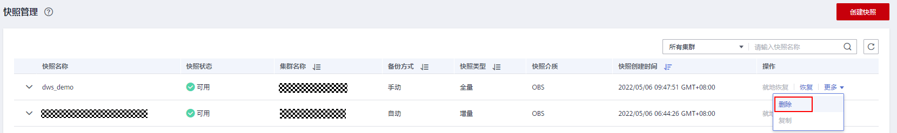
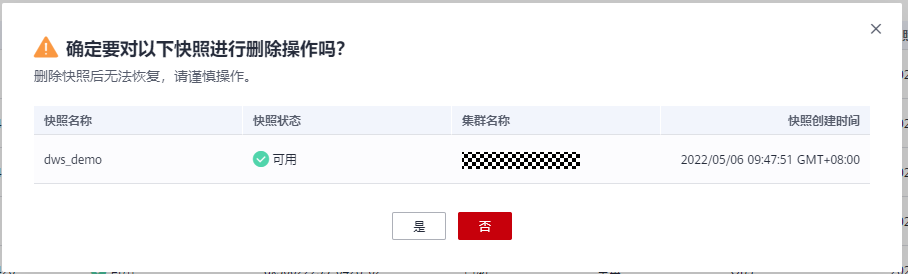

# 删除手动快照

用户需要删除状态为“不可用”的快照，或者需要释放快照所占用的存储空间时，可以在**“快照管理”**中删除不再使用的快照。

> **注意：** 
>成功删除的快照无法恢复，用户请谨慎操作。

## 操作步骤

1.  登录GaussDB\(DWS\) 管理控制台。
2.  在左侧导航栏中，选择“快照管理”。默认显示用户所有的快照。
3.  在快照列表中，在需要删除的快照所对应的“操作”列，单击“更多\>删除”按钮。

    

    > **说明：** 
    >用户可以对手动快照进行删除，自动快照不支持删除。

4.  确认无误后，在弹出窗口中单击“是”，删除此快照。

    

