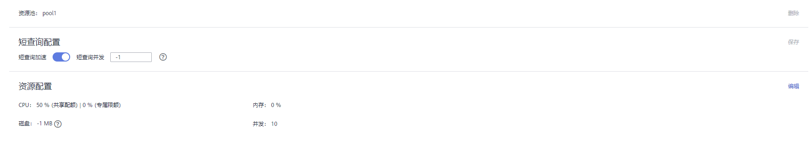

# 删除资源池

1.  登录GaussDB\(DWS\) 管理控制台。
2.  在集群列表中单击需要访问“资源管理”页面的集群名称。
3.  切换至“资源管理”页签。
4.  在左侧“资源池”中单击需要删除的资源池名称。
5.  单击右侧的“删除”。

    > **说明：** 
    >删除资源池时如果资源池中有关联的数据库用户，那么资源池删除后这些用户将被关联至默认资源池。

    

