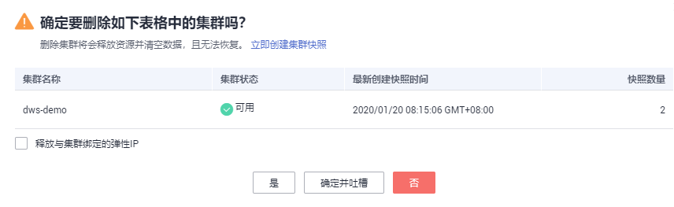

# 删除集群

## 操作场景

当用户不再需要使用某个集群时，可以参考如下操作删除该集群。

## 对系统的影响

成功删除的集群无法恢复，同时集群中的用户数据、自动快照也会自动删除且无法再访问。删除集群时不会删除手动快照。

## 操作步骤

1.  通过访问以下地址登录DWS管理控制台：[https://console.huaweicloud.com/dws](https://console.huaweicloud.com/dws)。
2.  单击管理控制台左上角的，选择区域。
3.  在“集群管理“页面，查找到所要删除的集群。
4.  在集群所在行，单击“更多  \>  删除“。
5.  在弹出对话框中，再次进行删除确认，您可以选择是否执行以下操作：

    -   立即创建集群快照

        如果集群状态无异常，您可以单击“立即创建集群快照“，然后在弹出窗口中输入快照名称并单击“确定”，为待删除的集群创建一个最新的快照。等快照创建完成后，请再返回“集群管理”页面执行删除集群的操作。

    -   释放与集群绑定的弹性IP

        如果集群绑定了弹性IP，建议您勾选“释放与集群绑定的弹性IP“，将待删除集群的弹性IP资源释放。如果不释放，弹性IP将仍然按照虚拟私有云（VPC）服务的弹性公网IP计费规则进行计费。

    **图 1**  删除集群  
    

6.  单击“是“，删除此集群。

    如果待删除集群使用了自动创建的安全组，且该自动创建的安全组没有被别的集群使用，删除集群时，该安全组也会被一并删除。

