# 包年/包月计费操作

如果您需长期使用当前集群，为节省开支，可以将按需购买的集群转为包年/包月计费模式（也称为包周期计费模式）。按需转包年/包月的具体操作，请参见本章节内容：

-   [按需转包年/包月](#section1522052192410)
-   [包年/包月转按需](#section1696910684520)
-   [包年/包月续费](#section452081175513)
-   [包年/包月退订](#section3479583117)

> **说明：** 
>-   按需计费：按需计费是后付费模式，根据集群的实际使用时长计费，可以随时创建/删除集群。
>-   包年/包月：包年/包月是预付费模式，根据订单的购买周期计费，适用于可预估资源使用周期的场景，价格比按需计费模式更优惠。

## **按需转包年/包月**

**前提条件**

集群的计费模式是“按需计费”。

> **须知：** 
>如果当前集群的规格与您的折扣套餐包的规格相同，需要注意如下事项：
>-   转包年/包月后，当前集群中的所有节点都会按照包年/包月形式计费，折扣套餐包会对当前集群失效，但仍会计时。
>-   当前集群转包年/包月后，折扣套餐包会自动关联您相同规格按需计费的其他集群，如果不存在，则折扣套餐包失效，但仍会计时。
>-   如果包年/包月到期后，会优先按照未过期的折扣套餐包关联集群，否则按需计费。

**操作步骤**

1.  登录GaussDB\(DWS\) 管理控制台。
2.  单击“集群管理”。默认显示用户所有的集群列表。
3.  在集群列表中，在指定集群所在行的“操作”列，选择“转包周期”。

    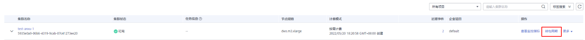

4.  跳转至CBC按需转包年/包月页面，选择时长和是否续费时长后，单击“支付”按钮。

    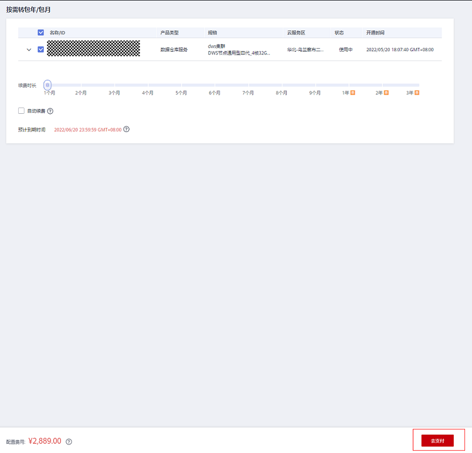

5.  确认无误后，单击“确认付款”，支付订单。

    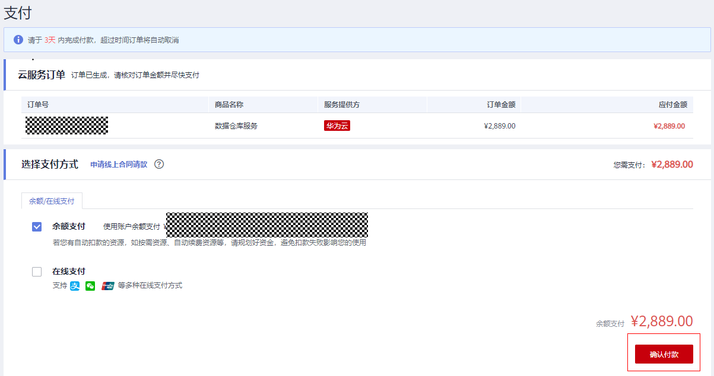

6.  返回集群管理页面单击，按需计费集群将转为包年/包月计费模式。

    

## **包年/包月转按需**

**前提条件**

-   集群的计费模式是“包年/包月”。
-   包年/包月转按需，需包年/包月资费模式到期后，按需的资费模式才会生效。

    > **说明：** 
    >包年包月集群在宽限期和保留期内不支持转为按需。

**操作步骤**

1.  登录GaussDB\(DWS\) 管理控制台。
2.  单击“集群管理”。默认显示用户所有的集群列表。
3.  在集群列表中，在指定集群所在行的“操作”列，选择“更多 \> 转按需”。

    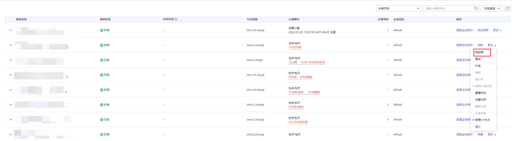

4.  跳转到CBC到期转按需页面，单击“到期转按需”按钮。

    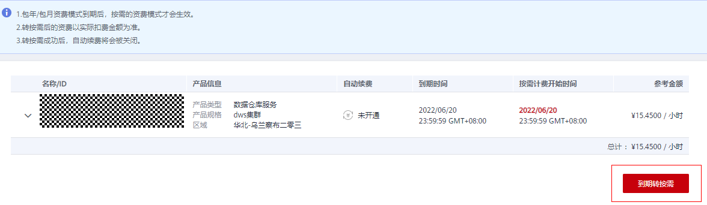

5.  返回集群管理页面单击，包年/包月计费模式集群将在到期后转为按需。

    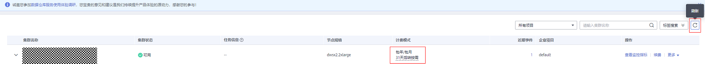

## 包年/包月续费

**前提条件**

集群的计费模式是“包年/包月”。

**操作步骤**

1.  登录GaussDB\(DWS\) 管理控制台。
2.  单击“集群管理”。默认显示用户所有的集群列表。
3.  在集群列表中，在指定集群所在行的“操作”列，选择“续费”。

    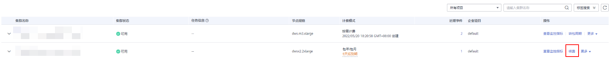

4.  跳转至CBC续费页面，确定无误后，支付订单。

    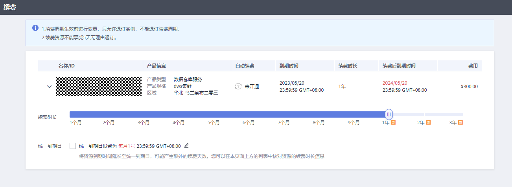

    **表 1**  续费参数说明

    
    <table><thead align="left"><tr id="row164538329530"><th class="cellrowborder" valign="top" width="12.86%" id="mcps1.2.3.1.1">
参数

    </th>
    <th class="cellrowborder" valign="top" width="87.14%" id="mcps1.2.3.1.2">
参数说明

    </th>
    </tr>
    </thead>
    <tbody><tr id="row104530320536"><td class="cellrowborder" valign="top" width="12.86%" headers="mcps1.2.3.1.1 ">
续费时长

    </td>
    <td class="cellrowborder" valign="top" width="87.14%" headers="mcps1.2.3.1.2 ">
选择续费时长。

    </td>
    </tr>
    <tr id="row345353255310"><td class="cellrowborder" valign="top" width="12.86%" headers="mcps1.2.3.1.1 ">
统一到期日

    </td>
    <td class="cellrowborder" valign="top" width="87.14%" headers="mcps1.2.3.1.2 ">
用户可根据自身需求选择是否勾选“统一到期日设置为每月1号”，默认为每月最后一天到期。

    
 说明： 

将资源到期时间延长至统一到期日，可能产生额外的续费天数。

    

    </td>
    </tr>
    </tbody>
    </table>

5.  返回集群管理页面单击，刷新集群列表。

    

## 包年/包月退订

**前提条件**

集群的计费模式是“包年/包月”。

> **说明：** 
>-   包年/包月集群在宽限期和保留期不支持退订，可在费用中心的续费管理处单击释放资源。
>-   包年/包月集群在保留期会被冻结，快照会随集群一同冻结，在保留期到期后自动删除。
>-   成功退订的包年/包月集群无法恢复，同时集群中的用户数据、自动快照也会自动删除且无法再访问。退订包年/包月集群时不会删除手动快照。

**注意事项**

续费周期生效前进行变更，只允许退订集群，DWS页面不支持退订续费周期。

**操作步骤**

1.  登录GaussDB\(DWS\) 管理控制台。
2.  单击“集群管理”。默认显示用户所有的集群列表。
3.  在集群列表中，在指定集群所在行的“操作”列，选择“更多 \> 退订”。

    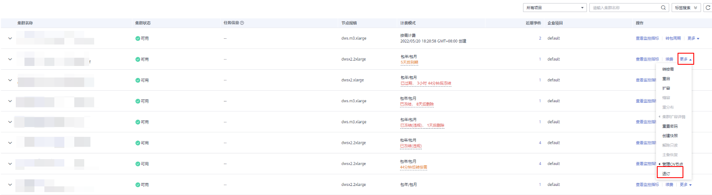

4.  在退订弹出对话框中，单击“确定”。

    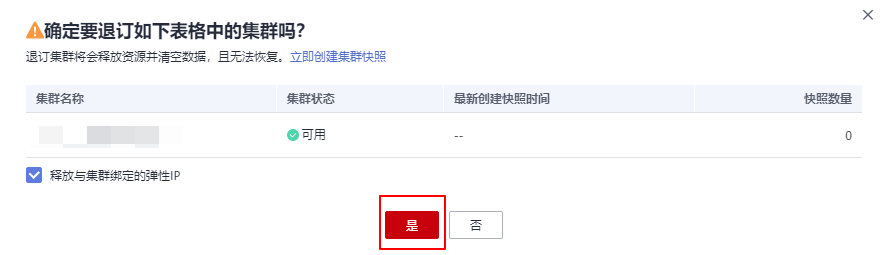

5.  跳转至CBC退订资源页面，选择退订理由，单击“退订”，在退订弹出对话框中，单击“退订”。订单退订后会自动刷新页面。

    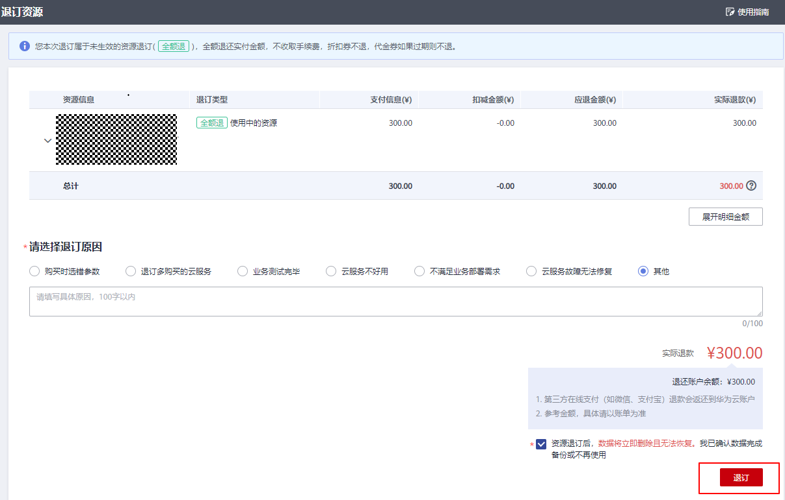

    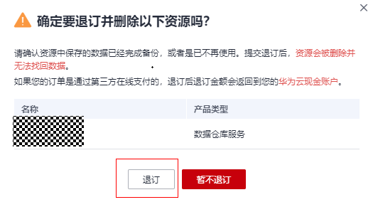

