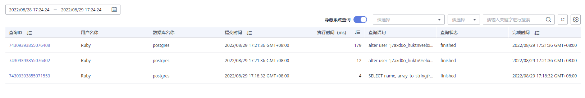
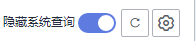
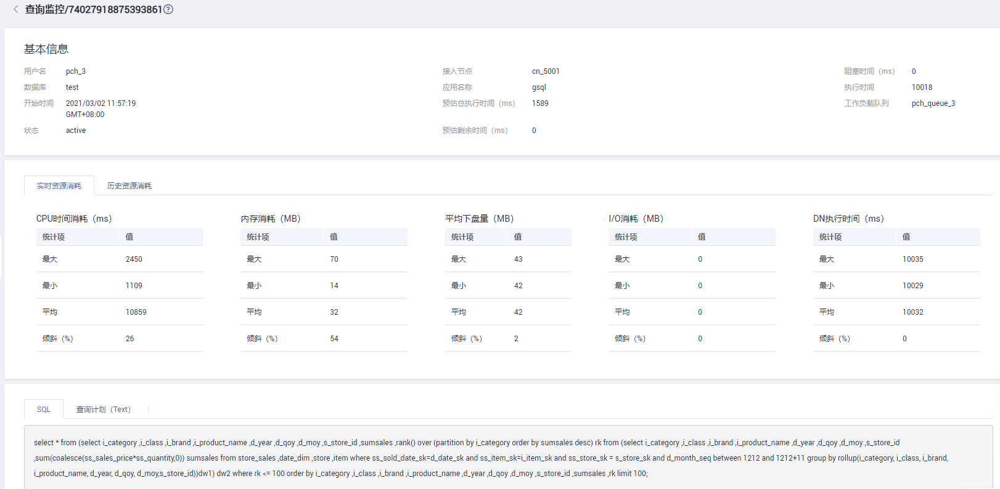

# 历史查询

## 进入历史查询页面

1.  登录GaussDB\(DWS\) 管理控制台。
2.  在“集群管理”页面，找到需要查看监控的集群。
3.  在指定集群所在行的“操作”列，单击“监控面板”，系统将显示数据库监控页面。
4.  在左侧导航栏选择“监控\>历史查询”，进入历史查询监控页面。

    在历史查询监控页面展示了当前集群中的所有历史查询信息。

> **说明：** 
>-   历史查询仅8.1.2及以上集群版本支持。
>-   启动历史查询功能需要在“监控设置\>监控采集”页面打开“历史查询监控”指标项，操作详情请参见[监控采集](https://support.huaweicloud.com/mgtg-dws/dws_01_00135.html)。

## 历史查询

在“历史查询”这一栏您可以根据选择的指定时间段浏览运行过的所有查询历史信息。其中包括：

-   查询ID
-   用户名称
-   应用名称
-   数据库名称
-   资源池
-   提交时间
-   阻塞时间（ms）
-   执行时间（ms）
-   CPU时间（ms）
-   CPU时间倾斜（%）
-   查询语句
-   接入CN
-   客户端IP
-   查询状态
-   完成时间
-   预估总执行时间（ms）
-   取消原因

    

    > **说明：** 
    >打开隐藏系统查询按钮可隐藏系统历史查询。
    >

## 历史查询监控详情

单击指定历史查询监控的查询ID可触发该查询监控的详情页面，在详情页面中会展示当前监控的更多细节。例如查询语句的基本信息、在执行中的实时资源消耗、执行过程中的历史资源消耗、完整描述以及查询计划。

