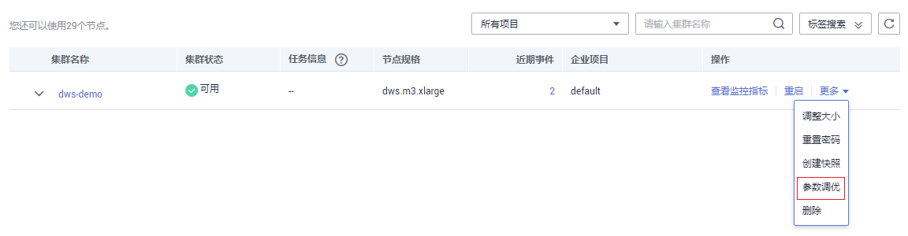
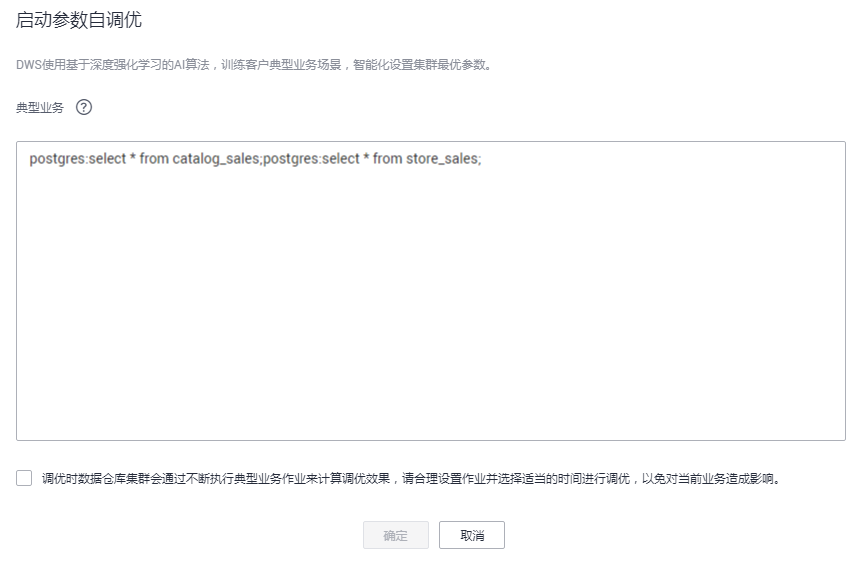

# 参数自调优<a name="dws_01_0155"></a>

在实际业务中，如果您希望提升SQL任务的执行性能，除了通过SQL调优优化查询性能以外，您可能还需要对数据库参数进行调优，以便充分利用系统资源，使集群性能得到充分发挥。由于DWS数据库参数复杂，一般用户可能并不具备足够的数据库知识指导自己调优参数，并且，人工调参工作量大，调优效果也不一定显著。为解决上述问题，DWS提供了参数自调优功能。DWS使用深度学习算法，基于用户指定的典型业务场景进行自动训练，通过训练，系统将得到一组可适用于用户集群配置的最优参数，从而将人力从复杂的参数配置工作中解放出来，使得集群配置更加贴近实际场景。

参数自调优功能，当前处于公测阶段，需要申请才能开通，开通后可免费使用。您可以在管理控制台右上角，将鼠标移至“工单“，然后单击“新建工单“提交开通公测特性的申请。

## 注意事项<a name="section106301840175115"></a>

-   只有当集群状态为“可用“并且任务信息不处于“创建快照中“、“调整大小“、“配置中“或“重启中“状态时，才能启动参数调优。

    启动参数调优后，不能执行集群管理的相关操作，且不能创建快照和使用快照恢复集群的操作。

-   启动参数自调优，不会影响其他的业务。但是，调优过程中，集群会通过不断执行用户指定的典型业务作业来计算调优效果，请合理设置作业并选择适当的时间进行调优，以免对当前业务造成影响。
-   如果调优成功，调优过程中调整的数据库参数，将应用到集群的所有数据库中，并对该集群后续所有的会话生效。如果调优失败，参数将会还原到调优前的值。

## 启动参数自调优<a name="section279384584014"></a>

1.  通过访问以下地址登录DWS管理控制台：[https://console.huaweicloud.com/dws](https://console.huaweicloud.com/dws)。
2.  进入集群管理页面，在集群列表中，找到所需要的集群，在集群所在行，单击“更多 \> 参数调优“。

    **图 1**  参数调优<a name="fig81196288919"></a>  
    

3.  在“启动参数自调优“窗口中，输入典型业务场景的SQL语句，阅读SQL输入框下方的调优说明并选中该复选框，然后单击“确定“启动参数调优。

    在SQL输入框中，可以输入一个或多个SQL语句，每个SQL语句需采用以下格式：

    ```
    DatabaseName:SQL_Statement
    ```

    -   **DatabaseName**：您已创建的数据库名称。
    -   **SQL\_Statement**：可执行的SQL语句。启动参数调优后，系统将自动连接指定的数据库并执行此处配置的SQL语句。如果SQL语句存在错误，将导致调优失败，因此，请确保您输入的SQL语句符合语法规范并可以正常运行。

    **图 2**  启动参数自调优<a name="fig57841421144417"></a>  
    

    启动参数调优后，您可以在集群列表的“任务信息“一列中查看调优状态。调优过程需要一定的运行时间。待参数调优执行成功后，集群的“任务信息“将恢复为“--”。

    **图 3**  查看调优状态<a name="fig94415318503"></a>  
    


## 停止调优<a name="section640071995412"></a>

启动参数调优后，在调优过程中可以手动停止调优。停止调优后，参数将被还原至调优前的值。

1.  通过访问以下地址登录DWS管理控制台：[https://console.huaweicloud.com/dws](https://console.huaweicloud.com/dws)。
2.  进入集群管理页面，在集群列表中，找到需要停止调优的集群，在集群所在行，单击“更多 \> 停止调优“。
3.  在警告对话框中，单击“是“停止调优。停止后，您还可以重新启动参数调优。

