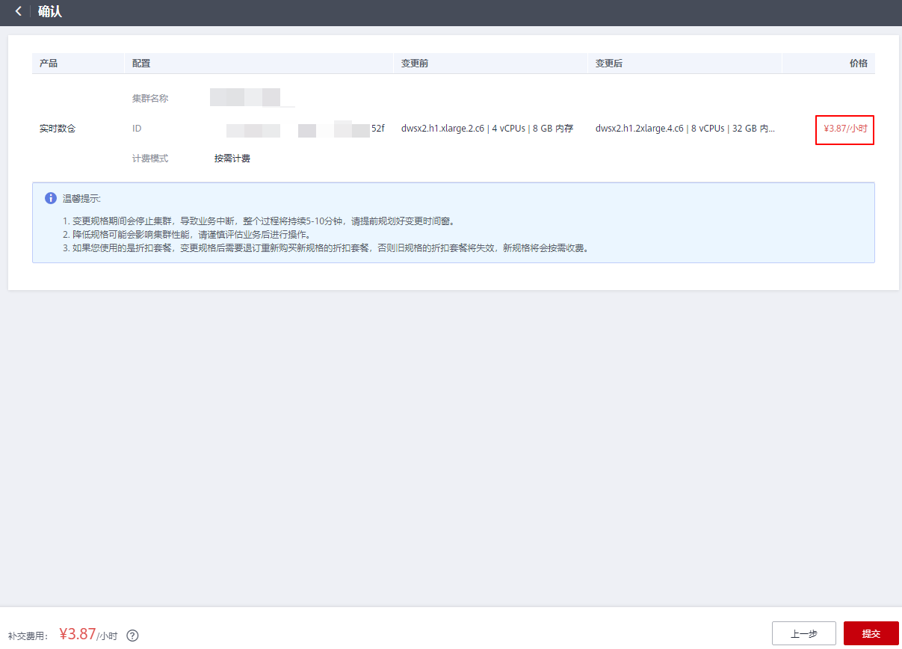

# 变更规格

相比于扩容节点而言，变更规格功能更适合阶段性峰值或只对计算能力变化有诉求的业务场景，在业务峰值来临之前您可以通过变更规格快速提升集群计算能力，在业务峰值过后再快速的将集群配置降低，做到最大程度的节约成本。支持的变更规格列表请参照**[表支持变更的规格列表](#table102761715151620)**。

> **说明：** 
>-   变更规格功能仅8.1.3.110及以上版本支持，历史版本需要联系技术支持人员升级Agent为8.1.3.110版本后支持。
>-   当前仅支持离线变更规格，变更时间大约需要10分钟左右。
>-   变更规格目前仅支持ECS+EVS形态的云数仓或实时数仓集群。
>-   包年/包月计费模式集群进行变更规格操作时，默认按照包年包月计费。

## 操作步骤

1.  登录GaussDB\(DWS\) 管理控制台。
2.  单击“集群管理”。默认显示用户所有的集群列表。
3.  集群列表中，在需要变更的集群所在行的**“操作”**列，选择“更多\>规格变更”，系统将显示“规格变更”页面。

    

4.  在“规格变更”页面，选择目标规格，您可根据需求选择是否打开自动备份开关。

    

    > **须知：** 
    >降配变更即选择比集群当前规格低的目标规格，进行此操作可能会影响集群性能，请谨慎评估业务后进行操作。

5.  单击"确定"按钮，提交集群变更规格任务。
6.  跳转至确认页面，显示规格变更后需补交的费用明细，确认无误后，单击“提交”按钮。

    

    > **说明：** 
    >包年/包月计费模式跳转至CBC界面支付订单。

7.  返回集群列表，集群将显示“规格变更中”，请耐心等待10分钟左右。

## 支持变更的规格列表

**表 1**  支持变更的规格列表

<table><thead align="left"><tr id="row1727615156161"><th class="cellrowborder" valign="top" width="31.46%" id="mcps1.2.3.1.1">
当前规格名称

</th>
<th class="cellrowborder" valign="top" width="68.54%" id="mcps1.2.3.1.2">
目标规格名称

</th>
</tr>
</thead>
<tbody><tr id="row82766151164"><td class="cellrowborder" valign="top" width="31.46%" headers="mcps1.2.3.1.1 ">
dwsk2.12xlarge

</td>
<td class="cellrowborder" valign="top" width="68.54%" headers="mcps1.2.3.1.2 ">
dwsk2.2xlarge，dwsk2.8xlarge

</td>
</tr>
<tr id="row57427581168"><td class="cellrowborder" valign="top" width="31.46%" headers="mcps1.2.3.1.1 ">
dwsk2.2xlarge

</td>
<td class="cellrowborder" valign="top" width="68.54%" headers="mcps1.2.3.1.2 ">
dwsk2.12xlarge，dwsk2.8xlarge

</td>
</tr>
<tr id="row2027691591612"><td class="cellrowborder" valign="top" width="31.46%" headers="mcps1.2.3.1.1 ">
dwsk2.8xlarge

</td>
<td class="cellrowborder" valign="top" width="68.54%" headers="mcps1.2.3.1.2 ">
dwsk2.2xlarge，dwsk2.12xlarge

</td>
</tr>
<tr id="row1027631521619"><td class="cellrowborder" valign="top" width="31.46%" headers="mcps1.2.3.1.1 ">
dwsk2.h.12xlarge.4.kc1

</td>
<td class="cellrowborder" valign="top" width="68.54%" headers="mcps1.2.3.1.2 ">
dwsk2.h.xlarge.4.kc1，dwsk2.h.2xlarge.4.kc1，dwsk2.h.4xlarge.4.kc1，dwsk2.h.8xlarge.4.kc1

</td>
</tr>
<tr id="row2277161510165"><td class="cellrowborder" valign="top" width="31.46%" headers="mcps1.2.3.1.1 ">
dwsk2.h.2xlarge.4.kc1

</td>
<td class="cellrowborder" valign="top" width="68.54%" headers="mcps1.2.3.1.2 ">
dwsk2.h.8xlarge.4.kc1，dwsk2.h.12xlarge.4.kc1，dwsk2.h.xlarge.4.kc1，dwsk2.h.4xlarge.4.kc1

</td>
</tr>
<tr id="row12693413131710"><td class="cellrowborder" valign="top" width="31.46%" headers="mcps1.2.3.1.1 ">
dwsk2.h.4xlarge.4.kc1

</td>
<td class="cellrowborder" valign="top" width="68.54%" headers="mcps1.2.3.1.2 ">
dwsk2.h.8xlarge.4.kc1，dwsk2.h.12xlarge.4.kc1，dwsk2.h.xlarge.4.kc1，dwsk2.h.2xlarge.4.kc1

</td>
</tr>
<tr id="row121162541712"><td class="cellrowborder" valign="top" width="31.46%" headers="mcps1.2.3.1.1 ">
dwsk2.h.8xlarge.4.kc1

</td>
<td class="cellrowborder" valign="top" width="68.54%" headers="mcps1.2.3.1.2 ">
dwsk2.h.xlarge.4.kc1，dwsk2.h.2xlarge.4.kc1，dwsk2.h.4xlarge.4.kc1，dwsk2.h.12xlarge.4.kc1

</td>
</tr>
<tr id="row221112512179"><td class="cellrowborder" valign="top" width="31.46%" headers="mcps1.2.3.1.1 ">
dwsk2.h.xlarge.4.kc1

</td>
<td class="cellrowborder" valign="top" width="68.54%" headers="mcps1.2.3.1.2 ">
dwsk2.h.2xlarge.4.kc1，dwsk2.h.4xlarge.4.kc1，dwsk2.h.8xlarge.4.kc1，dwsk2.h.12xlarge.4.kc1

</td>
</tr>
<tr id="row1521142541716"><td class="cellrowborder" valign="top" width="31.46%" headers="mcps1.2.3.1.1 ">
dwsk2.h1.12xlarge.4.kc1

</td>
<td class="cellrowborder" valign="top" width="68.54%" headers="mcps1.2.3.1.2 ">
dwsk2.h1.4xlarge.4.kc1，dwsk2.h1.8xlarge.4.kc1，dwsk2.h1.2xlarge.4.kc1

</td>
</tr>
<tr id="row1522172515173"><td class="cellrowborder" valign="top" width="31.46%" headers="mcps1.2.3.1.1 ">
dwsk2.h1.2xlarge.4.kc1

</td>
<td class="cellrowborder" valign="top" width="68.54%" headers="mcps1.2.3.1.2 ">
dwsk2.h1.4xlarge.4.kc1，dwsk2.h1.8xlarge.4.kc1，dwsk2.h1.12xlarge.4.kc1

</td>
</tr>
<tr id="row72262541718"><td class="cellrowborder" valign="top" width="31.46%" headers="mcps1.2.3.1.1 ">
dwsk2.h1.4xlarge.4.kc1

</td>
<td class="cellrowborder" valign="top" width="68.54%" headers="mcps1.2.3.1.2 ">
dwsk2.h1.8xlarge.4.kc1，dwsk2.h1.12xlarge.4.kc1，dwsk2.h1.2xlarge.4.kc1

</td>
</tr>
<tr id="row1322122516177"><td class="cellrowborder" valign="top" width="31.46%" headers="mcps1.2.3.1.1 ">
dwsk2.h1.8xlarge.4.kc1

</td>
<td class="cellrowborder" valign="top" width="68.54%" headers="mcps1.2.3.1.2 ">
dwsk2.h1.4xlarge.4.kc1，dwsk2.h1.12xlarge.4.kc1，dwsk2.h1.2xlarge.4.kc1

</td>
</tr>
<tr id="row20218104115176"><td class="cellrowborder" valign="top" width="31.46%" headers="mcps1.2.3.1.1 ">
dwsk2.h1.xlarge.2.kc1

</td>
<td class="cellrowborder" valign="top" width="68.54%" headers="mcps1.2.3.1.2 ">
dwsk2.h1.2xlarge.4.kc1，dwsk2.h1.4xlarge.4.kc1，dwsk2.h1.8xlarge.4.kc1，dwsk2.h1.12xlarge.4.kc1

</td>
</tr>
<tr id="row321864116171"><td class="cellrowborder" valign="top" width="31.46%" headers="mcps1.2.3.1.1 ">
dwsk2.xlarge

</td>
<td class="cellrowborder" valign="top" width="68.54%" headers="mcps1.2.3.1.2 ">
dwsk2.2xlarge，dwsk2.12xlarge，dwsk2.8xlarge

</td>
</tr>
<tr id="row1521884110176"><td class="cellrowborder" valign="top" width="31.46%" headers="mcps1.2.3.1.1 ">
dwsx2.16xlarge

</td>
<td class="cellrowborder" valign="top" width="68.54%" headers="mcps1.2.3.1.2 ">
dwsx2.8xlarge，dwsx2.2xlarge

</td>
</tr>
<tr id="row2218141171716"><td class="cellrowborder" valign="top" width="31.46%" headers="mcps1.2.3.1.1 ">
dwsx2.16xlarge.m7

</td>
<td class="cellrowborder" valign="top" width="68.54%" headers="mcps1.2.3.1.2 ">
dwsx2.8xlarge.m7，dwsx2.2xlarge.m7

</td>
</tr>
<tr id="row13218941141719"><td class="cellrowborder" valign="top" width="31.46%" headers="mcps1.2.3.1.1 ">
dwsx2.16xlarge.m7n

</td>
<td class="cellrowborder" valign="top" width="68.54%" headers="mcps1.2.3.1.2 ">
dwsx2.8xlarge.m7n，dwsx2.2xlarge.m7n

</td>
</tr>
<tr id="row2218114112175"><td class="cellrowborder" valign="top" width="31.46%" headers="mcps1.2.3.1.1 ">
dwsx2.2xlarge

</td>
<td class="cellrowborder" valign="top" width="68.54%" headers="mcps1.2.3.1.2 ">
dwsx2.16xlarge，dwsx2.8xlarge

</td>
</tr>
<tr id="row18218194119177"><td class="cellrowborder" valign="top" width="31.46%" headers="mcps1.2.3.1.1 ">
dwsx2.2xlarge.m7

</td>
<td class="cellrowborder" valign="top" width="68.54%" headers="mcps1.2.3.1.2 ">
dwsx2.16xlarge.m7，dwsx2.8xlarge.m7

</td>
</tr>
<tr id="row721815417179"><td class="cellrowborder" valign="top" width="31.46%" headers="mcps1.2.3.1.1 ">
dwsx2.2xlarge.m7n

</td>
<td class="cellrowborder" valign="top" width="68.54%" headers="mcps1.2.3.1.2 ">
dwsx2.16xlarge.m7n，dwsx2.8xlarge.m7n

</td>
</tr>
<tr id="row20219341181718"><td class="cellrowborder" valign="top" width="31.46%" headers="mcps1.2.3.1.1 ">
dwsx2.8xlarge

</td>
<td class="cellrowborder" valign="top" width="68.54%" headers="mcps1.2.3.1.2 ">
dwsx2.2xlarge，dwsx2.16xlarge

</td>
</tr>
<tr id="row321934121710"><td class="cellrowborder" valign="top" width="31.46%" headers="mcps1.2.3.1.1 ">
dwsx2.8xlarge.m7

</td>
<td class="cellrowborder" valign="top" width="68.54%" headers="mcps1.2.3.1.2 ">
dwsx2.16xlarge.m7，dwsx2.2xlarge.m7

</td>
</tr>
<tr id="row0219341161718"><td class="cellrowborder" valign="top" width="31.46%" headers="mcps1.2.3.1.1 ">
dwsx2.8xlarge.m7n

</td>
<td class="cellrowborder" valign="top" width="68.54%" headers="mcps1.2.3.1.2 ">
dwsx2.16xlarge.m7n，dwsx2.2xlarge.m7n

</td>
</tr>
<tr id="row19219441161712"><td class="cellrowborder" valign="top" width="31.46%" headers="mcps1.2.3.1.1 ">
dwsx2.h.16xlarge.4.c6

</td>
<td class="cellrowborder" valign="top" width="68.54%" headers="mcps1.2.3.1.2 ">
dwsx2.h.xlarge.4.c6，dwsx2.h.2xlarge.4.c6，dwsx2.h.4xlarge.4.c6，dwsx2.h.8xlarge.4.c6

</td>
</tr>
<tr id="row7701133051715"><td class="cellrowborder" valign="top" width="31.46%" headers="mcps1.2.3.1.1 ">
dwsx2.h.16xlarge.4.c7

</td>
<td class="cellrowborder" valign="top" width="68.54%" headers="mcps1.2.3.1.2 ">
dwsx2.h.8xlarge.4.c7，dwsx2.h.xlarge.4.c7，dwsx2.h.2xlarge.4.c7，dwsx2.h.4xlarge.4.c7

</td>
</tr>
<tr id="row07021030191719"><td class="cellrowborder" valign="top" width="31.46%" headers="mcps1.2.3.1.1 ">
dwsx2.h.16xlarge.4.c7n

</td>
<td class="cellrowborder" valign="top" width="68.54%" headers="mcps1.2.3.1.2 ">
dwsx2.h.4xlarge.4.c7n，dwsx2.h.8xlarge.4.c7n，dwsx2.h.2xlarge.4.c7n

</td>
</tr>
<tr id="row147021530141718"><td class="cellrowborder" valign="top" width="31.46%" headers="mcps1.2.3.1.1 ">
dwsx2.h.2xlarge.4.c6

</td>
<td class="cellrowborder" valign="top" width="68.54%" headers="mcps1.2.3.1.2 ">
dwsx2.h.xlarge.4.c6，dwsx2.h.4xlarge.4.c6，dwsx2.h.8xlarge.4.c6，dwsx2.h.16xlarge.4.c6

</td>
</tr>
<tr id="row47027305173"><td class="cellrowborder" valign="top" width="31.46%" headers="mcps1.2.3.1.1 ">
dwsx2.h.2xlarge.4.c7

</td>
<td class="cellrowborder" valign="top" width="68.54%" headers="mcps1.2.3.1.2 ">
dwsx2.h.4xlarge.4.c7，dwsx2.h.8xlarge.4.c7，dwsx2.h.16xlarge.4.c7，dwsx2.h.xlarge.4.c7

</td>
</tr>
<tr id="row10702183018170"><td class="cellrowborder" valign="top" width="31.46%" headers="mcps1.2.3.1.1 ">
dwsx2.h.2xlarge.4.c7n

</td>
<td class="cellrowborder" valign="top" width="68.54%" headers="mcps1.2.3.1.2 ">
dwsx2.h.4xlarge.4.c7n，dwsx2.h.8xlarge.4.c7n，dwsx2.h.16xlarge.4.c7n

</td>
</tr>
<tr id="row11702193051713"><td class="cellrowborder" valign="top" width="31.46%" headers="mcps1.2.3.1.1 ">
dwsx2.h.4xlarge.4.c6

</td>
<td class="cellrowborder" valign="top" width="68.54%" headers="mcps1.2.3.1.2 ">
dwsx2.h.8xlarge.4.c6，dwsx2.h.16xlarge.4.c6，dwsx2.h.xlarge.4.c6，dwsx2.h.2xlarge.4.c6

</td>
</tr>
<tr id="row15702183051711"><td class="cellrowborder" valign="top" width="31.46%" headers="mcps1.2.3.1.1 ">
dwsx2.h.4xlarge.4.c7

</td>
<td class="cellrowborder" valign="top" width="68.54%" headers="mcps1.2.3.1.2 ">
dwsx2.h.xlarge.4.c7，dwsx2.h.2xlarge.4.c7，dwsx2.h.8xlarge.4.c7，dwsx2.h.16xlarge.4.c7

</td>
</tr>
<tr id="row18703123011714"><td class="cellrowborder" valign="top" width="31.46%" headers="mcps1.2.3.1.1 ">
dwsx2.h.4xlarge.4.c7n

</td>
<td class="cellrowborder" valign="top" width="68.54%" headers="mcps1.2.3.1.2 ">
dwsx2.h.2xlarge.4.c7n，dwsx2.h.8xlarge.4.c7n，dwsx2.h.16xlarge.4.c7n

</td>
</tr>
<tr id="row5703430151713"><td class="cellrowborder" valign="top" width="31.46%" headers="mcps1.2.3.1.1 ">
dwsx2.h.8xlarge.4.c6

</td>
<td class="cellrowborder" valign="top" width="68.54%" headers="mcps1.2.3.1.2 ">
dwsx2.h.4xlarge.4.c6，dwsx2.h.16xlarge.4.c6，dwsx2.h.xlarge.4.c6，dwsx2.h.2xlarge.4.c6

</td>
</tr>
<tr id="row1570393021717"><td class="cellrowborder" valign="top" width="31.46%" headers="mcps1.2.3.1.1 ">
dwsx2.h.8xlarge.4.c7

</td>
<td class="cellrowborder" valign="top" width="68.54%" headers="mcps1.2.3.1.2 ">
dwsx2.h.16xlarge.4.c7，dwsx2.h.xlarge.4.c7，dwsx2.h.2xlarge.4.c7，dwsx2.h.4xlarge.4.c7

</td>
</tr>
<tr id="row4703173031716"><td class="cellrowborder" valign="top" width="31.46%" headers="mcps1.2.3.1.1 ">
dwsx2.h.8xlarge.4.c7n

</td>
<td class="cellrowborder" valign="top" width="68.54%" headers="mcps1.2.3.1.2 ">
dwsx2.h.16xlarge.4.c7n，dwsx2.h.2xlarge.4.c7n，dwsx2.h.4xlarge.4.c7n

</td>
</tr>
<tr id="row187031930151712"><td class="cellrowborder" valign="top" width="31.46%" headers="mcps1.2.3.1.1 ">
dwsx2.h.xlarge.4.c6

</td>
<td class="cellrowborder" valign="top" width="68.54%" headers="mcps1.2.3.1.2 ">
dwsx2.h.2xlarge.4.c6，dwsx2.h.4xlarge.4.c6，dwsx2.h.8xlarge.4.c6，dwsx2.h.16xlarge.4.c6

</td>
</tr>
<tr id="row2698111411207"><td class="cellrowborder" valign="top" width="31.46%" headers="mcps1.2.3.1.1 ">
dwsx2.h.xlarge.4.c7

</td>
<td class="cellrowborder" valign="top" width="68.54%" headers="mcps1.2.3.1.2 ">
dwsx2.h.4xlarge.4.c7，dwsx2.h.8xlarge.4.c7，dwsx2.h.16xlarge.4.c7，dwsx2.h.2xlarge.4.c7

</td>
</tr>
<tr id="row1369811144200"><td class="cellrowborder" valign="top" width="31.46%" headers="mcps1.2.3.1.1 ">
dwsx2.h.xlarge.4.c7n

</td>
<td class="cellrowborder" valign="top" width="68.54%" headers="mcps1.2.3.1.2 ">
dwsx2.h.2xlarge.4.c7n，dwsx2.h.4xlarge.4.c7n，dwsx2.h.8xlarge.4.c7n，dwsx2.h.16xlarge.4.c7n

</td>
</tr>
<tr id="row1069881412013"><td class="cellrowborder" valign="top" width="31.46%" headers="mcps1.2.3.1.1 ">
dwsx2.h1.16xlarge.4.c6

</td>
<td class="cellrowborder" valign="top" width="68.54%" headers="mcps1.2.3.1.2 ">
dwsx2.h1.4xlarge.4.c6，dwsx2.h1.2xlarge.4.c6，dwsx2.h1.8xlarge.4.c6

</td>
</tr>
<tr id="row869881419207"><td class="cellrowborder" valign="top" width="31.46%" headers="mcps1.2.3.1.1 ">
dwsx2.h1.16xlarge.4.c7

</td>
<td class="cellrowborder" valign="top" width="68.54%" headers="mcps1.2.3.1.2 ">
dwsx2.h1.4xlarge.4.c7，dwsx2.h1.8xlarge.4.c7，dwsx2.h1.2xlarge.4.c7

</td>
</tr>
<tr id="row17698181416200"><td class="cellrowborder" valign="top" width="31.46%" headers="mcps1.2.3.1.1 ">
dwsx2.h1.16xlarge.4.c7n

</td>
<td class="cellrowborder" valign="top" width="68.54%" headers="mcps1.2.3.1.2 ">
dwsx2.h1.2xlarge.4.c7n，dwsx2.h1.4xlarge.4.c7n，dwsx2.h1.8xlarge.4.c7n

</td>
</tr>
<tr id="row1369971452010"><td class="cellrowborder" valign="top" width="31.46%" headers="mcps1.2.3.1.1 ">
dwsx2.h1.2xlarge.4.c6

</td>
<td class="cellrowborder" valign="top" width="68.54%" headers="mcps1.2.3.1.2 ">
dwsx2.h1.4xlarge.4.c6，dwsx2.h1.8xlarge.4.c6，dwsx2.h1.16xlarge.4.c6

</td>
</tr>
<tr id="row485461082013"><td class="cellrowborder" valign="top" width="31.46%" headers="mcps1.2.3.1.1 ">
dwsx2.h1.2xlarge.4.c7

</td>
<td class="cellrowborder" valign="top" width="68.54%" headers="mcps1.2.3.1.2 ">
dwsx2.h1.4xlarge.4.c7，dwsx2.h1.8xlarge.4.c7，dwsx2.h1.16xlarge.4.c7

</td>
</tr>
<tr id="row2085471014203"><td class="cellrowborder" valign="top" width="31.46%" headers="mcps1.2.3.1.1 ">
dwsx2.h1.2xlarge.4.c7n

</td>
<td class="cellrowborder" valign="top" width="68.54%" headers="mcps1.2.3.1.2 ">
dwsx2.h1.16xlarge.4.c7n，dwsx2.h1.4xlarge.4.c7n，dwsx2.h1.8xlarge.4.c7n

</td>
</tr>
<tr id="row20854410172012"><td class="cellrowborder" valign="top" width="31.46%" headers="mcps1.2.3.1.1 ">
dwsx2.h1.4xlarge.4.c6

</td>
<td class="cellrowborder" valign="top" width="68.54%" headers="mcps1.2.3.1.2 ">
dwsx2.h1.2xlarge.4.c6，dwsx2.h1.8xlarge.4.c6，dwsx2.h1.16xlarge.4.c6

</td>
</tr>
<tr id="row129741757141913"><td class="cellrowborder" valign="top" width="31.46%" headers="mcps1.2.3.1.1 ">
dwsx2.h1.4xlarge.4.c7

</td>
<td class="cellrowborder" valign="top" width="68.54%" headers="mcps1.2.3.1.2 ">
dwsx2.h1.2xlarge.4.c7，dwsx2.h1.8xlarge.4.c7，dwsx2.h1.16xlarge.4.c7

</td>
</tr>
<tr id="row124361619172015"><td class="cellrowborder" valign="top" width="31.46%" headers="mcps1.2.3.1.1 ">
dwsx2.h1.4xlarge.4.c7n

</td>
<td class="cellrowborder" valign="top" width="68.54%" headers="mcps1.2.3.1.2 ">
dwsx2.h1.8xlarge.4.c7n，dwsx2.h1.16xlarge.4.c7n，dwsx2.h1.2xlarge.4.c7n

</td>
</tr>
<tr id="row243671917203"><td class="cellrowborder" valign="top" width="31.46%" headers="mcps1.2.3.1.1 ">
dwsx2.h1.8xlarge.4.c6

</td>
<td class="cellrowborder" valign="top" width="68.54%" headers="mcps1.2.3.1.2 ">
dwsx2.h1.16xlarge.4.c6，dwsx2.h1.4xlarge.4.c6，dwsx2.h1.2xlarge.4.c6

</td>
</tr>
<tr id="row6436101911208"><td class="cellrowborder" valign="top" width="31.46%" headers="mcps1.2.3.1.1 ">
dwsx2.h1.8xlarge.4.c7

</td>
<td class="cellrowborder" valign="top" width="68.54%" headers="mcps1.2.3.1.2 ">
dwsx2.h1.4xlarge.4.c7，dwsx2.h1.2xlarge.4.c7，dwsx2.h1.16xlarge.4.c7

</td>
</tr>
<tr id="row16436161917208"><td class="cellrowborder" valign="top" width="31.46%" headers="mcps1.2.3.1.1 ">
dwsx2.h1.8xlarge.4.c7n

</td>
<td class="cellrowborder" valign="top" width="68.54%" headers="mcps1.2.3.1.2 ">
dwsx2.h1.4xlarge.4.c7n，dwsx2.h1.16xlarge.4.c7n，dwsx2.h1.2xlarge.4.c7n

</td>
</tr>
<tr id="row343614194208"><td class="cellrowborder" valign="top" width="31.46%" headers="mcps1.2.3.1.1 ">
dwsx2.h1.xlarge.2.c6

</td>
<td class="cellrowborder" valign="top" width="68.54%" headers="mcps1.2.3.1.2 ">
dwsx2.h1.8xlarge.4.c6，dwsx2.h1.16xlarge.4.c6，dwsx2.h1.2xlarge.4.c6，dwsx2.h1.4xlarge.4.c6

</td>
</tr>
<tr id="row17436111962015"><td class="cellrowborder" valign="top" width="31.46%" headers="mcps1.2.3.1.1 ">
dwsx2.h1.xlarge.2.c7

</td>
<td class="cellrowborder" valign="top" width="68.54%" headers="mcps1.2.3.1.2 ">
dwsx2.h1.4xlarge.4.c7，dwsx2.h1.8xlarge.4.c7，dwsx2.h1.16xlarge.4.c7，dwsx2.h1.2xlarge.4.c7

</td>
</tr>
<tr id="row124361198208"><td class="cellrowborder" valign="top" width="31.46%" headers="mcps1.2.3.1.1 ">
dwsx2.h1.xlarge.2.c7n

</td>
<td class="cellrowborder" valign="top" width="68.54%" headers="mcps1.2.3.1.2 ">
dwsx2.h1.2xlarge.4.c7n，dwsx2.h1.4xlarge.4.c7n，dwsx2.h1.8xlarge.4.c7n，dwsx2.h1.16xlarge.4.c7n

</td>
</tr>
<tr id="row9437019152018"><td class="cellrowborder" valign="top" width="31.46%" headers="mcps1.2.3.1.1 ">
dwsx2.xlarge

</td>
<td class="cellrowborder" valign="top" width="68.54%" headers="mcps1.2.3.1.2 ">
dwsx2.16xlarge，dwsx2.8xlarge，dwsx2.2xlarge

</td>
</tr>
<tr id="row3652119209"><td class="cellrowborder" valign="top" width="31.46%" headers="mcps1.2.3.1.1 ">
dwsx2.xlarge.m7

</td>
<td class="cellrowborder" valign="top" width="68.54%" headers="mcps1.2.3.1.2 ">
dwsx2.16xlarge.m7，dwsx2.8xlarge.m7，dwsx2.2xlarge.m7

</td>
</tr>
<tr id="row2668186152019"><td class="cellrowborder" valign="top" width="31.46%" headers="mcps1.2.3.1.1 ">
dwsx2.xlarge.m7n

</td>
<td class="cellrowborder" valign="top" width="68.54%" headers="mcps1.2.3.1.2 ">
dwsx2.16xlarge.m7n，dwsx2.8xlarge.m7n，dwsx2.2xlarge.m7n

</td>
</tr>
</tbody>
</table>

