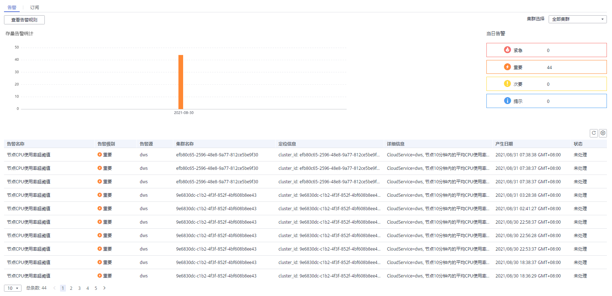

# 告警管理简介

## 概述

告警管理包含查看告警规则、告警规则配置与告警信息订阅功能。其中，告警规则可以提供过去一周的告警信息统计与告警信息明细，方便用户自行查看租户下的告警。该特性除了以默认值的形式提供一套GaussDB\(DWS\)告警最佳实践外，还允许用户根据自己的业务特点，个性化修改告警阈值。告警管理通过消息通知服务（Simple Message Notification，简称SMN）发送GaussDB\(DWS\) 告警通知，用户可订阅告警启用通知。

> **说明：** 
>该特性仅支持8.1.1.200及以上版本的数据库内核。

## 进入告警管理页面

1.  登录GaussDB\(DWS\) 管理控制台。
2.  在左侧导航栏，单击“告警管理”，切换至“告警”页签。
3.  进入数据仓库告警展示页面。该页面分为三个区域：

    -   存量告警统计

        最近7天的存量告警统计值（按告警级别分类），以柱状图的形式展示。用户可通过存量告警统计图，对过去一周告警发生的数量和分布有清晰的了解。

    -   当日告警

        当天的存量告警统计值（按级别分类），以列表的形式展示。重点向用户强调当天未处理的告警数量，帮助用户快速掌握目前告警的数量和分布。

    -   告警详情

        最近7天的所有告警（包括已处理和未处理）的明细信息，以表格的形式展示。可查看近7天内所有告警的告警名称、告警级别、集群名称、定位信息、详细信息、产生日期、状态等信息，帮助用户快速发现和定位问题。

    

    > **说明：** 
    >告警展示页面的数据源来自EventService微服务，该微服务最多可以提供30天的告警缓存数据。

## 告警类别和告警

**表 1**  DMS告警源触发阈值告警

<table><thead align="left"><tr id="row1034921103319"><th class="cellrowborder" valign="top" width="7.64%" id="mcps1.2.5.1.1">
告警类别

</th>
<th class="cellrowborder" valign="top" width="23.119999999999997%" id="mcps1.2.5.1.2">
告警名称

</th>
<th class="cellrowborder" valign="top" width="17.94%" id="mcps1.2.5.1.3">
告警级别

</th>
<th class="cellrowborder" valign="top" width="51.300000000000004%" id="mcps1.2.5.1.4">
告警描述

</th>
</tr>
</thead>
<tbody><tr id="row1634122183315"><td class="cellrowborder" valign="top" width="7.64%" headers="mcps1.2.5.1.1 ">
默认

</td>
<td class="cellrowborder" valign="top" width="23.119999999999997%" headers="mcps1.2.5.1.2 ">
节点CPU使用率超阈值

</td>
<td class="cellrowborder" valign="top" width="17.94%" headers="mcps1.2.5.1.3 ">
紧急

</td>
<td class="cellrowborder" valign="top" width="51.300000000000004%" headers="mcps1.2.5.1.4 ">
DMS告警模块在指定周期内，检测到集群任意节点的CPU使用率（系统+用户）超过当前设定阈值，且抑制条件不满足时，DMS告警模块将触发该告警；检测到集群任意节点的CPU使用率（系统+用户）低于当前设定阈值，且抑制条件不满足时，DMS告警模块将消除该告警。

</td>
</tr>
<tr id="row1734020562351"><td class="cellrowborder" valign="top" width="7.64%" headers="mcps1.2.5.1.1 ">
默认

</td>
<td class="cellrowborder" valign="top" width="23.119999999999997%" headers="mcps1.2.5.1.2 ">
节点系统CPU使用率超阈值

</td>
<td class="cellrowborder" valign="top" width="17.94%" headers="mcps1.2.5.1.3 ">
紧急

</td>
<td class="cellrowborder" valign="top" width="51.300000000000004%" headers="mcps1.2.5.1.4 ">
DMS告警模块在指定周期内，检测到集群任意节点的系统CPU使用率超过当前设定阈值，且抑制条件不满足时，DMS告警模块将触发该告警；检测到集群任意节点的系统CPU使用率低于当前设定阈值，且抑制条件不满足时，DMS告警模块将消除该告警。

</td>
</tr>
<tr id="row1550011311361"><td class="cellrowborder" valign="top" width="7.64%" headers="mcps1.2.5.1.1 ">
默认

</td>
<td class="cellrowborder" valign="top" width="23.119999999999997%" headers="mcps1.2.5.1.2 ">
节点系统磁盘使用率超阈值

</td>
<td class="cellrowborder" valign="top" width="17.94%" headers="mcps1.2.5.1.3 ">
&gt;85% 紧急，&gt;80%重要

</td>
<td class="cellrowborder" valign="top" width="51.300000000000004%" headers="mcps1.2.5.1.4 ">
DMS告警模块在指定周期内，检测到集群任意节点的系统盘（/）使用率超过当前设定阈值，且抑制条件不满足时，DMS告警模块将触发该告警；检测到集群任意节点的系统盘（/）使用率低于当前设定阈值，且抑制条件不满足时，DMS告警模块将消除该告警。

</td>
</tr>
<tr id="row233397173620"><td class="cellrowborder" valign="top" width="7.64%" headers="mcps1.2.5.1.1 ">
默认

</td>
<td class="cellrowborder" valign="top" width="23.119999999999997%" headers="mcps1.2.5.1.2 ">
节点日志盘使用率超阈值

</td>
<td class="cellrowborder" valign="top" width="17.94%" headers="mcps1.2.5.1.3 ">
&gt;85% 紧急，&gt;80%重要

</td>
<td class="cellrowborder" valign="top" width="51.300000000000004%" headers="mcps1.2.5.1.4 ">
DMS告警模块在指定周期内，检测到集群任意节点的日志盘（/var/chroot/DWS/manager）使用率超过当前设定阈值，且抑制条件不满足时，DMS告警模块将触发该告警；检测到集群任意节点的日志盘（/var/chroot/DWS/manager）使用率低于当前设定阈值，且抑制条件不满足时，DMS告警模块将消除该告警。

</td>
</tr>
<tr id="row1252412104360"><td class="cellrowborder" valign="top" width="7.64%" headers="mcps1.2.5.1.1 ">
默认

</td>
<td class="cellrowborder" valign="top" width="23.119999999999997%" headers="mcps1.2.5.1.2 ">
节点数据盘使用率超阈值

</td>
<td class="cellrowborder" valign="top" width="17.94%" headers="mcps1.2.5.1.3 ">
&gt;85% 紧急，&gt;80%重要

</td>
<td class="cellrowborder" valign="top" width="51.300000000000004%" headers="mcps1.2.5.1.4 ">
DMS告警模块在指定周期内，检测到集群任意节点的数据盘（/var/chroot/DWS/data[n]）使用率超过当前设定阈值，且抑制条件不满足时，DMS告警模块将触发该告警；检测到集群任意节点的数据盘（/var/chroot/DWS/data[n]）使用率低于当前设定阈值，且抑制条件不满足时，DMS告警模块将消除该告警。

</td>
</tr>
<tr id="row17322813153612"><td class="cellrowborder" valign="top" width="7.64%" headers="mcps1.2.5.1.1 ">
默认

</td>
<td class="cellrowborder" valign="top" width="23.119999999999997%" headers="mcps1.2.5.1.2 ">
节点系统盘I/O利用率超阈值

</td>
<td class="cellrowborder" valign="top" width="17.94%" headers="mcps1.2.5.1.3 ">
紧急

</td>
<td class="cellrowborder" valign="top" width="51.300000000000004%" headers="mcps1.2.5.1.4 ">
DMS告警模块在指定周期内，检测到集群任意节点的系统盘（/）I/O利用率（util）超过当前设定阈值，且抑制条件不满足时，DMS告警模块将触发该告警；检测到集群任意节点的系统盘（/）I/O利用率（util）低于当前设定阈值，且抑制条件不满足时，DMS告警模块将消除该告警。

</td>
</tr>
<tr id="row1885341573615"><td class="cellrowborder" valign="top" width="7.64%" headers="mcps1.2.5.1.1 ">
默认

</td>
<td class="cellrowborder" valign="top" width="23.119999999999997%" headers="mcps1.2.5.1.2 ">
节点日志盘I/O利用率超阈值

</td>
<td class="cellrowborder" valign="top" width="17.94%" headers="mcps1.2.5.1.3 ">
紧急

</td>
<td class="cellrowborder" valign="top" width="51.300000000000004%" headers="mcps1.2.5.1.4 ">
DMS告警模块在指定周期内，检测到集群任意节点的日志盘（/var/chroot/DWS/manager）I/O利用率（util）超过当前设定阈值，且抑制条件不满足时，DMS告警模块将触发该告警；检测到集群任意节点的日志盘（/var/chroot/DWS/manager）I/O利用率（util）低于当前设定阈值，且抑制条件不满足时，DMS告警模块将消除该告警。

</td>
</tr>
<tr id="row1824111823619"><td class="cellrowborder" valign="top" width="7.64%" headers="mcps1.2.5.1.1 ">
默认

</td>
<td class="cellrowborder" valign="top" width="23.119999999999997%" headers="mcps1.2.5.1.2 ">
节点数据盘I/O利用率超阈值

</td>
<td class="cellrowborder" valign="top" width="17.94%" headers="mcps1.2.5.1.3 ">
紧急

</td>
<td class="cellrowborder" valign="top" width="51.300000000000004%" headers="mcps1.2.5.1.4 ">
DMS告警模块在指定周期内，检测到集群任意节点的数据盘（/var/chroot/DWS/data[n]）I/O利用率（util）超过当前设定阈值，且抑制条件不满足时，DMS告警模块将触发该告警；检测到集群任意节点的数据盘（/var/chroot/DWS/data[n]）I/O利用率（util）低于当前设定阈值，且抑制条件不满足时，DMS告警模块将消除该告警。

</td>
</tr>
<tr id="row1614120610405"><td class="cellrowborder" valign="top" width="7.64%" headers="mcps1.2.5.1.1 ">
默认

</td>
<td class="cellrowborder" valign="top" width="23.119999999999997%" headers="mcps1.2.5.1.2 ">
节点系统盘时延超阈值

</td>
<td class="cellrowborder" valign="top" width="17.94%" headers="mcps1.2.5.1.3 ">
重要

</td>
<td class="cellrowborder" valign="top" width="51.300000000000004%" headers="mcps1.2.5.1.4 ">
DMS告警模块在指定周期内，检测到集群任意节点的系统盘（/）I/O延时（await）超过当前设定阈值，且抑制条件不满足时，DMS告警模块将触发该告警；检测到集群任意节点的系统盘（/）I/O延时（await）低于当前设定阈值，且抑制条件不满足时，DMS告警模块将消除该告警。

</td>
</tr>
<tr id="row1386514112400"><td class="cellrowborder" valign="top" width="7.64%" headers="mcps1.2.5.1.1 ">
默认

</td>
<td class="cellrowborder" valign="top" width="23.119999999999997%" headers="mcps1.2.5.1.2 ">
节点日志盘时延超阈值

</td>
<td class="cellrowborder" valign="top" width="17.94%" headers="mcps1.2.5.1.3 ">
重要

</td>
<td class="cellrowborder" valign="top" width="51.300000000000004%" headers="mcps1.2.5.1.4 ">
DMS告警模块在指定周期内，检测到集群任意节点的日志盘（/var/chroot/DWS/manager）I/O延时（await）超过当前设定阈值，且抑制条件不满足时，DMS告警模块将触发该告警；检测到集群任意节点的日志盘（/var/chroot/DWS/manager）I/O延时（await）低于当前设定阈值，且抑制条件不满足时，DMS告警模块将消除该告警。

</td>
</tr>
<tr id="row152784912408"><td class="cellrowborder" valign="top" width="7.64%" headers="mcps1.2.5.1.1 ">
默认

</td>
<td class="cellrowborder" valign="top" width="23.119999999999997%" headers="mcps1.2.5.1.2 ">
节点数据盘时延超阈值

</td>
<td class="cellrowborder" valign="top" width="17.94%" headers="mcps1.2.5.1.3 ">
重要

</td>
<td class="cellrowborder" valign="top" width="51.300000000000004%" headers="mcps1.2.5.1.4 ">
DMS告警模块在指定周期内，检测到集群任意节点的数据盘（/var/chroot/DWS/data[n]）I/O延时（await）超过当前设定阈值，且抑制条件不满足时，DMS告警模块将触发该告警；检测到集群任意节点的数据盘（/var/chroot/DWS/data[n]）I/O延时（await）低于当前设定阈值，且抑制条件不满足时，DMS告警模块将消除该告警。

</td>
</tr>
<tr id="row6586115364014"><td class="cellrowborder" valign="top" width="7.64%" headers="mcps1.2.5.1.1 ">
默认

</td>
<td class="cellrowborder" valign="top" width="23.119999999999997%" headers="mcps1.2.5.1.2 ">
节点系统盘inode使用率超阈值

</td>
<td class="cellrowborder" valign="top" width="17.94%" headers="mcps1.2.5.1.3 ">
&gt;95% 紧急，&gt;90%重要

</td>
<td class="cellrowborder" valign="top" width="51.300000000000004%" headers="mcps1.2.5.1.4 ">
DMS告警模块在指定周期内，检测到集群任意节点的系统盘（/）inode使用率超过当前设定阈值，且抑制条件不满足时，DMS告警模块将触发该告警；检测到集群任意节点的系统盘（/）inode使用率低于当前设定阈值，且抑制条件不满足时，DMS告警模块将消除该告警。

</td>
</tr>
<tr id="row20611056154012"><td class="cellrowborder" valign="top" width="7.64%" headers="mcps1.2.5.1.1 ">
默认

</td>
<td class="cellrowborder" valign="top" width="23.119999999999997%" headers="mcps1.2.5.1.2 ">
节点日志盘inode使用率超阈值

</td>
<td class="cellrowborder" valign="top" width="17.94%" headers="mcps1.2.5.1.3 ">
&gt;95% 紧急，&gt;90%重要

</td>
<td class="cellrowborder" valign="top" width="51.300000000000004%" headers="mcps1.2.5.1.4 ">
DMS告警模块在指定周期内，检测到集群任意节点的日志盘（/var/chroot/DWS/manager）inode使用率超过当前设定阈值，且抑制条件不满足时，DMS告警模块将触发该告警；检测到集群任意节点的日志盘（/var/chroot/DWS/manager）inode使用率低于当前设定阈值，且抑制条件不满足时，DMS告警模块将消除该告警。

</td>
</tr>
<tr id="row1834919595409"><td class="cellrowborder" valign="top" width="7.64%" headers="mcps1.2.5.1.1 ">
默认

</td>
<td class="cellrowborder" valign="top" width="23.119999999999997%" headers="mcps1.2.5.1.2 ">
节点数据盘inode使用率超阈值

</td>
<td class="cellrowborder" valign="top" width="17.94%" headers="mcps1.2.5.1.3 ">
&gt;95% 紧急，&gt;90%重要

</td>
<td class="cellrowborder" valign="top" width="51.300000000000004%" headers="mcps1.2.5.1.4 ">
DMS告警模块在指定周期内，检测到集群任意节点的数据盘（/var/chroot/DWS/data[n]）inode使用率超过当前设定阈值，且抑制条件不满足时，DMS告警模块将触发该告警；检测到集群任意节点的数据盘（/var/chroot/DWS/data[n]）inode使用率低于当前设定阈值，且抑制条件不满足时，DMS告警模块将消除该告警。

</td>
</tr>
<tr id="row18564733184115"><td class="cellrowborder" valign="top" width="7.64%" headers="mcps1.2.5.1.1 ">
默认

</td>
<td class="cellrowborder" valign="top" width="23.119999999999997%" headers="mcps1.2.5.1.2 ">
查询语句触发下盘量超阈值

</td>
<td class="cellrowborder" valign="top" width="17.94%" headers="mcps1.2.5.1.3 ">
紧急

</td>
<td class="cellrowborder" valign="top" width="51.300000000000004%" headers="mcps1.2.5.1.4 ">
DMS告警模块在指定周期内，检测到集群中执行的SQL语句触发结果集下盘，下盘量超过当前设定阈值，且抑制条件不满足时，DMS告警模块将触发该告警；该告警为针对每个SQL语句下盘量的告警，因此无法自动消除，需要用户在处理完该告警所涉及的SQL语句后手动消除该告警项。

</td>
</tr>
<tr id="row18101136154115"><td class="cellrowborder" valign="top" width="7.64%" headers="mcps1.2.5.1.1 ">
默认

</td>
<td class="cellrowborder" valign="top" width="23.119999999999997%" headers="mcps1.2.5.1.2 ">
查询语句堆积数量超阈值

</td>
<td class="cellrowborder" valign="top" width="17.94%" headers="mcps1.2.5.1.3 ">
紧急

</td>
<td class="cellrowborder" valign="top" width="51.300000000000004%" headers="mcps1.2.5.1.4 ">
DMS告警模块在指定周期内，检测到集群中处于等待状态的SQL语句数量超过当前设定阈值时，DMS告警模块将触发该告警；检测到集群中处于等待状态的SQL语句数量低于当前设定阈值时，DMS告警模块将消除该告警。

</td>
</tr>
<tr id="row165271754162113"><td class="cellrowborder" valign="top" width="7.64%" headers="mcps1.2.5.1.1 ">
默认

</td>
<td class="cellrowborder" valign="top" width="23.119999999999997%" headers="mcps1.2.5.1.2 ">
集群默认资源池队列阻塞

</td>
<td class="cellrowborder" valign="top" width="17.94%" headers="mcps1.2.5.1.3 ">
紧急

</td>
<td class="cellrowborder" valign="top" width="51.300000000000004%" headers="mcps1.2.5.1.4 ">
DMS告警模块在指定周期内，检测到集群的默认资源池队列发生阻塞，且抑制条件不能满足时，DMS告警模块将触发该告警；检测到集群的默认资源池队列不再发生阻塞，DMS告警模块将消除该告警。

</td>
</tr>
<tr id="row1479618581506"><td class="cellrowborder" valign="top" width="7.64%" headers="mcps1.2.5.1.1 ">
默认

</td>
<td class="cellrowborder" valign="top" width="23.119999999999997%" headers="mcps1.2.5.1.2 ">
集群的sql探针使用率超阈值

</td>
<td class="cellrowborder" valign="top" width="17.94%" headers="mcps1.2.5.1.3 ">
紧急

</td>
<td class="cellrowborder" valign="top" width="51.300000000000004%" headers="mcps1.2.5.1.4 ">
DMS告警模块在指定周期内，检测到任意集群的某个主机上出现sql探针耗时超过阈值，且抑制条件不能满足时，DMS告警模块将触发该告警；检测到任意集群的某个主机上不再出现sql探针耗时超过阈值时，DMS告警模块将消除该告警。

 说明： 

该告警仅8.1.1.300及以上版本支持，历史版本需要联系技术支持人员升级dms-agent为8.1.3版本后支持。

</td>
</tr>
<tr id="row843163723619"><td class="cellrowborder" valign="top" width="7.64%" headers="mcps1.2.5.1.1 ">
自定义

</td>
<td class="cellrowborder" valign="top" width="23.119999999999997%" headers="mcps1.2.5.1.2 ">
用户自定义阈值告警名称

</td>
<td class="cellrowborder" valign="top" width="17.94%" headers="mcps1.2.5.1.3 ">
用户自定义告警级别

</td>
<td class="cellrowborder" valign="top" width="51.300000000000004%" headers="mcps1.2.5.1.4 ">
用户自定义阈值告警描述。

</td>
</tr>
</tbody>
</table>

