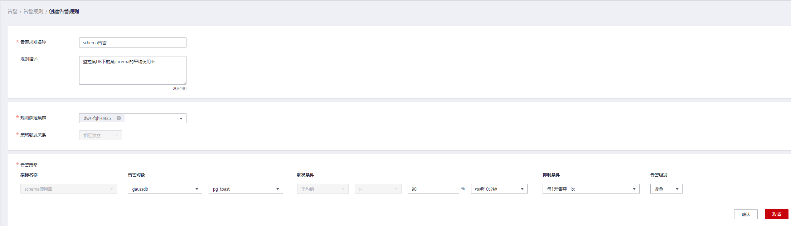

# 告警规则

## 概述

-   阈值告警相关概念：
    -   告警规则：告警规则由告警规则名称，告警规则描述，规则绑定集群列表，告警策略触发关系，告警策略项构成。一条告警规则可绑定某个指定集群或所有集群，拥有一个或多个告警策略。其中，告警策略之间组合关系由“策略触发关系”选项描述。告警规则的阈值触发和抑制条件由每条告警策略描述。
    -   告警策略：为某个告警指标指定的触发条件，抑制条件，告警级别的组合称为告警策略。
    -   告警指标：数据库集群的某个指标项，一般是一个时间序列数据，例如：节点CPU使用率，查询触发下盘量等。

-   告警规则分类：
    -   默认规则：GaussDB\(DWS\)阈值告警模块的最佳实践。
    -   自定义规则：用户可自由选择或组合监控指标形成个性化的告警规则。目前版本仅支持用户自定义schema使用率告警规则。

-   告警规则操作：
    -   修改：修改告警规则的选项。所有告警规则都可以修改编辑，但默认告警规则只能修改部分选项，而自定义告警规则可以修改全部选项。
    -   启用/停用：启用或停用告警规则。所有的告警规则都可以启用/停用，启用后告警规则会被告警引擎纳入检查列表，可以正常触发。停用后的告警规则将被告警引擎移出检查列表，不会触发该规则检查。
    -   删除：删除告警规则。只有自定义告警规则可以被删除，用户无法删除默认告警规则。

## 查看告警规则

1.  登录GaussDB\(DWS\) 管理控制台。
2.  在左侧导航栏，单击“告警管理”，默认显示“告警”页签。
3.  单击左上角的“查看告警规则”按钮，进入告警规则页面。该页面主要用来展示DMS告警模块上配置的数据库集群监控项阈值告警规则。

## 修改告警规则

1.  登录GaussDB\(DWS\) 管理控制台。
2.  在左侧导航栏，单击“告警管理”，切换至“告警”页签。
3.  单击左上角的“查看告警规则”按钮，进入告警规则页面。
4.  在指定告警规则名称所在行操作列，单击“修改”按钮进入修改告警规则页面。

    -   告警规则名称
    -   规则描述
    -   规则绑定集群：用户可在该下拉框中选择当前租户下的集群作为告警模块的监控集群。
    -   策略触发关系：
        -   相互独立：各个告警策略之间互相独立触发。
        -   按优先级：各个告警策略之间按照排列的先后顺序触发，当高优先级策略触发后低优先级策略就不会再做判断。

    -   告警策略：
        -   指标名称：GaussDB\(DWS\) 数据仓库的监控指标，告警引擎用来做阈值判断的数据源。
        -   触发条件：定义对监控指标做阈值判断的计算规则。目前主要使用一段时间内的平均值来降低告警震荡的几率。
        -   抑制条件：在指定的时间段内，抑制同类型告警的反复触发和消除。
        -   告警级别：告警的严重程度，包含紧急、重要、次要和提示。

    

    > **说明：** 
    >用户只能修改部分默认规则的选项（规则绑定集群，告警策略的触发阈值、数据抓取区间和告警抑制条件），可修改自定义规则的全部选项。

5.  确认无误后，单击“确认”。

## 创建自定义告警规则

1.  登录GaussDB\(DWS\) 管理控制台。
2.  在左侧导航栏，单击“告警管理”,切换至“告警”页签。
3.  单击左上角的“查看告警规则”按钮，进入告警规则页面。
4.  单击右上角的“创建告警规则”按钮，进入创建告警规则页面。用户可自定义告警规则名称，规则描述，规则绑定集群，告警策略等配置项。
    -   告警规则名称
    -   规则描述
    -   规则绑定集群：用户可在该下拉框中选择当前租户下的集群作为告警模块的监控集群。
    -   策略触发关系：
        -   相互独立：各个告警策略之间互相独立触发。
        -   按优先级：各个告警策略之间按照排列的先后顺序触发，当高优先级策略触发后低优先级策略就不会再做判断。

    -   告警策略：
        -   指标名称：GaussDB\(DWS\) 数据仓库的监控指标，告警引擎用来做阈值判断的数据源。
        -   告警对象：当前选择的集群中包含的数据库，及其已选择的数据库中所包含的SCHEMA。
        -   触发条件：定义对监控指标做阈值判断的计算规则。目前主要使用一段时间内的平均值来降低告警震荡的几率。
        -   抑制条件：在指定的时间段内，抑制同类型告警的反复触发和消除。
        -   告警级别：告警的严重程度，包含紧急、重要、次要和提示。

            **图 1**  新增自定义告警  
            

            > **说明：** 
            >目前GaussDB\(DWS\)只开放schema使用率的自定义告警规则指标。

