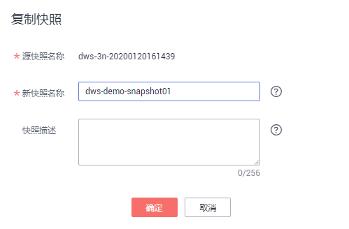

# 复制自动快照

用户可以对自动快照进行复制，生成手工快照以便长期保留。

## 复制自动快照

1.  登录[DWS管理控制台](https://console.huaweicloud.com/dws)。
2.  在左侧导航栏中，单击“快照管理“。

    默认显示用户所有的快照。用户可以对自动快照进行复制。

3.  在快照列表中，在需要复制的快照所对应的“操作“列，单击“复制“。

    -   “快照名称“：填写新快照的名称。

        快照名称长度为4～64个字符，必须以字母开头，不区分大小写，可以包含字母、数字、中划线或者下划线，不能包含其他的特殊字符。

    -   “快照描述“：填写快照的描述信息。

        此参数为可选参数。快照描述的字符长度为0～256，不支持特殊字符!<\>'=&"。

    **图 1**  复制快照  
    

4.  单击“确定“，开始为集群复制快照。

    系统提示“快照复制下发成功“。快照复制完成后，复制快照的状态为“可用“。

    > **说明：**   
    >如果快照大小明显大于集群当前存储数据的大小，可能存在数据仅标记为删除但未真实清理回收，建议执行清理并重新创建快照，参见[如何清理与回收存储空间](https://support.huaweicloud.com/dws_faq/dws_03_0033.html)。  

