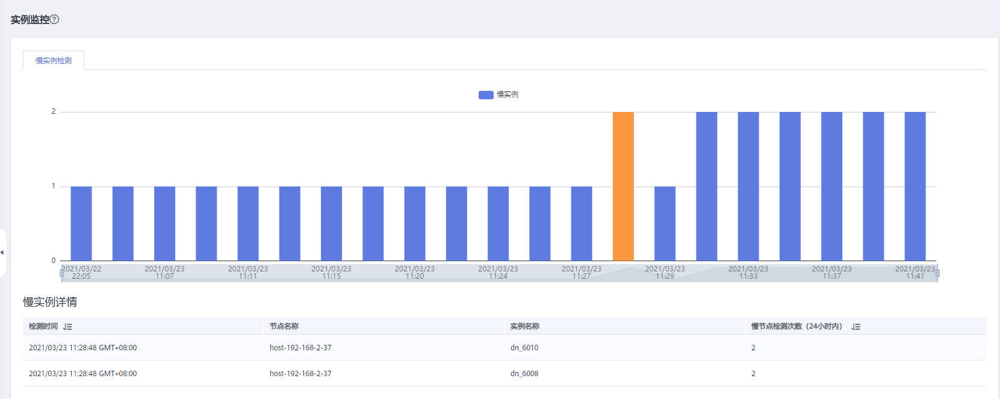

# 实例监控

## 进入实例监控页面

1.  登录GaussDB\(DWS\) 管理控制台。
2.  在“集群管理”页面，找到需要查看监控的集群。
3.  在指定集群所在行的“操作”列，单击“监控面板”，系统将显示数据库监控页面。
4.  在左侧导航栏选择“监控\>实例监控”，进入实例监控页面。

    在实例监控页面展示检测到的慢实例的实时信息和慢实例的历史信息。

## 慢实例检测

DMS可以在集群的CN节点上自动配置并拉起慢实例检测脚本，通过周期性采集脚本的缓存表，将检测到的慢实例数据上报。用户可在界面上查看24小时内检测到的慢实例数量，以及在时间维度上的分布状态等信息，更为快捷的定位到拖慢整个集群的慢节点并分析其根因。

慢实例检测页面分为两部分，上半部分是检测出慢实例数量的时间分布图，显示的是在不同的检测时间段检测出慢实例的数量。下半部分是慢实例详情，当用户选中时间分布图中的任意柱状时，就会在慢实例详情中展示该检测时间、节点名称、实例名称以及慢节点检测次数（24小时内）等详细情况。

> **说明：** 
>当实例周期超过240秒时，将被检测为慢实例。

