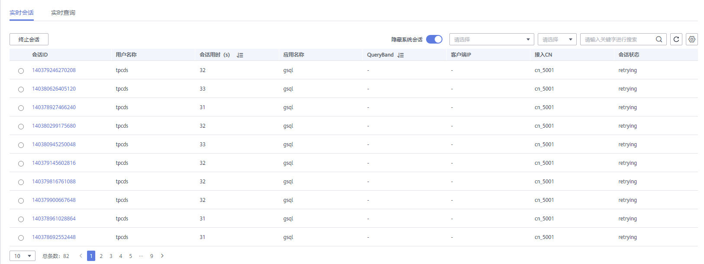
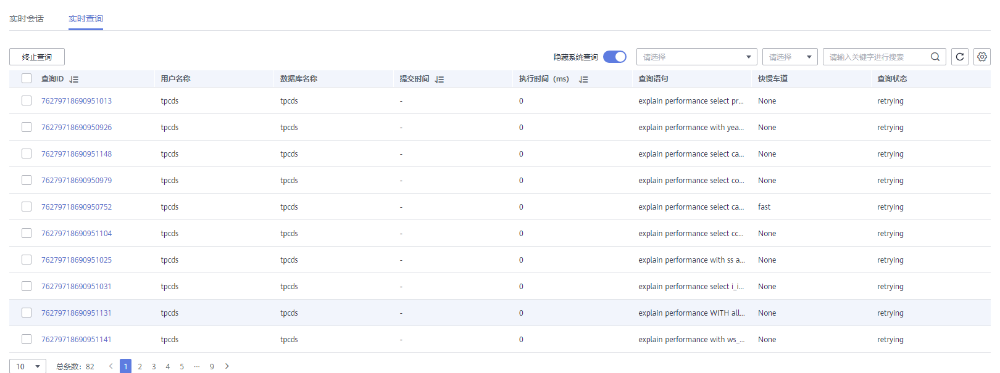
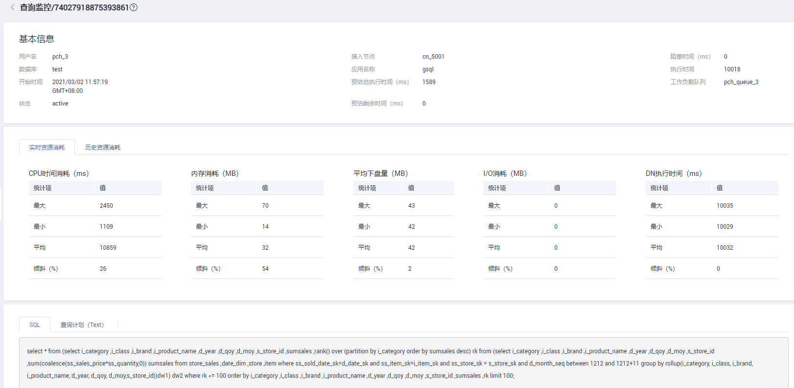

# 实时查询

## 进入实时查询页面

1.  登录GaussDB\(DWS\) 管理控制台。
2.  在“集群管理”页面，找到需要查看监控的集群。
3.  在指定集群所在行的“操作”列，单击“监控面板”，系统将显示数据库监控页面。
4.  在左侧导航栏选择“监控\>实时查询”，进入实时查询监控页面。

    在实时查询监控页面展示了当前运行在集群中的所有查询和会话的实时信息。

> **须知：** 
>-   实时查询仅8.1.2及以上集群版本支持。
>-   启动实时查询功能需要在“监控设置\>监控采集”页面**打开**“实时查询监控”指标项，操作详情请参见[监控采集](https://support.huaweicloud.com/mgtg-dws/dws_01_00135.html)。

## 前提条件

查询监控中用户查看数据前需要设置相关GUC参数，若没有设置的情况下，可能会导致查询监控中的实时查询或历史查询不可用。但如果设置也可能会导致集群性能下降，所以用户需权衡相关参数配置。相关GUC参数推荐配置如下，修改参数操作请参见[修改数据库参数](https://support.huaweicloud.com/mgtg-dws/dws_01_0152.html)，具体参数说明请参见[相关GUC参数设置](SQL诊断.md#zh-cn_topic_0000001076708521_section3665174263916)。

**表 1**  GUC参数推荐配置

<table><thead align="left"><tr id="row11888633125617"><th class="cellrowborder" valign="top" width="33.33333333333333%" id="mcps1.2.4.1.1">
GUC参数

</th>
<th class="cellrowborder" valign="top" width="33.33333333333333%" id="mcps1.2.4.1.2">
CN建议设置值

</th>
<th class="cellrowborder" valign="top" width="33.33333333333333%" id="mcps1.2.4.1.3">
DN建议设置值

</th>
</tr>
</thead>
<tbody><tr id="row108894332563"><td class="cellrowborder" valign="top" width="33.33333333333333%" headers="mcps1.2.4.1.1 ">
max_active_statements

</td>
<td class="cellrowborder" valign="top" width="33.33333333333333%" headers="mcps1.2.4.1.2 ">
10

</td>
<td class="cellrowborder" valign="top" width="33.33333333333333%" headers="mcps1.2.4.1.3 ">
10

</td>
</tr>
<tr id="row188891331561"><td class="cellrowborder" valign="top" width="33.33333333333333%" headers="mcps1.2.4.1.1 ">
enable_resource_track

</td>
<td class="cellrowborder" valign="top" width="33.33333333333333%" headers="mcps1.2.4.1.2 ">
on

</td>
<td class="cellrowborder" valign="top" width="33.33333333333333%" headers="mcps1.2.4.1.3 ">
on

</td>
</tr>
<tr id="row489023319567"><td class="cellrowborder" valign="top" width="33.33333333333333%" headers="mcps1.2.4.1.1 ">
resource_track_level

</td>
<td class="cellrowborder" valign="top" width="33.33333333333333%" headers="mcps1.2.4.1.2 ">
query

</td>
<td class="cellrowborder" valign="top" width="33.33333333333333%" headers="mcps1.2.4.1.3 ">
query

</td>
</tr>
<tr id="row1689063335610"><td class="cellrowborder" valign="top" width="33.33333333333333%" headers="mcps1.2.4.1.1 ">
resource_track_cost

</td>
<td class="cellrowborder" valign="top" width="33.33333333333333%" headers="mcps1.2.4.1.2 ">
0

</td>
<td class="cellrowborder" valign="top" width="33.33333333333333%" headers="mcps1.2.4.1.3 ">
0

</td>
</tr>
<tr id="row989033315564"><td class="cellrowborder" valign="top" width="33.33333333333333%" headers="mcps1.2.4.1.1 ">
resource_track_duration

</td>
<td class="cellrowborder" valign="top" width="33.33333333333333%" headers="mcps1.2.4.1.2 ">
0

</td>
<td class="cellrowborder" valign="top" width="33.33333333333333%" headers="mcps1.2.4.1.3 ">
0

</td>
</tr>
<tr id="row289173316569"><td class="cellrowborder" valign="top" width="33.33333333333333%" headers="mcps1.2.4.1.1 ">
enable_resource_record

</td>
<td class="cellrowborder" valign="top" width="33.33333333333333%" headers="mcps1.2.4.1.2 ">
on

</td>
<td class="cellrowborder" valign="top" width="33.33333333333333%" headers="mcps1.2.4.1.3 ">
on

</td>
</tr>
<tr id="row7891133355613"><td class="cellrowborder" valign="top" width="33.33333333333333%" headers="mcps1.2.4.1.1 ">
session_statistics_memory

</td>
<td class="cellrowborder" valign="top" width="33.33333333333333%" headers="mcps1.2.4.1.2 ">
1000MB

</td>
<td class="cellrowborder" valign="top" width="33.33333333333333%" headers="mcps1.2.4.1.3 ">
1000MB

</td>
</tr>
</tbody>
</table>

## 查询信息

在这一栏您可浏览查询信息状态的数量，其中包括会话数量、平均会话耗时、查询数量、平均查询耗时、平均查询等待时间等。

## 实时会话

在“实时会话”这一栏您可以浏览到正在运行中的所有会话实时信息。

-   会话ID
-   用户名称
-   会话用时
-   应用名称
-   QueryBand
-   客户端IP
-   接入CN
-   会话状态
    -   idle：后台正在等待新的客户端命令
    -   active：后台正在执行查询
    -   idle in transaction：后端在事务中，但事务中没有语句在执行
    -   idle in transaction \(aborted\)：后端在事务中，但事务中有语句执行失败
    -   fastpath function call：后端正在执行一个fast-path函数

> **说明：** 
>-   单击会话ID可以显示当前会话上的查询，详情参见[历史查询监控详情](历史查询.md#zh-cn_topic_0000001076579507_section5136123611463)。
>-   用户若需要终止会话，单击“终止会话”按钮，确认是否终止会话。
>-   新增细粒度权限控制功能，只有配置了操作权限的用户才能使用终止会话按钮。只读权限用户登入后终止会话按钮为灰色。

## 实时查询

在“实时查询”这一栏您可以根据选择的指定时间段浏览集群中正在运行的所有查询信息。其中包括：

-   查询ID
-   用户名称
-   数据库名称
-   提交时间
-   执行时间
-   查询语句
-   快慢车道
-   查询状态
    -   idle：后台正在等待新的客户端命令
    -   active：后台正在执行查询
    -   idle in transaction：后端在事务中，但事务中没有语句在执行
    -   idle in transaction \(aborted\)：后端在事务中，但事务中有语句执行失败
    -   fastpath function call：后端正在执行一个fast-path函数

> **说明：** 
>-   单击查询ID可以显示查询监控详情。但当查询ID为0时，表示此查询出现异常，不支持单击显示详情与终止查询功能。
>-   若用户需要终止查询，单击“终止查询”按钮，确认是否终止查询。
>-   新增细粒度权限控制功能，只有配置了操作权限的用户才能使用终止查询按钮。只读权限用户登入后终止查询按钮为灰色。

## 实时查询监控详情

单击指定实时查询监控的查询ID可触发该查询监控的详情页面，在详情页面中会展示当前监控的更多细节。例如查询语句的基本信息、在执行中的实时资源消耗、执行过程中的历史资源消耗、完整描述以及查询计划。

