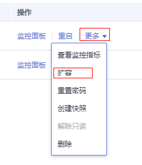

# 容灾互斥案例

## 案例一：容灾状态下如何进行集群扩容？

1.  登录GaussDB\(DWS\) 管理控制台。
2.  在左侧导航栏中，单击“集群管理”。
3.  在集群列表中，若需要容灾扩容的集群“任务信息”为“容灾未启动”，执行[5](#li18914144545215)和[7](#li51916418241)。
4.  若需要容灾扩容的集群“任务信息”不是“容灾未启动”时，则需要删除容灾，请参见[删除容灾](容灾管理.md#section1631535174714)。
5.  在生产、灾备集群所在行的“操作”列，选择“更多\>扩容”，确认节点规格后执行扩容操作。

    

6.  创建容灾，请参见[创建容灾](创建容灾.md)
7.  启动容灾，请参见[启动容灾](容灾管理.md#section4432124194612)。

    > **说明：** 
    >扩容后的生产集群和灾备集群需逻辑同构，即：扩容后生产、灾备集群的DN数量保持一致。

