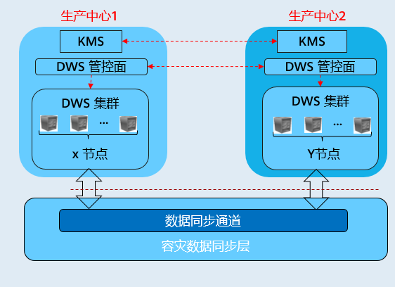

# 容灾概述

## 概览

容灾，即在另一个可用区（跨AZ）部署一个同构的GaussDB\(DWS\)灾备集群，如果生产集群所处的地理位置发生自然灾害，或者集群内部出现了故障从而导致生产集群无法正常对外提供读写服务，那么灾备集群可以切换为生产集群，从而保障业务连续性。架构图如下所示：

> **说明：** 
>-   跨AZ容灾特性仅8.1.1及以上集群版本支持。
>-   该功能受限商用，如需使用请[提交工单](https://account.huaweicloud.com/usercenter/?region=cn-north-4#/applyBeta?serviceCodeP=dws_poc)申请。
>-   实时数仓（单机部署）不支持容灾功能。
>-   若用户灾备集群使用包周期套餐，则会在包周期到期冻结一段时间后自动删除，请用户及时续费，以免后台删除灾备集群导致容灾异常。

## 容灾特点

-   多形态容灾
    -   支持跨AZ容灾。
    -   多种数据同步方式：基于直连互信作为同步层，借以实现更多场景下的容灾 。

-   TCO低
    -   部署异构（逻辑同构）。
    -   容灾级别： 集群级。

-   可视化
    -   自动化，一键式容灾演练、恢复。

## 约束与限制

-   灾备集群在数据同步期间，无法提供读写服务。
-   灾备集群在容灾任务停止或者异常但灾备集群正常的情况下，可以提供读服务，灾备切换成功后可以提供读写服务。
-   容灾创建后，生产集群快照功能正常使用，但是灾备集群禁用快照功能，以及生产、灾备集群均禁用恢复功能。
-   不支持逻辑集群。
-   不支持资源池。
-   使用冷热表后，冷数据同步依赖OBS。
-   容灾不支持同步配置的外部数据源数据。
-   容灾管理为同一租户下的双集群容灾。
-   创建容灾需要生产集群与灾备集群类型、版本号一致且逻辑同构。
-   跨AZ容灾生产集群和灾备集群需要在同一个VPC内。
-   跨AZ容灾在生产集群与容灾集群切换后支持绑定的EIP自动切换到灾备集群。

